---
## Front matter
lang: ru-RU
title: Лабораторная работа №1
subtitle: Работа с git
author:
  - Дворкина Е. В.
institute:
  - Российский университет дружбы народов, Москва, Россия
date: 22 февраля 2025

## i18n babel
babel-lang: russian
babel-otherlangs: english

## Formatting pdf
toc: false
toc-title: Содержание
slide_level: 2
aspectratio: 169
section-titles: true
theme: metropolis
header-includes:
 - \metroset{progressbar=frametitle,sectionpage=progressbar,numbering=fraction}
---

## Докладчик

:::::::::::::: {.columns align=center}
::: {.column width="70%"}

  * Дворкина Ева Владимировна
  * студентка
  * группа НФИбд-01-22
  * Российский университет дружбы народов
  * [1132226447@rudn.ru](mailto:1132226447@rudn.ru)
  * <https://github.com/evdvorkina>

:::
::: {.column width="30%"}


:::
::::::::::::::


## Цель работы

Цель данной лабораторной работы - приобретение практических навыков работы с системой управления версиями Git.

# Теоретическое введение

Git — распределённая система управления версиями. Проект был создан Линусом Торвальдсом для управления разработкой ядра Linux, первая версия выпущена 7 апреля 2005 года; координатор — Дзюн Хамано. 

# Выполнение лабораторной работы

## Подготовка

{#fig:001 width=70%}

## Создание проекта

{#fig:002 width=70%}

## Создание проекта

{#fig:003 width=70%}

## Внесение изменений

Изменим содержимое файла hello.html на:

```
<h1>Hello, World!</h1>
```

## Внесение изменений

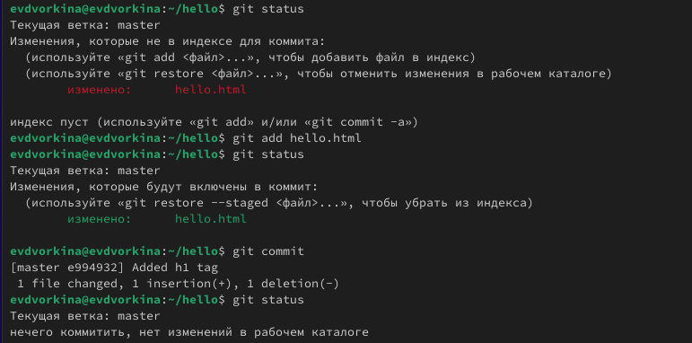{#fig:004 width=70%}

## Внесение изменений

Изменим страницу «Hello, World», чтобы она содержала стандартные теги <html> и <body> 

```
<html>
  <body>
    <h1>Hello, World!</h1>
  </body>
</html>
```

## Внесение изменений

Добавим это изменение в индекс git и добавим заголовки HTML (секцию <head>) к странице «Hello, World».

{#fig:0042 width=70%}

## Внесение изменений

Проверив текущий статус, увидим, что hello.html указан дважды в состоянии. Первое изменение (добавление стандартных тегов) проиндексировано и готово к коммиту. Второе изменение (добавление заголовков HTML) не проиндексированно.

{#fig:005 width=70%}

## Внесение изменений

Произведем коммит проиндексированного изменения. Проиндексируем оставшееся изменение, посмотрим статус и прокоммитим его тоже 

{#fig:006 width=70%}

## История

Получим список произведенных изменений в стандартном виде `git log`, затем в однострочном `git log --pretty=oneline` и далее с указанием времени и количества 

```
git log --pretty=oneline --max-count=2
git log --pretty=oneline --since='5 minutes ago'
git log --pretty=oneline --until='5 minutes ago'
```

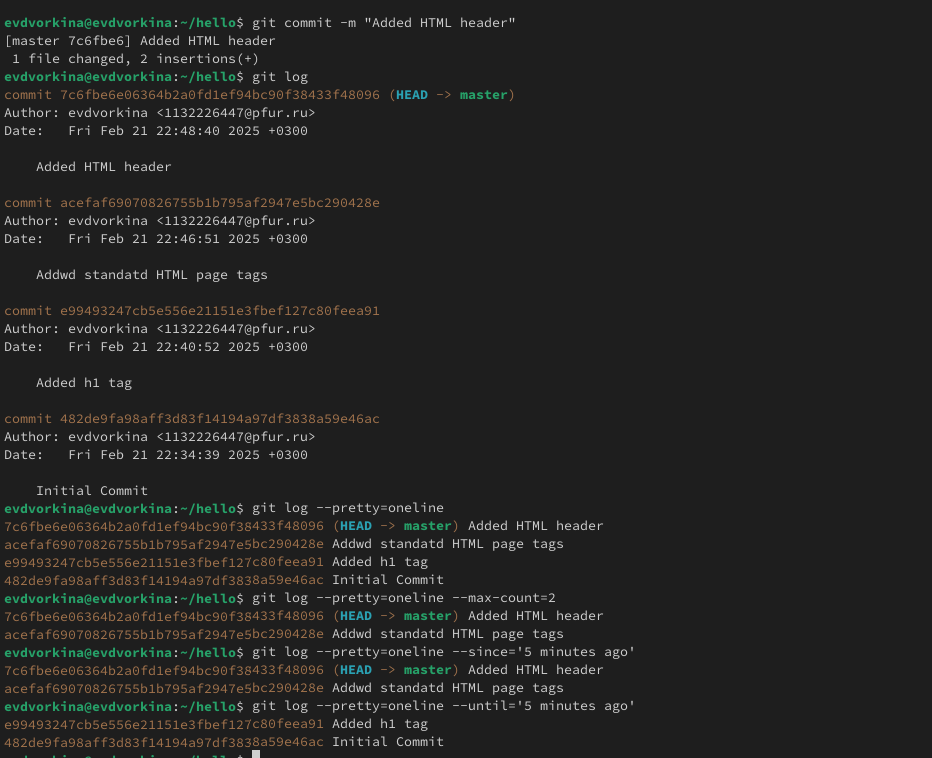{#fig:007 width=70%}

## Получение старых версий

Изучим данные лога и найдем там хэш первого коммита, используя его, вернемся к первой верссии репозитория и просмотрим файл hello.html, действительно, увидим первую версию. Затем вернемся к последней версии в ветке master и посмотрим на тот же файл 

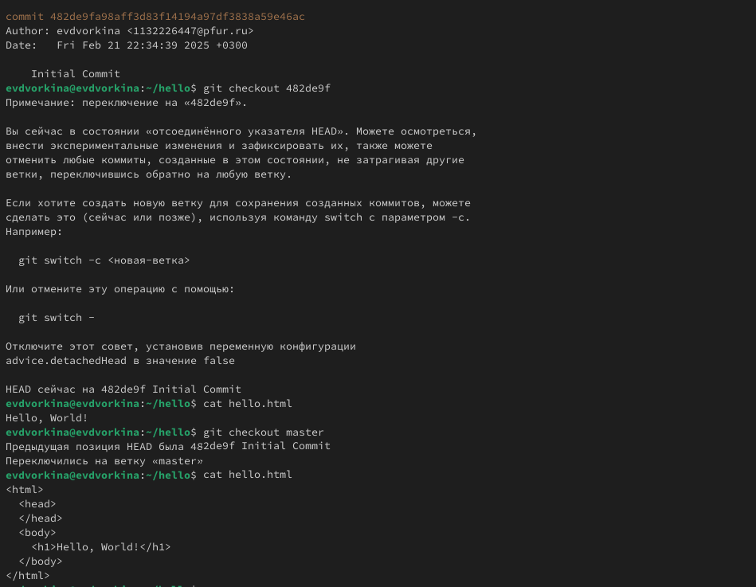{#fig:008 width=70%}

## Создание тегов версий

Назовем текущую версию страницы hello первой (v1). Создадим тег первой версии `git tag v1` и используем его для того, чтобы вернуться к предыдущей версии, которой также присвоим тег v1-beta 

{#fig:009 width=70%}

## Создание тегов версий

Переключимся по тегам между двумя отмеченными версиями. Просмотрим все доступные теги (их два) и посмотрим теги в логе 

{#fig:010 width=70%}

## Отмена локальных изменений (до индексации)

Убдеимся, что мы находимся на последнем коммите ветки master и внесем изменение в файл hello.html в виде нежелательного комментария 

{#fig:0111 width=70%}

## Отмена локальных изменений (до индексации)

{#fig:011 width=70%}

## Отмена проиндексированных изменений (перед коммитом)

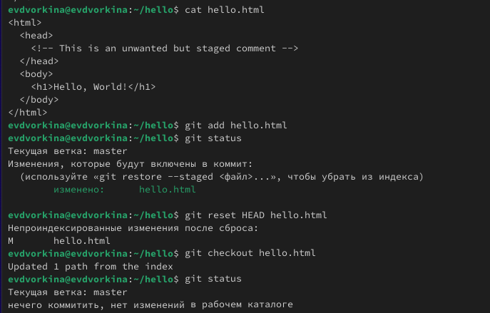{#fig:012 width=70%}

## Отмена коммитов

Изменим файл hello.html на следующий.

```
<html>
  <head>
  </head>
  <body>
    <h1>Hello, World!</h1>
    <!-- This is an unwanted but committed change -->
  </body>
</html>
```

## Отмена коммитов

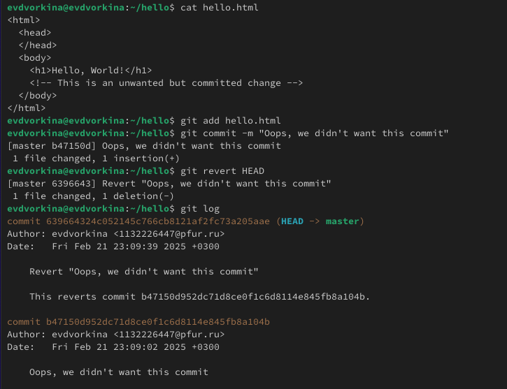{#fig:013 width=70%}

## Удаление коммиттов из ветки

Удалим последние два коммита с помощью сброса, сначала отметим последний коммит тегом, чтобы его можно было потом найти. Используем команду`git reser --hard v1`, чтобы вернуться к версии до этих коммитов.

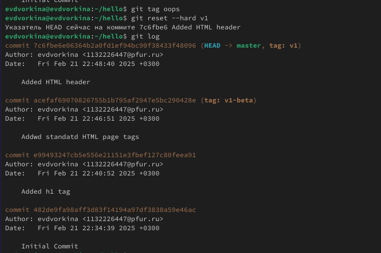{#fig:014 width=70%}

## Удаление коммиттов из ветки

Теперь в логе их нет, но если посмотреть логи с опцией  `--all` можно их увидеть.

{#fig:015 width=70%}

## Удаление тега oops

Удалим тег oops и коммиты, на которые он ссылался, сборщиком мусора. Теперь этот тег не отображается в репозитории

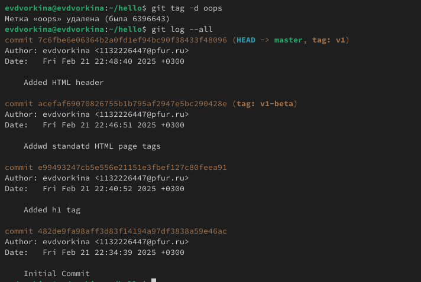{#fig:016 width=70%}

## Изменение предыдущего коммита

Добавим в страницу комментарий автора

{#fig:017 width=70%}

## Изменение предыдущего коммита

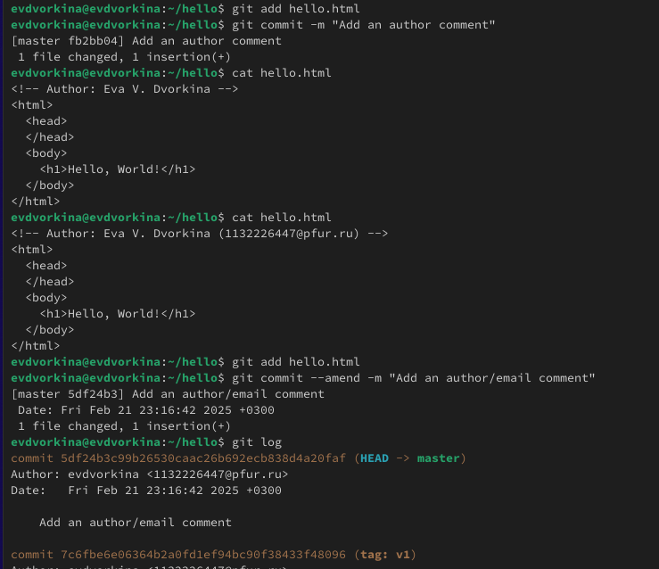{#fig:018 width=70%}

## Перемещение файлов

Переместим наш файл в каталог lib. Для этого создадим его и используем команду `git mv`, сделаем коммит этого перемещения

{#fig:0181 width=70%}

## Подробнее о структуре

Добавим файл index.html в наш репозиторий, заполним файл:

```
<html>
  <body>
    <iframe src="lib/hello.html" width="200" height="200" />
  </body>
</html>
```

## Подробнее о структуре

Проиндексируем файл и сделаем коммит 

{#fig:0182 width=70%}

## Подробнее о структуре

Теперь при открытии index.html увидим кусок страницы hello в маленьком окошке 

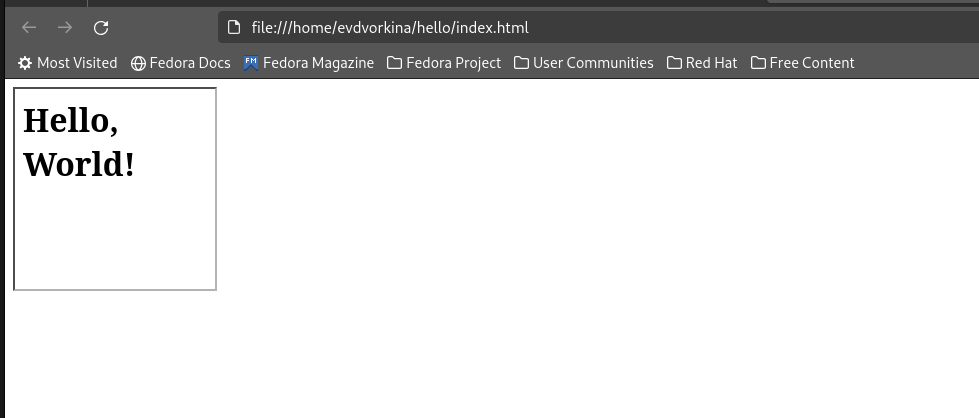{#fig:019 width=70%}

## Git внутри: Каталог .git

Просмотрим каталог, в котором хранится вся информация git. `ls -C .git/`

Затем посмотрим набор каталогов, имена которых состоят из 2 символов `ls -C .git/objects`

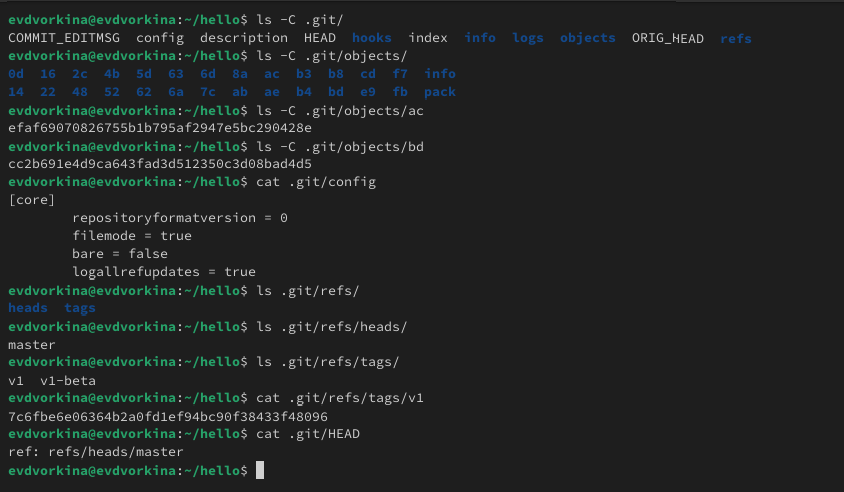{#fig:020 width=70%}

## Работа непосредственно с объектами git

Найдем последний коммит через `log` и выедем его, используя SHA1 хэш.

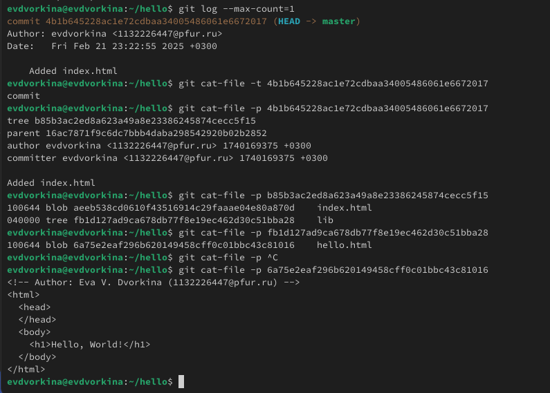{#fig:021 width=70%}

Исследуем  git репозиторий вручную самостоятельно. Используя хэш родительского коммита последовательно дойдем до первой версии файла hello.html и посмотрим его

{#fig:0211 width=70%}

## Создание ветки

Создадим новую ветку «style» и перейдем в неё. Добавим туда файл стилей style.css и добавим его в репозиторий (

{#fig:022 width=70%}

## Создание ветки

Обновим файл hello.html, чтобы использовать стили style.css и index.html 

{#fig:024 width=70%}

## Создание ветки

Обновиv файл index.html

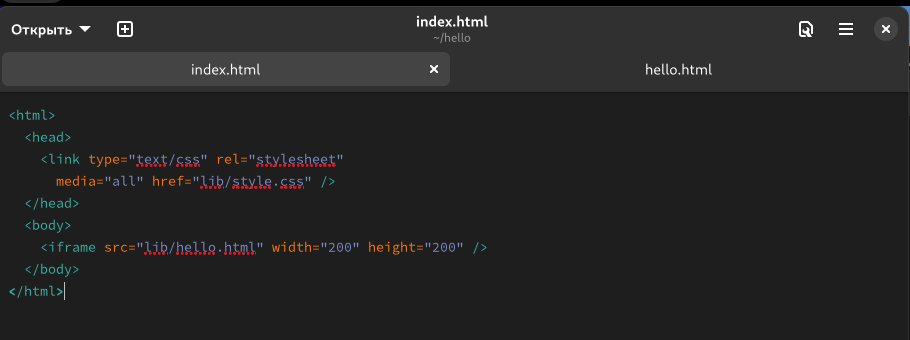{#fig:025 width=70%}

## Создание ветки

Также обновим их в репозиторий

{#fig:023 width=70%}

## Навигация по веткам

Посмотрим все логи 

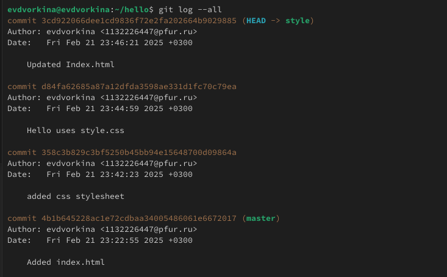{#fig:026 width=70%}

Переключимся обратно на основную ветку и просмотрим содержимое файла `lib/hello.html`, заметим, что он не использует стили, не изменился, также просмотрим содержимое этого файла в новой ветке `style`, файл в ней уже использует стили


## Изменения в ветке master

Вернемся в основную ветку и добавим файл  README.md 

{#fig:028 width=70%}

## Изменения в ветке master

 Просмотрим ветки и их различия `git log --graph --all` 
 
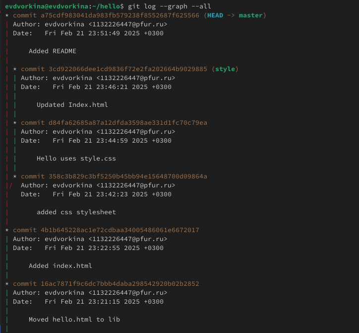{#fig:029 width=70%}

## Слияние

Слияние переносит изменения из двух веток в одну. Вернемся к ветке style и сольем master с style 

{#fig:030 width=70%}

## Создание конфликта

Вернемся в ветку master и создадим конфликт, внеся изменения в файл hello.html 

{#fig:0301 width=70%}

## Создание конфликта

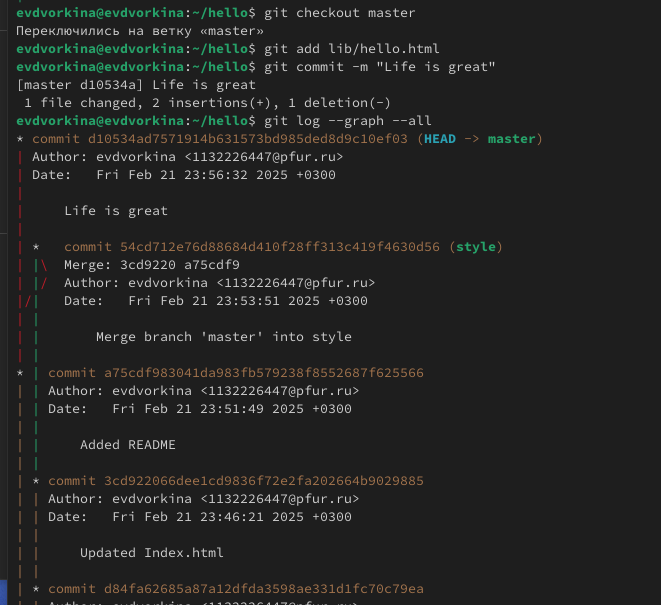{#fig:031 width=70%}

## Разрешение конфликтов

Вернемся к ветке style и попытаемся объединить ее с новой веткой
master. В файле lib/hello.html можно увидеть записи с обеих версий этого файла. Первый раздел — версия текущей ветки (style). Второй раздел — версия ветки master.  Внесем изменения в lib/hello.html, оставив только необходимую нам запись и добавим этот файл в репозиторий, чтобы вручную разрешить конфликт

## Разрешение конфликтов

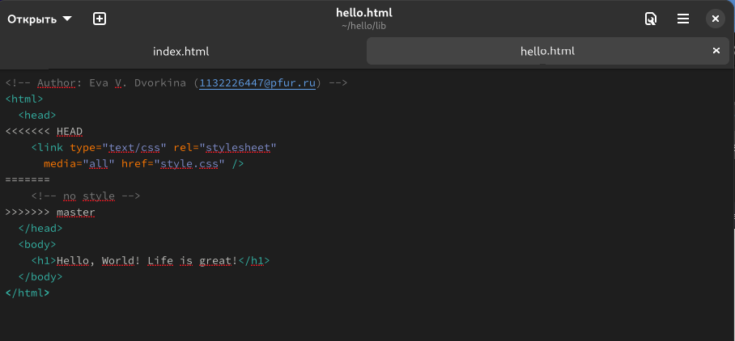{#fig:032 width=70%}

## Разрешение конфликтов

{#fig:033 width=70%}

## Разрешение конфликтов

{#fig:034 width=70%}

## Сброс ветки style

Вернемся на ветку style к точке перед тем, как мы слили ее с веткой master. Мы хотим вернуться в ветке style в точку перед слиянием с master. Нам необходимо найти последний коммит перед слиянием .

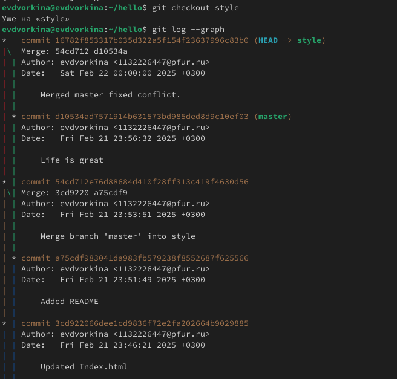{#fig:035 width=70%}

## Сброс ветки style

Мы видим, что коммит «Updated index.html» был последним на ветке style перед слиянием. Сбросим ветку style к этому коммиту.

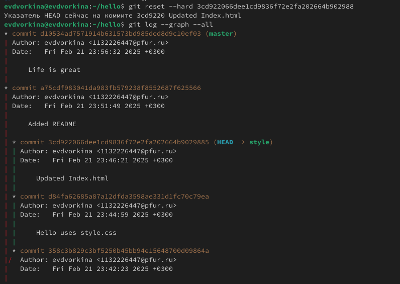{#fig:036 width=70%}

## Сброс ветки master

Добавив интерактивный режим в ветку master, мы внесли изменения, конфликтующие с изменениями в ветке style. 

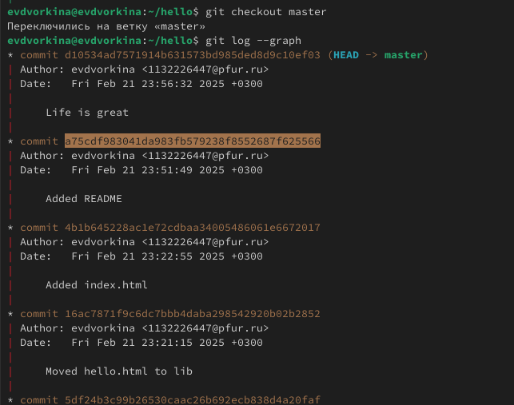{#fig:037 width=70%}

## Сброс ветки master

Коммит «Added README» идет непосредственно перед коммитом конфликтующего интерактивного режима. Мы сбросим ветку master к коммиту «Added README»

{#fig:038 width=70%}

## Перебазирование

Используем команду rebase вместо команды merge. Мы вернулись в точку до первого слияния и хотим перенести изменения из ветки master в нашу ветку style. На этот раз для переноса изменений из ветки master мы будем использовать команду git rebase вместо слияния 

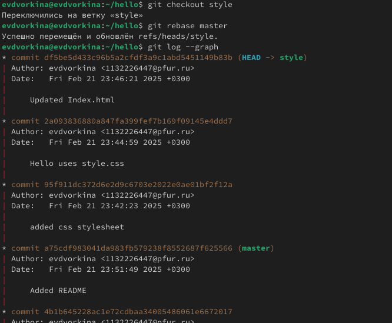{#fig:039 width=70%}

## Слияние в ветку master
 
Вернемся в ветку master и сольем ветку style в неё с помощью команды git merge(рис. 

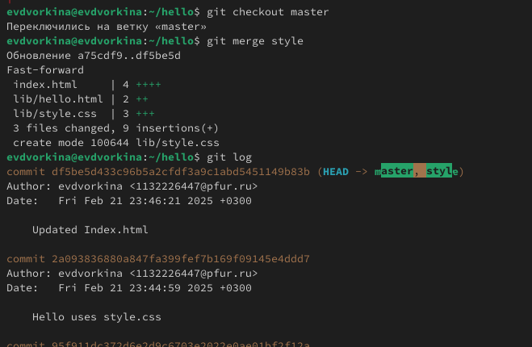{#fig:040 width=70%}

## Клонирование репозиториев

Перейдем в наш рабочий каталог и сделаем клон репозитория hello. Просмотрев его, увидим список всех файлов на верхнем уровне оригинального репозитория README.md, index.html и lib

{#fig:041 width=70%}

## Клонирование репозиториев

Затем просмотрим историю репозитория и увидим список всех коммитов в новый репозиторий, и он совпадает с историей коммитов в оригинальном репозитории.

{#fig:042 width=70%}

## Что такое origin?

Клонированный репозиторий знает об имени по умолчанию удаленного репозитория. Посмотрим, подробную информацию об имени по умолчанию. .


{#fig:043 width=70%}

## Удаленные ветки

Посмотрим на ветки, доступные в нашем клонированном репозитории. Можно увидеть, что в списке только ветка master. Для того, чтобы увидеть все ветки используем опцию -a 

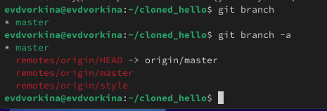{#fig:044 width=70%}


## Изменение оригинального репозитория

Перейдем в репозиторий hello. Внесем изменения в файл README.md. Затем добавим их в репозиторий

{#fig:045 width=70%}

## Изменение оригинального репозитория

Перейдём в клон репозитория и используем команду `git fetch`, которая будет извлекать новые коммиты из удаленного репозитория, но не будет сливать их с наработками в локальных ветках

{#fig:046 width=70%}

## Слияние извлеченных изменений

Сольем внесённые изменения в главную ветку с помощью `git pull`, которая является объединением `fetch` и `merge` в одну команду

{#fig:047 width=70%}

## Добавление ветки наблюдения

{#fig:048 width=70%}

## Создание чистого репозитория

{#fig:049 width=70%}

## Отправка и извлечение изменений 

{#fig:050 width=70%}

## Отправка и извлечение изменений 

{#fig:051 width=70%}

## Выводы

В процессе выполнения данной лабораторной работы я приобрела практические навыки работы с Git.

# Cпасибо за внимание
