---
## Front matter
title: "Лабораторная работа №1"
subtitle: "Работа с git"
author: "Дворкина Ева Владимировна"

## Generic otions
lang: ru-RU
toc-title: "Содержание"

## Bibliography
bibliography: bib/cite.bib
csl: pandoc/csl/gost-r-7-0-5-2008-numeric.csl

## Pdf output format
toc: true # Table of contents
toc-depth: 2
lof: true # List of figures
lot: false # List of tables
fontsize: 12pt
linestretch: 1.5
papersize: a4
documentclass: scrreprt
## I18n polyglossia
polyglossia-lang:
  name: russian
  options:
	- spelling=modern
	- babelshorthands=true
polyglossia-otherlangs:
  name: english
## I18n babel
babel-lang: russian
babel-otherlangs: english
## Fonts
mainfont: IBM Plex Serif
romanfont: IBM Plex Serif
sansfont: IBM Plex Sans
monofont: IBM Plex Mono
mathfont: STIX Two Math
mainfontoptions: Ligatures=Common,Ligatures=TeX,Scale=0.94
romanfontoptions: Ligatures=Common,Ligatures=TeX,Scale=0.94
sansfontoptions: Ligatures=Common,Ligatures=TeX,Scale=MatchLowercase,Scale=0.94
monofontoptions: Scale=MatchLowercase,Scale=0.94,FakeStretch=0.9
mathfontoptions:
## Biblatex
biblatex: true
biblio-style: "gost-numeric"
biblatexoptions:
  - parentracker=true
  - backend=biber
  - hyperref=auto
  - language=auto
  - autolang=other*
  - citestyle=gost-numeric
## Pandoc-crossref LaTeX customization
figureTitle: "Рис."
tableTitle: "Таблица"
listingTitle: "Листинг"
lofTitle: "Список иллюстраций"
lotTitle: "Список таблиц"
lolTitle: "Листинги"
## Misc options
indent: true
header-includes:
  - \usepackage{indentfirst}
  - \usepackage{float} # keep figures where there are in the text
  - \floatplacement{figure}{H} # keep figures where there are in the text
---

# Цель работы

Цель данной лабораторной работы - приобретение практических навыков работы с системой управления версиями Git.

# Задание

1. Выполнить задания из лабораторной работы
2. Оформить отчет по лабораторной работе с помощью Markdown


# Теоретическое введение

Git — распределённая система управления версиями. Проект был создан Линусом Торвальдсом для управления разработкой ядра Linux, первая версия выпущена 7 апреля 2005 года; координатор — Дзюн Хамано. [@wiki:bash].

# Выполнение лабораторной работы

Использованы материыл из [@g].

Ранее я уже работа с git, поэтому установка у меня уже осуществлена. Перейдем сразу к параметрам установки окончаний строк.

## Подготовка

Сначала настроим core.autocrlf с параметрами true и input, чтобы сделать все переводы строк текстовых файлов в главном репозитории одинаковыми, а затем настроим отображение unicode(рис. [-@fig:001]).

{#fig:001 width=70%}

## Создание проекта

Создадим пустой каталог hello, а в нём файл с именем hello.html. В файл добавим строчку "Hello, World!". Затем создадим  git репозиторий из этого каталога, выполнив команду git init. (рис. [-@fig:002]).

{#fig:002 width=70%}

Добавим файл в репозиторий и проверим статус, мы увидим сообщение о том, что коммитить нечего (рис. [-@fig:003]).

{#fig:003 width=70%}

## Внесение изменений

Изменим содержимое файла hello.html на:

```
<h1>Hello, World!</h1>
```

Проверив состояние рабочего каталога увидим, что git знает, что файл hello.html был изменен, но при этом эти изменения еще не зафиксированы в репозитории. Проиндексируем изменения и снова посмотрим статус, в нем указано, что изменения пока не записаны в резапозиторий. И наконец закоммитим изменения, внеся их в репозиторий и снова посмотрим статус, который теперь показывает, что все изменения внесены в репозиторий (рис. [-@fig:004]).

{#fig:004 width=70%}

Изменим страницу «Hello, World», чтобы она содержала стандартные теги <html> и <body> (рис. [-@fig:0041]).

```
<html>
  <body>
    <h1>Hello, World!</h1>
  </body>
</html>
```


{#fig:0041 width=70%}

Добавим это изменение в индекс git и добавим заголовки HTML (секцию <head>) к странице «Hello, World». (рис. [-@fig:0042])

{#fig:0042 width=70%}

Проверив текущий статус, увидим, что hello.html указан дважды в состоянии. Первое изменение (добавление стандартных тегов) проиндексировано и готово к коммиту. Второе изменение (добавление заголовков HTML) не проиндексированно. (рис. [-@fig:005]).

{#fig:005 width=70%}

Произведем коммит проиндексированного изменения. Проиндексируем оставшееся изменение, посмотрим статус и прокоммитим его тоже (рис. [-@fig:006]).

{#fig:006 width=70%}

## История

Получим список произведенных изменений в стандартном виде `git log`, затем в однострочном `git log --pretty=oneline` и далее с указанием времени и количества (рис. [-@fig:007]).

```
git log --pretty=oneline --max-count=2
git log --pretty=oneline --since='5 minutes ago'
git log --pretty=oneline --until='5 minutes ago'
```

{#fig:007 width=70%}

## Получение старых версий

Изучим данные лога и найдем там хэш первого коммита, используя его, вернемся к первой верссии репозитория и просмотрим файл hello.html, действительно, увидим первую версию. Затем вернемся к последней версии в ветке master и посмотрим на тот же файл (рис. [-@fig:008]).

{#fig:008 width=70%}

## Создание тегов версий

Назовем текущую версию страницы hello первой (v1). Создадим тег первой версии `git tag v1` и используем его для того, чтобы вернуться к предыдущей версии, которой также присвоим тег v1-beta (рис. [-@fig:009]).

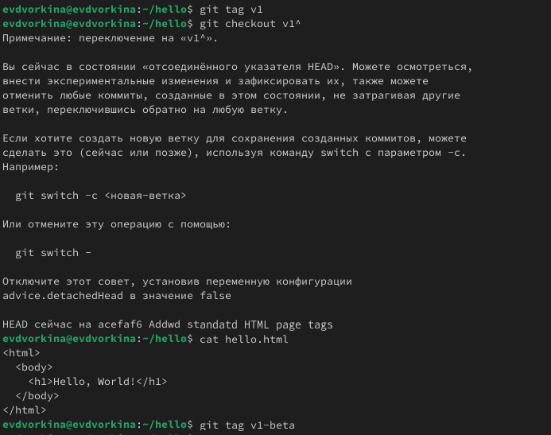{#fig:009 width=70%}

Переключимся по тегам между двумя отмеченными версиями. Просмотрим все доступные теги (их два) и посмотрим теги в логе (рис. [-@fig:010]).

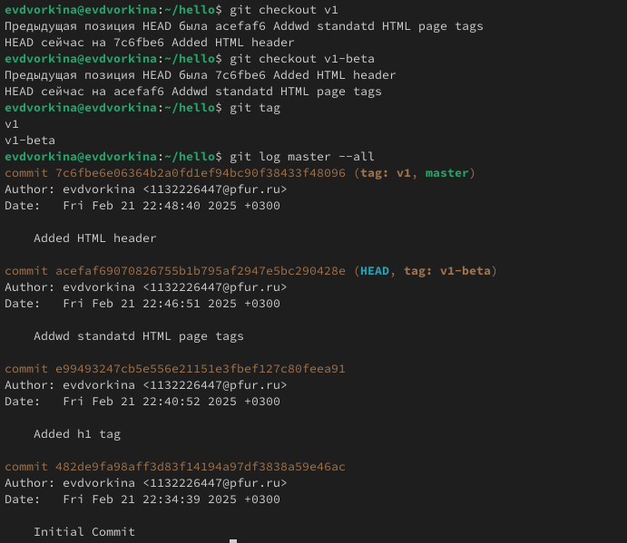{#fig:010 width=70%}

## Отмена локальных изменений (до индексации)

Убдеимся, что мы находимся на последнем коммите ветки master и внесем изменение в файл hello.html в виде нежелательного комментария (рис. [-@fig:0111]). 

{#fig:0111 width=70%}

Затем проверим статус, увидим, что изменения ещё не проиндексированы. Используем команду git checkout для переключения версии файла hello.html в репозитории, видим, что нежелательный комментарий отсутствует в файле (рис. [-@fig:011]).

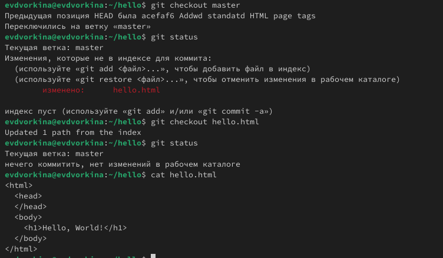{#fig:011 width=70%}

## Отмена проиндексированных изменений (перед коммитом)

Внесем изменение в файл hello.html в виде нежелательного комментария

```
<html>
  <head>
    <!-- This is an unwanted but staged comment -->
  </head>
  <body>
    <h1>Hello, World!</h1>
  </body>
</html>
```

Проиндексируем это изменение и проверим состояние. Состояние показывает, что изменение было проиндексировано и готово к коммиту. Используем команду git reset, чтобы сбросить буферную зону к HEAD. Это очищает буферную зону от изменений, которые мы только что проиндексировали. Переключимся на последнюю версию коммита, посмотрев статус увидим, что наш каталог опять чист (рис. [-@fig:012]).

{#fig:012 width=70%}

## Отмена коммитов

Изменим файл hello.html на следующий.

```
<html>
  <head>
  </head>
  <body>
    <h1>Hello, World!</h1>
    <!-- This is an unwanted but committed change -->
  </body>
</html>
```

Проиндексируем изменения файла и прокоммитим их. Чтобы отменить коммит, нам необходимо сделать коммит, который удаляет изменения, сохраненные нежелательным коммитом. Перейдем в редактор, где изменим нежелательный коммит. Проверим лог. Проверка лога показывает нежелательные и отмененные коммиты в нашем репозитории (рис. [-@fig:013]).

{#fig:013 width=70%}

## Удаление коммиттов из ветки

Удалим последние два коммита с помощью сброса, сначала отметим последний коммит тегом, чтобы его можно было потом найти. Используем команду`git reser --hard v1`, чтобы вернуться к версии до этих коммитов. (рис. [-@fig:014]).

{#fig:014 width=70%}

Теперь в логе их нет, но если посмотреть логи с опцией  `--all` можно их увидеть, однако метка HEAD находится на нужной нам версии (рис. [-@fig:015]).

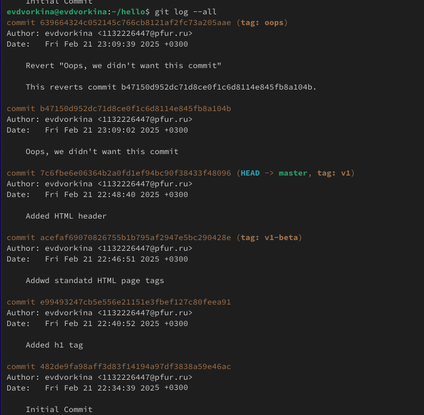{#fig:015 width=70%}

## Удаление тега oops

Удалим тег oops и коммиты, на которые он ссылался, сборщиком мусора. Теперь этот тег не отображается в репозитории (рис. [-@fig:016]).

{#fig:016 width=70%}

## Изменение предыдущего коммита

Добавим в страницу комментарий автора (рис. [-@fig:017]).

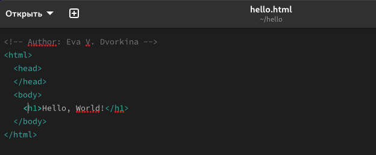{#fig:017 width=70%}

Затем добавим изменения в репозиторий. Теперь мы хотим добавить в комментарий автора почту, обновим страницу hello, включив в неё почту. Чтобы у нас остался один коммит, а не два, изменим последний с помощь опции `--amend`, теперь в логах отображается последняя версия коммита (рис. [-@fig:018]).

{#fig:018 width=70%}

## Перемещение файлов

Переместим наш файл в каталог lib. Для этого создадим его и используем команду `git mv`, сделаем коммит этого перемещения (рис. [-@fig:0181]).

{#fig:0181 width=70%}

## Подробнее о структуре

Добавим файл index.html в наш репозиторий, заполним файл:

```
<html>
  <body>
    <iframe src="lib/hello.html" width="200" height="200" />
  </body>
</html>
```

Проиндексируем файл и сделаем коммит (рис. [-@fig:0182]).

{#fig:0182 width=70%}

Теперь при открытии index.html увидим кусок страницы hello в маленьком окошке (рис. [-@fig:019]).

{#fig:019 width=70%}

## Git внутри: Каталог .git

Просмотрим каталог, в котором хранится вся информация git. `ls -C .git/`

Затем посмотрим набор каталогов, имена которых состоят из 2 символов `ls -C .git/objects`

Имена каталогов являются первыми двумя буквами хэша sha1 объекта, хранящегося в git. Посмотрим в один из каталогов с именем из 2 букв. `ls -C .git/objects/ac` Увидим файлы с именами из 38 символов. Это файлы, содержащие объекты, хранящиеся в git. 

Посмотрим файл конфигурации, создающийся для каждого конкретного проекта `cat .git/config`. 
Затем посмотрим подкаталоги `.git/refs/heads` и `.git/refs/tags`, а также содержимое файла `v1`, в нём хранится хэш коммита, привязанный к тегу. Также посмотрим содержимоей файла HEAD, который содержит ссылку на текущую ветку, в данный момент это ветка master (рис. [-@fig:020]).

{#fig:020 width=70%}

## Работа непосредственно с объектами git

Найдем последний коммит через `log` и выедем его, используя SHA1 хэш. Затем посмотрим дерево каталогов, ссылка на который идёт в последнем коммите, вывдем каталог lib и файл  hello.html (рис. [-@fig:021]).

{#fig:021 width=70%}

Исследуем  git репозиторий вручную самостоятельно. Используя хэш родительского коммита последовательно дойдем до первой версии файла hello.html и посмотрим его(рис. [-@fig:0211]).

{#fig:0211 width=70%}

## Создание ветки

Создадим новую ветку «style» и перейдем в неё. Добавим туда файл стилей style.css и добавим его в репозиторий (рис. [-@fig:022]). 

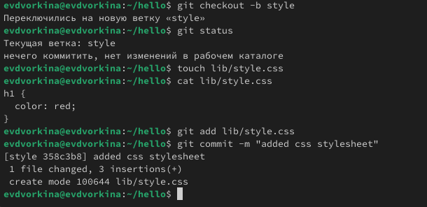{#fig:022 width=70%}

Обновим файл hello.html, чтобы использовать стили style.css и index.html (рис. [-@fig:024]).

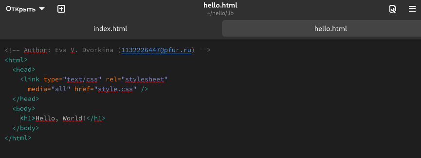{#fig:024 width=70%}

Обновиv файл index.html (рис. [-@fig:025]).

{#fig:025 width=70%}

Также обновим их в репозиторий (рис. [-@fig:023]).

{#fig:023 width=70%}

## Навигация по веткам

Посмотрим все логи (рис. [-@fig:026]).

{#fig:026 width=70%}

Переключимся обратно на основную ветку и просмотрим содержимое файла `lib/hello.html`, заметим, что он не использует стили, не изменился, также просмотрим содержимое этого файла в новой ветке `style`, файл в ней уже использует стили(рис. [-@fig:027]).

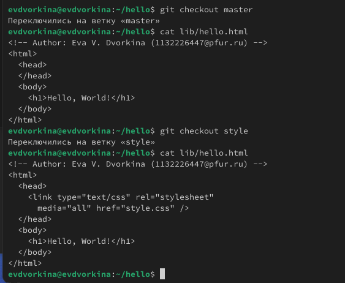{#fig:027 width=70%}

## Изменения в ветке master

Вернемся в основную ветку и добавим файл  README.md (рис. [-@fig:028]).

{#fig:028 width=70%}

 Просмотрим ветки и их различия `git log --graph --all`  (рис. [-@fig:029]).
 
{#fig:029 width=70%}

## Слияние

Слияние переносит изменения из двух веток в одну. Вернемся к ветке style и сольем master с style (рис. [-@fig:030]).

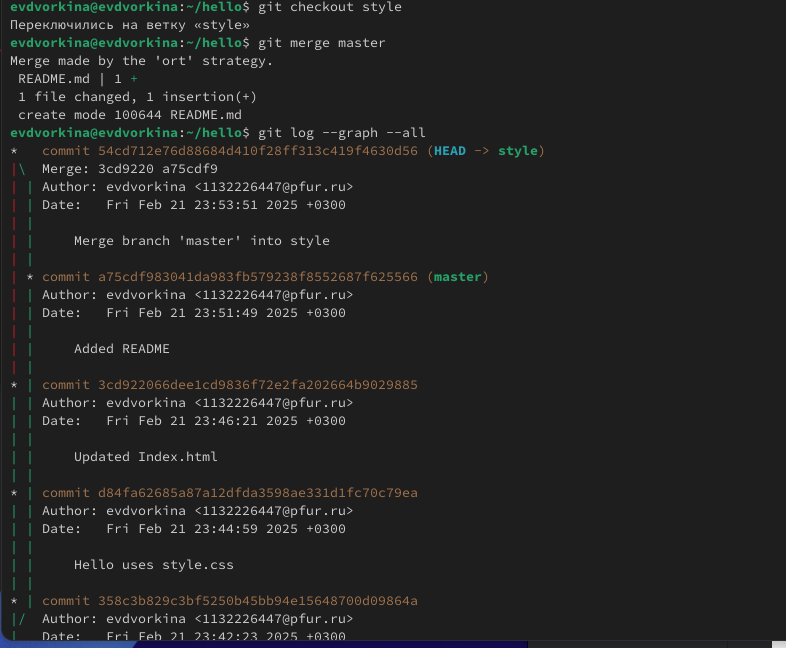{#fig:030 width=70%}

## Создание конфликта

Вернемся в ветку master и создадим конфликт, внеся изменения в файл hello.html (рис. [-@fig:0301]).

{#fig:0301 width=70%}

Просмотрим ветки. После коммита «Added README» ветка master была объединена с веткой style, но в настоящее время в master есть дополнительный коммит, который не был слит с style. Последнее изменение в master конфликтует с некоторыми изменениями в style (рис. [-@fig:031]).

{#fig:031 width=70%}

## Разрешение конфликтов

Вернемся к ветке style и попытаемся объединить ее с новой веткой
master. В файле lib/hello.html можно увидеть записи с обеих версий этого файла. Первый раздел — версия текущей ветки (style). Второй раздел — версия ветки master.  Внесем изменения в lib/hello.html, оставив только необходимую нам запись и добавим этот файл в репозиторий, чтобы вручную разрешить конфликт (рис. [-@fig:032],[-@fig:033], [-@fig:034]).

{#fig:032 width=70%}

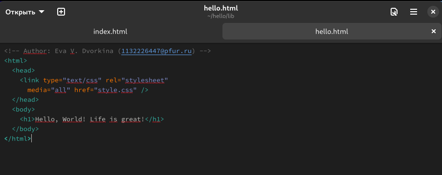{#fig:033 width=70%}

{#fig:034 width=70%}

## Сброс ветки style

Вернемся на ветку style к точке перед тем, как мы слили ее с веткой master. Мы хотим вернуться в ветке style в точку перед слиянием с master. Нам необходимо найти последний коммит перед слиянием (рис. [-@fig:035]).

{#fig:035 width=70%}

Мы видим, что коммит «Updated index.html» был последним на ветке style перед слиянием. Сбросим ветку style к этому коммиту.

Поищем лог ветки style. Увидим, что у нас в истории больше нет коммитов слияний (рис. [-@fig:036]).

{#fig:036 width=70%}

## Сброс ветки master

Добавив интерактивный режим в ветку master, мы внесли изменения, конфликтующие с изменениями в ветке style. Давайте вернемся в ветке master в точку перед внесением конфликтующих изменений. Это позволяет нам продемонстрировать работу команды git rebase, не беспокоясь о конфликтах. Просмотрим коммиты ветки master (рис. [-@fig:037]).

{#fig:037 width=70%}

Коммит «Added README» идет непосредственно перед коммитом конфликтующего интерактивного режима. Мы сбросим ветку master к коммиту «Added README» (рис. [-@fig:038]).

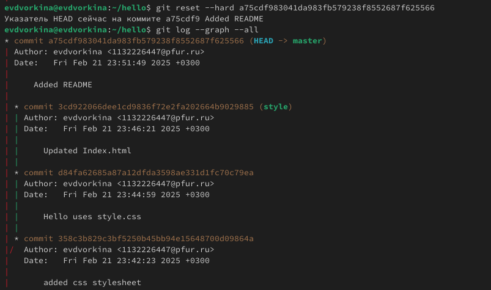{#fig:038 width=70%}

## Перебазирование

Используем команду rebase вместо команды merge. Мы вернулись в точку до первого слияния и хотим перенести изменения из ветки master в нашу ветку style. На этот раз для переноса изменений из ветки master мы будем использовать команду git rebase вместо слияния (рис. [-@fig:039]).

{#fig:039 width=70%}

## Слияние в ветку master
 
Вернемся в ветку master и сольем ветку style в неё с помощью команды git merge(рис. [-@fig:040]).

{#fig:040 width=70%}

## Клонирование репозиториев

Перейдем в наш рабочий каталог и сделаем клон репозитория hello. Просмотрев его, увидим список всех файлов на верхнем уровне оригинального репозитория README.md, index.html и lib (рис. [-@fig:041]). 

{#fig:041 width=70%}

Затем просмотрим историю репозитория и увидим список всех коммитов в новый репозиторий, и он совпадает с историей коммитов в оригинальном репозитории. Единственное отличие в названиях веток (рис. [-@fig:042]).

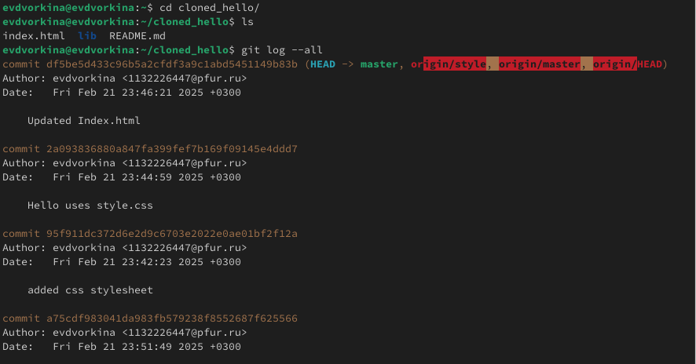{#fig:042 width=70%}

## Что такое origin?

Клонированный репозиторий знает об имени по умолчанию удаленного репозитория. Посмотрим, подробную информацию об имени по умолчанию. Давайте посмотрим, можем ли мы получить более по-
дробную информацию об имени по умолчанию (рис. [-@fig:043]).


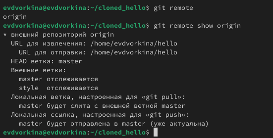{#fig:043 width=70%}

## Удаленные ветки

Посмотрим на ветки, доступные в нашем клонированном репозитории. Можно увидеть, что в списке только ветка master. Для того, чтобы увидеть все ветки используем опцию -a (рис. [-@fig:044]).

{#fig:044 width=70%}


## Изменение оригинального репозитория

Перейдем в репозиторий hello. Внесем изменения в файл README.md. Затем добавим их в репозиторий (рис. [-@fig:045]).

{#fig:045 width=70%}

Перейдём в клон репозитория и используем команду `git fetch`, которая будет извлекать новые коммиты из удаленного репозитория, но не будет сливать их с наработками в локальных ветках (рис. [-@fig:046]).

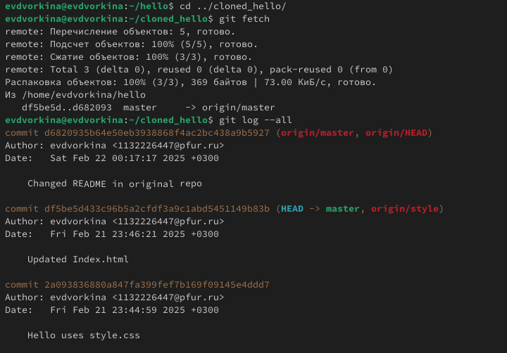{#fig:046 width=70%}

## Слияние извлеченных изменений

Сольем внесённые изменения в главную ветку с помощью `git pull`, которая является объединением `fetch` и `merge` в одну команду (рис. -@fig:047).

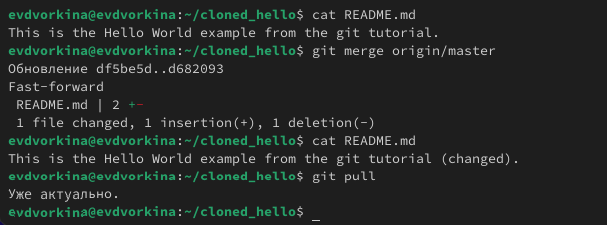{#fig:047 width=70%}

## Добавление ветки наблюдения

Добавим локальную ветку, которая отслеживает удаленную ветку, теперь мы можем видеть ветку style в списке веток и логе (рис. [-@fig:048]).

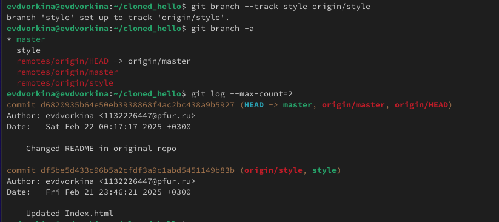{#fig:048 width=70%}

## Создание чистого репозитория

Как правило, репозитории, оканчивающиеся на .git являются чистыми репозиториями. Создадим такой в рабочем каталоге. Затем добавим репозиторий  hello.git к нашему оригинальному репозиторию (рис. [-@fig:049]).

{#fig:049 width=70%}

## Отправка и извлечение изменений 

Так как чистые репозитории, как правило, расшариваются на каком-нибудь сетевом сервере, нам необходимо отправить наши изменения в другие репозитории. Начнем с создания изменения для отправки. Отредактируем файл README.md и сделаем коммит, затем отправим изменения в общий репозиторий. Затем извлечем изменения из общего репозитория(рис. [-@fig:050], [-@fig:051]).

{#fig:050 width=70%}

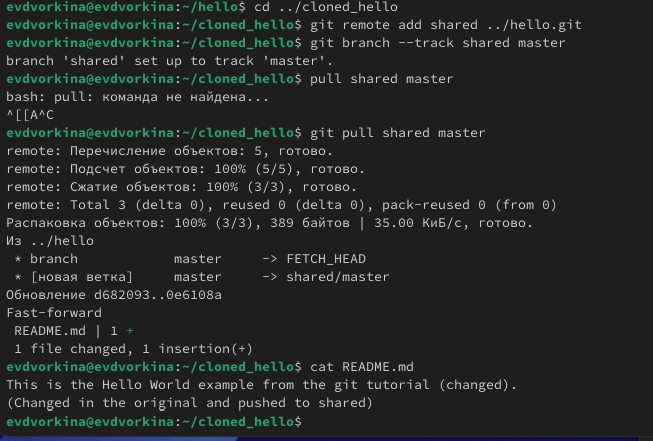{#fig:051 width=70%}

# Выводы

В процессе выполнения данной лабораторной работы я приобрела практические навыки работы с Git.

# Список литературы{.unnumbered}

::: {#refs}
:::
