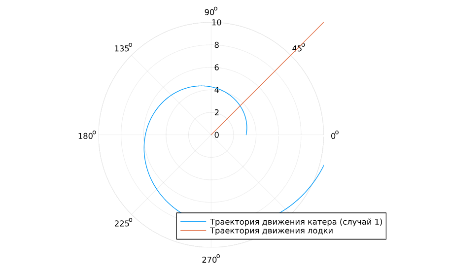
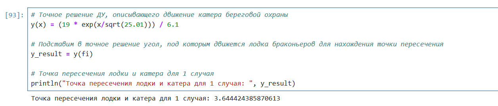
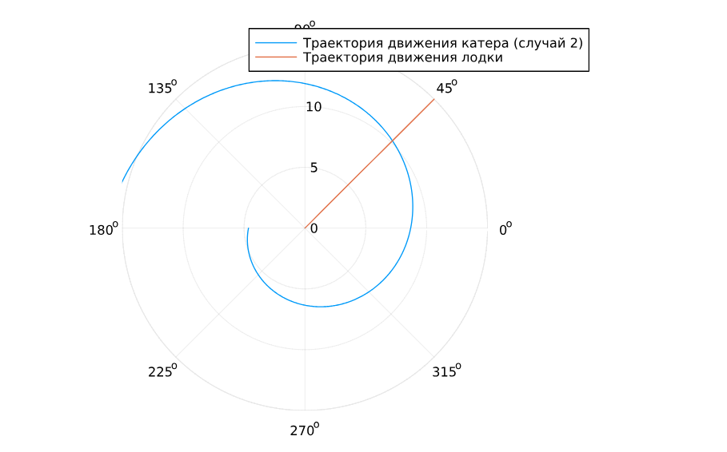
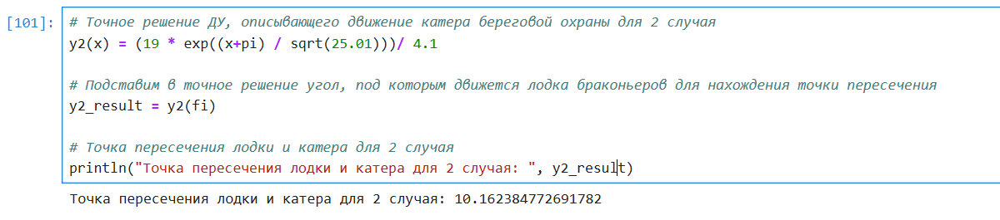
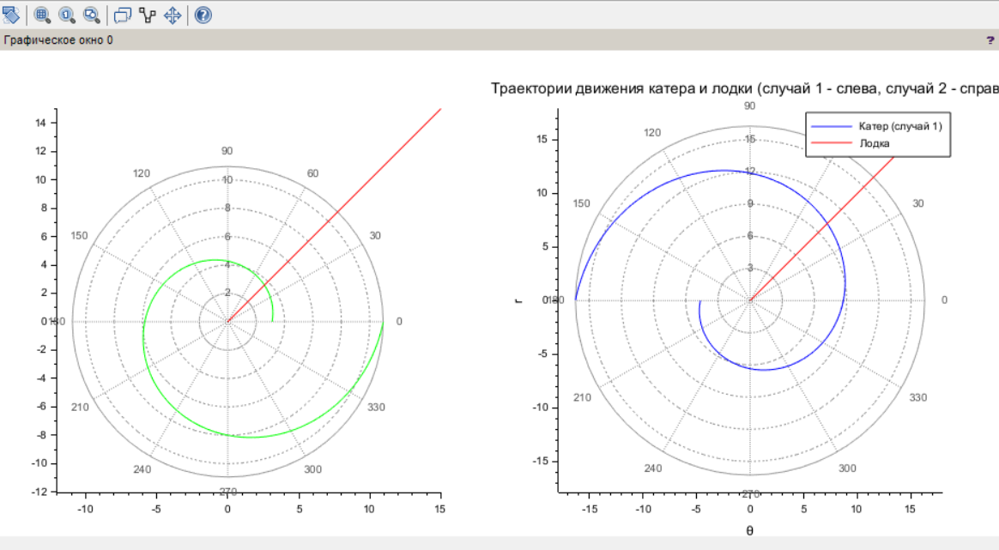

---
## Front matter
lang: ru-RU
title: Лабораторная работа №2
subtitle: Задача о погоне
author:
  - Дворкина Е. В.
institute:
  - Российский университет дружбы народов, Москва, Россия
date: 08 марта 2025

## i18n babel
babel-lang: russian
babel-otherlangs: english

## Formatting pdf
toc: false
toc-title: Содержание
slide_level: 2
aspectratio: 169
section-titles: true
theme: metropolis
header-includes:
 - \metroset{progressbar=frametitle,sectionpage=progressbar,numbering=fraction}
---

## Докладчик

:::::::::::::: {.columns align=center}
::: {.column width="70%"}

  * Дворкина Ева Владимировна
  * студентка
  * группа НФИбд-01-22
  * Российский университет дружбы народов
  * [1132226447@rudn.ru](mailto:1132226447@rudn.ru)
  * <https://github.com/evdvorkina>

:::
::: {.column width="30%"}


:::
::::::::::::::

## Цель работы

Построить математическую модель для выбора правильной стратегии при решении примера задаче о погоне.

## Задание

На море в тумане катер береговой охраны преследует лодку браконьеров.
Через определенный промежуток времени туман рассеивается, и лодка обнаруживается на расстоянии 19 км от катера. Затем лодка снова скрывается в тумане и уходит прямолинейно в неизвестном направлении. Известно, что скорость катера в 5.1 раза больше скорости браконьерской лодки.

## Задание

1. Записать уравнение, описывающее движение катера, с начальными условиями для двух случаев (в зависимости от расположения катера относительно лодки в начальный момент времени).

2. Построить траекторию движения катера и лодки для двух случаев.

3. Найти точку пересечения траектории катера и лодки 

## Выполнение лабораторной работы

Формула для выбора варианта: `(1132226447%70)+1` = 38 вариант.

## Выполнение лабораторной работы

$$
\dfrac{x}{v} = \dfrac{k-x}{5.1v} \text{ -- в первом случае}
$$
$$
\dfrac{x}{v} = \dfrac{k+x}{5.1v} \text{ -- во втором}
$$

Отсюда мы найдем два значения $x_1 = \dfrac{19}{6.1}$ и $x_2 = \dfrac{19}{4.1}$, задачу будем решать для двух случаев.

## Выполнение лабораторной работы

$$v_{\tau} = \sqrt{5.1^2v^2-v^2} = \sqrt{25.01}v$$

Из чего можно вывести:

$$
r\dfrac{d \theta}{dt} = \sqrt{25.01}v
$$

## Выполнение лабораторной работы

Решение исходной задачи сводится к решению системы из двух дифференциальных уравнений:

$$\begin{cases}
&\dfrac{dr}{dt} = v\\
&r\dfrac{d \theta}{dt} = \sqrt{25.01}v
\end{cases}$$

## Выполнение лабораторной работы

С начальными условиями для первого случая:

$$\begin{cases}
&{\theta}_0 = 0\\  \tag{1}
&r_0 = \dfrac{19}{6.1}
\end{cases}$$

## Выполнение лабораторной работы

Или для второго:

$$\begin{cases}
&{\theta}_0 = -\pi\\  \tag{2}
&r_0 = \dfrac{19}{4.1}
\end{cases}$$

## Выполнение лабораторной работы

Исключая из полученной системы производную по $t$, можно перейти к следующему уравнению:

$$
\dfrac{dr}{d \theta} = \dfrac{r}{\sqrt{15.81}}
$$

## Реализация модели с помощью Julia

```Julia
using DifferentialEquations, Plots

# расстояние от лодки до катера
k = 19
# вычисление x для двух случаев
x1 = k/6.1
x2 = k/4.1
# начальные условия для 1 случая
r0 = x1 
theta0 = (0.0, 2*pi) #диапазон значений 
# Начальные условия для 2 случая
r0_2 = x2 
theta0_2 = (-pi, pi)

```

## Реализация модели с помощью Julia

```

fi=pi/4 #угол под которым двигается лодка

x(t) = tan(fi) * t #движение лодки браконьеров

f(r, p, t) = r/sqrt(25.01) #Функция, описывающая движение катера береговой охраны (ДУ)

```

## Реализация модели с помощью Julia

```
# Постановка ДУ с ЗК для 1 случая
prob = ODEProblem(f, r0, theta0) 
sol = solve(prob, saveat=0.01) #шаг для красивой линии

# Постановка ДУ с ЗК для 2 случая
prob_2 = ODEProblem(f, r0_2, theta0_2)
sol_2 = solve(prob_2, saveat=0.01)

#построим траекторию движения лодки 
ugol = [fi for i in range(0, 15)] #20 т.к. ограничение радиуса полярных координат 20 
x_lims = [x(i) for i in range(0, 15)]
```

## Построение траекторий в первом случае

Построим траекторию движения катера и лодки в первом случае

```Julia
# Отрисовка траектории движения катера
plot(sol.t, sol.u, proj=:polar, lims=(0, 10), label="Траектория движения катера (случай 1)") #передаем время и решение, t - угол
#u - радиус
plot!(ugol, x_lims, proj=:polar, lims=(0, 10), label="Траектория движения лодки")
```

## Построение траекторий в первом случае

{#fig:001 width=70%}

## Точка пересечения в первом случае

$$
r = \frac{19}{6.1} e^\frac{\theta}{\sqrt{25.01}} \text{ -- для случая (1)}
$$

```Julia
# Точное решение ДУ, описывающего движение катера береговой охраны
y(x) = (19 * exp(x/sqrt(25.01))) / 6.1

# Подставим в точное решение угол, под которым движется лодка браконьеров для нахождения точки пересечения
y_result = y(fi)

# Точка пересечения лодки и катера для 1 случая
println("Точка пересечения лодки и катера для 1 случая: ", y_result)
```

## Точка пересечения в первом случае

{#fig:002 width=70%}

## Построение траекторий во втором случае

```Julia
plot(sol_2.t, sol_2.u, proj=:polar, lims=(0, 15), label="Траектория движения катера (случай 2)")

plot!(ugol, x_lims, proj=:polar, lims=(0, 15), label="Траектория движения лодки")
```

## Построение траекторий во втором случае

{#fig:003 width=70%}


## Точка пересечения во втором случае

```Julia
# Точное решение ДУ, описывающего движение катера береговой охраны для 2 случая
y2(x) = (19 * exp((x+pi) / sqrt(25.01)))/ 4.1

# Подставим в точное решение угол, под которым движется лодка браконьеров для нахождения точки пересечения
y2_result = y2(fi)

# Точка пересечения лодки и катера для 2 случая
println("Точка пересечения лодки и катера для 2 случая: ", y2_result)
```

## Точка пересечения в первом случае

{#fig:004 width=70%}

## Реализация в scilab

```
// Исходные данные
s = 19; // начальное расстояние от лодки до катера
n = 5.1;  // отношение скоростей катера и лодки
fi = %pi / 4; // угол направления движения лодки

// Функция, описывающая движение катера береговой охраны
function dr = f(theta, r)
    dr = r / sqrt(n*n - 1); 
endfunction
```

## Реализация в scilab

```
// Начальные условия для первого случая (катер ближе к полюсу)
r0_1 = s / (n + 1); // x1 = k / (n + 1)
theta0_1 = 0;

theta = 0:0.01:2*%pi;
r1 = ode(r0_1, theta0_1, theta, f);

// Начальные условия для второго случая (катер дальше от полюса)
r0_2 = s / (n - 1); // x2 = k / (n - 1)
theta0_2 = -%pi;
theta2 = -%pi:0.01:%pi;
r2 = ode(r0_2, theta0_2, theta2, f);
```

## Реализация в scilab

```
// Функция движения лодки браконьеров
function xt = f2(t)
    xt = tan(fi) * t;
endfunction

t = 0:1:15;
```

## Реализация в scilab

```
// Графики
clf;
subplot(1,2,1);
polarplot(theta, r1, style=color('green')); // катер (случай 1)
plot2d(t, f2(t), style=color('red')); // лодка

subplot(1,2,2);
polarplot(theta2, r2, style=color('blue')); // катер (случай 2)
plot2d(t, f2(t), style=color('red')); // лодка

xtitle("Траектории движения катера и лодки (случай 1 - слева, случай 2 - справа", "θ", "r");
legend("Катер (случай 1)", "Лодка", "Катер (случай 2)");
```


## Графики кривых в scilab

{#fig:005 width=70%}

## Выводы

В процессе выполнения данной лабораторной работы я построила математическую модель для выбора правильной стратегии при решении примера задаче о погоне.

