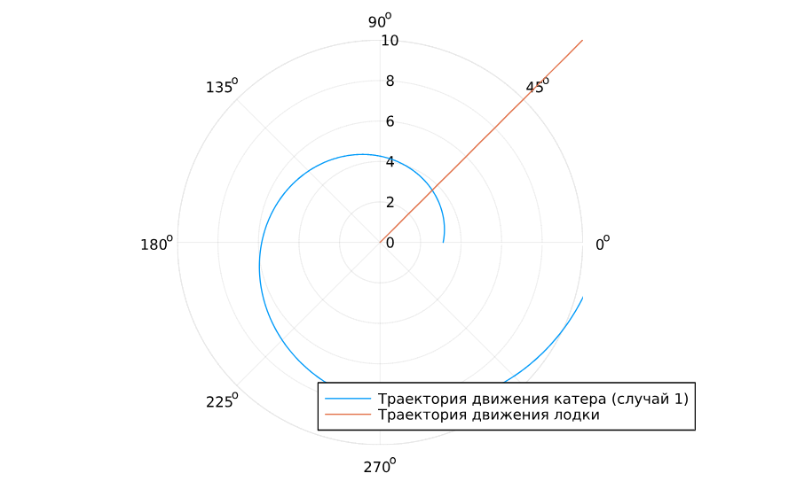
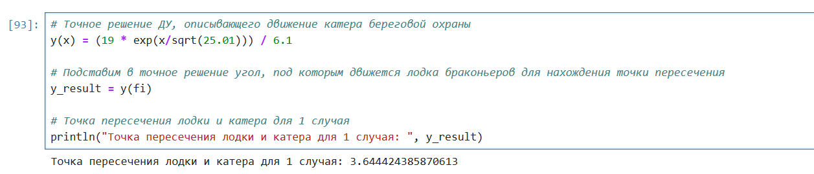
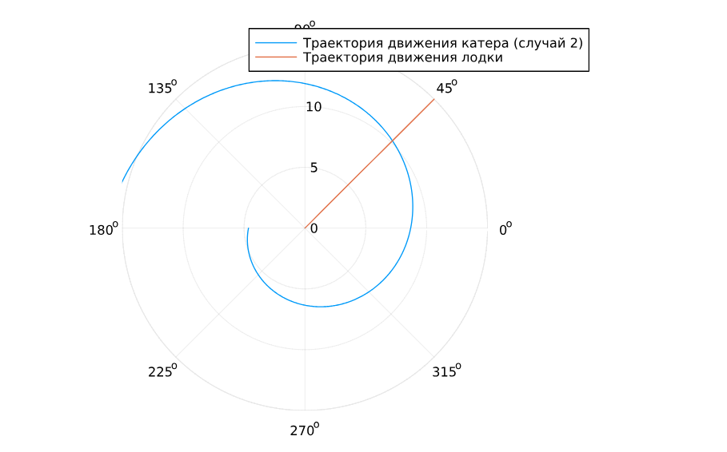
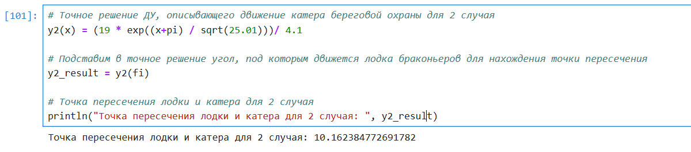
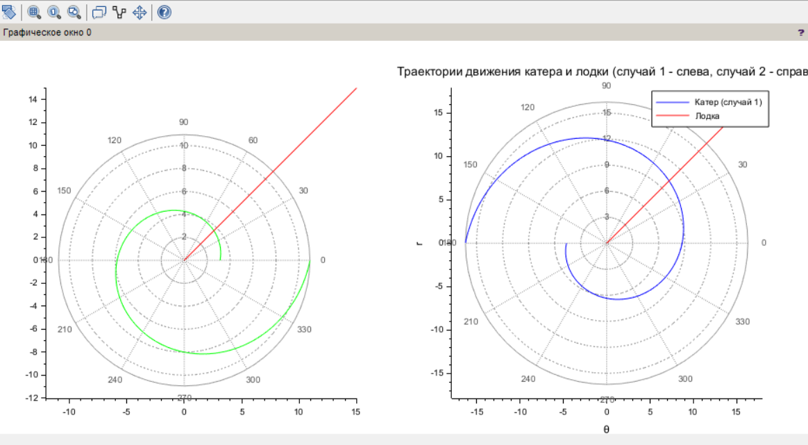

---
## Front matter
title: "Лабораторная работа №2"
subtitle: "Задача о погоне"
author: "Дворкина Ева Владимировна"

## Generic otions
lang: ru-RU
toc-title: "Содержание"

## Bibliography
bibliography: bib/cite.bib
csl: pandoc/csl/gost-r-7-0-5-2008-numeric.csl

## Pdf output format
toc: true # Table of contents
toc-depth: 2
lof: true # List of figures
lot: false # List of tables
fontsize: 12pt
linestretch: 1.5
papersize: a4
documentclass: scrreprt
## I18n polyglossia
polyglossia-lang:
  name: russian
  options:
	- spelling=modern
	- babelshorthands=true
polyglossia-otherlangs:
  name: english
## I18n babel
babel-lang: russian
babel-otherlangs: english
## Fonts
mainfont: IBM Plex Serif
romanfont: IBM Plex Serif
sansfont: IBM Plex Sans
monofont: IBM Plex Mono
mathfont: STIX Two Math
mainfontoptions: Ligatures=Common,Ligatures=TeX,Scale=0.94
romanfontoptions: Ligatures=Common,Ligatures=TeX,Scale=0.94
sansfontoptions: Ligatures=Common,Ligatures=TeX,Scale=MatchLowercase,Scale=0.94
monofontoptions: Scale=MatchLowercase,Scale=0.94,FakeStretch=0.9
mathfontoptions:
## Biblatex
biblatex: true
biblio-style: "gost-numeric"
biblatexoptions:
  - parentracker=true
  - backend=biber
  - hyperref=auto
  - language=auto
  - autolang=other*
  - citestyle=gost-numeric
## Pandoc-crossref LaTeX customization
figureTitle: "Рис."
tableTitle: "Таблица"
listingTitle: "Листинг"
lofTitle: "Список иллюстраций"
lotTitle: "Список таблиц"
lolTitle: "Листинги"
## Misc options
indent: true
header-includes:
  - \usepackage{indentfirst}
  - \usepackage{float} # keep figures where there are in the text
  - \floatplacement{figure}{H} # keep figures where there are in the text
---

# Цель работы

Построить математическую модель для выбора правильной стратегии при решении примера задаче о погоне.

# Задание

На море в тумане катер береговой охраны преследует лодку браконьеров.
Через определенный промежуток времени туман рассеивается, и лодка обнаруживается на расстоянии 11,4 км от катера. Затем лодка снова скрывается в тумане и уходит прямолинейно в неизвестном направлении. Известно, что скорость катера в 4,1 раза больше скорости браконьерской лодки.

1. Записать уравнение, описывающее движение катера, с начальными условиями для двух случаев (в зависимости от расположения катера относительно лодки в начальный момент времени).

2. Построить траекторию движения катера и лодки для двух случаев.

3. Найти точку пересечения траектории катера и лодки 

# Теоретическое введение

Кривая погони — кривая, представляющая собой решение задачи о «погоне», которая ставится следующим образом. Пусть точка A равномерно движется по некоторой заданной кривой. Требуется найти траекторию равномерного движения точки P такую, что касательная, проведённая к траектории в любой момент движения, проходила бы через соответствующее этому моменту положение точки A [@wiki:bash].

# Выполнение лабораторной работы

Формула для выбора варианта: `(1132226447%70)+1` = 38 вариант.

**Вариант 38**

На море в тумане катер береговой охраны преследует лодку браконьеров. 
Через определенный промежуток времени туман рассеивается, и лодка 
обнаруживается на расстоянии 19 км от катера. Затем лодка снова скрывается в 
тумане и уходит прямолинейно в неизвестном направлении. Известно, что скорость 
катера в 5,1 раза больше скорости браконьерской лодки.

1. Запишите уравнение, описывающее движение катера, с начальными условиями для двух случаев (в зависимости от расположения катера относительно лодки в начальный момент времени).  

2. Постройте траекторию движения катера и лодки для двух случаев. 

3. Найдите точку пересечения траектории катера и лодки

Далее будут приведены рассуждения как в лабораторной работе [@l].

Запишем уравнение описывающее движение катера, с начальными условиями для двух случаев (в зависимости от расположения катера относительно лодки в начальный момент времени).

Принимем за $t_0 = 0$, $x_0 = 0$ -- место нахождения лодки браконьеров в момент обнаружения,$x_{k_0} = k$ - место нахождения катера береговой охраны относительно лодки браконьеров в момент обнаружения лодки. $k$ = 19

Введем полярные координаты. Считаем, что полюс - это точка обнаружения лодки браконьеров $x_{0}$ ($\theta = x_{0} = 0$), а полярная ось $r$ проходит через точку нахождения катера береговой охраны.

Траектория катера должна быть такой, чтобы и катер, и лодка все время
были на одном расстоянии от полюса $\theta$ , только в этом случае траектория
катера пересечется с траекторией лодки. Поэтому для начала катер береговой охраны должен двигаться некоторое время прямолинейно, пока не окажется на том же расстоянии от полюса, что и лодка браконьеров. После этого катер береговой охраны должен двигаться вокруг полюса удаляясь от него с той же скоростью, что и лодка браконьеров.

Чтобы найти расстояние $x$ (расстояние после которого катер начнет двигаться вокруг полюса), необходимо составить простое уравнение. Пусть через время $t$ катер и лодка окажутся на одном расстоянииx от полюса. За это время лодка пройдет $x$ , а катер $k-x$ (или $k+x$, в зависимости от начального положения катера относительно полюса). Время, за которое они пройдут это расстояние, вычисляется как $\dfrac{x}{v}$ или $\dfrac{k-x}{5.1v}$ (во втором случае $\dfrac{k+x}{5.1v}$). Так как время одно и то же, то эти величины одинаковы. Тогда неизвестное расстояниеx можно найти из следующего уравнения:

$$
\dfrac{x}{v} = \dfrac{k-x}{5.1v} \text{ -- в первом случае}
$$

$$
\dfrac{x}{v} = \dfrac{k+x}{5.1v} \text{ -- во втором}
$$

Отсюда мы найдем два значения $x_1 = \dfrac{19}{6.1}$ и $x_2 = \dfrac{19}{4.1}$, задачу будем решать для двух случаев.

После того, как катер береговой охраны окажется на одном расстоянии от полюса, что и лодка, он должен сменить прямолинейную траекторию и начать двигаться вокруг полюса удаляясь от него со скоростью лодки $v$. Для этого скорость катера раскладываем на две составляющие: $v_{r}$ - радиальная скорость и  - $v_{\tau}$ тангенциальная скорость. Радиальная скорость - это скорость, с которой катер удаляется от полюса, $v_r = \dfrac{dr}{dt}$. Нам нужно, чтобы эта скорость была равна скорости лодки, поэтому полагаем $\dfrac{dr}{dt} = v$.

Тангенциальная скорость – это линейная скорость вращения катера относительно полюса. Она равна произведению угловой скорости $\dfrac{d \theta}{dt}$ на радиус $r$, $r \dfrac{d \theta}{dt}$.

Получаем: 

$$v_{\tau} = \sqrt{5.1^2v^2-v^2} = \sqrt{26.01v^2-v^2} = \sqrt{25.01}v$$

Из чего можно вывести:

$$
r\dfrac{d \theta}{dt} = \sqrt{25.01}v
$$

Решение исходной задачи сводится к решению системы из двух дифференциальных уравнений:

$$\begin{cases}
&\dfrac{dr}{dt} = v\\
&r\dfrac{d \theta}{dt} = \sqrt{25.01}v
\end{cases}$$

С начальными условиями для первого случая:

$$\begin{cases}
&{\theta}_0 = 0\\  \tag{1}
&r_0 = x_1
\end{cases}$$

Или для второго:

$$\begin{cases}
&{\theta}_0 = -\pi\\  \tag{2}
&r_0 = x_2
\end{cases}$$

Исключая из полученной системы производную по $t$, можно перейти к следующему уравнению:

$$
\dfrac{dr}{d \theta} = \dfrac{r}{\sqrt{25.01}}
$$

Начальные условия остаются прежними. Решив это уравнение, мы получим траекторию движения катера в полярных координатах.

Найдем точку пересечения траектории катера и лодки. Для этого найдем аналитическое решение дифференциального уравнения, задающего траекторию движения катера. 

Решение Дифференциального уравнения и задачи Коши:

$$
\ln{r}=\frac{\theta}{\sqrt{25.01}} + C
$$

$$
r = Ce^\frac{\theta}{\sqrt{25.01}}
$$

$$
r = \frac{19}{6.1} e^\frac{\theta}{\sqrt{25.01}} \text{ -- для случая (1)}
$$

$$
r = \frac{19}{4.1} e^\frac{\theta+\pi}{\sqrt{25.01}}  \text{ -- для случая (2)}
$$

## Построение модели

С помощью языка программирования Julia построим модель для приведенной выше системы дифференциальных уравнений.

```Julia
using DifferentialEquations, Plots

# расстояние от лодки до катера
k = 19
# вычисление x для двух случаев
x1 = k/6.1
x2 = k/4.1

# начальные условия для 1 случая
r0 = x1 
theta0 = (0.0, 2*pi) #диапазон значений 

# Начальные условия для 2 случая
r0_2 = x2 
theta0_2 = (-pi, pi)

fi=pi/4 #угол под которым двигается лодка

x(t) = tan(fi) * t #движение лодки браконьеров

f(r, p, t) = r/sqrt(25.01) #Функция, описывающая движение катера береговой охраны (ДУ)

# Постановка ДУ с ЗК для 1 случая
prob = ODEProblem(f, r0, theta0) 
sol = solve(prob, saveat=0.01) #шаг для красивой линии

# Постановка ДУ с ЗК для 2 случая
prob_2 = ODEProblem(f, r0_2, theta0_2)
sol_2 = solve(prob_2, saveat=0.01)

#построим траекторию движения лодки 
ugol = [fi for i in range(0, 15)] #20 т.к. ограничение радиуса полярных координат 20 
x_lims = [x(i) for i in range(0, 15)]
```

Построим траекторию движения катера и лодки в первом случае (рис. [-@fig:001]):

```Julia
# Отрисовка траектории движения катера
plot(sol.t, sol.u, proj=:polar, lims=(0, 10), label="Траектория движения катера (случай 1)") #передаем время и решение, t - угол
#u - радиус
plot!(ugol, x_lims, proj=:polar, lims=(0, 10), label="Траектория движения лодки")
```

{#fig:001 width=70%}

Теперь найдем точную точку пересечения двух графиков с помощью найденного аналитического решения дифференциального уравнения в первом случае.

$$
r = \frac{19}{6.1} e^\frac{\theta}{\sqrt{25.01}} \text{ -- для случая (1)}
$$

```Julia
# Точное решение ДУ, описывающего движение катера береговой охраны
y(x) = (19 * exp(x/sqrt(25.01))) / 6.1

# Подставим в точное решение угол, под которым движется лодка браконьеров для нахождения точки пересечения
y_result = y(fi)

# Точка пересечения лодки и катера для 1 случая
println("Точка пересечения лодки и катера для 1 случая: ", y_result)
```

Получим следующий результат (рис. [-@fig:002]):

{#fig:002 width=70%}

Построим траекторию движения катера и лодки во втором случае (рис. [-@fig:003]):

```Julia
plot(sol_2.t, sol_2.u, proj=:polar, lims=(0, 15), label="Траектория движения катера (случай 2)")

plot!(ugol, x_lims, proj=:polar, lims=(0, 15), label="Траектория движения лодки")
```

{#fig:003 width=70%}

Теперь найдем точную точку пересечения двух графиков с помощью найденного аналитического решения дифференциального уравнения во втором случае.

$$
r = \frac{19}{4.1} e^\frac{\theta+\pi}{\sqrt{25.01}}  \text{ -- для случая (2)}
$$

```Julia
# Точное решение ДУ, описывающего движение катера береговой охраны для 2 случая
y2(x) = (19 * exp((x+pi) / sqrt(25.01)))/ 4.1

# Подставим в точное решение угол, под которым движется лодка браконьеров для нахождения точки пересечения
y2_result = y2(fi)

# Точка пересечения лодки и катера для 2 случая
println("Точка пересечения лодки и катера для 2 случая: ", y2_result)
```

Получим следующее значение (рис. [-@fig:004]):

{#fig:004 width=70%}

## Реализация в scilab

К сожалению, OpenModelica не поддерживает полярыне координаты, поэтому построила модель в scilab.

```
// Исходные данные
s = 19; // начальное расстояние от лодки до катера
n = 5.1;  // отношение скоростей катера и лодки
fi = %pi / 4; // угол направления движения лодки

// Функция, описывающая движение катера береговой охраны
function dr = f(theta, r)
    dr = r / sqrt(n*n - 1); 
endfunction

// Начальные условия для первого случая (катер ближе к полюсу)
r0_1 = s / (n + 1); // x1 = k / (n + 1)
theta0_1 = 0;

theta = 0:0.01:2*%pi;
r1 = ode(r0_1, theta0_1, theta, f);

// Начальные условия для второго случая (катер дальше от полюса)
r0_2 = s / (n - 1); // x2 = k / (n - 1)
theta0_2 = -%pi;
theta2 = -%pi:0.01:%pi;
r2 = ode(r0_2, theta0_2, theta2, f);

// Функция движения лодки браконьеров
function xt = f2(t)
    xt = tan(fi) * t;
endfunction

t = 0:1:15;

// Графики
clf;
subplot(1,2,1);
polarplot(theta, r1, style=color('green')); // катер (случай 1)
plot2d(t, f2(t), style=color('red')); // лодка

subplot(1,2,2);
polarplot(theta2, r2, style=color('blue')); // катер (случай 2)
plot2d(t, f2(t), style=color('red')); // лодка

// Отображение графиков
xtitle("Траектории движения катера и лодки (случай 1 - слева, случай 2 - справа", "θ", "r");
legend("Катер (случай 1)", "Лодка", "Катер (случай 2)");
```

Получим следующие графики (рис. [-@fig:005]).

{#fig:005 width=70%}

Графики, полученные в Scilab и Julia совпали, значит все сделано верно. 

# Выводы

При выполнении данной лабораторной работы я построила математическую модель для выбора правильной стратегии при решении примера задачи о погоне.

# Список литературы{.unnumbered}

::: {#refs}
:::
