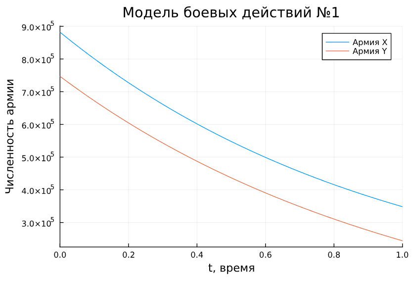
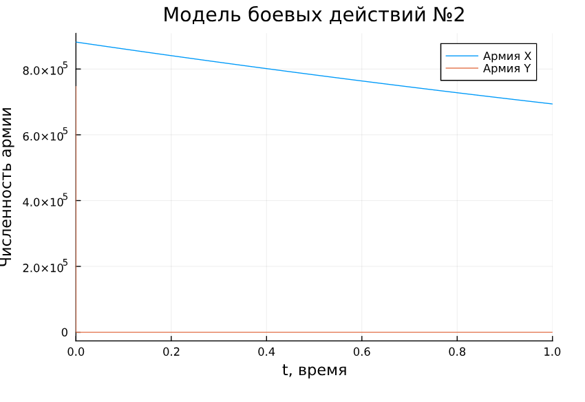
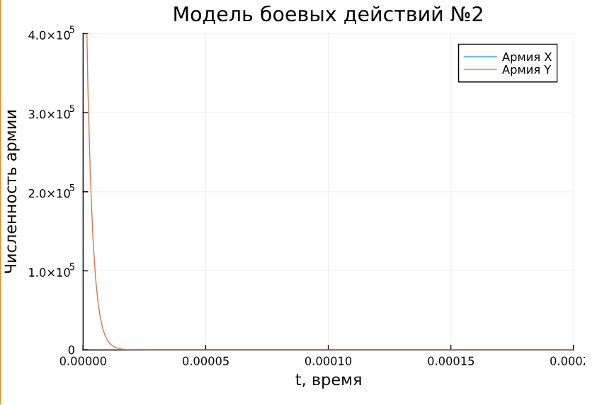
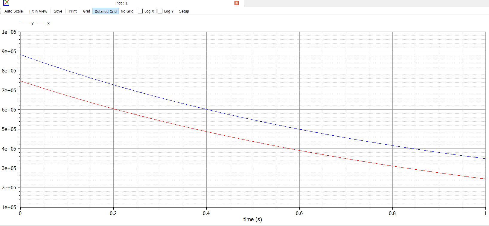
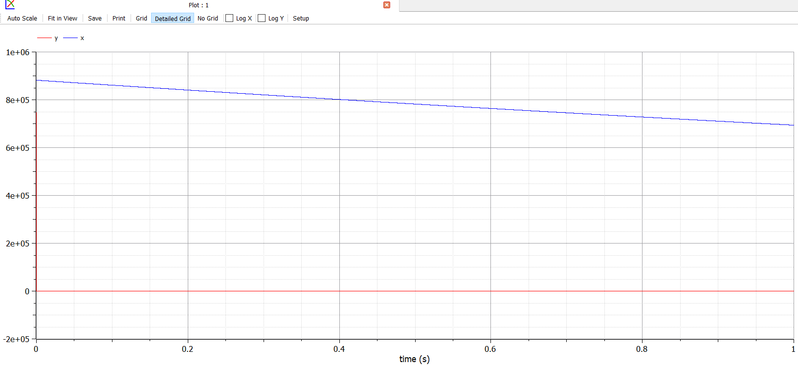
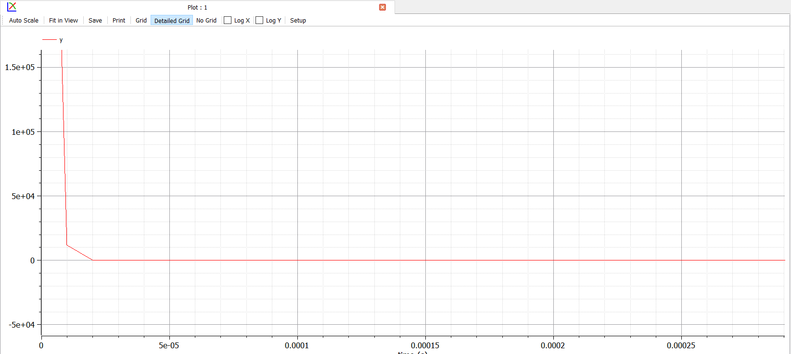

---
## Front matter
lang: ru-RU
title: Лабораторная работа №3
subtitle: Модель боевых действий
author:
  - Дворкина Е. В.
institute:
  - Российский университет дружбы народов, Москва, Россия
date: 17 марта 2025

## i18n babel
babel-lang: russian
babel-otherlangs: english

## Formatting pdf
toc: false
toc-title: Содержание
slide_level: 2
aspectratio: 169
section-titles: true
theme: metropolis
header-includes:
 - \metroset{progressbar=frametitle,sectionpage=progressbar,numbering=fraction}
---

## Докладчик

:::::::::::::: {.columns align=center}
::: {.column width="70%"}

  * Дворкина Ева Владимировна
  * студентка
  * группа НФИбд-01-22
  * Российский университет дружбы народов
  * [1132226447@rudn.ru](mailto:1132226447@rudn.ru)
  * <https://github.com/evdvorkina>

:::
::: {.column width="30%"}


:::
::::::::::::::

## Цель работы

Цель данной лабораторной работы - построить математическую модель боевых действий и провести анализ.

## Задание. Вариант 38

Между страной $X$ и страной $Y$ идет война. Численность состава войск исчисляется от начала войны, и являются временными функциями $x(t)$ и $y(t)$. В начальный момент времени страна $X$ имеет армию численностью 882 000 человек, а в распоряжении страны $Y$ армия численностью в  747 000 человек. Для упрощения модели считаем, что коэффициенты $a$, $b$, $c$, $h$ постоянны. Также считаем $P(t)$ и $Q(t)$, учитывающие возможность подкрепления к войскам в течение одного дня, непрерывными функциями.

Построить графики изменения численности войск армии $X$ и армии $Y$ для следующих случаев:

## Задание. Вариант 38

1. Модель боевых действий между регулярными войсками

$$
\begin{cases}
\dfrac{dx}{dt} = -0,4 x(t)- 0,67y(t) + \sin{3t}+1\\
\dfrac{dy}{dt} = -0,77 x(t)- 0,14y(t) + \cos{2t} + 2
\end{cases}
$$

## Задание. Вариант 38

2. Модель ведения боевых действий с участием регулярных войск и партизанских отрядов 

$$
\begin{cases}
\dfrac{dx}{dt} = -0,24 x(t)- 0,67 y(t) + |\sin{2t}| \\
\dfrac{dy}{dt} = -0,47 x(t) y(t)- 0,14 y(t) + |\cos{2t}|
\end{cases}
$$

# Выполнение лабораторной работы

## Реализация в Julia. Модель боевых действий между регулярными войсками

```Julia
using DifferentialEquations, Plots
x0 = 882000
y0 = 747000
p1 = [0.4, 0.67, 0.77, 0.14]
tspan = (0,1) #интервал времени от 0 до 1
```

## Реализация в Julia. Модель боевых действий между регулярными войсками

```Julia
function f1(u,p,t)
 x,y = u
 a,b,c,h = p
 dx = -a*x-b*y + sin(3*t) + 1
 dy = -c*x-h*y + cos(2*t) + 2
 return [dx, dy]
end

prob1 = ODEProblem(f1, [x0,y0], tspan, p1)
solution1 = solve(prob1, Tsit5())
plot(solution1, title = "Модель боевых действий №1", 
label = ["Армия X" "Армия Y"], xaxis = "t, время", 
yaxis = "Численность армии")
```

## Реализация в Julia. Модель боевых действий между регулярными войсками

{#fig:001 width=70%}


## Реализация в Julia. Модель боевых действий с участием регулярных войск и партизанских отрядов

```Julia
p2 = [0.24, 0.67, 0.47, 0.14]

function f2(u,p,t)
 x,y = u
 a,b,c,h = p
 dx = -a*x-b*y + abs(sin(2*t))
 dy = -c*x*y-h*y + abs(cos(2t))
 return [dx, dy]
end
```

## Реализация в Julia. Модель боевых действий с участием регулярных войск и партизанских отрядов

```Julia
prob2 = ODEProblem(f2, [x0,y0], tspan, p2)
solution2 = solve(prob2, Tsit5(), saveat=0.000001)
plot(solution2, title = "Модель боевых действий №2", 
label = ["Армия X" "Армия Y"], xaxis = "t, время", 
yaxis = "Численность армии")
```

## Реализация в Julia. Модель боевых действий с участием регулярных войск и партизанских отрядов

{#fig:002 width=70%}

## Реализация в Julia. Модель боевых действий с участием регулярных войск и партизанских отрядов

```Julia
plot(solution2, title = "Модель боевых действий №2", 
label = ["Армия X" "Армия Y"],
    xaxis = "t, время", yaxis = "Численность армии", 
    xlimit=[0, 0.0002], ylimit=[0, 400000])
```

## Реализация в Julia. Модель боевых действий с участием регулярных войск и партизанских отрядов

{#fig:003 width=70%}

## Реализация в OpenModelica.  Модель боевых действий между регулярными войсками

```Modelica
Real x(start=882000);
Real y(start=747000);
Real P;
Real Q;

parameter Real a=0.4;
parameter Real b=0.67;
parameter Real c=0.77;
parameter Real h=0.14;
```

## Реализация в OpenModelica.  Модель боевых действий между регулярными войсками

```Modelica
equation
  der(x) = -a*x-b*y + P;
  der(y) = -c*x-h*y + Q;
  P = sin(3*time)+1;
  Q = cos(2*time)+2;
```

## Реализация в OpenModelica.  Модель боевых действий между регулярными войсками

{#fig:004 width=70%}

## Реализация в OpenModelica. Модель боевых действий с участием регулярных войск и партизанских отрядов

Построим такую же модель с помощью `OpenModelica`. Модель задается следующим образом:

```Modelica
Real x(start=882000);
Real y(start=747000);
Real P;
Real Q;

parameter Real a=0.24;
parameter Real b=0.67;
parameter Real c=0.47;
parameter Real h=0.14;
```

## Реализация в OpenModelica. Модель боевых действий с участием регулярных войск и партизанских отрядов

```Modelica
equation
  der(x) = -a*x-b*y + P;
  der(y) = -c*x*y-h*y + Q;
  P = abs(sin(2*time));
  Q = abs(cos(2*time));
```

## Реализация в OpenModelica. Модель боевых действий с участием регулярных войск и партизанских отрядов

{#fig:005 width=70%}

## Реализация в OpenModelica. Модель боевых действий с участием регулярных войск и партизанских отрядов

{#fig:006 width=70%}

## Выводы

При выполнении данной лабораторной работы я построила математическую модель боевых действий и провели анализ.

