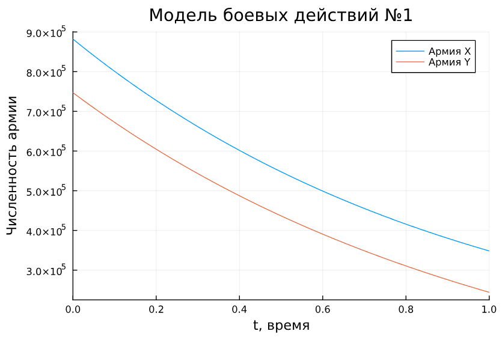
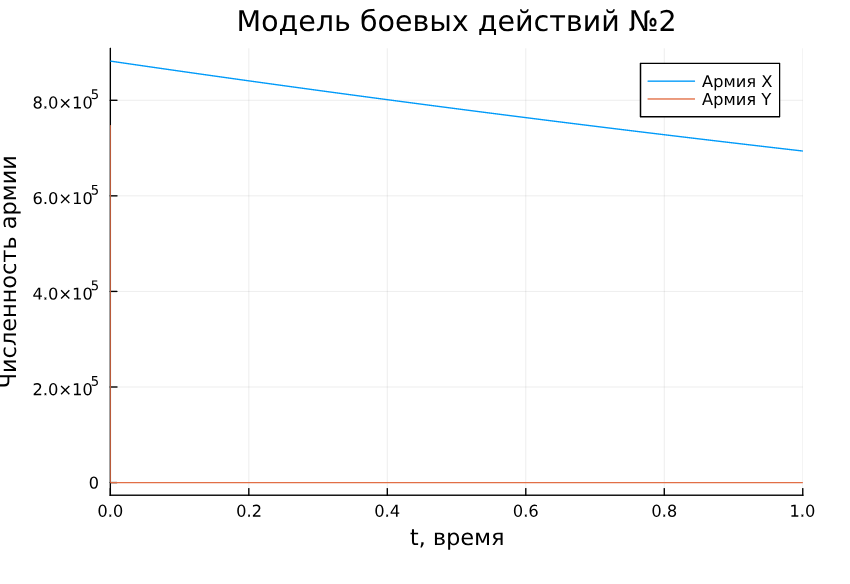
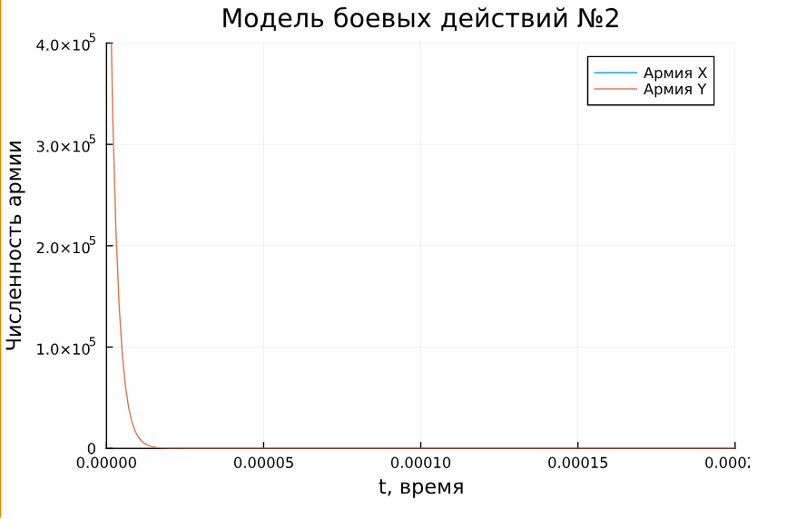
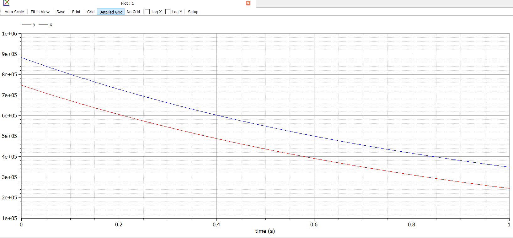
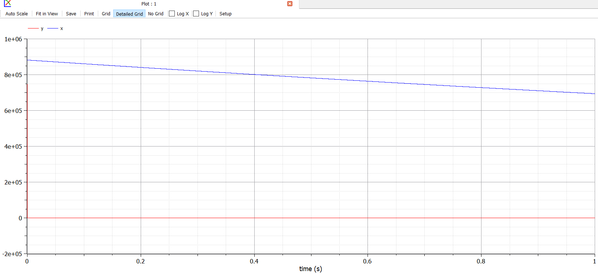
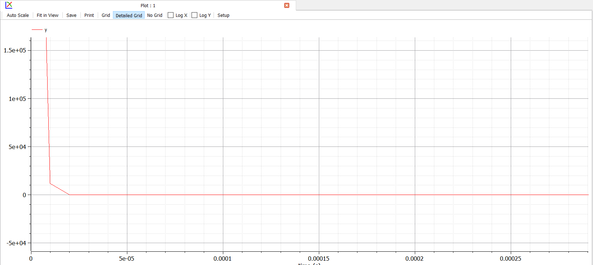

---
## Front matter
title: "Лабораторная работа №3"
subtitle: "Модель боевых действий"
author: "Дворкина Ева Владимировна"

## Generic otions
lang: ru-RU
toc-title: "Содержание"

## Bibliography
bibliography: bib/cite.bib
csl: pandoc/csl/gost-r-7-0-5-2008-numeric.csl

## Pdf output format
toc: true # Table of contents
toc-depth: 2
lof: true # List of figures
lot: false # List of tables
fontsize: 12pt
linestretch: 1.5
papersize: a4
documentclass: scrreprt
## I18n polyglossia
polyglossia-lang:
  name: russian
  options:
	- spelling=modern
	- babelshorthands=true
polyglossia-otherlangs:
  name: english
## I18n babel
babel-lang: russian
babel-otherlangs: english
## Fonts
mainfont: IBM Plex Serif
romanfont: IBM Plex Serif
sansfont: IBM Plex Sans
monofont: IBM Plex Mono
mathfont: STIX Two Math
mainfontoptions: Ligatures=Common,Ligatures=TeX,Scale=0.94
romanfontoptions: Ligatures=Common,Ligatures=TeX,Scale=0.94
sansfontoptions: Ligatures=Common,Ligatures=TeX,Scale=MatchLowercase,Scale=0.94
monofontoptions: Scale=MatchLowercase,Scale=0.94,FakeStretch=0.9
mathfontoptions:
## Biblatex
biblatex: true
biblio-style: "gost-numeric"
biblatexoptions:
  - parentracker=true
  - backend=biber
  - hyperref=auto
  - language=auto
  - autolang=other*
  - citestyle=gost-numeric
## Pandoc-crossref LaTeX customization
figureTitle: "Рис."
tableTitle: "Таблица"
listingTitle: "Листинг"
lofTitle: "Список иллюстраций"
lotTitle: "Список таблиц"
lolTitle: "Листинги"
## Misc options
indent: true
header-includes:
  - \usepackage{indentfirst}
  - \usepackage{float} # keep figures where there are in the text
  - \floatplacement{figure}{H} # keep figures where there are in the text
---

# Цель работы

Цель данной лабораторной работы - построить математическую модель боевых действий и провести анализ.

# Задание 

## Вариант 38

Между страной $X$ и страной $Y$ идет война. Численность состава войск исчисляется от начала войны, и являются временными функциями $x(t)$ и $y(t)$. В начальный момент времени страна $X$ имеет армию численностью 882 000 человек, а в распоряжении страны $Y$ армия численностью в  747 000 человек. Для упрощения модели считаем, что коэффициенты $a$, $b$, $c$, $h$ постоянны. Также считаем $P(t)$ и $Q(t)$, учитывающие возможность подкрепления к войскам в течение одного дня, непрерывными функциями.

Построить графики изменения численности войск армии $X$ и армии $Y$ для следующих случаев:

1. Модель боевых действий между регулярными войсками ([-@eq:eq:aa])

$$
\begin{cases}
\dfrac{dx}{dt} = -0,4 x(t)- 0,67y(t) + \sin{3t}+1\\
\dfrac{dy}{dt} = -0,77 x(t)- 0,14y(t) + \cos{2t} + 2
\end{cases}
$${#eq:eq:aa}

2. Модель ведения боевых действий с участием регулярных войск и партизанских отрядов ([-@eq:eq:aaa])

$$
\begin{cases}
\dfrac{dx}{dt} = -0,24 x(t)- 0,67 y(t) + |\sin{2t}| \\
\dfrac{dy}{dt} = -0,47 x(t) y(t)- 0,14 y(t) + |\cos{2t}|
\end{cases}
$${#eq:eq:aaa}

# Теоретическое введение

Под боевыми действиями понимаются организованные действия частей, соединений, объединений при выполнении поставленных боевых (оперативных) задач. Боевые действия сухопутных войск ведутся в форме общевойсковых боев подразделений (частей и соединений), операций и сражений армий (фронтов) [@mathnet:bash].

Моделирование боевых действий началось во время Первой мировой войны. В годы Второй мировой войны возник научный метод «исследование операций», дающий в распоряжение военного командования или другого исполнительного органа количественные основания для принятия решений по действию войск или других организаций, находящихся под их управлением. Большой вклад в развитие моделей боя внесен специалистами Вычислительного центра им. А. А. Дородницына. В частности, П. С. Краснощеков и А. А. Петров описали динамику боя в пространстве, представив модель перемещения линии фронта. Ю. Н. Павловским предложен способ учета морального фактора в уравнении равенства сил квадратичной модели боя [@kim:bash]. 

Уравнения Осипова – Ланчестера ([-@eq:eq:a]) можно записать в виде [@mathnet:bash] :

$$
\begin{cases}
 \dfrac{dx}{dt} = -a_{y}*y^p*x^q \\
 \dfrac{dy}{dt} = -a_{x}*x^p*y^q
\end{cases}
$${#eq:eq:a}

где $x(y)$ – численности войск первой (второй) стороны в момент времени $t$; $a_x$ ($a_y$) – эффективность огня первой (второй) стороны (число поражаемых целей противника в единицу времени)1; p и q – параметры степени.
В начальный момент времени заданы численности сторон: $x(0) = x_0$ и $y(0) = y_0$.

Выделяются следующие разновидности модели Осипова – Ланчестера. Если p = q = 1 (в общем случае, p – q = 0), то это линейная модель боя с условием равенства сил. Если p = 1, q = 0 (в общем случае, p – q = 1), то это квадратичная модель боя с условием равенства сил. Наконец, если p = 0, q = 1 (в общем случае, q – p = 1), то это логарифмическая модель боя.

Рассмотрим некоторые простейшие модели боевых действий – модели Ланчестера [@lab:bash]. В противоборстве могут принимать участие как регулярные войска,
так и партизанские отряды. В общем случае главной характеристикой соперников являются численности сторон. Если в какой-то момент времени одна из 
численностей обращается в нуль, то данная сторона считается проигравшей (при условии, что численность другой стороны в данный момент положительна). 
Рассмотри три случая ведения боевых действий: 

1. Боевые действия между регулярными войсками 
2. Боевые действия с участием регулярных войск и партизанских отрядов
3. Боевые действия между партизанскими отрядами

## Боевые действия между регулярными войсками

Численность регулярных войск определяется тремя факторами: 

- скорость уменьшения численности войск из-за причин, не связанных с 
боевыми действиями (болезни, травмы, дезертирство); 

- скорость потерь, обусловленных боевыми действиями 
противоборствующих сторон (что связанно с качеством стратегии, 
уровнем вооружения, профессионализмом солдат и т.п.); 

- скорость поступления подкрепления (задаётся некоторой функцией от 
времени).
   
В этом случае модель боевых действий между регулярными войсками 
описывается следующим образом ([-@eq:eq:b])

$$
\begin{cases}
\dfrac{dx}{dt} = -a(t)x(t)- b(t)y(t) + P(t)\\
\dfrac{dy}{dt} = -c(t)x(t)- h(t)y(t) + Q(t)
\end{cases}
$${#eq:eq:b}

Потери, не связанные с боевыми действиями, описывают члены $-a(t)x(t)$ и $- h(t)y(t)$, члены $- b(t)y(t)$ и $-c(t)x(t)$ отражают потери на поле боя. 

Коэффициенты $b(t)$  и $c(t)$  указывают на эффективность боевых действий со стороны $у$ и $х$ соответственно, $a(t)$ и $h(t)$  - величины, характеризующие степень 
влияния различных факторов на потери. Функции $P(t)$ $Q(t)$   учитывают 
возможность подхода подкрепления к войскам $Х$ и $У$ в течение одного дня.

## Боевые действия с участием регулярных войск и партизанских отрядов 

В борьбу добавляются партизанские отряды. Нерегулярные войска в отличии от постоянной армии менее уязвимы, так как действуют скрытно. В этом случае сопернику приходится действовать неизбирательно, по площадям, занимаемым партизанами. Поэтому считается, что темп потерь партизан, проводящих свои операции в разных местах на некоторой известной территории, пропорционален не только численности армейских соединений, но и численности 
самих партизан. В результате модель принимает вид ([-@eq:eq:c])

$$
\begin{cases}
\dfrac{dx}{dt} = -a(t)x(t)- b(t)y(t) + P(t)\\
\dfrac{dy}{dt} = -c(t)x(t)y(t)- h(t)y(t) + Q(t)
\end{cases}
$${#eq:eq:c}

В этой системе все величины имеют тот же смысл, что и в предыдущей системе 

## Боевые действия между партизанскими отрядами

Модель ведения боевых действий между партизанскими отрядами с учетом предположений, сделанном в предыдущем случаем, имеет вид: ([-@eq:eq:d])

$$
\begin{cases}
\dfrac{dx}{dt} = -a(t)x(t)- b(t)x(t)y(t) + P(t)\\
\dfrac{dy}{dt} = -c(t)x(t)y(t)- h(t)y(t) + Q(t)
\end{cases}
$${#eq:eq:d}

## Простейшая модель

В простейшей модели борьбы двух противников коэффициенты $b(t)$ и $c(t)$ являются постоянными. Попросту говоря, предполагается, что каждый солдат армии $x$ убивает за единицу времени $c$ солдат армии $y$ (и, соответственно, каждый солдат армии $y$ убивает $b$ солдат армии $x$). Также не учитываются потери, не связанные с боевыми действиями, и возможность подхода подкрепления. 

Состояние системы описывается точкой $(x,y)$ положительного квадранта плоскости. 
Координаты этой точки, $x$ и $y$ - это численности противостоящих армий. Тогда модель принимает вид ([-@eq:eq:e])

$$
\begin{cases}
\dfrac{dx}{dt} = - by(t)\\
\dfrac{dy}{dt} = -cx(t)
\end{cases}
$${#eq:eq:e}

Эта модель допускает точное решение ([-@eq:eq:f])

$$
cx^2-by^2=C
$${#eq:eq:f}

Вывод модели таков: для борьбы с вдвое более многочисленным противником нужно в четыре раза более мощное оружие, с втрое более многочисленным - в девять раз и т. д. (на это указывают квадратные корни в уравнении прямой). 

Стоит помнить, что эта модель сильно идеализирована и неприменима к реальной ситуации. Но может использоваться для начального анализа.  

## Упрощение модели с партизанскими войсками

$$
\begin{cases}
\dfrac{dx}{dt} = -b(t)y(t)\\
\dfrac{dy}{dt} = -c(t)x(t)y(t)
\end{cases}
$${#eq:eq:g}

Эта система [-@eq:eq:g] приводится к уравнению [-@eq:eq:h]

$$
\dfrac{d}{dt}(\frac{b}{2}x^2(t)-cy(t))=0
$${#eq:eq:h}

Которое имеет единственное решение [-@eq:eq:i]

$$
\dfrac{b}{2}x^2(t)-cy(t)=\dfrac{b}{2}x^2(0)-cy(0)=C_1
$${#eq:eq:i}

При $C_1>0$ побеждает регулярная армия, $C_1<0$ -- побеждают партизаны. Аналогично противоборству регулярных войск, победа обеспечивается не только начальной численностью, но и боевой выучкой и качеством вооружения.

Чтобы одержать победу партизанам необходимо увеличить коэффициент $c$ и повысить 
свою начальную численность на соответствующую величину. Причем это увеличение, с ростом начальной численности регулярных войск $x(0)$ должно расти не линейно, а пропорционально второй степени $x(0)$. Таким образом, можно сделать вывод, что регулярные войска находятся в более выгодном положении, так как неравенство для них выполняется прим меньшем росте начальной численности войск.

Рассмотренные простейшие модели соперничества соответствуют системам обыкновенных дифференциальных уравнений второго порядка, широко распространенным при описании многих естественно научных объектов.

# Выполнение лабораторной работы

## Реализация в Julia

### Модель боевых действий между регулярными войсками

Модель боевых действий между регулярными войсками. Зададим коэффициент смертности, не связанный с боевыми действиями, коэффициенты эффективности первой и второй армии. 

В `Julia` будем работать с библиотеками `DifferentialEquations` для работы с дифференциальными уравнениями и `Plots` для построения графиков. 

```Julia
using DifferentialEquations, Plots
x0 = 882000
y0 = 747000
p1 = [0.4, 0.67, 0.77, 0.14]
tspan = (0,1) #интервал времени от 0 до 1
```

Функция, описывающая подход подкрепление первой армии, $P(t) = \sin{3t}+1$, подкрепление второй армии описывается функцией $Q(t) = \cos{2t} + 2$. Тогда получим систему, описывающую противостояние между регулярными войсками $X$ и $Y$.

Запишем систему ОДУ через функцию, зададим соответствующую задачу Коши с помощью `ODEProblem` и решим её с помощью `solve`, далее построим график решения (рис. [-@fig:001]):

```Julia
function f1(u,p,t)
 x,y = u
 a,b,c,h = p
 dx = -a*x-b*y + sin(3*t) + 1
 dy = -c*x-h*y + cos(2*t) + 2
 return [dx, dy]
end

prob1 = ODEProblem(f1, [x0,y0], tspan, p1)
solution1 = solve(prob1, Tsit5())
plot(solution1, title = "Модель боевых действий №1", label = ["Армия X" "Армия Y"], xaxis = "t, время", yaxis = "Численность армии")
```

{#fig:001 width=70%}

В результате можно увидеть, что при таких параметрах модели армия $X$ побеждает армию $Y$.

### Модель боевых действий с участием регулярных войск и партизанских отрядов

 Зададим коэффициент смертности, не связанный с боевыми действиями и коэффициенты эффективности первой и второй армии. Функция, описывающая подход подкрепление первой армии, $P(t) = |\sin{2t}|$, подкрепление второй армии описывается функцией $Q(t) = |\cos{2t}|$. Тогда получим систему, описывающую противостояние между регулярными войсками $X$ и $Y$, зададим ее в `Julia`, зададим соответствующую задачу Коши с помощью ODEProblem и решим её с помощью `solve`, решение отобразим на графике (рис. [-@fig:002]):

```Julia
p2 = [0.24, 0.67, 0.47, 0.14]

function f2(u,p,t)
 x,y = u
 a,b,c,h = p
 dx = -a*x-b*y + abs(sin(2*t))
 dy = -c*x*y-h*y + abs(cos(2t))
 return [dx, dy]
end

prob2 = ODEProblem(f2, [x0,y0], tspan, p2)
solution2 = solve(prob2, Tsit5(), saveat=0.000001)
plot(solution2, title = "Модель боевых действий №2", label = ["Армия X" "Армия Y"], xaxis = "t, время", yaxis = "Численность армии")
```

{#fig:002 width=70%}

В результате можно увидеть, что при таких параметрах модели армия $X$ побеждает армию $Y$.
На графике плохо видно убывание армии $Y$, так как это происходит очень быстро, поэтому приблизим меньший промежуток (рис. [@fig:003]).


```Julia
plot(solution2, title = "Модель боевых действий №2", label = ["Армия X" "Армия Y"],
    xaxis = "t, время", yaxis = "Численность армии", xlimit=[0, 0.0002], ylimit=[0, 400000])
```

{#fig:003 width=70%}

## Реализация в OpenModelica

### Модель боевых действий между регулярными войсками

Построим такую же модель с помощью `OpenModelica`. Модель задается следующим образом:

```Modelica
model lab3_1

Real x(start=882000);
Real y(start=747000);
Real P;
Real Q;

parameter Real a=0.4;
parameter Real b=0.67;
parameter Real c=0.77;
parameter Real h=0.14;

equation
  der(x) = -a*x-b*y + P;
  der(y) = -c*x-h*y + Q;
  P = sin(3*time)+1;
  Q = cos(2*time)+2;

end lab3_1;
```

Промежуток времени и численный метод решения задаётся в настройках симуляции. Просимулировав модель получим график, совпадающий с предыдущим (рис. [@fig:004]):


{#fig:004 width=70%}

Разница реализаций визуально не заметна.

### Модель боевых действий с участием регулярных войск и партизанских отрядов

Построим такую же модель с помощью `OpenModelica`. Модель задается следующим образом:

```Modelica
model lab3_2

Real x(start=882000);
Real y(start=747000);
Real P;
Real Q;

parameter Real a=0.24;
parameter Real b=0.67;
parameter Real c=0.47;
parameter Real h=0.14;

equation
  der(x) = -a*x-b*y + P;
  der(y) = -c*x*y-h*y + Q;
  P = abs(sin(2*time));
  Q = abs(cos(2*time));

end lab3_2;
```

Промежуток времени и численный метод решения задаётся в настройках симуляции. Просимулировав модель построим два графика (рис. [@fig:005], [@fig:006]):


{#fig:005 width=70%}

{#fig:006 width=70%}

Можно увидеть, что график (рис. [@fig:006]), построенный в `OpenModelica` отличается от (рис. [@fig:004]), численность армии $Y$ убывает резко до нуля, а в `Julia` более плавно, так как в ней точность вычислений выше, мы ее такой выставили. В `OpenModelica` тоже можно было выставить другую точность вычислений. А при большем расстоянии разница численности армии $Y$ не заметна (так как уходит в ноль).


# Выводы

При выполнении данной лабораторной работы я построила математическую модель боевых действий и провели анализ.

# Список литературы{.unnumbered}

::: {#refs}
:::
