---
## Front matter
lang: ru-RU
title: Лабораторная работа №4
subtitle: Модель гармонических колебаний
author:
  - Дворкина Е. В.
institute:
  - Российский университет дружбы народов, Москва, Россия
date: 17 март 2025

## i18n babel
babel-lang: russian
babel-otherlangs: english

## Formatting pdf
toc: false
toc-title: Содержание
slide_level: 2
aspectratio: 169
section-titles: true
theme: metropolis
header-includes:
 - \metroset{progressbar=frametitle,sectionpage=progressbar,numbering=fraction}
---

## Докладчик

:::::::::::::: {.columns align=center}
::: {.column width="70%"}

  * Дворкина Ева Владимировна
  * студентка
  * группа НФИбд-01-22
  * Российский университет дружбы народов
  * [1132226447@rudn.ru](mailto:1132226447@rudn.ru)
  * <https://github.com/evdvorkina>

:::
::: {.column width="30%"}


:::
::::::::::::::


## Цель работы

Исследовать математическую модель гармонического осциллятора.

## Задание. Вариант 38

Постройте фазовый портрет гармонического осциллятора и решение уравнения гармонического осциллятора для следующих случаев

1. Колебания гармонического осциллятора без затуханий и без действий внешней силы $\ddot x + 21x = 0$
2. Колебания гармонического осциллятора c затуханием и без действий внешней силы $\ddot x + 2.2\dot x + 2.3x = 0$
3. Колебания гармонического осциллятора c затуханием и под действием внешней силы $\ddot x + 2.4\dot x + 2.5x = 0.2\sin{(2.6t)}$

На интервале $t \in [0; 72]$ (шаг 0.05) с начальными условиями $x_0 = 1.2, \, y_0=-1.2$


# Выполнение лабораторной работы

## Реализация в Julia

```julia
using DifferentialEquations, Plots

tspan = (0, 72)

p1 = [0, 21] # первый элемент - гамма
p2 = [2.2, 2.3] # второй - омега в квадрате 
p3 = [2.4, 2.5] #омега уже дана в квадрате!!

du0 = [-1.2] #y - первая производная от х
u0 = [1.2] 
```

## Реализация в Julia

```julia
#без действий внешний силы
function harm_osc(ddu, du, u, p, t)
 g, w = p
 ddu .= -g.*du.-w .*u
end
```

## Реализация в Julia

```julia
#внешняя сила
f(t) = 0.2*sin(2.6*t)

#с действием в нешней силы
function forced_harm_osc(ddu, du, u, p, t)
 g, w = p 
 ddu .= -g.*du.-w .*u .+ f(t)
end
```

## Реализация в Julia

```julia
prob1 = SecondOrderODEProblem(harm_osc, du0, u0, tspan, p1)
sol1 = solve(prob1, DPRKN6(), saveat=0.0005)

prob2 = SecondOrderODEProblem(harm_osc, du0, u0, tspan, p2)
sol2 = solve(prob2, DPRKN6(), saveat=0.0005)

prob3 = SecondOrderODEProblem(forced_harm_osc, du0, u0, tspan, p3)
sol3 = solve(prob3, Tsit5(), saveat=0.0005)
```

## Реализация в Julia

```julia
# Функция для построения графиков колебаний
function plot_oscillations(sol, title)
    plot(sol, vars=(0, 1), label="y", xlabel="Время t", ylabel="", title=title)
    plot!(sol, vars=(0, 2), label="x", xlabel="Время t", ylabel="", title=title)
end
```

## Реализация в Julia

```julia
# Построение графиков для sol1
plot_oscillations(sol1, "Колебания без затухания и внешней силы")

plot(sol1, vars=(2, 1), label="y от x", xlabel="x", ylabel="y", 
    title="Фазовый портрет без внешней силы и затухания")
```
    
## Реализация в OpenModelica. Модель для колебания без затухания и без действия внешних сил:

```Modelica
Real x(start=1.2);
Real y(start=-1.2);

parameter Real w=21;
parameter Real g=0;

equation
der(x) = y;
der(y) = -w*x-g*y;
```

## Реализация в OpenModelica. Модель для колебания с затуханием и без действия внешних сил:

```Modelica
Real x(start=1.2);
Real y(start=-1.2);

parameter Real w=2.3;
parameter Real g=2.2;

equation
der(x) = y;
der(y) = -w*x-g*y;
```

## Реализация в OpenModelica. Модель для колебания с затуханием и действием внешних сил:

```Modelica
Real x(start=1.2);
Real y(start=-1.2);

parameter Real w=2.5;
parameter Real g=2.4;
Real p;

equation
der(x) = y;
der(y) = -w*x-g*y+p;
p = 0.2*sin(2.6*time);
```

## Колебания гармонического осциллятора без затуханий и без действий внешней силы

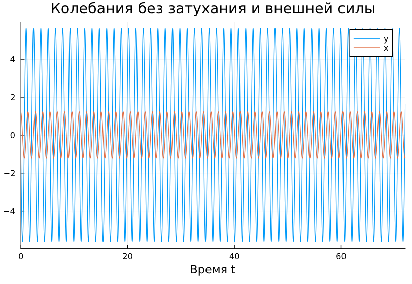
{#fig:002 width=70%}

## Колебания гармонического осциллятора без затуханий и без действий внешней силы

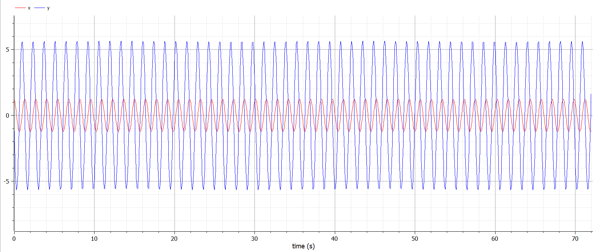{#fig:003 width=70%}

## Колебания гармонического осциллятора без затуханий и без действий внешней силы

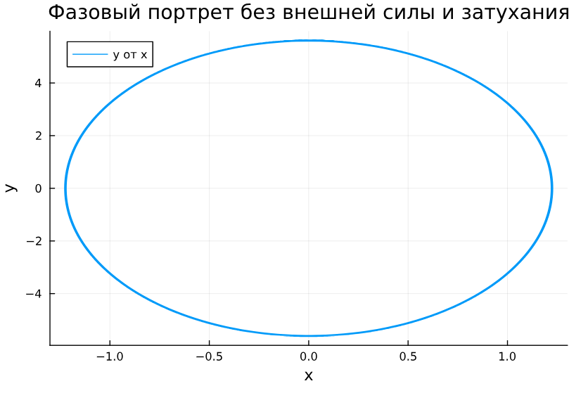{#fig:004 width=70%}

## Колебания гармонического осциллятора без затуханий и без действий внешней силы

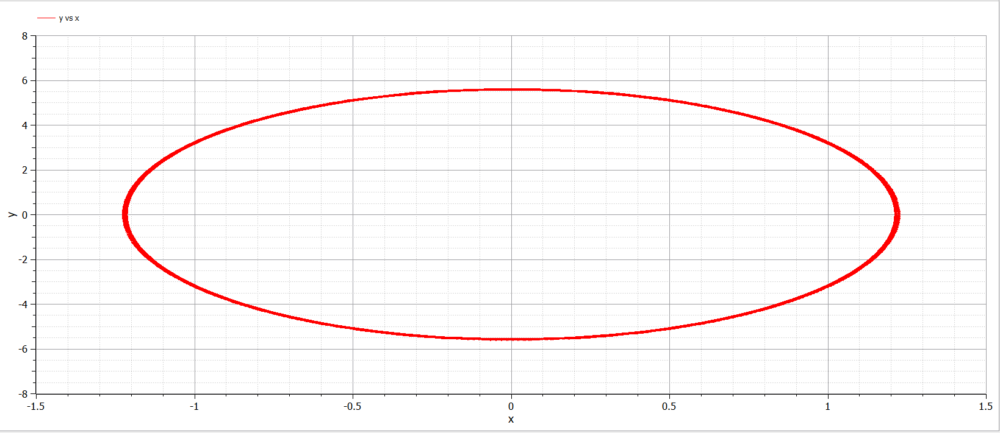{#fig:005 width=70%}

## Колебания гармонического осциллятора с затуханием и без действий внешней силы 

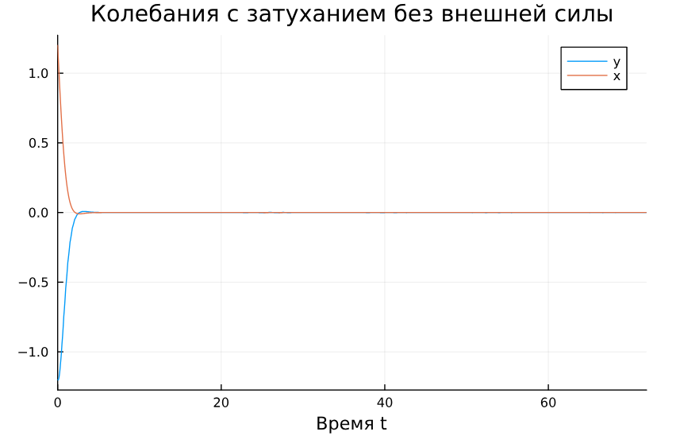{#fig:006 width=70%}

## Колебания гармонического осциллятора с затуханием и без действий внешней силы 

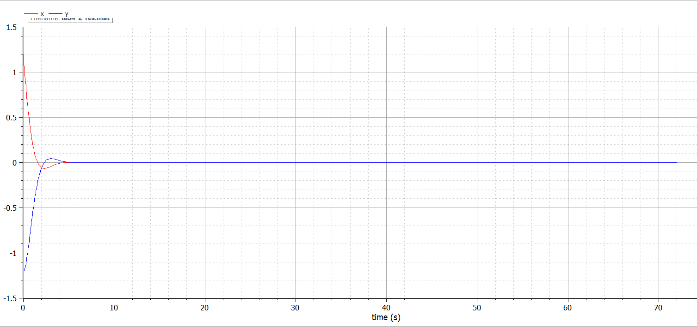{#fig:007 width=70%}

## Колебания гармонического осциллятора с затуханием и без действий внешней силы 

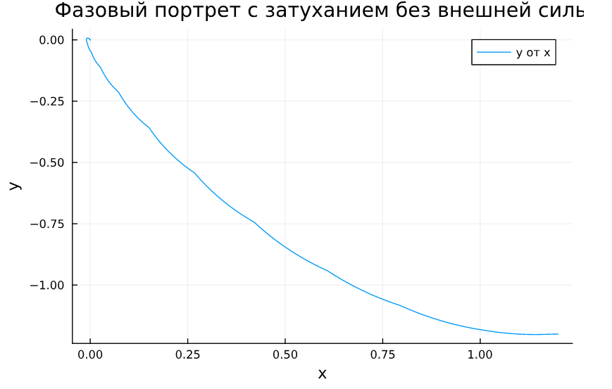{#fig:008 width=70%}

## Колебания гармонического осциллятора с затуханием и без действий внешней силы 

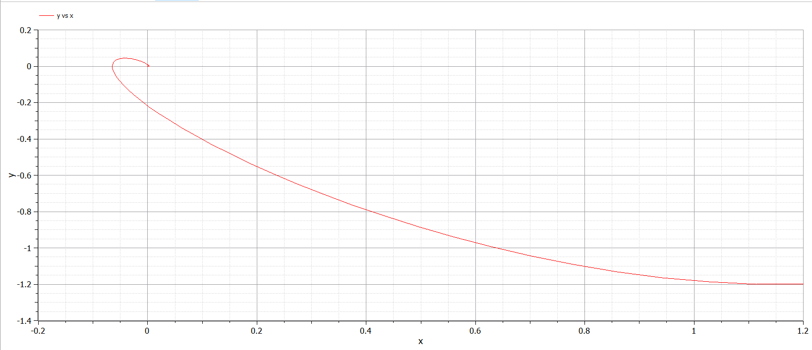{#fig:009 width=70%}

## Колебания гармонического осциллятора c затуханием и под действием внешней силы 

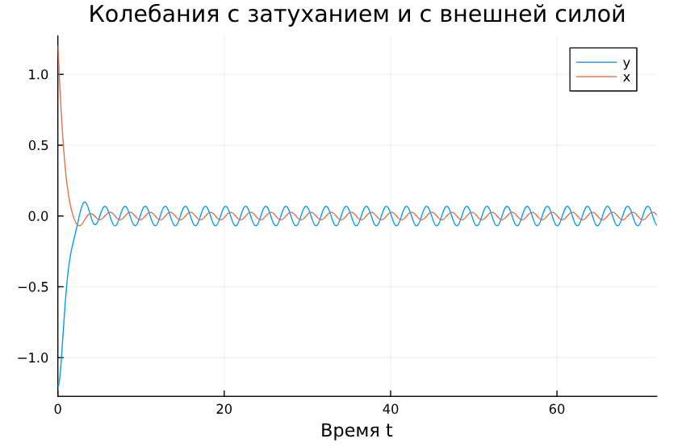{#fig:010 width=70%}

## Колебания гармонического осциллятора c затуханием и под действием внешней силы 

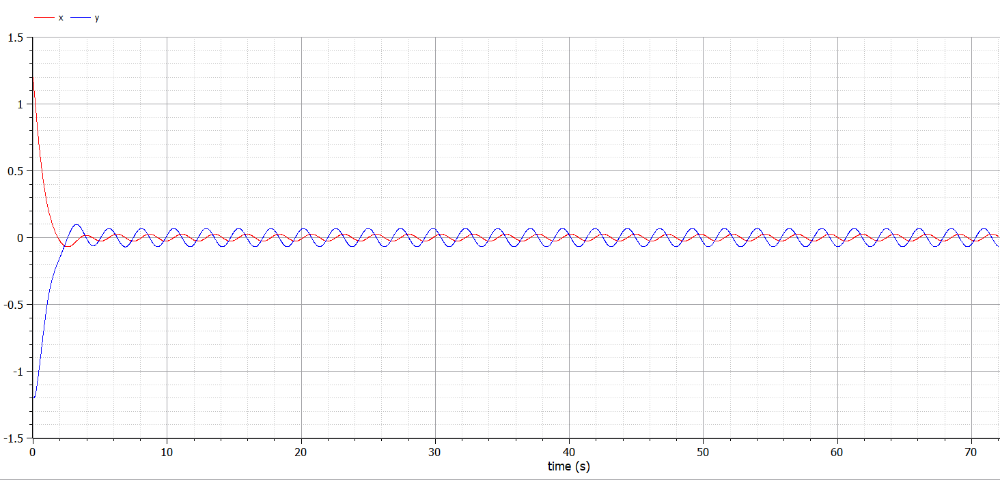{#fig:011 width=70%}

## Колебания гармонического осциллятора c затуханием и под действием внешней силы 

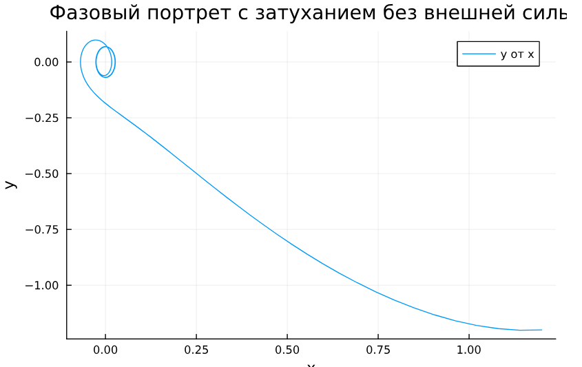{#fig:012 width=70%}

## Колебания гармонического осциллятора c затуханием и под действием внешней силы 

{#fig:013 width=70%}


# Вопросы к лабораторной работе

## Запишите простейшую модель гармонических колебаний

$$
\ddot{x} + \omega_0^2 x = 0,
$$

где:

- $x$ — переменная, описывающая состояние системы (например, смещение грузика),
- $\omega_0$ — собственная частота колебаний,
- $\ddot{x} = \frac{\partial^2 x}{\partial t^2}$ — вторая производная по времени.

## Дайте определение осциллятора

Осциллятор — это система, которая совершает колебания, то есть меняет своё состояние вблизи положения равновесия.

$$
\ddot{x} + 2\gamma\dot{x} + \omega_0^2 x = 0,
$$

где:

- $x$ — переменная состояния системы,
- $\gamma$ — параметр, характеризующий потери энергии (например, трение или сопротивление),
- $\omega_0$ — собственная частота колебаний,
- $\dot{x} = \frac{\partial x}{\partial t}$ и $\ddot{x} = \frac{\partial^2 x}{\partial t^2}$ — первая и вторая производные по времени.

## 3. Запишите модель математического маятника

Модель математического маятника является частным случаем гармонического осциллятора. Для малых углов отклонения $(\theta \ll 1)$ уравнение движения математического маятника записывается как:

$$
\ddot{\theta} + \frac{g}{l} \theta = 0,
$$

где:

- $\theta$ — угловое смещение маятника от вертикали,
- $g$ — ускорение свободного падения,
- $l$ — длина подвеса маятника,
- $\ddot{\theta} = \frac{\partial^2 \theta}{\partial t^2}$ — вторая производная углового смещения по времени.

## 3. Запишите модель математического маятника

Это уравнение можно переписать в стандартной форме гармонического осциллятора:

$$
\ddot{\theta} + \omega_0^2 \theta = 0,
$$

где $\omega_0 = \sqrt{\frac{g}{l}}$ — собственная частота колебаний маятника.

## 4. Запишите алгоритм перехода от дифференциального уравнения второго порядка к двум дифференциальным уравнениям первого порядка

- Введем новую переменную $y$, равную первой производной исходной переменной:

$$
y = \dot{x}.
$$

- Выразим вторую производную через новую переменную:

$$
\ddot{x} = \dot{y}.
$$

## 4. Запишите алгоритм перехода от дифференциального уравнения второго порядка к двум дифференциальным уравнениям первого порядка

- Подставим эти выражения в исходное уравнение второго порядка. Например, для уравнения консервативного осциллятора:

$$
\ddot{x} + \omega_0^2 x = 0
$$

получаем:

$$
\dot{y} + \omega_0^2 x = 0.
$$

## 4. Запишите алгоритм перехода от дифференциального уравнения второго порядка к двум дифференциальным уравнениям первого порядка

- Запишем систему из двух уравнений первого порядка:
  
$$
\begin{cases}
\dot{x} = y, \\
\dot{y} = -\omega_0^2 x.
\end{cases}
$$

## 5. Что такое фазовый портрет и фазовая траектория?

- **Фазовый портрет** — это графическое представление всех возможных состояний системы в фазовом пространстве (пространстве переменных состояния). Для осциллятора фазовое пространство обычно строится в координатах $(x, y)$, где $x$ — переменная состояния, а $y = \dot{x}$ — её скорость изменения.

- **Фазовая траектория** — это кривая в фазовом пространстве, описывающая изменение состояния системы во времени. Каждая точка на фазовой траектории соответствует определённому состоянию системы в заданный момент времени.


## Выводы

Построили математическую модель гармонического осциллятора и провели анализ.

