---
## Front matter
title: "Лабораторная работа №4"
subtitle: "Модель гармонических колебаний"
author: "Дворкина Ева Владимировна"

## Generic otions
lang: ru-RU
toc-title: "Содержание"

## Bibliography
bibliography: bib/cite.bib
csl: pandoc/csl/gost-r-7-0-5-2008-numeric.csl

## Pdf output format
toc: true # Table of contents
toc-depth: 2
lof: true # List of figures
lot: false # List of tables
fontsize: 12pt
linestretch: 1.5
papersize: a4
documentclass: scrreprt
## I18n polyglossia
polyglossia-lang:
  name: russian
  options:
	- spelling=modern
	- babelshorthands=true
polyglossia-otherlangs:
  name: english
## I18n babel
babel-lang: russian
babel-otherlangs: english
## Fonts
mainfont: IBM Plex Serif
romanfont: IBM Plex Serif
sansfont: IBM Plex Sans
monofont: IBM Plex Mono
mathfont: STIX Two Math
mainfontoptions: Ligatures=Common,Ligatures=TeX,Scale=0.94
romanfontoptions: Ligatures=Common,Ligatures=TeX,Scale=0.94
sansfontoptions: Ligatures=Common,Ligatures=TeX,Scale=MatchLowercase,Scale=0.94
monofontoptions: Scale=MatchLowercase,Scale=0.94,FakeStretch=0.9
mathfontoptions:
## Biblatex
biblatex: true
biblio-style: "gost-numeric"
biblatexoptions:
  - parentracker=true
  - backend=biber
  - hyperref=auto
  - language=auto
  - autolang=other*
  - citestyle=gost-numeric
## Pandoc-crossref LaTeX customization
figureTitle: "Рис."
tableTitle: "Таблица"
listingTitle: "Листинг"
lofTitle: "Список иллюстраций"
lotTitle: "Список таблиц"
lolTitle: "Листинги"
## Misc options
indent: true
header-includes:
  - \usepackage{indentfirst}
  - \usepackage{float} # keep figures where there are in the text
  - \floatplacement{figure}{H} # keep figures where there are in the text
---

# Цель работы

Исследовать математическую модель гармонического осциллятора.

# Задание

## Вариант 38

Постройте фазовый портрет гармонического осциллятора и решение уравнения гармонического осциллятора для следующих случаев

1. Колебания гармонического осциллятора без затуханий и без действий внешней силы $\ddot x + 21x = 0$
2. Колебания гармонического осциллятора c затуханием и без действий внешней силы $\ddot x + 2.2\dot x + 2.3x = 0$
3. Колебания гармонического осциллятора c затуханием и под действием внешней силы $\ddot x + 2.4\dot x + 2.5x = 0.2\sin{(2.6t)}$

На интервале $t \in [0; 72]$ (шаг 0.05) с начальными условиями $x_0 = 1.2, \, y_0=-1.2$

# Теоретическое введение

## Модель гармонического осциллятора 


Гармонические колебания — колебания, при которых физическая величина изменяется с течением времени по гармоническому (синусоидальному, косинусоидальному) закону [@wiki:bash].

Гармоническое колебание является специальным, частным видом периодического колебания. Периодическим называется повторяющееся движение, у которого каждый цикл в точности воспроизводит любой другой цикл. Этот специальный вид колебания очень важен, так как он чрезвычайно часто встречается в самых различных колебательных системах. Колебание груза на пружине, камертона, маятника, зажатой металлической пластинки как раз и является по своей форме гармоническим. Следует заметить, что при больших амплитудах колебания указанных систем имеют несколько более сложную форму, но они тем ближе к гармоническому, чем меньше амплитуда колебаний [@landsberg:bash]. 

Гармонический осциллятор (в классической механике) — система, которая при выведении её из положения равновесия испытывает действие возвращающей силы F, пропорциональной смещению $x$ [@wiki:osc:bash]

Движение грузика на пружинке, маятника, заряда в электрическом контуре, а также эволюция во времени многих систем в физике, химии, биологии и других науках при определенных предположениях можно описать одним и тем же дифференциальным уравнением, которое в теории колебаний выступает в качестве основной модели. Эта модель называется линейным гармоническим осциллятором. Уравнение свободных колебаний гармонического осциллятора имеет следующий вид ([-@eq:eq:a]) 

$$
\ddot{x} + 2\gamma\dot{x} + \omega_0^2 x = 0
$${#eq:eq:a}
   
   где $x$ — переменная, описывающая состояние системы (смещение грузика, заряд конденсатора и т.д.), $\gamma$ — параметр, характеризующий потери энергии (трение в механической системе, сопротивление в контуре), $\omega_0$ — собственная частота колебаний, $t$ — время. (Обозначения $\ddot{x}=\frac{\partial^2 x}{\partial t^2}, \dot{x}=\frac{\partial x}{\partial t}$)

Уравнение ([-@eq:eq:a]) есть линейное однородное дифференциальное уравнение второго порядка и оно является примером линейной динамической системы. 

При отсутствии потерь в системе ($\gamma=0$) вместо уравнения ([-@eq:eq:a]) получаем 
уравнение консервативного осциллятора энергия колебания которого сохраняется во времени.

$$
\ddot{x} + \omega_0^2 x = 0
$${#eq:eq:b}

Для однозначной разрешимости уравнения второго порядка ([-@eq:eq:b]) необходимо 
задать два начальных условия вида

$$
\begin{cases}
x(t_0) = x_0 \\
\dot{x}(t_0) = y_0
\end{cases}
$${#eq:eq:c}

Уравнение второго порядка ([-@eq:eq:b]) можно представить в виде системы двух уравнений первого порядка: 

$$
\begin{cases}
\dot{x} = y \\
\dot{y} = -\omega_0^2 x
\end{cases}
$${#eq:eq:d}

Начальные условия ([-@eq:eq:c]) для системы ([-@eq:eq:d]) примут вид ([-@eq:eq:e]): 

$$
\begin{cases}
x(t_0) = x_0 \\
y(t_0) = y_0
\end{cases}
$${#eq:eq:e}

Независимые переменные $x$, $y$ определяют пространство, в котором «движется» решение. Это фазовое пространство системы, поскольку оно двумерно будем называть его фазовой плоскостью. 

Значение фазовых координат $x$, $y$ в любой момент времени полностью определяет состояние системы. Решению уравнения движения как функции времени отвечает гладкая кривая в фазовой плоскости. Она называется фазовой траекторией. Если множество различных решений (соответствующих различным начальным условиям) изобразить на одной фазовой плоскости, возникает общая картина поведения системы. Такую картину, образованную набором фазовых траекторий, называют фазовым портретом [@lab:bash]. 

# Выполнение лабораторной работы

## Реализация в Julia

Зададим функцию для решения модели линейного гармонического осциллятора. Зададим функции для случаев однородного уравнения и неоднородного отдельно. В `Julia` можно решить сразу уравнение второго порядка:

```julia
using DifferentialEquations, Plots

tspan = (0, 72)

p1 = [0, 21] # первый элемент - гамма
p2 = [2.2, 2.3] # второй - омега в квадрате 
p3 = [2.4, 2.5] #омега уже дана в квадрате!!

du0 = [-1.2] #y - первая производная от х
u0 = [1.2] 

#без действий внешний силы
function harm_osc(ddu, du, u, p, t)
 g, w = p
 ddu .= -g.*du.-w .*u
end

#внешняя сила
f(t) = 0.2*sin(2.6*t)

#с действием в нешней силы
function forced_harm_osc(ddu, du, u, p, t)
 g, w = p 
 ddu .= -g.*du.-w .*u .+ f(t)
end
```

Для задания проблемы используется функция `SecondOrderODEProblem`, а для решения -- численный метод `DPRKN6()`:

```
prob1 = SecondOrderODEProblem(harm_osc, du0, u0, tspan, p1)
sol1 = solve(prob1, DPRKN6(), saveat=0.0005)

prob2 = SecondOrderODEProblem(harm_osc, du0, u0, tspan, p2)
sol2 = solve(prob2, DPRKN6(), saveat=0.0005)

prob3 = SecondOrderODEProblem(forced_harm_osc, du0, u0, tspan, p3)
sol3 = solve(prob3, Tsit5(), saveat=0.0005)
```

Далее построим графики и фазовые портреты модели, используем функцию для унификации графиков

```
# Функция для построения графиков колебаний
function plot_oscillations(sol, title)
    plot(sol, vars=(0, 1), label="y", xlabel="Время t", ylabel="", title=title)
    plot!(sol, vars=(0, 2), label="x", xlabel="Время t", ylabel="", title=title)
end
```

Так будет выглядеть построение графика уравнения:

```
# Построение графиков для sol1
plot_oscillations(sol1, "Колебания без затухания и внешней силы")

plot(sol1, vars=(2, 1), label="y от x", xlabel="x", ylabel="y", 
    title="Фазовый портрет без внешней силы и затухания")
```

Аналогично строим графики других моделей.    
    
## Реализация в OpenModelica    

Также зададим эту модель в OpenModelica. Модель для колебания без затухания и без действия внешних сил:


```Modelica
model lab4_1

Real x(start=1.2);
Real y(start=-1.2);

parameter Real w=21;
parameter Real g=0;

equation

der(x) = y;
der(y) = -w*x-g*y;

end lab4_1;
```

Модель для колебания с затуханием и без действия внешних сил:

```Modelica
model lab4_2

Real x(start=1.2);
Real y(start=-1.2);

parameter Real w=2.3;
parameter Real g=2.2;

equation

der(x) = y;
der(y) = -w*x-g*y;

end lab4_2;
```

Модель для колебания с затуханием и действием внешних сил:

```Modelica
model lab4_3

Real x(start=1.2);
Real y(start=-1.2);

parameter Real w=2.5;
parameter Real g=2.4;
Real p;

equation

der(x) = y;
der(y) = -w*x-g*y+p;
p = 0.2*sin(2.6*time);
```

## Колебания гармонического осциллятора без затуханий и без действий внешней силы

Рассмотрим колебания гармонического осциллятора без затуханий и без действий внешней силы

Графики решений, полученные с помощью OpenModelica и Julia идентичны (рис. [@fig:002],  [@fig:003]):

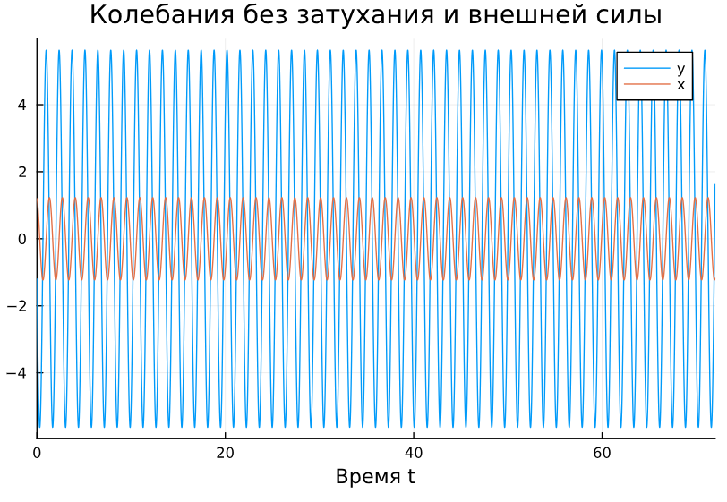{#fig:002 width=70%}

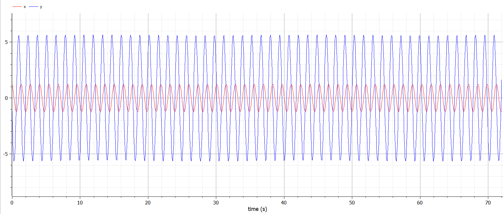{#fig:003 width=70%}

Фазовые портреты, полученные с помощью OpenModelica и Julia также идентичны (рис. [@fig:004],  [@fig:005]):

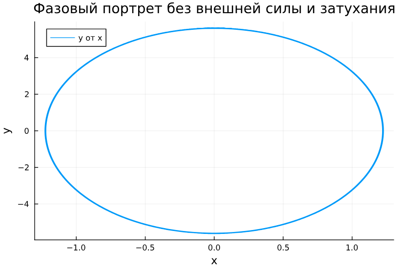{#fig:004 width=70%}

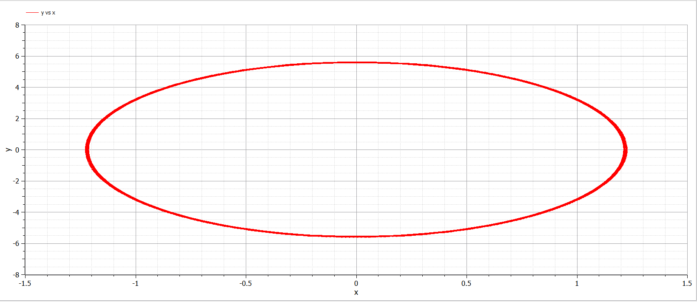{#fig:005 width=70%}

Можно видеть, что колебание осциллятора периодично, график не затухает, а решение системы дифференциальных уравнений движется по одной траектории всегда.

## Колебания гармонического осциллятора с затуханием и без действий внешней силы 

Рассмотрим колебания гармонического осциллятора c затуханием и без действий внешней силы, заданные уравнением:

Графики, полученные с помощью OpenModelica и Julia идентичны (рис. [@fig:004],  [@fig:005]):

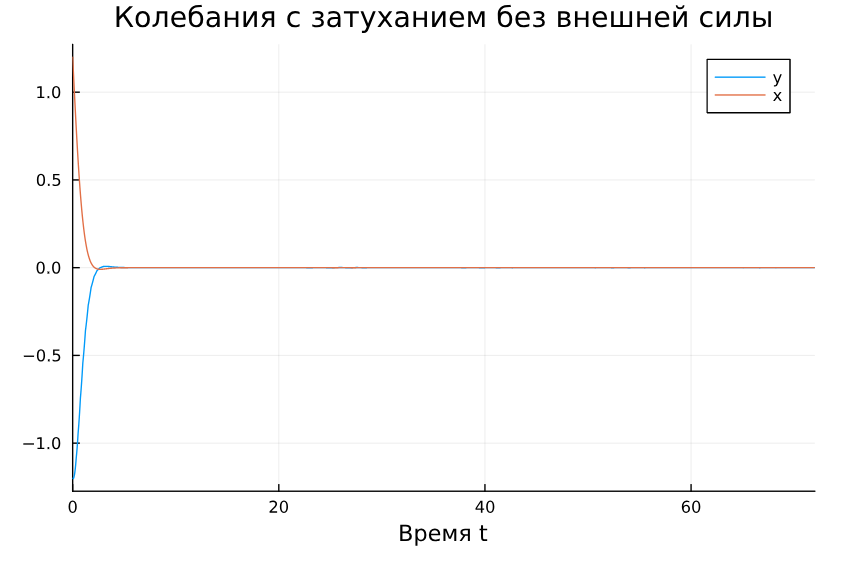{#fig:006 width=70%}

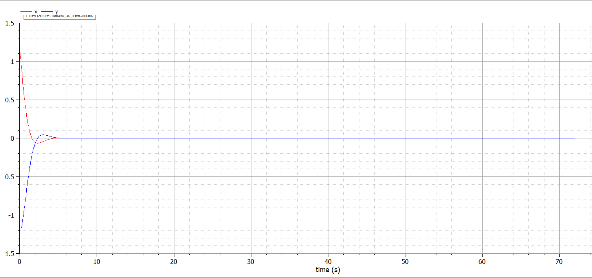{#fig:007 width=70%}

Графики решений, полученные с помощью OpenModelica и Julia также идентичны (рис. [@fig:008],  [@fig:009]):

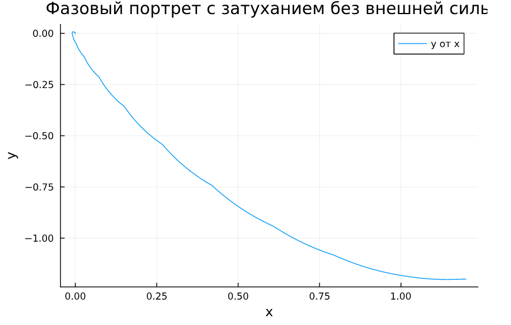{#fig:008 width=70%}

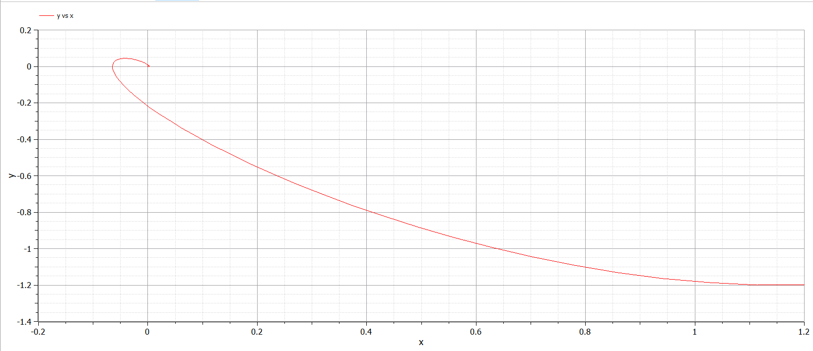{#fig:009 width=70%}

Можно видеть, что сначала происходят колебания осциллятора, а затем график затухает.

## Колебания гармонического осциллятора c затуханием и под действием внешней силы 

Рассмотрим колебания гармонического осциллятора c затуханием и под действием внешней силы

Графики, полученные с помощью OpenModelica и Julia идентичны (рис. [@fig:010],  [@fig:011]):

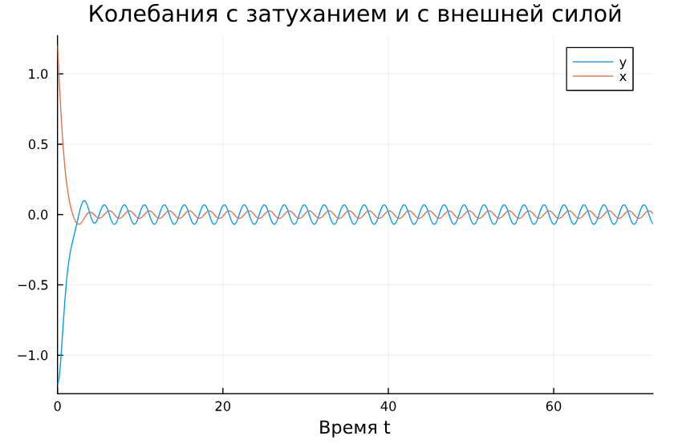{#fig:010 width=70%}

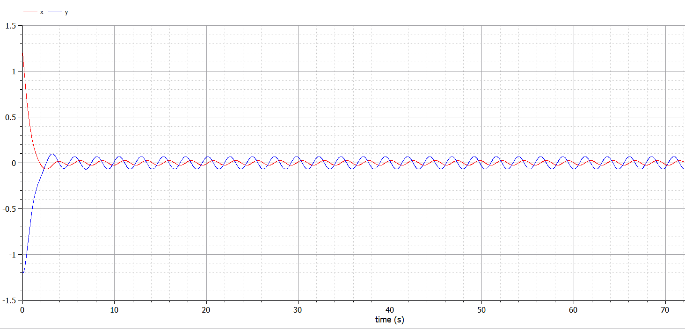{#fig:011 width=70%}

Графики решений, полученные с помощью OpenModelica и Julia также идентичны (рис. [@fig:012],  [@fig:013]):

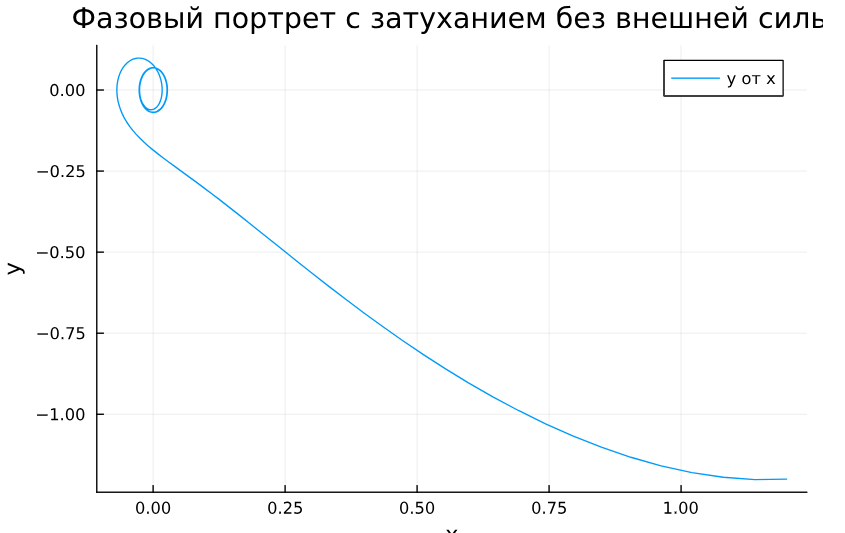{#fig:012 width=70%}

{#fig:013 width=70%}

Можно увидеть, что система приходит в состояние равновесия, период колебаний больше, чем в первом случае, так как затухание замедляет его, так же видим, что под действием внешней силы колебания продолжаются, но их амплитуда меньше.

# Вопросы к лабораторной работе

1. Запишите простейшую модель гармонических колебаний

Простейшая модель гармонических колебаний описывается уравнением консервативного осциллятора:

$$
\ddot{x} + \omega_0^2 x = 0,
$$

где:

- $x$ — переменная, описывающая состояние системы (например, смещение грузика),
- $\omega_0$ — собственная частота колебаний,
- $\ddot{x} = \frac{\partial^2 x}{\partial t^2}$ — вторая производная по времени.

2. Дайте определение осциллятора

Осциллятор — это система, которая совершает колебания, то есть меняет своё состояние вблизи положения равновесия. В общем случае поведение осциллятора описывается дифференциальным уравнением второго порядка:

$$
\ddot{x} + 2\gamma\dot{x} + \omega_0^2 x = 0,
$$

где:

- $x$ — переменная состояния системы,
- $\gamma$ — параметр, характеризующий потери энергии (например, трение или сопротивление),
- $\omega_0$ — собственная частота колебаний,
- $\dot{x} = \frac{\partial x}{\partial t}$ и $\ddot{x} = \frac{\partial^2 x}{\partial t^2}$ — первая и вторая производные по времени.

3. Запишите модель математического маятника

Модель математического маятника является частным случаем гармонического осциллятора. Для малых углов отклонения $(\theta \ll 1)$ уравнение движения математического маятника записывается как:

$$
\ddot{\theta} + \frac{g}{l} \theta = 0,
$$

где:

- $\theta$ — угловое смещение маятника от вертикали,
- $g$ — ускорение свободного падения,
- $l$ — длина подвеса маятника,
- $\ddot{\theta} = \frac{\partial^2 \theta}{\partial t^2}$ — вторая производная углового смещения по времени.

Это уравнение можно переписать в стандартной форме гармонического осциллятора:

$$
\ddot{\theta} + \omega_0^2 \theta = 0,
$$

где $\omega_0 = \sqrt{\frac{g}{l}}$ — собственная частота колебаний маятника.

4. Запишите алгоритм перехода от дифференциального уравнения второго порядка к двум дифференциальным уравнениям первого порядка

- Введем новую переменную $y$, равную первой производной исходной переменной:

$$
y = \dot{x}.
$$

- Выразим вторую производную через новую переменную:

$$
\ddot{x} = \dot{y}.
$$

- Подставим эти выражения в исходное уравнение второго порядка. Например, для уравнения консервативного осциллятора:

$$
\ddot{x} + \omega_0^2 x = 0
$$

получаем:

$$
\dot{y} + \omega_0^2 x = 0.
$$

- Запишем систему из двух уравнений первого порядка:
  
$$
\begin{cases}
\dot{x} = y, \\
\dot{y} = -\omega_0^2 x.
\end{cases}
$$

5. Что такое фазовый портрет и фазовая траектория?

- **Фазовый портрет** — это графическое представление всех возможных состояний системы в фазовом пространстве (пространстве переменных состояния). Для осциллятора фазовое пространство обычно строится в координатах $(x, y)$, где $x$ — переменная состояния, а $y = \dot{x}$ — её скорость изменения.

- **Фазовая траектория** — это кривая в фазовом пространстве, описывающая изменение состояния системы во времени. Каждая точка на фазовой траектории соответствует определённому состоянию системы в заданный момент времени.

Для гармонического осциллятора фазовые траектории представляют собой замкнутые кривые (эллипсы), что указывает на периодический характер колебаний.

# Выводы

Построили математическую модель гармонического осциллятора и провели анализ.

# Список литературы{.unnumbered}

::: {#refs}
:::
