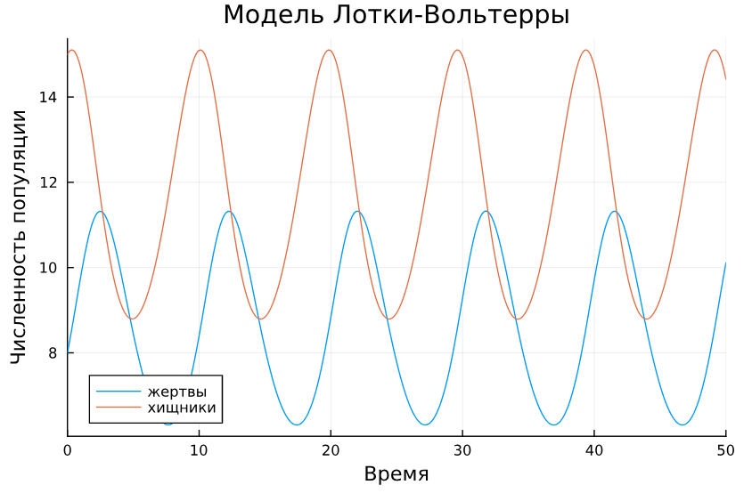
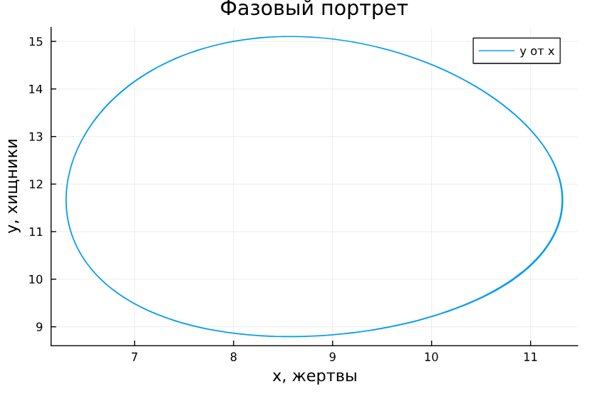
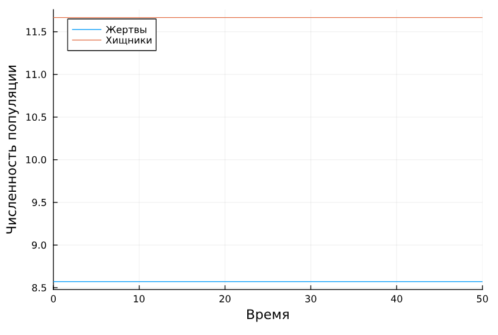
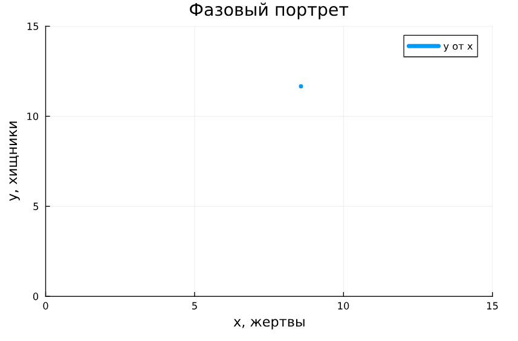
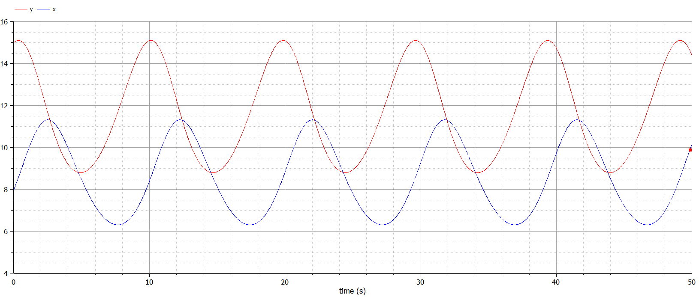
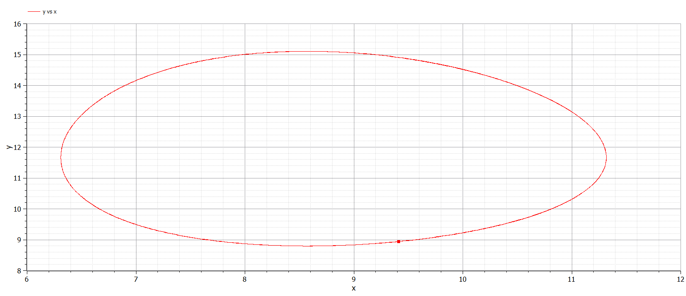
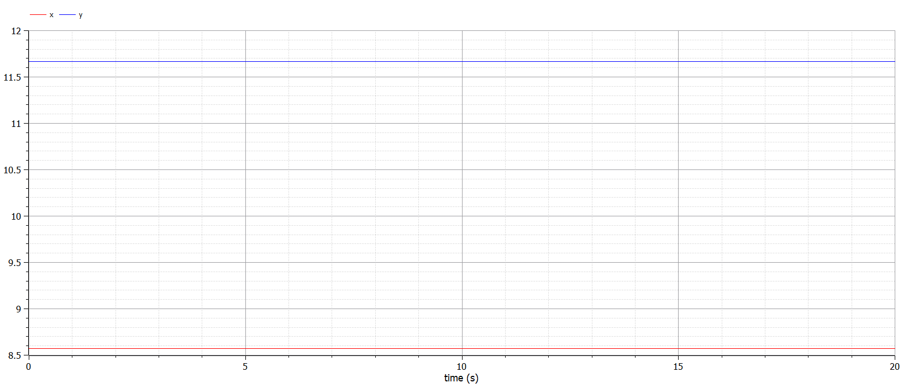
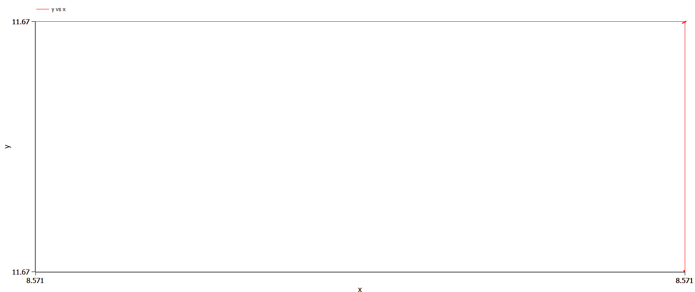

---
## Front matter
lang: ru-RU
title: Лабораторная работа №5
subtitle: Модель хищник-жертва
author:
  - Дворкина Е. В.
institute:
  - Российский университет дружбы народов, Москва, Россия
date: 01 января 1970

## i18n babel
babel-lang: russian
babel-otherlangs: english

## Formatting pdf
toc: false
toc-title: Содержание
slide_level: 2
aspectratio: 169
section-titles: true
theme: metropolis
header-includes:
 - \metroset{progressbar=frametitle,sectionpage=progressbar,numbering=fraction}
---

## Докладчик

:::::::::::::: {.columns align=center}
::: {.column width="70%"}

  * Дворкина Ева Владимировна
  * студентка
  * группа НФИбд-01-22
  * Российский университет дружбы народов
  * [1132226447@rudn.ru](mailto:1132226447@rudn.ru)
  * <https://github.com/evdvorkina>

:::
::: {.column width="30%"}


:::
::::::::::::::

## Цель работы

Исследовать математическую модель хищник-жертва.

## Задание Вариант 38

Для модели «хищник-жертва»:

$$
\begin{cases}
\dfrac{dx}{dt} = -0.7 x(t)+0.06 x(t)y(t)\\
\dfrac{dy}{dt} = 0.6y(t)- 0.07 x(t)y(t)
\end{cases}
\tag{1}
$$

Постройте график зависимости численности хищников от численности жертв, графики изменения численности хищников и численности жертв при следующих начальных условиях: $x_0 = 8$, $y_0 = 15$. Найдите стационарное состояние системы.

# Выполнение лабораторной работы

## Поиск стационарного состояния системы

Найдём стационарное состояние системы. Для этого приравняем её правые части к нулю.

$$
\begin{cases}
  -0.7 x(t)+0.06 x(t)y(t) = 0\\
  0.6y(t)- 0.07 x(t)y(t) = 0
\end{cases}
\tag{2}
$$

## Поиск стационарного состояния системы

$$
\begin{cases}
  -0.7 +0.06 y(t) = 0\\
  0.6- 0.07 x(t) = 0
\end{cases}
\tag{3}
$$

Cтационарное состояние системы будет в точке $x_0 = 0.6/0.07 = 60/7=8,571428$, $y_0 = 0.7/0.06 = 35/3=11,(6)$. 

## Реализация в Julia. Задание параметров

```julia
using DifferentialEquations, Plots
# Начальные условия
u0 = [8, 15]
p = [-0.7, -0.06, -0.6, -0.07]
tspan = (0.0, 50.0)
```

## Реализация в Julia. Определение функции

```julia
# система ДУ, описывающей модель Лотки-Вольтерры
function LV(u, p, t)
    x, y = u
    a, b, c, d = p
    dx = a*x - b*x*y
    dy = -c*y + d*x*y
    return [dx, dy]
end

prob = ODEProblem(LV, u0, tspan, p)
sol = solve(prob, Tsit5())
```

## Реализация в Julia. Построение графиков

```julia
plot(sol, title = "Модель Лотки-Вольтерры", 
    xaxis = "Время", yaxis = "Численность популяции", 
    label = ["жертвы" "хищники"])

plot(sol, vars=(1, 2), label="y от x", 
    xlabel="x, жертвы", ylabel="y, хищники", 
    title="Фазовый портрет")
```

## Реализация в Julia. График решения

{#fig:001 width=70%}

## Реализация в Julia. Фазовый портрет

{#fig:002 width=70%}

## Реализация в Julia. Поиск стационарного состояния

```julia
# проверка стационарной точки
x_c = p[3]/p[4]
y_c = p[1]/p[2]
u0_c = [x_c, y_c]
prob2 = ODEProblem(LV, u0_c, tspan, p)
sol2 = solve(prob2, Tsit5())
```

## Реализация в Julia. Построение графиков

```julia
plot(sol2, xaxis = "Время", 
    yaxis = "Численность популяции", 
    label = ["Жертвы" "Хищники"])

plot(sol2, vars=(1, 2), label="y от x", 
    xlabel="x, жертвы", ylabel="y, хищники", 
    title="Фазовый портрет", xlimit = [0,15], 
    ylimit=[0,15], lw=5)
```

## Реализация в Julia. График решения

{#fig:003 width=70%}

## Реализация в Julia. Фазовый портрет

{#fig:004 width=70%}

## Реализация в OpenModelica

```Modelica
parameter Real a=-0.7;
parameter Real b=-0.06;
parameter Real c=-0.6;
parameter Real d=-0.07;

parameter Real x0=8;
parameter Real y0=15;
Real x(start=x0);
Real y(start=y0);

equation
der(x) = a*x - b*x*y;
der(y) = -c*y + d*x*y;
```

## Реализация в OpenModelica. График решения

{#fig:005 width=70%}

## Реализация в OpenModelica. Фазовый портрет

{#fig:006 width=70%}

## Реализация в OpenModelica

```Modelica
parameter Real a=-0.7;
parameter Real b=-0.06;
parameter Real c=-0.6;
parameter Real d=-0.07;

parameter Real x0=c/d;
parameter Real y0=a/b;
Real x(start=x0);
Real y(start=y0);

equation
der(x) = a*x - b*x*y;
der(y) = -c*y + d*x*y;
```

## Реализация в OpenModelica. График решения

{#fig:007 width=70%}

## Реализация в OpenModelica. Фазовый портрет

{#fig:008 width=70%}

## Выводы

Построили математическую модель хищник жертва и провели анализ.

