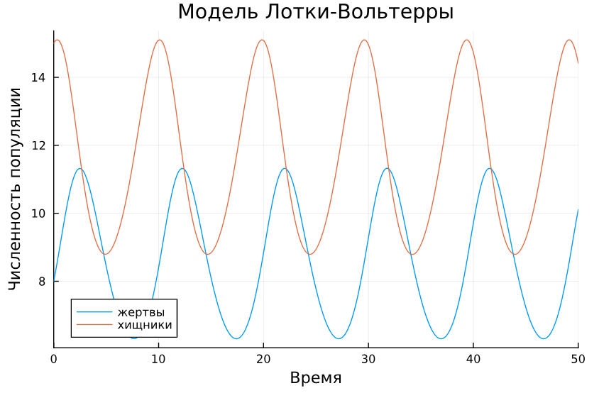
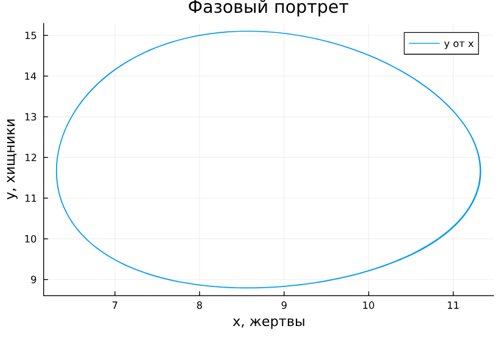
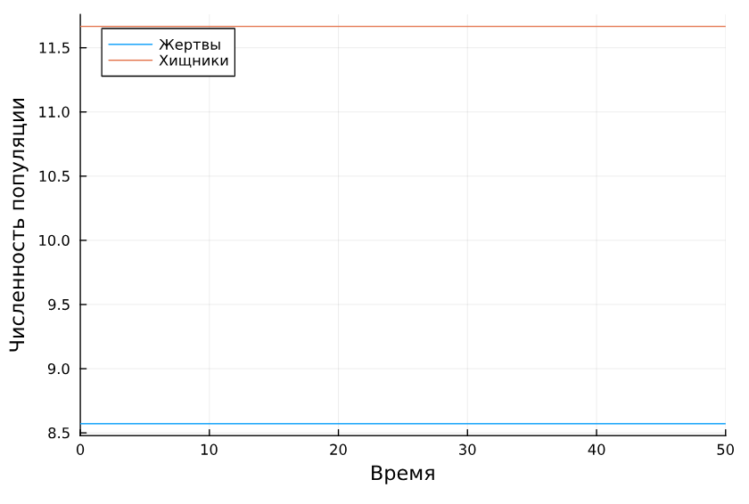
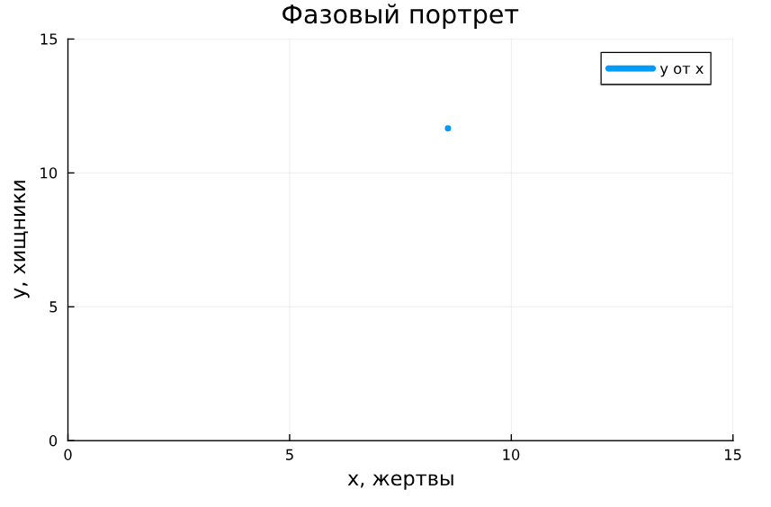
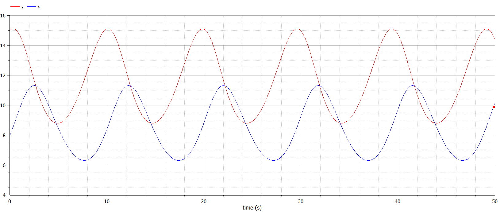
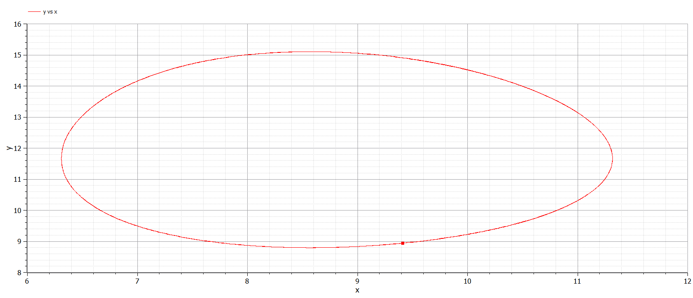
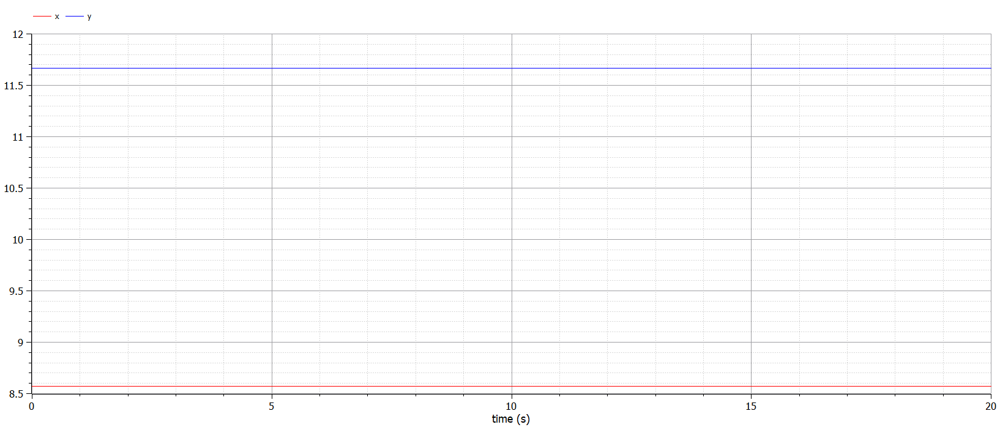

---
## Front matter
title: "Лабораторная работа №5"
subtitle: "Модель хищник-жертва"
author: "Дворкина Ева Владимировна"

## Generic otions
lang: ru-RU
toc-title: "Содержание"

## Bibliography
bibliography: bib/cite.bib
csl: pandoc/csl/gost-r-7-0-5-2008-numeric.csl

## Pdf output format
toc: true # Table of contents
toc-depth: 2
lof: true # List of figures
lot: false # List of tables
fontsize: 12pt
linestretch: 1.5
papersize: a4
documentclass: scrreprt
## I18n polyglossia
polyglossia-lang:
  name: russian
  options:
	- spelling=modern
	- babelshorthands=true
polyglossia-otherlangs:
  name: english
## I18n babel
babel-lang: russian
babel-otherlangs: english
## Fonts
mainfont: IBM Plex Serif
romanfont: IBM Plex Serif
sansfont: IBM Plex Sans
monofont: IBM Plex Mono
mathfont: STIX Two Math
mainfontoptions: Ligatures=Common,Ligatures=TeX,Scale=0.94
romanfontoptions: Ligatures=Common,Ligatures=TeX,Scale=0.94
sansfontoptions: Ligatures=Common,Ligatures=TeX,Scale=MatchLowercase,Scale=0.94
monofontoptions: Scale=MatchLowercase,Scale=0.94,FakeStretch=0.9
mathfontoptions:
## Biblatex
biblatex: true
biblio-style: "gost-numeric"
biblatexoptions:
  - parentracker=true
  - backend=biber
  - hyperref=auto
  - language=auto
  - autolang=other*
  - citestyle=gost-numeric
## Pandoc-crossref LaTeX customization
figureTitle: "Рис."
tableTitle: "Таблица"
listingTitle: "Листинг"
lofTitle: "Список иллюстраций"
lotTitle: "Список таблиц"
lolTitle: "Листинги"
## Misc options
indent: true
header-includes:
  - \usepackage{indentfirst}
  - \usepackage{float} # keep figures where there are in the text
  - \floatplacement{figure}{H} # keep figures where there are in the text
---

# Цель работы

Исследовать математическую модель хищник-жертва.

# Задание

## Вариант 38

Для модели «хищник-жертва» ([-@eq:eq:aa]):

$$
\begin{cases}
\dfrac{dx}{dt} = -0.7 x(t)+0.06 x(t)y(t)\\
\dfrac{dy}{dt} = 0.6y(t)- 0.07 x(t)y(t)
\end{cases}
$${#eq:eq:aa}

Постройте график зависимости численности хищников от численности жертв, а также графики изменения численности хищников и численности жертв при следующих начальных условиях: $x_0 = 8$, $y_0 = 15$. Найдите стационарное состояние системы.

# Теоретическое введение

## Модель хищник-жертва

Модель "Хищник-жертва" основывается на следующих предположениях [@lab:bash] :

1. Численность популяции жертв $x$ и хищников $y$ зависят только от времени (модель не учитывает пространственное распределение популяции на занимаемой территории)

2. В отсутствии взаимодействия численность видов изменяется по модели Мальтуса (экспоненциальный рост с постоянным темпом), при этом число жертв увеличивается, а число хищников падает

3. Естественная смертность жертвы и естественная рождаемость хищника считаются несущественными

4. Эффект насыщения численности обеих популяций не учитывается

5. Скорость роста численности жертв уменьшается пропорционально численности хищников

$$
\begin{cases}
&\dfrac{dx}{dt} = ax(t)-bx(t)y(t)\\
&\dfrac{dy}{dt} = -cy(t)+dx(t)y(t)
\end{cases}
$${#eq:eq:b}

В этой модели ([-@eq:eq:b]) $x$ – число жертв, $y$ - число хищников. Коэффициент $a$ описывает скорость естественного прироста числа жертв в отсутствие хищников, $c$ - естественное вымирание хищников, лишенных пищи в виде жертв. Вероятность взаимодействия жертвы и хищника считается пропорциональной как количеству жертв, так и числу самих хищников. Каждый акт взаимодействия уменьшает популяцию жертв, но способствует увеличению популяции хищников (члены $-bxy$ и $dxy$ в правой части уравнения).  

Найдём стационарное состояние системы ([-@eq:eq:b]). Для этого приравняем её правые части к нулю.

$$
\begin{cases}
ax(t)-bx(t)y(t) = 0\\
-cy(t)+dx(t)y(t) = 0
\end{cases}
$${#eq:eq:c}

Из полученной системы ([-@eq:eq:c]) получаем, что стационарное состояние системы будет в точке $x_0 = c/d$, $y_0 = a/b$. Если начальные значения задать в стационарном состоянии $x(0) = x_0$, $y(0) = y_0$, то в любой момент времени численность популяций изменяться не будет. При малом отклонении от положения равновесия численности как хищника, так и жертвы с течением времени не возвращаются к равновесным значениям, а совершают периодические колебания вокруг стационарной точки.

# Выполнение лабораторной работы

## Поиск стационарного состояния системы

Найдём стационарное состояние системы ([-@eq:eq:aa]). Для этого приравняем её правые части к нулю.

$$
\begin{cases}
  -0.7 x(t)+0.06 x(t)y(t) = 0\\
  0.6y(t)- 0.07 x(t)y(t) = 0
\end{cases}
$${#eq:eq:d}

$$
\begin{cases}
  -0.7 +0.06 y(t) = 0\\
  0.6- 0.07 x(t) = 0
\end{cases}
$${#eq:eq:e}

Из полученной системы получаем, что стационарное состояние системы будет в точке $x_0 = 0.6/0.07 = 60/7=8,571428$, $y_0 = 0.7/0.06 = 35/3=11,(6)$. Если начальные значения задать в стационарном состоянии $x(0) = x_0$, $y(0) = y_0$, то в любой момент времени численность популяций изменяться не будет. При малом отклонении от положения равновесия численности как хищника, так и жертвы с течением времени не возвращаются к равновесным значениям, а совершают периодические колебания вокруг стационарной точки.

## Реализация в Julia

Зададим начальные значения функций и параметры, а также интервал интегрирования.

```julia
using DifferentialEquations, Plots
# Начальные условия
u0 = [8, 15]
p = [-0.7, -0.06, -0.6, -0.07]
tspan = (0.0, 50.0)
```

Зададим функцию для решения модели хищник-жертва. Для задания проблемы используется функция `ODEProblem`, а для решения -- численный метод `Tsit5()`:

```julia
# система ДУ, описывающей модель Лотки-Вольтерры
function LV(u, p, t)
    x, y = u
    a, b, c, d = p
    dx = a*x - b*x*y
    dy = -c*y + d*x*y
    return [dx, dy]
end

prob = ODEProblem(LV, u0, tspan, p)
sol = solve(prob, Tsit5())
```

С помощью `plot` строим графики решения модели, а также фазовый портрет (рис. [-@fig:001], [-@fig:002]).

```julia
plot(sol, title = "Модель Лотки-Вольтерры", 
    xaxis = "Время", yaxis = "Численность популяции", 
    label = ["жертвы" "хищники"])

plot(sol, vars=(1, 2), label="y от x", 
    xlabel="x, жертвы", ylabel="y, хищники", 
    title="Фазовый портрет")
```

{#fig:001 width=70%}

{#fig:002 width=70%}

Проверим найденное стационарное состояние с помощью вычислений в программе, для этого используем деление соответствующих параметров и получим `x_c`, `y_c`. Если это стационарное состояние системы,то на графике решения мы не увидим изменения функций, а на фазовом портрете получим одну точку. Поэтому зададим проблему со стационарным состоянием в виде начального условия и решим ее:

```julia
# проверка стационарной точки
x_c = p[3]/p[4]
y_c = p[1]/p[2]
u0_c = [x_c, y_c]
prob2 = ODEProblem(LV, u0_c, tspan, p)
sol2 = solve(prob2, Tsit5())
```

С помощью `plot` построим графики решения и фазовый портрет (рис. [-@fig:003], [-@fig:004]).

```julia
plot(sol2, xaxis = "Время", 
    yaxis = "Численность популяции", 
    label = ["Жертвы" "Хищники"])

plot(sol2, vars=(1, 2), label="y от x", 
    xlabel="x, жертвы", ylabel="y, хищники", 
    title="Фазовый портрет", xlimit = [0,15], 
    ylimit=[0,15], lw=5)
```

{#fig:003 width=70%}

{#fig:004 width=70%}

Видим, что значения решений остаются неизменными, значит, мы верно определили стационарное состояние системы.

## Реализация в OpenModelica

Сначала зададим модель с данными в условиях варианта начальными значениями.

```Modelica
model lab5_1

parameter Real a=-0.7;
parameter Real b=-0.06;
parameter Real c=-0.6;
parameter Real d=-0.07;

parameter Real x0=8;
parameter Real y0=15;

Real x(start=x0);
Real y(start=y0);

equation

der(x) = a*x - b*x*y;
der(y) = -c*y + d*x*y;

end lab5_1;
```

После установки симуляции получим следующие графики решения модели и фазового портрета (рис. [-@fig:005], [-@fig:006])

{#fig:005 width=70%}

{#fig:006 width=70%}

Далее поменяем начальное значение на стационарное состояние системы:

```Modelica
model lab5_2
parameter Real a=-0.7;
parameter Real b=-0.06;
parameter Real c=-0.6;
parameter Real d=-0.07;

parameter Real x0=c/d;
parameter Real y0=a/b;

Real x(start=x0);
Real y(start=y0);

equation

der(x) = a*x - b*x*y;
der(y) = -c*y + d*x*y;
end lab5_2;
```

После установки симуляции получим следующие графики решения модели и фазового портрета (рис. [-@fig:007], [-@fig:008])

{#fig:007 width=70%}

{#fig:008 width=70%}

Графики, полученнные в OpenModelica идентичны графикам в Julia.

# Выводы

Построили математическую модель хищник жертва и провели анализ.

# Список литературы{.unnumbered}

::: {#refs}
:::
