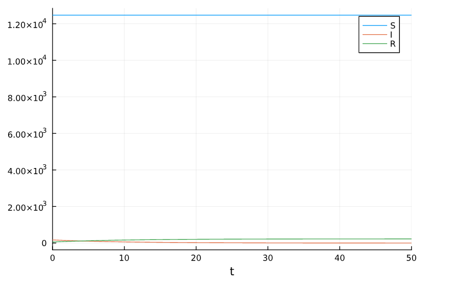
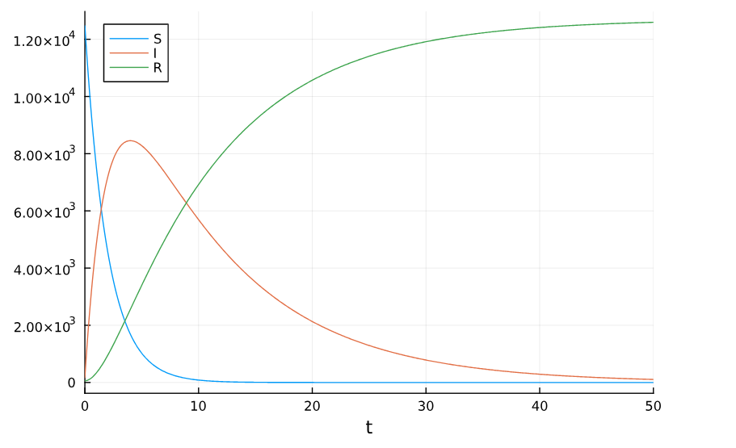
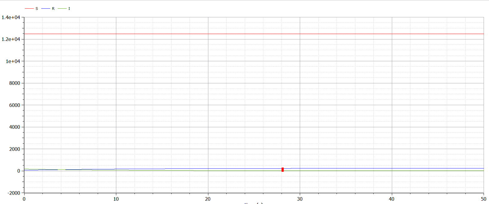
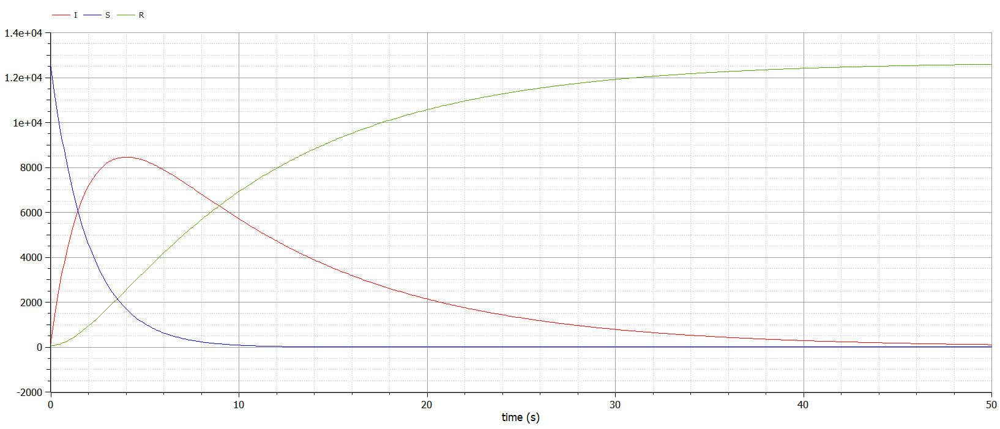

---
## Front matter
lang: ru-RU
title: Лабораторная работа №6
subtitle: Модель эпидемии
author:
  - Дворкина Е. В.
institute:
  - Российский университет дружбы народов, Москва, Россия
date: 18 марта 2025

## i18n babel
babel-lang: russian
babel-otherlangs: english

## Formatting pdf
toc: false
toc-title: Содержание
slide_level: 2
aspectratio: 169
section-titles: true
theme: metropolis
header-includes:
 - \metroset{progressbar=frametitle,sectionpage=progressbar,numbering=fraction}
---

## Докладчик

:::::::::::::: {.columns align=center}
::: {.column width="70%"}

  * Дворкина Ева Владимировна
  * студентка
  * группа НФИбд-01-22
  * Российский университет дружбы народов
  * [1132226447@rudn.ru](mailto:1132226447@rudn.ru)
  * <https://github.com/evdvorkina>

:::
::: {.column width="30%"}


:::
::::::::::::::

## Цель работы

Исследовать простейшую математическую модель эпидемии (SIR).

## Задание. Вариант 38

На одном острове вспыхнула эпидемия. Известно, что из всех проживающих на острове ($N=12700$) в момент начала эпидемии ($t=0$) число заболевших людей (являющихся распространителями инфекции) $I(0)=170$, А число здоровых людей с иммунитетом к болезни $R(0)=57$. Таким образом, число людей восприимчивых к болезни, но пока здоровых, в начальный момент времени $S(0)=N-I(0)-R(0)$.

Постройте графики изменения числа особей в каждой из трех групп. Рассмотрите, как будет протекать эпидемия в случае:

1. если $I(0)\leq I^*$;

2. если $I(0) > I^*$.

# Выполнение лабораторной работы

## Реализация в Julia

```julia
using DifferentialEquations, Plots

N = 12700
I_0 = 170
R_0 = 57
S_0 = N - I_0 - R_0
u0 = [S_0, I_0, R_0]
p = [0.5, 0.1]
tspan = (0.0, 50.0)
```

## Реализация в Julia. Случай $I(0)\leq I^*$

```julia
function sir_2(u,p,t)
    (S,I,R) = u
    (b, c) = p
    dS = 0
    dI = -c*I
    dR = c*I
    return [dS, dI, dR]
end
prob_2 = ODEProblem(sir_2, u0, tspan, p)
sol_2 = solve(prob_2, Tsit5(), saveat = 0.1)
plot(sol_2, label = ["S" "I" "R"])
```

## Реализация в Julia. Случай $I(0)\leq I^*$

{#fig:001 width=70%}

## Реализация в Julia. Случай $I(0) > I^*$

```julia
function sir(u,p,t)
    (S,I,R) = u
    (b, c) = p
    dS = -(b*S)
    dI = (b*S) - c*I
    dR = c*I
    return [dS, dI, dR]
end
prob = ODEProblem(sir, u0, tspan, p)
sol = solve(prob, Tsit5(), saveat = 0.1)
plot(sol, label = ["S" "I" "R"])
```

## Случай $I(0) > I^*$

{#fig:002 width=70%}

## Реализация в OpenModelica. Задание параметров

```Modelica
  parameter Real I_0 = 170;
  parameter Real R_0 = 57;
  parameter Real N = 12700;
  parameter Real S_0 = N-I_0-R_0;
  parameter Real b = 0.5;
  parameter Real c = 0.1;
```

## Реализация в OpenModelica. Случай $I(0)\leq I^*$

```Modelica
  Real S(start=S_0);
  Real I(start=I_0);
  Real R(start=R_0);
  
equation
  der(S) = 0;
  der(I) = - c*I;
  der(R) = c*I;
```


## Реализация в OpenModelica. Случай $I(0)\leq I^*$

{#fig:003 width=70%}


## Реализация в OpenModelica. Случай $I(0) > I^*$

```Modelica
  Real S(start=S_0);
  Real I(start=I_0);
  Real R(start=R_0);
  
equation
  der(S) = -b*S;
  der(I) = b*S - c*I;
  der(R) = c*I;
```

## Реализация в OpenModelica. Случай $I(0) > I^*$

{#fig:004 width=70%}

## Выводы

Построили математическую модель эпидемии.

