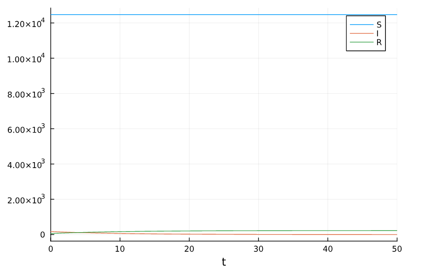
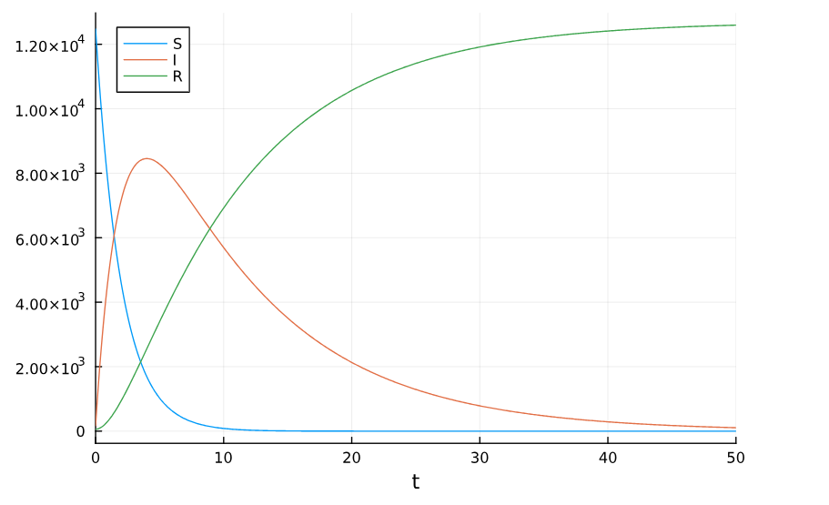
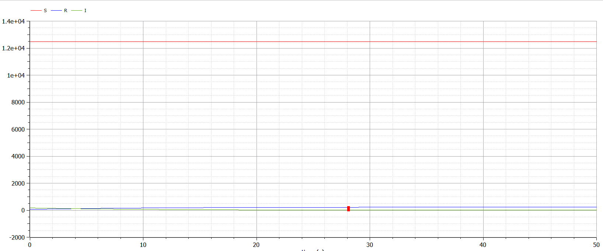
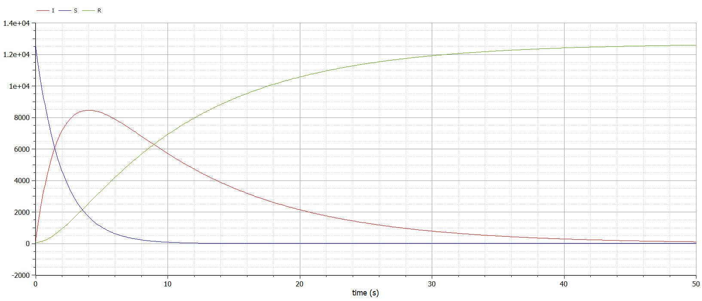

---
## Front matter
title: "Лабораторная работа №6"
subtitle: "Модель эпидемии"
author: "Дворкина Ева Владимировна"

## Generic otions
lang: ru-RU
toc-title: "Содержание"

## Bibliography
bibliography: bib/cite.bib
csl: pandoc/csl/gost-r-7-0-5-2008-numeric.csl

## Pdf output format
toc: true # Table of contents
toc-depth: 2
lof: true # List of figures
lot: false # List of tables
fontsize: 12pt
linestretch: 1.5
papersize: a4
documentclass: scrreprt
## I18n polyglossia
polyglossia-lang:
  name: russian
  options:
	- spelling=modern
	- babelshorthands=true
polyglossia-otherlangs:
  name: english
## I18n babel
babel-lang: russian
babel-otherlangs: english
## Fonts
mainfont: IBM Plex Serif
romanfont: IBM Plex Serif
sansfont: IBM Plex Sans
monofont: IBM Plex Mono
mathfont: STIX Two Math
mainfontoptions: Ligatures=Common,Ligatures=TeX,Scale=0.94
romanfontoptions: Ligatures=Common,Ligatures=TeX,Scale=0.94
sansfontoptions: Ligatures=Common,Ligatures=TeX,Scale=MatchLowercase,Scale=0.94
monofontoptions: Scale=MatchLowercase,Scale=0.94,FakeStretch=0.9
mathfontoptions:
## Biblatex
biblatex: true
biblio-style: "gost-numeric"
biblatexoptions:
  - parentracker=true
  - backend=biber
  - hyperref=auto
  - language=auto
  - autolang=other*
  - citestyle=gost-numeric
## Pandoc-crossref LaTeX customization
figureTitle: "Рис."
tableTitle: "Таблица"
listingTitle: "Листинг"
lofTitle: "Список иллюстраций"
lotTitle: "Список таблиц"
lolTitle: "Листинги"
## Misc options
indent: true
header-includes:
  - \usepackage{indentfirst}
  - \usepackage{float} # keep figures where there are in the text
  - \floatplacement{figure}{H} # keep figures where there are in the text
---

# Цель работы

Исследовать простейшую математическую модель эпидемии (SIR).

# Задание

## Вариант 38

На одном острове вспыхнула эпидемия. Известно, что из всех проживающих на острове ($N=12700$) в момент начала эпидемии ($t=0$) число заболевших людей
(являющихся распространителями инфекции) $I(0)=170$, А число здоровых людей с иммунитетом к болезни $R(0)=57$. Таким образом, число людей восприимчивых к болезни, но пока здоровых, в начальный момент времени $S(0)=N-I(0)-R(0)$.

Постройте графики изменения числа особей в каждой из трех групп.

Рассмотрите, как будет протекать эпидемия в случае:

1. если $I(0)\leq I^*$;

2. если $I(0) > I^*$.

# Теоретическое введение

## Модель эпидемии SIR

Рассмотрим простейшую модель эпидемии. Предположим, что некая популяция, состоящая из $N$ особей, (считаем, что популяция изолирована) подразделяется на три группы. Первая группа - это восприимчивые к болезни, но пока здоровые особи, обозначим их через   $S(t)$. Вторая группа – это число инфицированных особей, которые также при этом являются распространителями инфекции, обозначим их $I(t)$. А третья группа, обозначающаяся через $R(t)$ – это здоровые особи с иммунитетом к болезни [@lab:bash].  

До того, как число заболевших не превышает критического значения 
$I^*$, считаем, что все больные изолированы и не заражают здоровых. Когда $I(t)>I^*$, 
тогда инфицирование способны заражать восприимчивых к болезни особей.  
Таким образом, скорость изменения числа $S(t)$ меняется по закону ([-@eq:eq:a])

$$
\frac{dS}{dt} = 
\begin{cases}
-\alpha S, & \text{если } I(t) > I^* \\
0, & \text{если } I(t) \leq I^*
\end{cases}
$${#eq:eq:a}
   
Поскольку каждая восприимчивая к болезни особь, которая, в конце концов, заболевает, сама становится инфекционной, то скорость изменения числа инфекционных особей представляет разность за единицу времени между заразившимися и теми, кто уже болеет и лечится ([-@eq:eq:b])

$$
\frac{dI}{dt} = 
\begin{cases}
\alpha S - \beta I, & \text{если } I(t) > I^* \\
-\beta I, & \text{если } I(t) \leq I^*
\end{cases}
$${#eq:eq:b}

А скорость изменения выздоравливающих особей (при этом приобретающие 
иммунитет к болезни) ([-@eq:eq:c])

$$
\frac{dR}{dt} = \beta I
$${#eq:eq:c}

Постоянные пропорциональности $\alpha$ и $\beta$ — это коэффициенты заболеваемости и выздоровления соответственно.

Для того, чтобы решения соответствующих уравнений определялось *
однозначно, необходимо задать начальные условия. Считаем, что на начало 
эпидемии в момент времени $t=0$  нет особей с иммунитетом к болезни $R(0)=0$, а 
число инфицированных и восприимчивых к болезни особей  $I(0)$ и $S(0)$ соответственно. Для анализа картины протекания эпидемии необходимо рассмотреть два случая: $I(0)\leq I^*$ и $I(0)>I^*$

# Выполнение лабораторной работы

## Реализация в Julia

Зададим начальные значения, время интегрирования и параметры модели:

```julia
using DifferentialEquations, Plots

N = 12700
I_0 = 170
R_0 = 57
S_0 = N - I_0 - R_0
u0 = [S_0, I_0, R_0]
p = [0.5, 0.1]
tspan = (0.0, 50.0)
```

###  Случай $I(0)\leq I^*$

Рассмотрим случай, когда число заболевших не превышает критического значения $I^*$, то есть считаем, что все больные изолированы и не заражают здоровых.

Зададим функцию для нашего случая по формулам, также зададим задачу Коши с помощью `ODEProblem`, с помощью `solve` решим ее. Используем `plot` для построения графика (рис. [-@fig:001]).

```julia
function sir_2(u,p,t)
    (S,I,R) = u
    (b, c) = p
    dS = 0
    dI = -c*I
    dR = c*I
    return [dS, dI, dR]
end
prob_2 = ODEProblem(sir_2, u0, tspan, p)
sol_2 = solve(prob_2, Tsit5(), saveat = 0.1)
plot(sol_2, label = ["S" "I" "R"])
```

{#fig:001 width=70%}

Можно увидеть, что число здоровых уязвимых не изменяется, так как в этом случае все заражённые изолированы. При это заражённые выздоравливают и приобретают иммунитет.

### Случай $I(0) > I^*$

Рассмотрим случай, когда число заболевших превышает критическое значения $I^*$, то есть считаем, что инфицирование способны заражать восприимчивых к болезни особей. 

Аналогично предыдущему случаю, зададим по формулам для случая функцию, в которой опишем систему дифференциальных уравнений. Также зададим задачу Коши с помощью `ODEProblem`, с помощью `solve` решим ее. Используем `plot` для построения графика (рис. [-@fig:002]).

```julia
function sir(u,p,t)
    (S,I,R) = u
    (b, c) = p
    dS = -(b*S)
    dI = (b*S) - c*I
    dR = c*I
    return [dS, dI, dR]
end
prob = ODEProblem(sir, u0, tspan, p)
sol = solve(prob, Tsit5(), saveat = 0.1)
plot(sol, label = ["S" "I" "R"])
```

{#fig:002 width=70%}

Можно увидеть, что сначала количество зараженных увеличивается, как и количество приобретающих иммунитет, при этом уменьшается количество здоровых без иммунитета. Затем количество зараженных начинает уменьшаться, а другие две категории изменяются так же, как раньше, но медленнее. Максимальное значение заболевших показывает время прохождения порога эпидемии. 

## Реализация в OpenModelica

Зададим те же модели в OpenModelica

###  Случай $I(0)\leq I^*$

Рассмотрим случай, когда число заболевших не превышает критического значения $I^*$, то есть считаем, что все больные изолированы и не заражают здоровых (рис. [-@fig:003]).

```Modelica
model lab6_1
  parameter Real I_0 = 170;
  parameter Real R_0 = 57;
  parameter Real N = 12700;
  parameter Real S_0 = N-I_0-R_0;
  parameter Real b = 0.5;
  parameter Real c = 0.1;
  
  Real S(start=S_0);
  Real I(start=I_0);
  Real R(start=R_0);
  
equation
  der(S) = 0;
  der(I) = - c*I;
  der(R) = c*I;

end lab6_1;
```

{#fig:003 width=70%}

Графики решений, полученные с помощью OpenModelica и Julia идентичны.

### Случай $I(0) > I^*$

Рассмотрим случай, когда число заболевших превышает критическое значения $I^*$, то есть считаем, что инфицирование способны заражать восприимчивых к болезни особей (рис. [-@fig:004]). 

```Modelica
model lab6_2
  parameter Real I_0 = 170;
  parameter Real R_0 = 57;
  parameter Real N = 12700;
  parameter Real S_0 = N-I_0-R_0;
  parameter Real b = 0.5;
  parameter Real c = 0.1;
  
  Real S(start=S_0);
  Real I(start=I_0);
  Real R(start=R_0);
  
equation
  der(S) = -b*S;
  der(I) = b*S - c*I;
  der(R) = c*I;
end lab6_2;
```

{#fig:004 width=70%}

Графики решений, полученные с помощью OpenModelica и Julia идентичны.

# Выводы

Построили математическую модель эпидемии.

# Список литературы{.unnumbered}

::: {#refs}
:::
