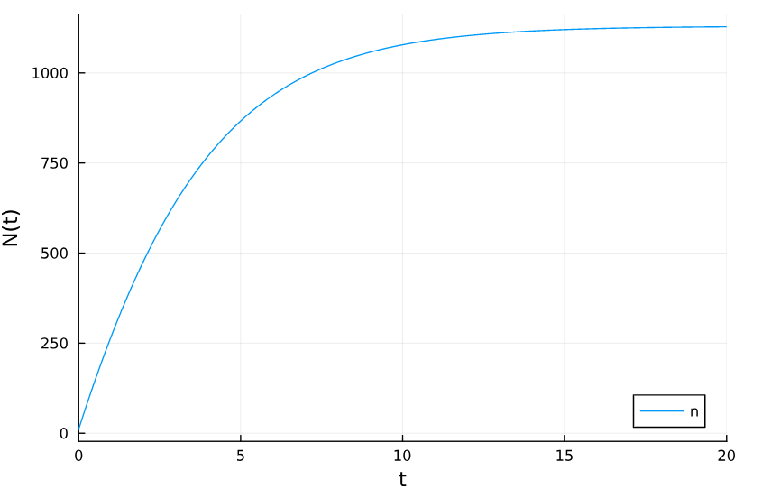
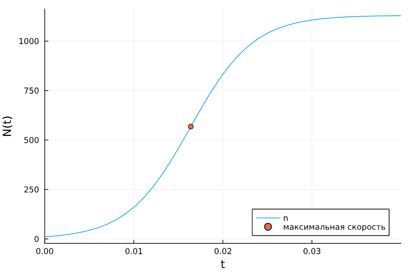
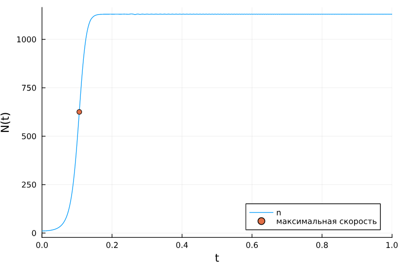
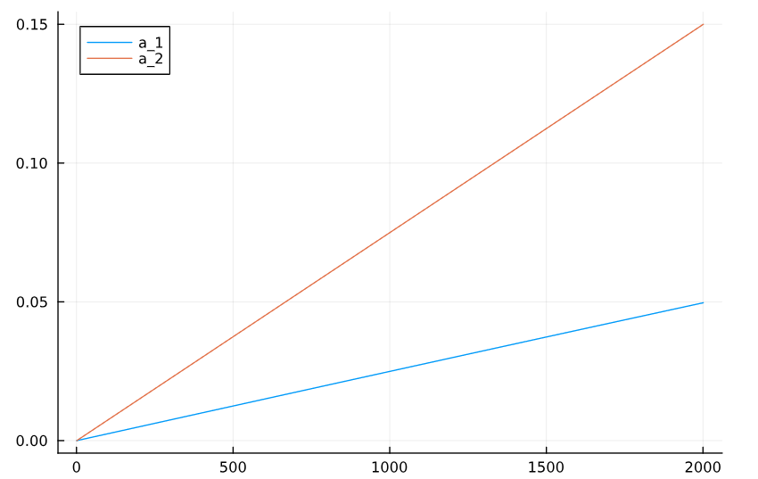
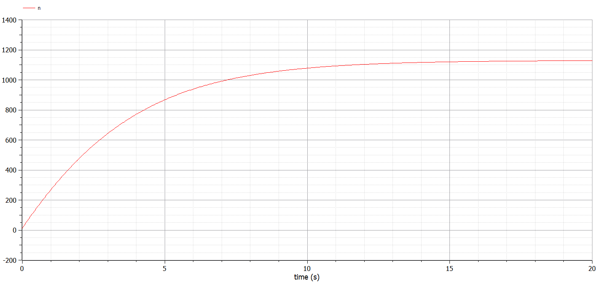
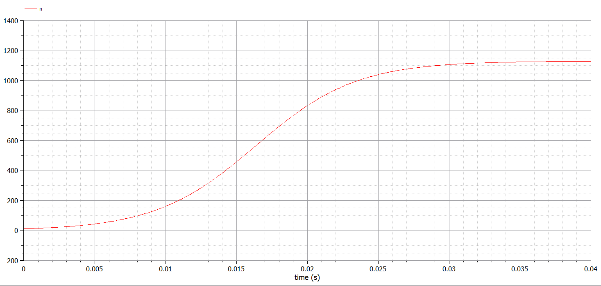
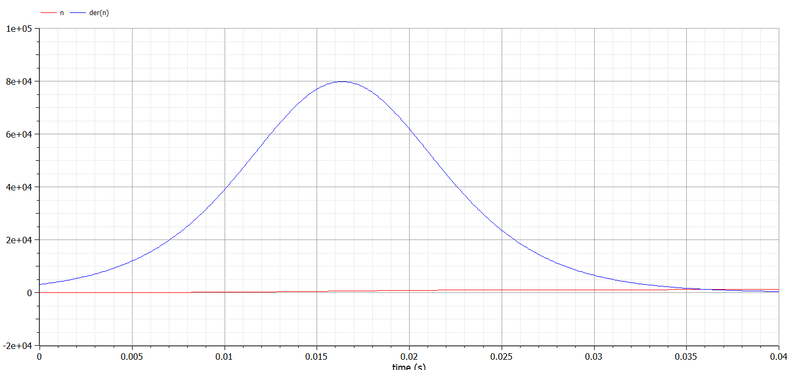
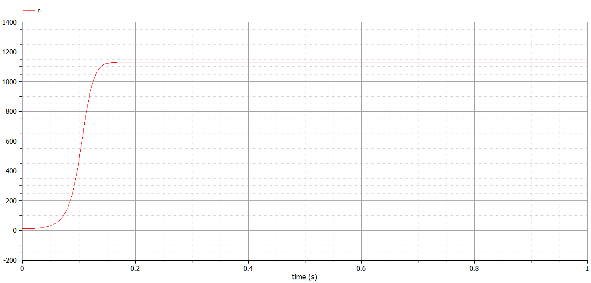
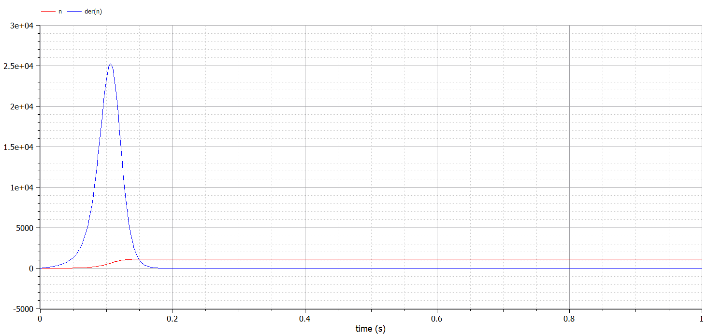

---
## Front matter
lang: ru-RU
title: Лабораторная работа №7
subtitle: Эффективность рекламы
author:
  - Дворкина Е. В.
institute:
  - Российский университет дружбы народов, Москва, Россия
date: 18 марта 2025

## i18n babel
babel-lang: russian
babel-otherlangs: english

## Formatting pdf
toc: false
toc-title: Содержание
slide_level: 2
aspectratio: 169
section-titles: true
theme: metropolis
header-includes:
 - \metroset{progressbar=frametitle,sectionpage=progressbar,numbering=fraction}
---

# Информация

## Докладчик

:::::::::::::: {.columns align=center}
::: {.column width="70%"}

  * Дворкина Ева Владимировна
  * студентка
  * группа НФИбд-01-22
  * Российский университет дружбы народов
  * [1132226447@rudn.ru](mailto:1132226447@rudn.ru)
  * <https://github.com/evdvorkina>

:::
::: {.column width="30%"}


:::
::::::::::::::

## Цель работы

Исследовать простейшую математическую модель эффективности рекламы.

## Задание. Вариант 38

Построить график распространения рекламы, математическая модель которой описывается
следующим уравнением:

1. $\dfrac{dn}{dt} = (0.25+0.000075n(t))(N-n(t))$

2. $\dfrac{dn}{dt} = (0.000075+0.25n(t))(N-n(t))$

3. $\dfrac{dn}{dt} = (0.25\sin{(t)}+0.75 \cdot t \cdot n(t))(N-n(t))$

При этом объем аудитории $N = 1130$, в начальный момент о товаре знает 11 человек. Для случая 2 определить в какой момент времени скорость распространения рекламы будет
иметь максимальное значение.

## Реализация в Julia

```julia
using DifferentialEquations, Plots
f(n, p, t) = (p[1] + p[2]*n)*(p[3] - n)
f3(n, p, t) = (p[1]t + p[2]*t*n)*(p[3]-n) 
```

## Реализация в Julia

```julia
N=1130
p1 = [0.25, 0.000075, N]
p2 = [0.000075, 0.25, N]
p3 = [0.25, 0.75, N]
n_0 = 11
tspan1 = (0.0, 20.0)
tspan2 = (0.0, 0.04)
tspan3 = (0.0, 1.0)
prob1 = ODEProblem(f, n_0, tspan1, p1)
prob2 = ODEProblem(f, n_0, tspan2, p2)
prob3 = ODEProblem(f3, n_0, tspan3, p3)
```

## Реализация в Julia, решение для первого случая

```julia
sol1 = solve(prob1, Tsit5(), saveat = 0.01)
plot(sol1, yaxis = "N(t)", label="n")
```

## Реализация в Julia, решение для первого случая

{#fig:001 width=70%}


## Реализация в Julia, решение для второго случая 

```julia
sol2 = solve(prob2, Tsit5(), saveat = 0.0001)
dev = [sol2(i, Val{1}) for i in 0:0.0001:0.04]
findall(x -> x == maximum(dev), dev) 

sol2.t[165] 
0.0164
```

## Реализация в Julia, решение для второго случая 

```julia
x = sol2.t[165]
y = sol2.u[165]
plot(sol2, yaxis="N(t)", label="n")
scatter!((x,y), leg=:bottomright, label="максимальная скорость")
```

## Реализация в Julia, решение для второго случая 

{#fig:002 width=70%}

## Реализация в Julia, решение для третьего случая 

```julia
sol3 = solve(prob3, Tsit5(), saveat = 0.0001)
dev = [sol3(i, Val{1}) for i in 0:0.0001:1]
findall(x -> x == maximum(dev), dev)

sol3.t[1066]
0.1065
```

## Реализация в Julia, решение для третьего случая 

```julia
plot(sol3, markersize =:15, yaxis="N(t)", label="n")
scatter!((sol3.t[1066], sol3.u[1066]), label="максимальная скорость")
```

## Реализация в Julia, решение для третьего случая 

{#fig:003 width=70%}

## Реализация в Julia, параметры для третьего случая 

```julia
plot([sin(i)*0.25 for i in 0:0.0001:0.2], label="a_1")
plot!([0.75*i for i in 0:0.0001:0.2], label="a_2")
```

## Реализация в Julia, параметры для третьего случая 

{#fig:004 width=70%}

## Реализация в OpenModelica, первый случай

```Modelica
  parameter Real a_1 = 0.25;
  parameter Real a_2 = 0.000075;
  parameter Real N = 1130;
  parameter Real n_0 = 11;
  
  Real n(start=n_0);

equation
  der(n) = (a_1 + a_2*n)*(N - n);
```

## Реализация в OpenModelica, первый случай

{#fig:005 width=70%}

## Реализация в OpenModelica, второй случай

```Modelica
  parameter Real a_1 = 0.000075;
  parameter Real a_2 = 0.25;
  parameter Real N = 1130;
  parameter Real n_0 = 11;
  
  Real n(start=n_0);

equation
  der(n) = (a_1 + a_2*n)*(N - n);
```

## Реализация в OpenModelica, второй случай

{#fig:006 width=70%}

## Реализация в OpenModelica, второй случай

{#fig:007 width=70%}

## Реализация в OpenModelica, третий случай

```Modelica
parameter Real N = 1130;
parameter Real n_0 = 11;

Real n(start=n_0);
Real a_1;
Real a_2;

equation
  der(n) = (a_1 + a_2*n)*(N - n);
  a_1 = 0.25*sin(time);
  a_2 = 0.75*time;
```

## Реализация в OpenModelica, третий случай

{#fig:008 width=70%}

## Реализация в OpenModelica, третий случай

{#fig:009 width=70%}


## Выводы

Исследовали математическую модель эффективности рекламы.


