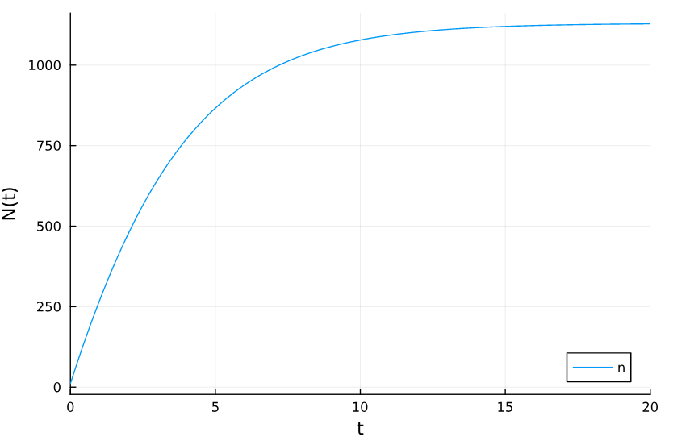
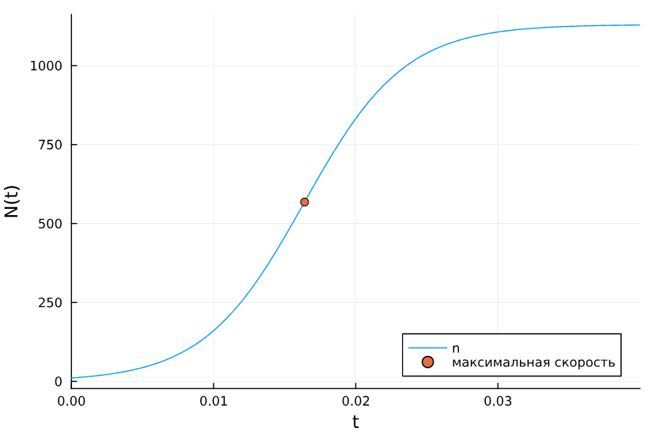
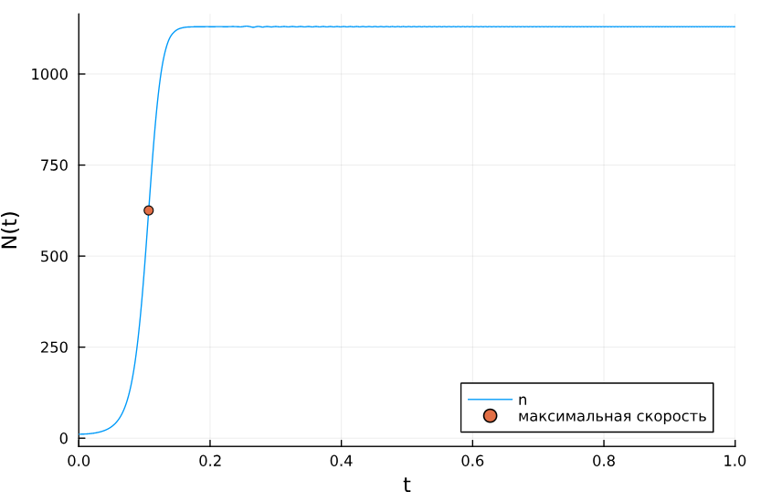
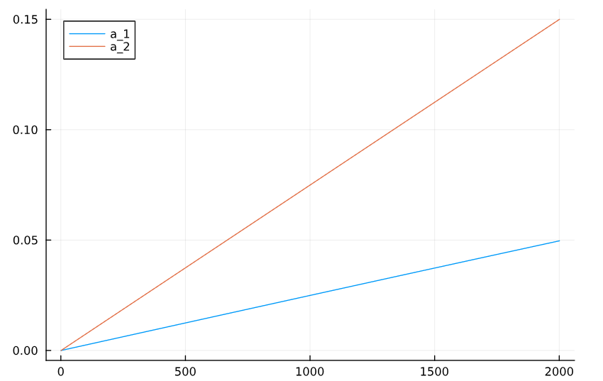
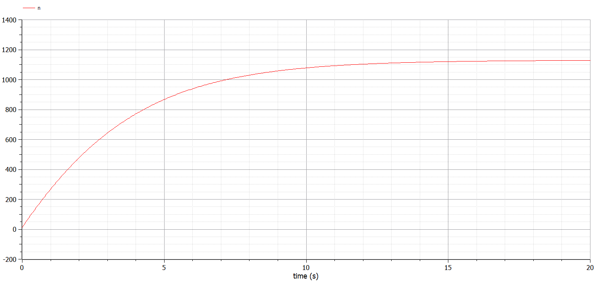
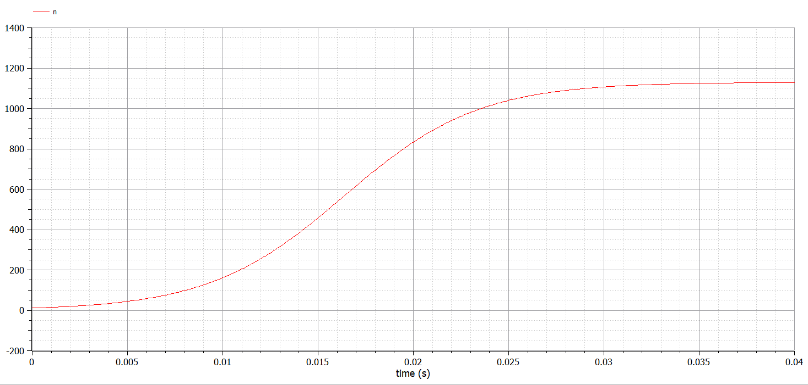
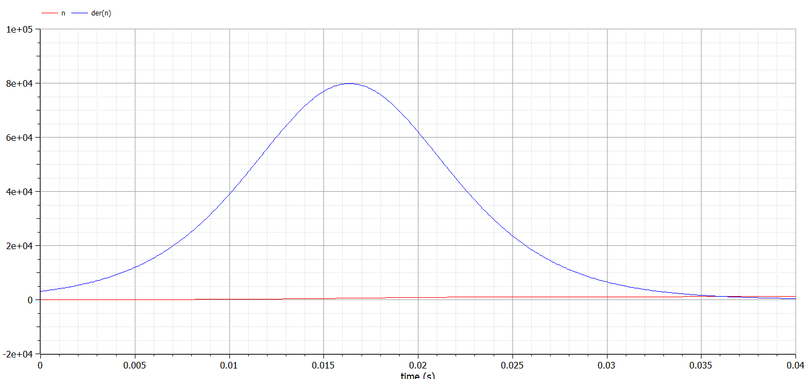
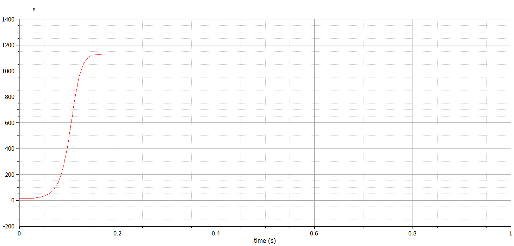
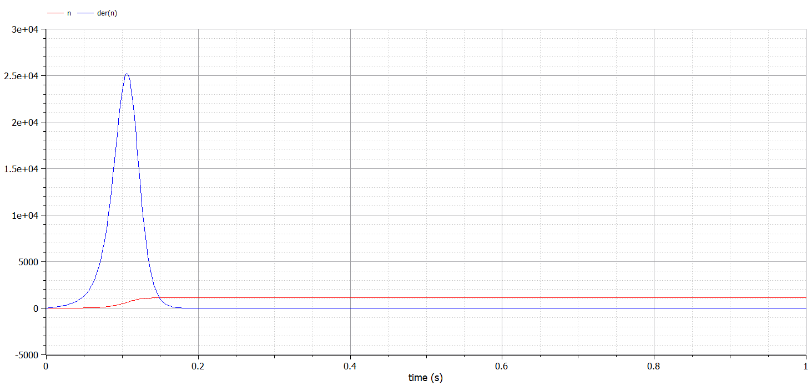

---
## Front matter
title: "Лабораторная работа №7"
subtitle: "Эффективность рекламы"
author: "Дворкина Ева Владимировна"

## Generic otions
lang: ru-RU
toc-title: "Содержание"

## Bibliography
bibliography: bib/cite.bib
csl: pandoc/csl/gost-r-7-0-5-2008-numeric.csl

## Pdf output format
toc: true # Table of contents
toc-depth: 2
lof: true # List of figures
lot: false # List of tables
fontsize: 12pt
linestretch: 1.5
papersize: a4
documentclass: scrreprt
## I18n polyglossia
polyglossia-lang:
  name: russian
  options:
	- spelling=modern
	- babelshorthands=true
polyglossia-otherlangs:
  name: english
## I18n babel
babel-lang: russian
babel-otherlangs: english
## Fonts
mainfont: IBM Plex Serif
romanfont: IBM Plex Serif
sansfont: IBM Plex Sans
monofont: IBM Plex Mono
mathfont: STIX Two Math
mainfontoptions: Ligatures=Common,Ligatures=TeX,Scale=0.94
romanfontoptions: Ligatures=Common,Ligatures=TeX,Scale=0.94
sansfontoptions: Ligatures=Common,Ligatures=TeX,Scale=MatchLowercase,Scale=0.94
monofontoptions: Scale=MatchLowercase,Scale=0.94,FakeStretch=0.9
mathfontoptions:
## Biblatex
biblatex: true
biblio-style: "gost-numeric"
biblatexoptions:
  - parentracker=true
  - backend=biber
  - hyperref=auto
  - language=auto
  - autolang=other*
  - citestyle=gost-numeric
## Pandoc-crossref LaTeX customization
figureTitle: "Рис."
tableTitle: "Таблица"
listingTitle: "Листинг"
lofTitle: "Список иллюстраций"
lotTitle: "Список таблиц"
lolTitle: "Листинги"
## Misc options
indent: true
header-includes:
  - \usepackage{indentfirst}
  - \usepackage{float} # keep figures where there are in the text
  - \floatplacement{figure}{H} # keep figures where there are in the text
---

# Цель работы

Исследовать простейшую математическую модель эффективности рекламы.

# Задание

## Вариант 38

Построить график распространения рекламы, математическая модель которой описывается
следующим уравнением:

1. $\dfrac{dn}{dt} = (0.25+0.000075n(t))(N-n(t))$

2. $\dfrac{dn}{dt} = (0.000075+0.25n(t))(N-n(t))$

3. $\dfrac{dn}{dt} = (0.25\sin{(t)}+0.75 \cdot t \cdot n(t))(N-n(t))$

При этом объем аудитории $N = 1130$, в начальный момент о товаре знает 11 человек. Для случая 2 определить в какой момент времени скорость распространения рекламы будет
иметь максимальное значение.

# Теоретическое введение

Пусть некая фирма начинает рекламировать новый товар. Необходимо, чтобы прибыль от будущих продаж покрывала издержки на дорогостоящую кампанию. Ясно, что вначале расходы могут превышать прибыль, поскольку лишь малая часть потенциальных покупателей будет информирована о новом товаре. Затем, при увеличении числа продаж, уже возможно рассчитывать на заметную прибыль, и, наконец, наступит момент, когда рынок насытится, и рекламировать товар далее станет бессмысленно.

Модель рекламной кампании основывается на следующих основных предположениях. Считается, что величина $\dfrac{dN}{dt}$ — скорость изменения со временем числа потребителей, узнавших о товаре и готовых купить его ($t$ — время, прошедшее с начала рекламной кампании, $N(t)$ – число уже информированных клиентов), — пропорциональна числу покупателей, еще не знающих о нем, т. е. величине $\alpha_1(t)(N_0 - N(t))$, где $N_0$ - общее число покупателей (емкость рынка),характеризует интенсивность рекламной кампании. Предполагается также, что узнавшие о товаре потребители распространяют полученную информацию среди неосведомленных, выступая как бы в роли дополнительных рекламных агентов фирмы. Их вклад равен величине $\alpha_2(t)N(t)(N_0-N(t))$, которая тем больше, чем больше число агентов. Величина $\alpha_2$ характеризует степень общения покупателей между собой [@lab:bash].

В итоге получаем уравнение ([-@eq:eq:a])

$$
\dfrac{dn}{dt} = (\alpha_1+\alpha_2 n(t))(N-n(t))
$${#eq:eq:a}

# Выполнение лабораторной работы

## Реализация в Julia

Зададим функцию для решения модели эффективности рекламы. Возьмем разные интервалы интегрирования для каждого случае, а также зададим начальное значение интегрирования и параметры модели Зададим начальные условия и функции для трех случаев:

```julia
using DifferentialEquations, Plots
f(n, p, t) = (p[1] + p[2]*n)*(p[3] - n)
f3(n, p, t) = (p[1]t + p[2]*t*n)*(p[3]-n) 

N=1130
p1 = [0.25, 0.000075, N]
p2 = [0.000075, 0.25, N]
p3 = [0.25, 0.75, N]
n_0 = 11
tspan1 = (0.0, 20.0)
tspan2 = (0.0, 0.04)
tspan3 = (0.0, 1.0)
prob1 = ODEProblem(f, n_0, tspan1, p1)
prob2 = ODEProblem(f, n_0, tspan2, p2)
prob3 = ODEProblem(f3, n_0, tspan3, p3)
```

Найдем решение для первого случая и построим его (рис. [-@fig:001])

```julia
sol1 = solve(prob1, Tsit5(), saveat = 0.01)
plot(sol1, yaxis = "N(t)", label="n")
```

{#fig:001 width=70%}

В первом случае $\alpha_1(t)$ на порядки выше, чем $\alpha_2(t)$, поэтому мы получили модель Мальтуса.

Найдем решение для второго случая и построим его. Также найдем время, когда производная принимает максимальное значение (это время наибольшей скорости распространения информации о товаре) 

```julia
sol2 = solve(prob2, Tsit5(), saveat = 0.0001)
dev = [sol2(i, Val{1}) for i in 0:0.0001:0.04]
findall(x -> x == maximum(dev), dev)
```

Получим значение 0.0164 

```julia
sol2.t[165] 
0.0164
```

Отметим эту точку на графике (рис. [-@fig:002])

```julia
x = sol2.t[165]
y = sol2.u[165]
plot(sol2, yaxis="N(t)", label="n")
scatter!((x,y), leg=:bottomright, label="максимальная скорость")
```

{#fig:002 width=70%}

Во втором случае $\alpha_1(t)$ на порядки меньше, чем $\alpha_2(t)$, поэтому мы получили логистическую кривую.


Найдем решение для третьего случая и построим его. Также найдем время, когда производная принимает максимальное значение (это время наибольшей скорости распространения информации о товаре; в задании не требуется)

```julia
sol3 = solve(prob3, Tsit5(), saveat = 0.0001)
dev = [sol3(i, Val{1}) for i in 0:0.0001:1]
findall(x -> x == maximum(dev), dev)
```

Получим значение времени 0.1065. 

```julia
sol3.t[1066]
0.1065
```

Отметим эту точку на графике (рис. [-@fig:003])

```julia
plot(sol3, markersize =:15, yaxis="N(t)", label="n")
scatter!((sol3.t[1066], sol3.u[1066]), label="максимальная скорость")
```

{#fig:003 width=70%}

График полученной модели похож на график логистической кривой, чтобы проверить это предположение, сравним коэффициенты модели с помощью графика их изменения во времени (рис. [-@fig:004]).

```julia
plot([sin(i)*0.25 for i in 0:0.0001:0.2], label="a_1")
plot!([0.75*i for i in 0:0.0001:0.2], label="a_2")
```

{#fig:004 width=70%}

Получим, что степень общения покупателей между собой всегда выше чем $\alpha_1(t)$, значит у нас действительно график логистической кривой.

## Реализация в OpenModelica

Также зададим эту модель в OpenModelica. Модель для первого случая:

```Modelica
parameter Real a_1 = 0.25;
  parameter Real a_2 = 0.000075;
  parameter Real N = 1130;
  parameter Real n_0 = 11;
  
  Real n(start=n_0);

equation
  der(n) = (a_1 + a_2*n)*(N - n);

end lab7_1;
```

После установки симуляции, получим следующий график (рис. [-@fig:005])

{#fig:005 width=70%}

Модель для второго случая:

```Modelica
model lab7_2
  parameter Real a_1 = 0.000075;
  parameter Real a_2 = 0.25;
  parameter Real N = 1130;
  parameter Real n_0 = 11;
  
  Real n(start=n_0);

equation
  der(n) = (a_1 + a_2*n)*(N - n);
end lab7_2;
```

Получим график изменения интенсивности рекламы (рис. [-@fig:006]), также, выбрав в качестве отображаемой функции производную, получим график, на котором видна максимальная скорость изменения интенсивности рекламы (рис. [-@fig:007])

{#fig:006 width=70%}

{#fig:007 width=70%}

Модель для третьего случая:

```Modelica
model lab7_3

parameter Real N = 1130;
parameter Real n_0 = 11;

Real n(start=n_0);
Real a_1;
Real a_2;

equation
  der(n) = (a_1 + a_2*n)*(N - n);
  a_1 = 0.25*sin(time);
  a_2 = 0.75*time;
  
end lab7_3;
```

Получим график изменения интенсивности рекламы (рис. [-@fig:008]), также, выбрав в качестве отображаемой функции производную, получим график, на котором видна максимальная скорость изменения интенсивности рекламы (рис. [-@fig:009])

{#fig:008 width=70%}

{#fig:009 width=70%}

Графики, полученные с помощью OpenModelica и Julia идентичны.

# Выводы

Исследовали математическую модель эффективности рекламы.

# Список литературы{.unnumbered}

::: {#refs}
:::
