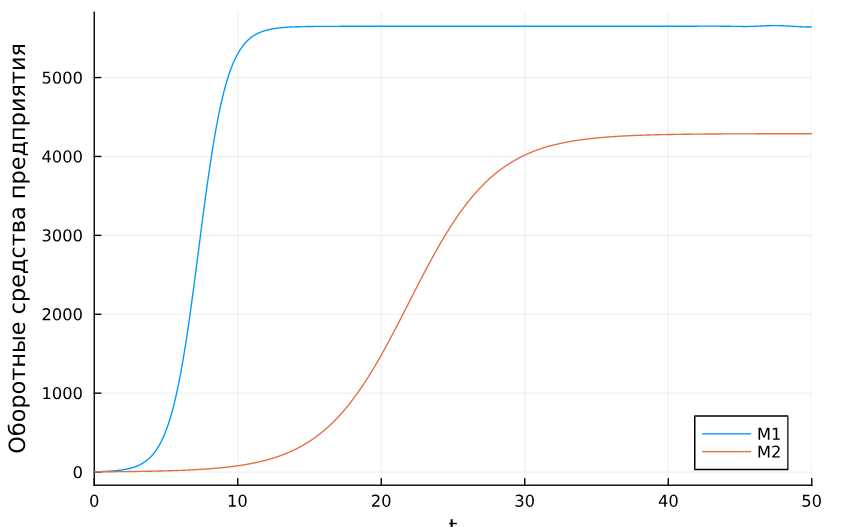
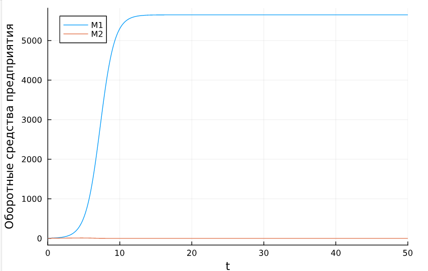
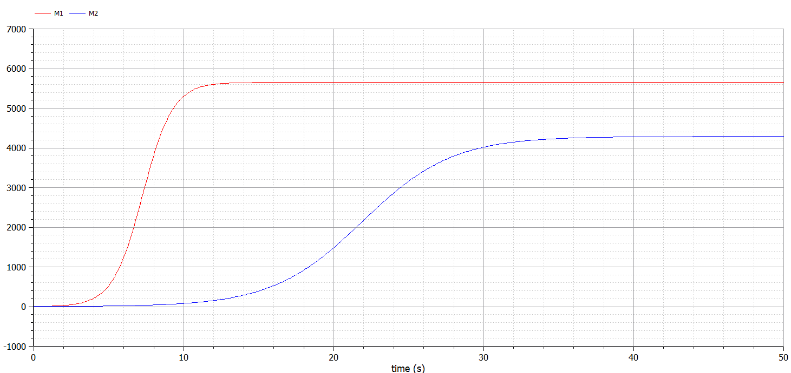
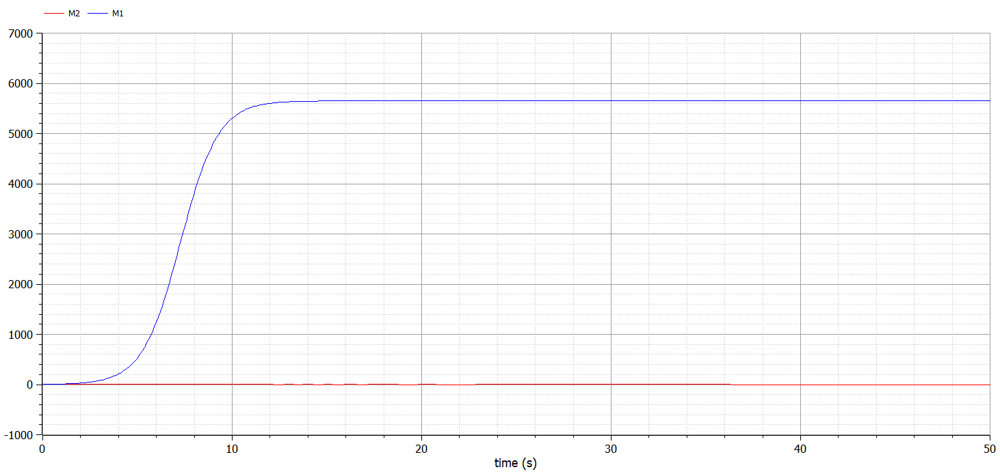
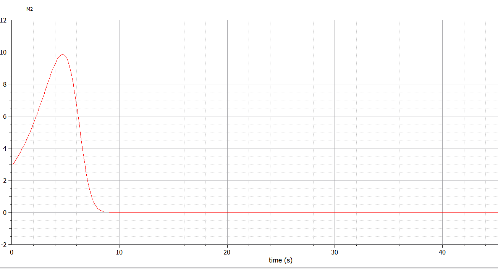

---
## Front matter
lang: ru-RU
title: Лабораторная работа №8
subtitle: Модель конкуренции двух фирм
author:
  - Дворкина Е. В.
institute:
  - Российский университет дружбы народов, Москва, Россия
date: 18 марта 2025

## i18n babel
babel-lang: russian
babel-otherlangs: english

## Formatting pdf
toc: false
toc-title: Содержание
slide_level: 2
aspectratio: 169
section-titles: true
theme: metropolis
header-includes:
 - \metroset{progressbar=frametitle,sectionpage=progressbar,numbering=fraction}
---

## Докладчик

:::::::::::::: {.columns align=center}
::: {.column width="70%"}

  * Дворкина Ева Владимировна
  * студентка
  * группа НФИбд-01-22
  * Российский университет дружбы народов
  * [1132226447@rudn.ru](mailto:1132226447@rudn.ru)
  * <https://github.com/evdvorkina>

:::
::: {.column width="30%"}


:::
::::::::::::::

## Цель работы

Исследовать простейшую математическую модель конкуренции двух фирм.

## Задание. Вариант 38

*Случай 1.* 

$$
\begin{cases}                                 
\dfrac{dM_1}{d\theta} = M_1-\dfrac{b}{c_1}M_1M_2-\dfrac{a_1}{c_1}M_1^2,\\
\dfrac{dM_2}{d\theta} = \dfrac{c_2}{c_1}M2-\dfrac{b}{c_1}M_1M_2-\dfrac{a_2}{c_1}M_2^2,
\end{cases}
$$

## Задание. Вариант 38

*Случай 2.* 

$$
\begin{cases}                                 
\dfrac{dM_1}{d\theta} = M_1-\dfrac{b}{c_1}M_1M_2-\dfrac{a_1}{c_1}M_1^2,\\
\dfrac{dM_2}{d\theta} = \dfrac{c_2}{c_1}M_2-(\dfrac{b}{c_1}+0.00083)M_1M_2-\dfrac{a_2}{c_1}M_2^2,
\end{cases}
$$

## Задание. Вариант 38

Для обоих случаев рассмотрим задачу со следующими начальными условиями и параметрами:
$$M(0)_1=3.9, M(0)_2=2.9, p_{cr}=25, \,N=39, q=1, \tau_1=29, \tau_2=19, \tilde{p_1}=6.9, \tilde{p_2}=15.9$$

1. Построить графики изменения оборотных средств фирмы 1 и фирмы 2 без
учета постоянных издержек и с веденной нормировкой для случая 1.

2. Построить графики изменения оборотных средств фирмы 1 и фирмы 2 без
учета постоянных издержек и с веденной нормировкой для случая 2.

3. Найдите стационарное состояние системы для первого случая.

# Выполнение лабораторной работы

## Реализация в julia, начальные значения 

```julia
using DifferentialEquations, Plots
p_cr = 25 #критическая стоимость продукта
tau1 = 29 #длительность производственного цикла фирмы 1
p1 = 6.9 #себестоимость продукта у фирмы 1
tau2 = 19 #длительность производственного цикла фирмы 2
p2 = 15.9 #себестоимость продукта у фирмы 2
N = 39 #число потребителей производимого продукта
q = 1; #максимальная потребность одного человека в продукте в единицу времени
```

## Реализация в julia, параметры функции

```julia
a1 = p_cr/(tau1^2*p1^2*N*q);
a2 = p_cr/(tau2^2*p2^2*N*q);
b = p_cr/(tau1^2*tau2^2*p1^2*p2^2*N*q);
c1 = (p_cr-p1)/(tau1*p1);
c2 = (p_cr-p2)/(tau2*p2);

u0 = [3.9, 2.9] #начальные значения M1 и M2
p = [a1, a2, b, c1, c2]
tspan = (0.0, 50.0) #временной интервал
```

## Реализация в julia, функция

```julia
function f(u, p, t)
    M1, M2 = u
    a1, a2, b, c1, c2 = p
    M1 = M1 - (a1/c1)*M1^2 - (b/c1)*M1*M2
    M2 = (c2/c1)*M2 - (a2/c1)*M2^2 - (b/c1)*M1*M2
    return [M1, M2]
end
```

## Реализация в julia, стационарное состояние системы

```julia
using LinearAlgebra
A = [(a1/c1) (b/c1); (b/c1) (a2/c1)]
b1 = [1, (c2/c1)]
x = A \ b1
println("Решение: ", x)
Решение: [5649.976610483586, 4288.470491728287]
```

## Реализация в julia, Задача Коши и решение

```julia
prob = ODEProblem(f, u0, tspan, p)
sol = solve(prob, Tsit5(), saveat = 0.01)
plot(sol, yaxis = "Оборотные средства предприятия", label = ["M1" "M2"])
```

## Реализация в julia, график решения

{#fig:001 width=70%}

## Реализация в julia, функция

```julia
function f2(du,u,p,t)
 a1, a2, b, c1, c2 = p
 du[1] = u[1] - (a1/c1)*u[1]*u[1] - (b/c1)*u[1]*u[2]
 du[2] = (c2/c1)*u[2] - (a2/c1)*u[2]*u[2] - (b/c1+0.00083)*u[1]*u[2]
end
```

## Реализация в julia, задача Коши, решение

```julia
prob2 = ODEProblem(f2, u0, tspan, p)
sol2 = solve(prob2, Tsit5(), saveat = 0.01)
plot(sol2, yaxis = "Оборотные средства предприятия", label = ["M1" "M2"])
```

## Реализация в julia, график решения

{#fig:002 width=70%}

## Реализация в julia, приближенный график решения.

{#fig:003 width=70%}

## Реализация в OpenModelica. Параметры

```Modelica
  parameter Real p_cr = 25;
  parameter Real tau1 = 29;  
  parameter Real p1 = 6.9;
  parameter Real tau2 = 19;
  parameter Real p2 = 15.9;  
  parameter Real N = 39;
  parameter Real q = 1;
  parameter Real a1 = p_cr/(tau1^2*p1^2*N*q);
  parameter Real a2 = p_cr/(tau2^2*p2^2*N*q);
  parameter Real b = p_cr/(tau1^2*tau2^2*p1^2*p2^2*N*q);  
  parameter Real c1 = (p_cr-p1)/(tau1*p1);
  parameter Real c2 = (p_cr-p2)/(tau2*p2);
```

## Реализация в OpenModelica. Случай 1

```Modelica
  Real M1(start=3.9);
  Real M2(start=2.9);
  
equation

  der(M1) = M1 - (a1/c1)*M1^2 - (b/c1)*M1*M2;
  der(M2) = (c2/c1)*M2 - (a2/c1)*M2^2 - (b/c1)*M1*M2;
```

## Реализация в OpenModelica. Случай 1, решение

{#fig:004 width=70%}

## Реализация в OpenModelica. Случай 2

```Modelica
  Real M1(start=3.9);
  Real M2(start=2.9);
  
equation

  der(M1) = M1 - (a1/c1)*M1^2 - (b/c1)*M1*M2;
  der(M2) = (c2/c1)*M2 - (a2/c1)*M2^2 - (b/c1+0.00083)*M1*M2;
```

## Реализация в OpenModelica. Случай 2, решение

{#fig:005 width=70%}

## Реализация в OpenModelica. Случай 2, приближенное решение

{#fig:006 width=70%}

## Выводы

Построили математическую модель конкуренции двух фирм.

