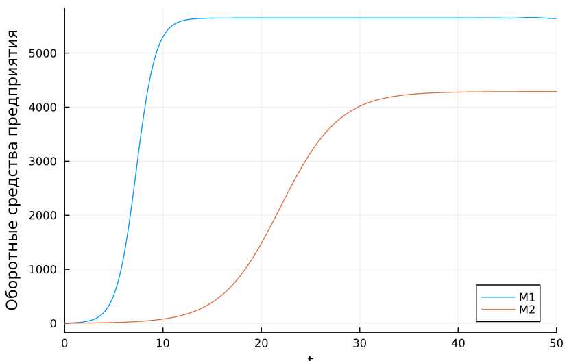
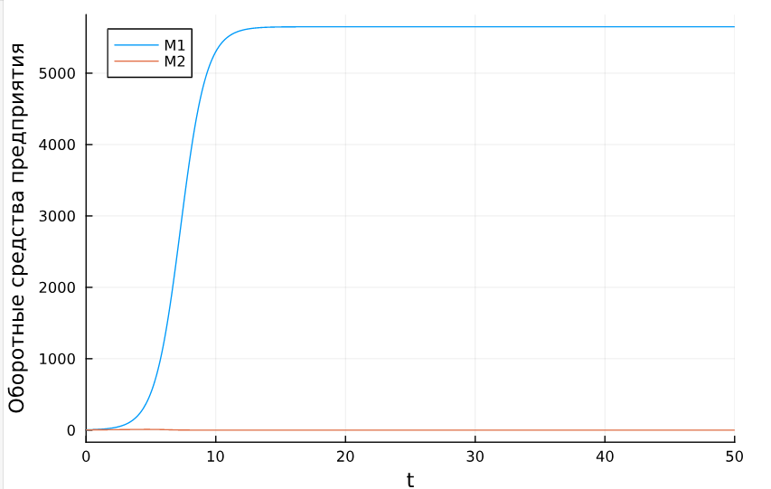
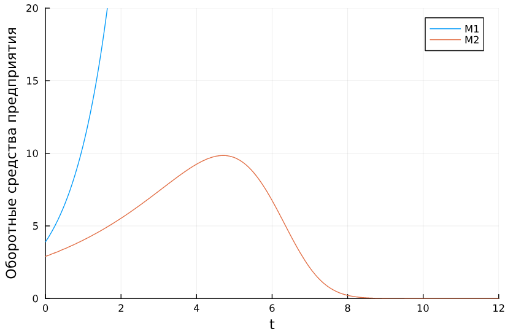
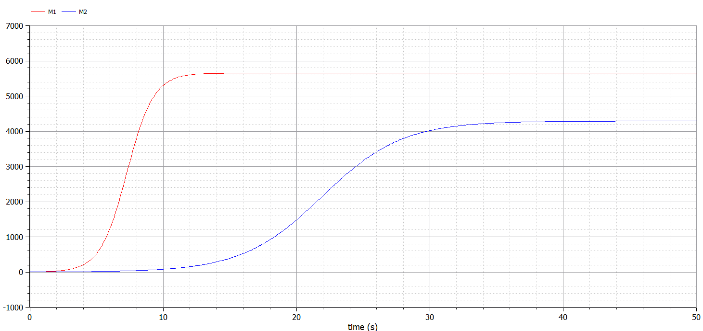
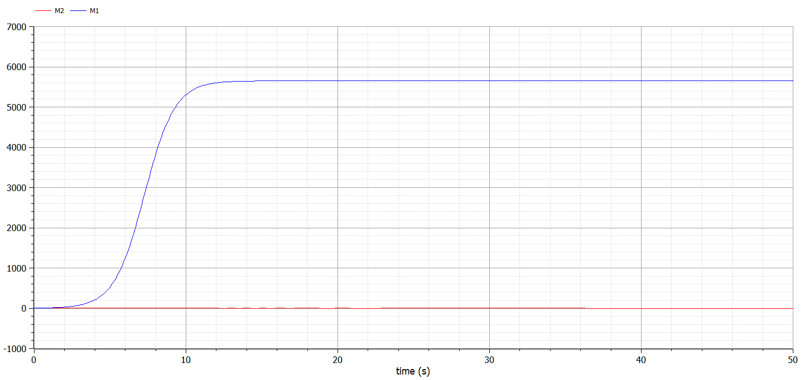
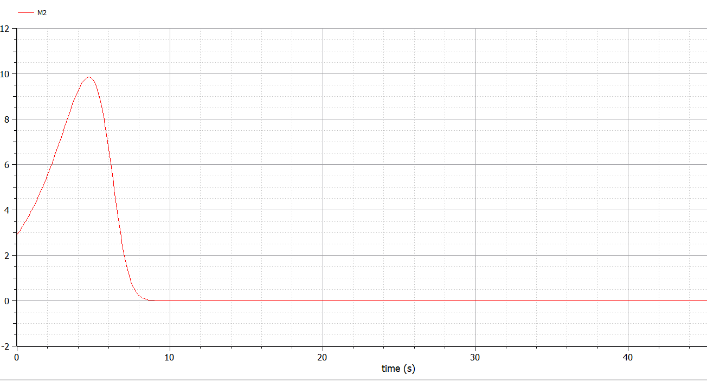

---
## Front matter
title: "Лабораторная работа №8"
subtitle: "Модель конкуренции двух фирм"
author: "Дворкина Ева Владимировна"

## Generic otions
lang: ru-RU
toc-title: "Содержание"

## Bibliography
bibliography: bib/cite.bib
csl: pandoc/csl/gost-r-7-0-5-2008-numeric.csl

## Pdf output format
toc: true # Table of contents
toc-depth: 2
lof: true # List of figures
lot: false # List of tables
fontsize: 12pt
linestretch: 1.5
papersize: a4
documentclass: scrreprt
## I18n polyglossia
polyglossia-lang:
  name: russian
  options:
	- spelling=modern
	- babelshorthands=true
polyglossia-otherlangs:
  name: english
## I18n babel
babel-lang: russian
babel-otherlangs: english
## Fonts
mainfont: IBM Plex Serif
romanfont: IBM Plex Serif
sansfont: IBM Plex Sans
monofont: IBM Plex Mono
mathfont: STIX Two Math
mainfontoptions: Ligatures=Common,Ligatures=TeX,Scale=0.94
romanfontoptions: Ligatures=Common,Ligatures=TeX,Scale=0.94
sansfontoptions: Ligatures=Common,Ligatures=TeX,Scale=MatchLowercase,Scale=0.94
monofontoptions: Scale=MatchLowercase,Scale=0.94,FakeStretch=0.9
mathfontoptions:
## Biblatex
biblatex: true
biblio-style: "gost-numeric"
biblatexoptions:
  - parentracker=true
  - backend=biber
  - hyperref=auto
  - language=auto
  - autolang=other*
  - citestyle=gost-numeric
## Pandoc-crossref LaTeX customization
figureTitle: "Рис."
tableTitle: "Таблица"
listingTitle: "Листинг"
lofTitle: "Список иллюстраций"
lotTitle: "Список таблиц"
lolTitle: "Листинги"
## Misc options
indent: true
header-includes:
  - \usepackage{indentfirst}
  - \usepackage{float} # keep figures where there are in the text
  - \floatplacement{figure}{H} # keep figures where there are in the text
---

# Цель работы

Исследовать простейшую математическую модель конкуренции двух фирм.

# Задание

## Вариант 38

*Случай 1.* 

Рассмотрим две фирмы, производящие взаимозаменяемые товары
одинакового качества и находящиеся в одной рыночной нише. Считаем, что в рамках
нашей модели конкурентная борьба ведётся только рыночными методами. То есть, конкуренты могут влиять на противника путем изменения параметров своего
производства: себестоимость, время цикла, но не могут прямо вмешиваться в
ситуацию на рынке («назначать» цену или влиять на потребителей каким-либо иным способом.) Будем считать, что постоянные издержки пренебрежимо малы, и в
модели учитывать не будем. В этом случае динамика изменения объемов продаж
фирмы 1 и фирмы 2 описывается следующей системой уравнений:

$$
\begin{cases}                                 
  \dfrac{dM_1}{d\theta} = M_1-\dfrac{b}{c_1}M_1M_2-\dfrac{a_1}{c_1}M_1^2,\\\\
  \dfrac{dM_2}{d\theta} = \dfrac{c_2}{c_1}M2-\dfrac{b}{c_1}M_1M_2-\dfrac{a_2}{c_1}M_2^2,
\end{cases}
$$

где $a_1=\dfrac{p_{cr}}{\tau_{1}^2\tilde p_1^2Nq}, \, \, a_2=\dfrac{p_{cr}}{\tau_{2}^2\tilde p_2^2Nq}, \, \, b=\dfrac{p_{cr}}{\tau_{1}^2\tilde p_1^2\tau_{2}^2\tilde p_2^2Nq}, \, \, c_1=\dfrac{p_{cr} - \tilde{p_1}}{\tau_{1}\tilde p_1}, \, \, c_2=\dfrac{p_{cr} - \tilde{p_1}}{\tau_{2}\tilde p_2}$

Также введена нормировка $t=c_1\theta$.

*Случай 2.* 

Рассмотрим модель, когда, помимо экономического фактора
влияния (изменение себестоимости, производственного цикла, использование
кредита и т.п.), используются еще и социально-психологические факторы –
формирование общественного предпочтения одного товара другому, не зависимо от
их качества и цены. В этом случае взаимодействие двух фирм будет зависеть друг
от друга, соответственно коэффициент перед $M_1M_2$
будет отличаться. Пусть в
рамках рассматриваемой модели динамика изменения объемов продаж фирмы 1 и
фирмы 2 описывается следующей системой уравнений:

$$
\begin{cases}                                 
  \dfrac{dM_1}{d\theta} =
01:10
M_1-\dfrac{b}{c_1}M_1M_2-\dfrac{a_1}{c_1}M_1^2,\\\\
  \dfrac{dM_2}{d\theta} = \dfrac{c_2}{c_1}M_2-(\dfrac{b}{c_1}+0.00083)M_1M_2-\dfrac{a_2}{c_1}M_2^2,
\end{cases}
$$

Для обоих случаев рассмотрим задачу со следующими начальными условиями и параметрами:
$$M(0)_1=3.9, \, M(0)_2=2.9,\\ p_{cr}=25, \,N=39, q=1, \\ \tau_1=29, \, \tau_2=19,\\ \tilde{p_1}=6.9, \, \tilde{p_2}=15.9$$

*Обозначения:*

* $N$ – число потребителей производимого продукта.

* $\tau$ – длительность производственного цикла

* $p$ – рыночная цена товара

* $\tilde{p}$– себестоимость продукта, то есть переменные издержки на производство единицы
продукции.

* $q$ – максимальная потребность одного человека в продукте в единицу времени

* $\theta = \dfrac{t}{c_1}$- безразмерное время

1. Построить графики изменения оборотных средств фирмы 1 и фирмы 2 без
учета постоянных издержек и с веденной нормировкой для случая 1.

2. Построить графики изменения оборотных средств фирмы 1 и фирмы 2 без
учета постоянных издержек и с веденной нормировкой для случая 2.

3. Найдите стационарное состояние системы для первого случая.

# Теоретическое введение

Математическому моделированию процессов конкуренции и сотрудничества двух фирм на различных рынках посвящено довольно много научных работ, в основном использующих аппарат теории игр и статистических решений. В качестве примера можно привести работы таких исследователей, как Курно, Стакельберг, Бертран, Нэш, Парето [@model].

Следует отметить, что динамические дифференциальные модели уже давно и успешно используются для математического моделирования самых разнообразных по своей природе процессов. Достаточно упомянуть широко использующуюся в экологии модель «хищник-жертва» Вольтерра, математическую теорию развития эпидемий, модели боевых действий

Задача решалась в следующей постановке [@lab:bash].

На рынке однородного товара присутствуют две основные фирмы, разделяющие его между собой, т.е. имеет место классическая дуополия.

Безусловно, это является весьма сильным предположением, однако оно вполне оправдано в тех случаях, когда доля продаж остальных конкурентов на рассматриваемом сегменте рынке пренебрежимо мала. Хорошим примером может служить отечественный рынок микропроцессоров, который по существу разделили между собой две фирмы: Intel и AMD. 

Изменение объемов продаж конкурирующих фирм с течением времени описывается системой дифференциальных уравнений ([-@eq:eq:a])

$$
\begin{cases}
\frac{d M_1}{d \theta} = M_1 - \dfrac{b}{c_1} M_1 M_2 - \dfrac{a_1}{c_1} M_1^2,\\
\frac{d M_2}{d \theta} = \dfrac{c_2}{c_1} M_1 - \dfrac{b}{c_1} M_1 M_2 - \dfrac{a_2}{c_1} M_2^2,
\end{cases}
$${#eq:eq:a}

где $a_1 = \dfrac{p_{cr}}{(\tau _1^2 \tilde{p_1} N q)}$, $a_2 = \dfrac{p_{cr}}{(\tau _2 ^2*\tilde{p_2} N q)}$, $b = \dfrac{p_{cr}}{(\tau _1^2 \tau _2^2 \tilde{p_1}^2 \tilde{p_2}^2 N q)}$,
$c_1 = \dfrac{(p_{cr}-p_1)}{(\tau _1 \tilde{p_1})}$, $c_2 = \dfrac{(p_{cr}-p_2)}{(\tau _2 \tilde{p_2})}$.

- $N$ -- число потребителей производимого продукта.
- $\tau$ -- длительность производственного цикла
- $p$ -- рыночная цена товара
- $\tilde p$ -- себестоимость продукта, то есть переменные издержки на производство единицы продукции.
- $q$ -- максимальная потребность одного человека в продукте в единицу времени 
- $\theta = \dfrac{t}{c_1}$ -- безразмерное время

# Выполнение лабораторной работы

## Реализация в julia 

Зададим функцию для решения модели эффективности рекламы. Возьмем интервал $t \in [0; 50]$. Рассмотрим сначала реализацию в Julia. Зададим начальные условия, значения параметров

```julia
using DifferentialEquations, Plots
p_cr = 25 #критическая стоимость продукта
tau1 = 29 #длительность производственного цикла фирмы 1
p1 = 6.9 #себестоимость продукта у фирмы 1
tau2 = 19 #длительность производственного цикла фирмы 2
p2 = 15.9 #себестоимость продукта у фирмы 2
N = 39 #число потребителей производимого продукта
q = 1; #максимальная потребность одного человека в продукте в единицу времени
a1 = p_cr/(tau1^2*p1^2*N*q);
a2 = p_cr/(tau2^2*p2^2*N*q);
b = p_cr/(tau1^2*tau2^2*p1^2*p2^2*N*q);
c1 = (p_cr-p1)/(tau1*p1);
c2 = (p_cr-p2)/(tau2*p2);

u0 = [3.9, 2.9] #начальные значения M1 и M2
p = [a1, a2, b, c1, c2]
tspan = (0.0, 50.0) #временной интервал
```

Зададим функцию для первого случая. Сразу же найдем стационарное состояние системы, для этого воспользуемся библиотекой `LinearAlgebra`, зададим матрицу коэффициент системы линейных уравнений и вектор решений $b_1$ (добавили у переменной индекс, так как переменная с таким именем уже используется в качестве параметра модели). 

```julia
function f(u, p, t)
    M1, M2 = u
    a1, a2, b, c1, c2 = p
    M1 = M1 - (a1/c1)*M1^2 - (b/c1)*M1*M2
    M2 = (c2/c1)*M2 - (a2/c1)*M2^2 - (b/c1)*M1*M2
    return [M1, M2]
end

using LinearAlgebra
A = [(a1/c1) (b/c1); (b/c1) (a2/c1)]
b1 = [1, (c2/c1)]
x = A \ b1
println("Решение: ", x)
Решение: [5649.976610483586, 4288.470491728287]
```

Получим значение: $M_{1c} = 5649.976610483586, M_{2c} = 4288.470491728287$. Эти значения соответствуют максимальным значениям полученного решения модели.

Для задания проблемы используется функция `ODEProblem`, а для решения -- численный метод Tsit5(), с помощью `plot` построим график решения для первого случая (рис. [-@fig:001]).

```julia
prob = ODEProblem(f, u0, tspan, p)
sol = solve(prob, Tsit5(), saveat = 0.01)
plot(sol, yaxis = "Оборотные средства предприятия", label = ["M1" "M2"])
```

{#fig:001 width=70%}

Зададим функцию для второго случая.

```julia
function f2(du,u,p,t)
 a1, a2, b, c1, c2 = p
 du[1] = u[1] - (a1/c1)*u[1]*u[1] - (b/c1)*u[1]*u[2]
 du[2] = (c2/c1)*u[2] - (a2/c1)*u[2]*u[2] - (b/c1+0.00083)*u[1]*u[2]
end
```

Для задания проблемы используется функция `ODEProblem`, а для решения -- численный метод Tsit5(), с помощью `plot` построим график решения для второго случая (рис. [-@fig:002]).

```julia
prob2 = ODEProblem(f2, u0, tspan, p)
sol2 = solve(prob2, Tsit5(), saveat = 0.01)
plot(sol2, yaxis = "Оборотные средства предприятия", label = ["M1" "M2"])
```

{#fig:002 width=70%}

На графике плохо видно изменения оборотных средств второй фирмы, поэтому построим график с заданными ограничениями:

```julia
plot(sol2, yaxis = "Оборотные средства предприятия", label = ["M1" "M2"], ylimit=[0, 20], xlimit=[0,12])
```

По графику видно, что вторая фирма, несмотря на начальный рост, достигнув своего максимального объема продаж (рис. [-@fig:003]), начинает нести убытки и, в итоге, терпит банкротство. Динамика роста объемов оборотных средств первой фирмы остается без изменения: достигнув максимального значения, остается на этом уровне.

{#fig:003 width=70%}

## Реализация в OpenModelica

```Modelica
model lab8_1
  parameter Real p_cr = 25;
  parameter Real tau1 = 29;  
  parameter Real p1 = 6.9;
  parameter Real tau2 = 19;
  parameter Real p2 = 15.9;  
  parameter Real N = 39;
  parameter Real q = 1;
  parameter Real a1 = p_cr/(tau1^2*p1^2*N*q);
  parameter Real a2 = p_cr/(tau2^2*p2^2*N*q);
  parameter Real b = p_cr/(tau1^2*tau2^2*p1^2*p2^2*N*q);  
  parameter Real c1 = (p_cr-p1)/(tau1*p1);
  parameter Real c2 = (p_cr-p2)/(tau2*p2);
  
  Real M1(start=3.9);
  Real M2(start=2.9);
  
equation

  der(M1) = M1 - (a1/c1)*M1^2 - (b/c1)*M1*M2;
  der(M2) = (c2/c1)*M2 - (a2/c1)*M2^2 - (b/c1)*M1*M2;
end lab8_1;
```

После установки симуляции модели, получим график ее решения (рис. [-@fig:004]).

{#fig:004 width=70%}


```Modelica
model lab8_2
  parameter Real p_cr = 25;
  parameter Real tau1 = 29;  
  parameter Real p1 = 6.9;
  parameter Real tau2 = 19;
  parameter Real p2 = 15.9;  
  parameter Real N = 39;
  parameter Real q = 1;
  parameter Real a1 = p_cr/(tau1^2*p1^2*N*q);
  parameter Real a2 = p_cr/(tau2^2*p2^2*N*q);
  parameter Real b = p_cr/(tau1^2*tau2^2*p1^2*p2^2*N*q);  
  parameter Real c1 = (p_cr-p1)/(tau1*p1);
  parameter Real c2 = (p_cr-p2)/(tau2*p2);
  
  Real M1(start=3.9);
  Real M2(start=2.9);
  
equation

  der(M1) = M1 - (a1/c1)*M1^2 - (b/c1)*M1*M2;
  der(M2) = (c2/c1)*M2 - (a2/c1)*M2^2 - (b/c1+0.00083)*M1*M2;

end lab8_2;
```

После установки симуляции модели, получим график ее решения (рис. [-@fig:005]).

{#fig:005 width=70%}

На графике плохо видно изменения оборотных средств второй фирмы, поэтому приблизим его (рис. [-@fig:006]).

{#fig:006 width=70%}

Графики решений, полученные с помощью OpenModelica и Julia идентичны. 

# Выводы

Построили математическую модель конкуренции двух фирм.

# Список литературы{.unnumbered}

::: {#refs}
:::
