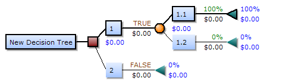

---
## Front matter
lang: ru-RU
title: Доклад
subtitle: Дерево решений
author:
  - Дворкина Е. В.
institute:
  - Преподаватель Кулябов Д. С.
  - Российский университет дружбы народов, Москва, Россия
date: 07 марта 2025

## i18n babel
babel-lang: russian
babel-otherlangs: english

## Formatting pdf
toc: false
toc-title: Содержание
slide_level: 2
aspectratio: 169
section-titles: true
theme: metropolis
header-includes:
 - \metroset{progressbar=frametitle,sectionpage=progressbar,numbering=fraction}
---

# Информация

## Докладчик

:::::::::::::: {.columns align=center}
::: {.column width="70%"}

  * Дворкина Ева Владимировна
  * студентка
  * группа НФИбд-01-22
  * Российский университет дружбы народов
  * [1132226447@rudn.ru](mailto:1132226447@rudn.ru)
  * <https://github.com/evdvorkina>

:::
::: {.column width="30%"}


:::
::::::::::::::

# Вводная часть

## Цели и задачи

**Цель**

исследовать модель "Дерево решений"

**Задачи**

* Дать определение модели дерево решений;

* Описать алгоритм построения дерева решений;

* Показать пример, демонстрирующий работу алгоритма;

* Показать практическую реализацию примера.

## Актуальность

- Интерпретируемый и эффективный метод для принятия решения

- Визуализация логики работы с помощью графа

- Применение в различных задачах

## Определение

:::::::::::::: {.columns align=center}
::: {.column width="60%"}

**Дерево решений** - математическая модель, средство поддержки принятия решений, использующееся в прогнозной аналитике и статистике.

:::
::: {.column width="40%"}


:::
::::::::::::::

## Принципы модели

:::::::::::::: {.columns align=center}
::: {.column width="30%"}

Элементы решающего дерева: 

- Узлы

- Ветви

- Листья

:::
::: {.column width="70%"}



:::
::::::::::::::

# Задача построения дерева решений

## Общий алгоритм построения дерева решений

1. Корневой узел  

2. Нахождение лучшего атрибута и значения для разделения данных

3. Разделение данных на подмножества на основе найденных атрибута и значения.

4. Повторение шагов 2 и 3

## Условия остановки алгоритма

* Все объекты в узле принадлежат к одному классу.

* Достигнута максимальная глубина дерева `max_depth`

* Количество объектов в узле меньше заданного порога `min_samples_leaf` и `min_samples_split`.

## Энтропия Шеннона

:::::::::::::: {.columns align=center}
::: {.column width="60%"}

$$E(X_m) = H(X_m) = -\sum_{k=1}^K (p_k \log_{2}p_k)$$

$p_k$ - доля объектов класса $k$ в наборе данных $X_m$

:::
::: {.column width="40%"}


:::
::::::::::::::

## Прирост информации (Information Gain)

$$IG(X_m,A)=H(X_m)-\sum_{A} \frac{|X_{m_v}|}{X_m} H(X_{m_v})$$

* $A$ - атрибут, по которому происходит разделение данных

* $X_{m_v}$ подмножество множества $X_m$ после разделения по атрибуту $A$. $v$ -- конкретное значение атрибута.

* $|X_{m_v}|$ - количество объектов в модмножестве.

* $|X_{m_v}|$ - количество объектов в наборе данных делимого узла


## Ограничения построения дерева решений

:::::::::::::: {.columns align=center}
::: {.column width="30%"}

- Низкая обобщающая способность
- Высокая вычислительная сложность

:::
::: {.column width="70%"}


:::
::::::::::::::

# Пример работы алгоритма

## Данные для принятия решения о выдаче кредитов с помощью решающих деревьев

| ID  | Возраст  | Доход      | Кредитная история | Трудоустройство  | Семейное положение | Выдать кредит |
|----|---------|-----------|------------------|----------------|----------------|---------------|
| 1  | Молодой  | Низкий    | Плохая           | Безработный    | Холост         | Нет           |
| 2  | Средний  | Средний   | Хорошая          | Официальная    | Женат          | Да            |
| 3  | Пожилой  | Высокий   | Отличная         | Пенсионер      | Вдовец         | Да            |
| 4  | Молодой  | Средний   | Хорошая          | Неофициальная  | Холост         | Нет           |

## Построение дерева

Сравнение показателей энтропии Шеннона на первом разбиении

| Признак            | Энтропия |
|--------------------|-----|
| **Трудоустройство** | **0.40** |
| Кредитная история  | 0.41 |
| Возраст           | 0.7 |
| Доход             | 0.59 |
| Семейное положение | 0.84 |

## Построение дерева


## Построение дерева


# Практическая реализация

## Используемые библиотеки

```

using DataFrames, StatsBase, Random

```

## Функция для вычисления энтропии множества значений целевой переменной

```
function entropy(s)
    counts = countmap(s) 
    total = length(s) 
    return -sum((v/total) * log2(v/total) for v in values(counts))
end
```

## Определение структуры данных для узла дерева решений

```
mutable struct DecisionTree
    name::String 
    df::DataFrame 
    edges::Vector{Any} 
end
```

## Создание корневого узла с полными исходными данными

```
root = DecisionTree("decision tree $(names(df0)[end])", df0, [])
open_nodes = [root] 
```

## Построение дерева решений

```
while !isempty(open_nodes)
    node = popfirst!(open_nodes)  # Извлекаем первый узел из очереди
    df_n = node.df  
    
    # Проверяем, является ли узел листом 
    if entropy(df_n[:, end]) == 0
        continue  
    end
```

## Построение дерева решений

```
    attrs = Dict()
    
    for attr in names(df_n)[1:end-1]
        attrs[attr] = (entropy=0.0, dfs=[], values=[])
        
        for value in unique(df_n[:, attr])
            df_m = filter(row -> row[attr] == value, df_n) 
            e = entropy(df_m[:, end]) * size(df_m, 1) / size(df_n, 1)  
            attrs[attr] = (entropy=attrs[attr].entropy + e, dfs=push!(attrs[attr].dfs, df_m), values=push!(attrs[attr].values, value))
        end
    end
```

## Построение дерева решений

```   
    if isempty(attrs)
        continue  # Если больше нечего разделять, выходим
    end
    
    # Выбираем атрибут с наименьшей энтропией
    best_attr = argmin(x -> x[2].entropy, attrs)[1]
    
    # Создаем дочерние узлы и добавляем их в дерево и очередь open_nodes
    for (d, v) in zip(attrs[best_attr].dfs, attrs[best_attr].values)
        child = DecisionTree("$best_attr=$v", d[:, Not(best_attr)], [])
        push!(node.edges, child)  # Добавляем в дерево
        push!(open_nodes, child)  # Добавляем в очередь на обработку
    end
end
```

## Результат работы

```
decision tree Выдать_кредит
  Трудоустройство=Безработный Dict("Нет" => 4)
  Трудоустройство=Официальная
    Кредитная_история=Хорошая Dict("Да" => 3)
    Кредитная_история=Отличная Dict("Да" => 4)
    Кредитная_история=Плохая Dict("Нет" => 1)
  Трудоустройство=Пенсионер
    Кредитная_история=Отличная Dict("Да" => 1)
    Кредитная_история=Плохая Dict("Нет" => 1)
    Кредитная_история=Хорошая Dict("Да" => 3)
  Трудоустройство=Неофициальная Dict("Нет" => 3)
```

# Выводы
