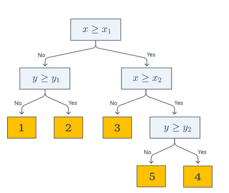
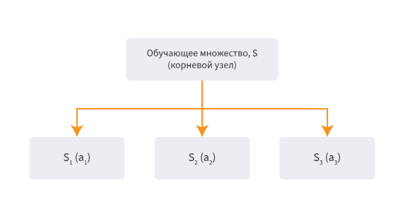
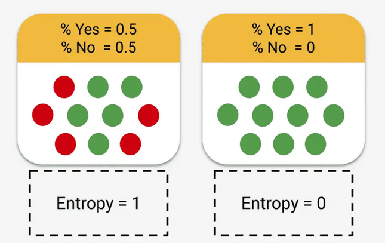
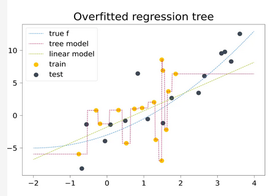
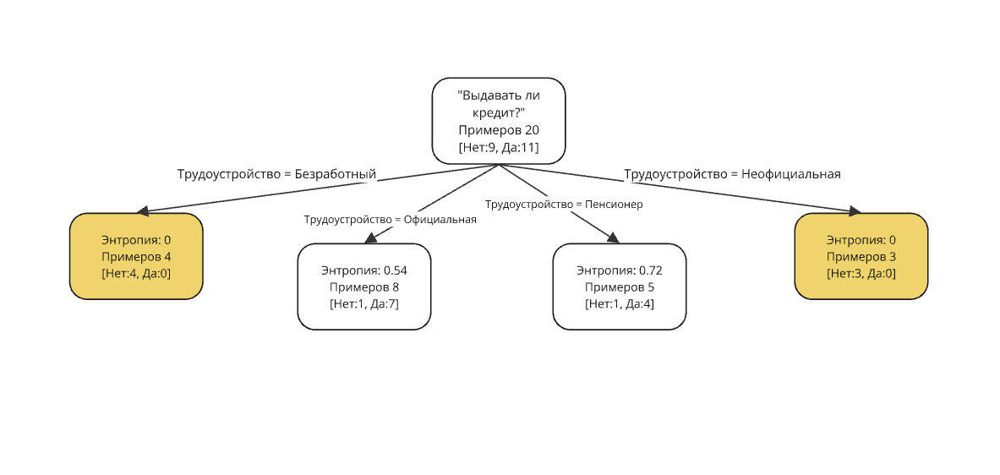
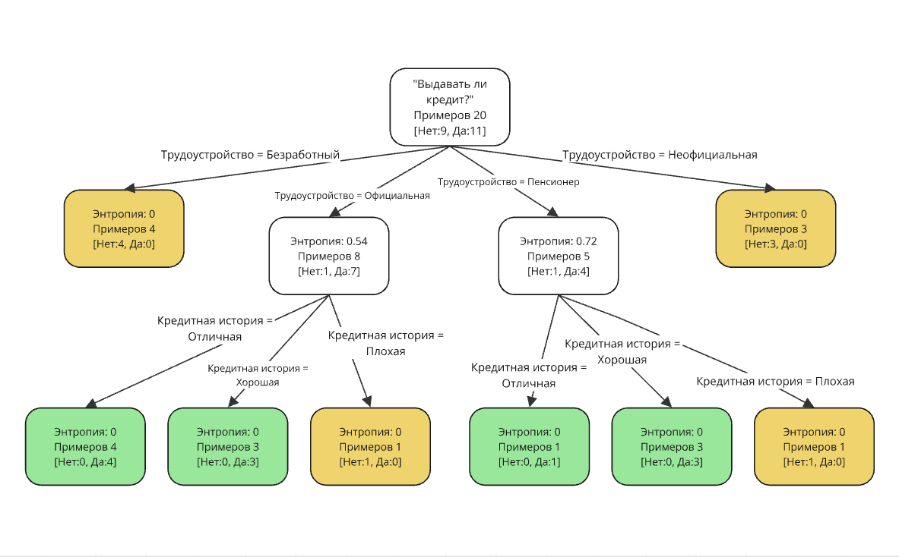

---
## Front matter
title: "Доклад"
subtitle: "Дерево решений"
author: "Ева Владимировна Дворкина"

## Generic otions
lang: ru-RU
toc-title: "Содержание"

## Bibliography
bibliography: bib/cite.bib
csl: pandoc/csl/gost-r-7-0-5-2008-numeric.csl

## Pdf output format
toc: true # Table of contents
toc-depth: 2
lof: true # List of figures
lot: true # List of tables
fontsize: 12pt
linestretch: 1.5
papersize: a4
documentclass: scrreprt
## I18n polyglossia
polyglossia-lang:
  name: russian
  options:
	- spelling=modern
	- babelshorthands=true
polyglossia-otherlangs:
  name: english
## I18n babel
babel-lang: russian
babel-otherlangs: english
## Fonts
mainfont: IBM Plex Serif
romanfont: IBM Plex Serif
sansfont: IBM Plex Sans
monofont: IBM Plex Mono
mathfont: STIX Two Math
mainfontoptions: Ligatures=Common,Ligatures=TeX,Scale=0.94
romanfontoptions: Ligatures=Common,Ligatures=TeX,Scale=0.94
sansfontoptions: Ligatures=Common,Ligatures=TeX,Scale=MatchLowercase,Scale=0.94
monofontoptions: Scale=MatchLowercase,Scale=0.94,FakeStretch=0.9
mathfontoptions:
## Biblatex
biblatex: true
biblio-style: "gost-numeric"
biblatexoptions:
  - parentracker=true
  - backend=biber
  - hyperref=auto
  - language=auto
  - autolang=other*
  - citestyle=gost-numeric
## Pandoc-crossref LaTeX customization
figureTitle: "Рис."
tableTitle: "Таблица"
listingTitle: "Листинг"
lofTitle: "Список иллюстраций"
lotTitle: "Список таблиц"
lolTitle: "Листинги"
## Misc options
indent: true
header-includes:
  - \usepackage{indentfirst}
  - \usepackage{float} # keep figures where there are in the text
  - \floatplacement{figure}{H} # keep figures where there are in the text
---

# Введение

**Цель**

Цель данной работы -- исследовать модель "Дерево решений".

**Задачи**

* Дать определение и описание модели дерево решений
* Описать основной алгоритм построения дерева решений
* Ознакомиться с различными алгоритмами построения дерева решений
* Показать пример, демонстрирующий работу алгоритма
* Показать практическую реализацию примера на языке программирования Julia 

**Актуальность**

Актуальность исследования модели дерева решений обусловлена ее важной ролью в современных задачах статистики и анализа данных для прогнозных решений. В условиях растущего объема информации, деревья решений остаются одним из наиболее интерпретируемых и эффективных методов моделирования процесса принятия решений. Они успешно применяются как для решения прямых задач (классификация, регрессия), так и для обратных (анализ причин, оптимизация условий). Особую ценность представляют их способность явно демонстрировать логику принятия решений и визуализировать ее с помощью графа, что полезно в сферах, где важна прозрачность алгоритмов. Например, сфере финансов, медицине и управлении. Кроме того, развитие новых подходов к построению и оптимизации решающих деревьев открывает новые возможности для их применения в сложных задачах.

# Описание дерева решений

## Определения

**Дерево решений** (дерево классификации, регрессионное дерево, решающее дерево) - математическая модель, которая задаёт процесс принятия решений так, что будут отображены каждое возможное решение, предшествующие и последующие этим решениям события или другие решения и последствия каждого конечного решения. Это средство поддержки принятия решений, использующееся в прогнозной аналитике и статистике [@wiki_ru; @graph].

Подобные деревья решений широко используются в интеллектуальном анализе данных. Цель - создание модели, которая предсказывает значение целевой переменной на основе нескольких переменных на входе. 
В случае использования решающих деревьев для решения задач регрессии, эту модель можно рассматривать как кусочно-постоянную аппроксимацию [@scikit].

Дерево решений состоит из следующих элементов: дуги, узлы решений, узлы событий и конечные узлы (исходы, результаты, "листья") (рис. [-@fig:001]).

{#fig:001 width=70%}

## Практическая значимость 

Решающее дерево – это визуальное представление процесса принятия решений, поэтому оно позволяет разбивать сложные задачи на более простые, последовательно принимая решения на основе определенных критериев.

В отличие от сложных для интерпретации нейросетей и ансамблевых методов, решающие деревья позволяют наглядно интерпретировать процесс принятия решений. Это делает их популярными в таких сферах, как банковская аналитика, медицина, юриспруденция и аудит, где важно объяснять причины предсказаний. 
Использование решающих деревьев также востребовано в оптимизации бизнес-процессов, стратегическом планировании, медицинской диагностике, правовых решениях и других областях.
Деревья решений также используются в управлении операциями и в качестве описательного средства для вычисления условных вероятностей [@wiki_en]. 

## Главные принципы модели

Дерево состоит из трех элементов:

* **Узлы**.

    Каждый узел представляет собой вопрос или условие, которое в нем проверяется. Это точки принятия решений. В каждом узле мы проверяем значение определенного атрибута или признака данных [@wiki_en]. 
    
Узлы бывают трех типов:

    - узлы принятия решений, 

    - вероятностные узлы, 

    - конечные узлы (“листья”).

* **Ветви**.
    
    Ветви - это ребра. Они показывают результаты проверки в узле. В простых моделях это "да" или "нет", но есть возможность построения дерева с несколькими ветвями от одного узла. Ветви, отходящие от узла, представляют возможные исходы проверки в нем. Если условие в узле выполняется, мы переходим по одной ветви, если не выполняется – по другой. 

* **Листья**.
    
    Листья – это конечные узлы дерева. Они представляют собой результат процесса принятия решений – предсказание.

Каждый новый узел решающего дерева может лишь расщепляться. Таким образом, при конструировании дерева вручную, мы можем столкнуться с проблемой его размерности, поэтому, как правило, дерево решений мы можем получить с помощью специализированного программного обеспечения. Обычно дерево решений представляют в виде схематического чертежа, благодаря которому его проще воспринимать и анализировать 

Эта модель со всеми элементами представлена на рис. [-@fig:002].

{#fig:002 width=70%}

# Задача построения дерева решений

## Общий алгоритм построения дерева решений

Пусть $X$ -- исходное множестве объектов, на которых строится дерево, а $X_m$ - множество объектов, попавших в текущий лист.

**Шаг 1.** Построение дерева начинается с корневого узла (вершина графа $v$), содержащего все примеры, на основе которых строится модель ($X_m = X$). 

**Шаг 2.** Нахождение лучшего атрибута и значения для разделения данных (обозначим $B_{j,t}$), чтобы получить подмножества $X_{i_1}\dots X_{i_k}$, с преобладанием одинаковых значений целевой переменной в подмножестве.

**Шаг 3.**  Разделение данных на подмножества $X_{i_1}\dots X_{i_k}$ на основе найденных на втором этапе атрибута и значения.

**Шаг 4.** Повторение шагов 2 и 3 для каждого подмножества $X_{i_1}\dots X_{i_k}$ для создания дочерних узлов (рис. [-@fig:003]).

Прекращаем выполнение алгоритма, когда будет выполнен один из критериев остановки алгоритма $Stop(X_m)$. После выполнения критерия остановки у вершины $v$, объявляем вершину листом, ставим в соответствие ответ $Ans(X_m)$, возвращаем эту вершину.

$Ans(X_m)$ - вычисляющая ответ для листа по попавшим в него объектам из выборки. Может принимать значение класса, среднего или медианы значений, попавших в лист, или простой быть функцией в зависимости от задачи [@yandexhandbook].

{#fig:003 width=70%}

## Условия остановки алгоритма

Критерий остановки $Stop(X_m)$ - функция, которая решает, нужно ли продолжать ветвление. 

Частые условия остановки:

* Все объекты в узле принадлежат к одному классу (имеют примерно одинаковое значение целевой переменной). Получен лист, который предсказывает класс (среднее значение целевой переменной в этом узле).

* Достигнута максимальная глубина дерева `max_depth`. Глубина дерева –- это количество уровней от корневого узла до самого глубокого листа.

* Количество объектов в узле меньше заданного порога `min_samples_leaf` и `min_samples_split`.

## Информационные критерии для построения дерева решений

В алгоритме построения дерева есть необходимость выбора наилучшего разбиения. Для определения этого используются различные информационные критерии, измеряющие, насколько предлагаемое разбиение хорошо.

При этом строгой теории, которая бы связывала оптимальность выбора разных вариантов этих функций и разных метрик классификации и регрессии, в общем случае не существует. Однако есть набор зарекомендовавших себя соображений, которые будут рассмотрены ниже. 

### Задачи классификации

Пусть в задаче $K$ классов, а $p_k$ -- доля объектов класса $k$ в текущей вершине $X_m$.

**Энтропия Шеннона** 

Энтропия – это мера неопределенности или случайности в наборе данных. Чем более равномерно распределены классы в наборе данных, тем выше энтропия. Чем более доминирует один класс, тем ниже энтропия (рис. [-@fig:004]).

Вычисляется по формуле [-eq:eq:a].

$$
E(X_m) = H(X_m) = -\sum_{k=1}^K (p_k \log_{2}p_k)
$$ {#eq:eq:a}

где $p_k$ - доля объектов класса $k$ в наборе данных $X_m$

{#fig:004 width=70%}

**Прирост информации**

Прирост информации (Information Gain) измеряет, насколько уменьшается энтропия набора данных после разделения его по определенному атрибуту. Чем больше прирост информации, тем лучше разделение. 

Вычисляется по формуле [-eq:eq:b].

$$
IG(X_m,A)=H(X_m)-\sum_{A} \frac{|X_{m_v}|}{X_m} H(X_{m_v})
$$ {#eq:eq:b}

* $A$ - атрибут, по которому происходит разделение данных

* $X_{m_v}$ подмножество множества $X_m$ после разделения по атрибуту $A$. $v$ -- конкретное значение атрибута.

* $|X_{m_v}|$ - количество объектов в модмножестве.

* $|X_{m_v}|$ - количество объектов в наборе данных делимого узла

* $H(X_m)$ и $H(X_{m_v})$ - энтропии соответствующих множеств

**Индекс Джини**

Индекс Джини (Gini Impurity) – это еще одна мера неоднородности набора данных. Он представляет собой вероятность того, что случайно выбранный объект из набора данных будет неправильно классифицирован, если его класс будет выбран случайно на основе распределения классов в наборе данных.

Вычисляется по формуле [-eq:eq:c].

$$
Gini(X_m) = 1-\sum_{k}p(k)^2
$$ {#eq:eq:c}

где $p_k$ - доля объектов класса $k$ в наборе данных $X_m$.

Для оценки качества разделения по атрибуту $A$ нужно посчитать взвешенное среднее индекса Джинни для дочерних узлов после разделения по формуле [-eq:eq:d].

$$
Gini_split(X_m, A) = \sum_{A} \frac{|X_{m_v}|}{X_m} Gini(X_{m_v})
$$ {#eq:eq:d}

### Задачи регрессии

**MSE**

При жадной минимизации MSE информативность — это оценка дисперсии полученных результатов для объектов, попавших в лист. Тогда оценка значения в каждом листе — это среднее, а выбирать разбиения надо так, чтобы сумма дисперсий в листьях была как можно меньше [@yandexhandbook].

$$
H(X_m) = \sum_{(x_i,y_i \in X_m)} \frac{(y_i-\overline{y})^2}{|X_m|}
$$

**MAE**

Случай средней абсолютной ошибки: в листе надо предсказывать медиану, ведь именно медиана значений целевой переменной для обучающих примеров минимизирует MAE констатного предсказателя. Тогда в качестве информативности выступает абсолютное отклонение от медианы:

$$
H(X_m) = \sum_{(x_i,y_i \in X_m)} \frac{|y_i-MEDIAN(Y)|}{|X_m|}
$$

## Ограничения построения дерева решений

**Низкая обобщающая способность**

Дерево решений не сможет экстраполировать зависимости за границы области значений обучающей выборки. Также дерево решений способно идеально приблизить обучающую выборку и ничего не выучить. Следовательно, кроме построения хорошо предсказывающего нужные решения дерева, необходимо стремиться оставлять дерево как можно более простым, чтобы результат обладал хорошей обобщающей способностью (рис. [-@fig:005]).

{#fig:005 width=70%}

**Высокая вычислительная сложность**

Проблема получения оптимального дерева решений является NP-полной задачей (то есть пока неизвестны способы нахождения оптимального дерева за полиномиальное время), так как для нахождении оптимального разбиения необходимо посчитать значение информационного критерия, на основе которого строится конкретное дерево решений. 

# Примеры алгоритмов построения деревьев решений

**ID3**

ID3 (Iterative Dichotomiser 3) был разработан в 1986 году Россом Куинланом. Алгоритм создает многоходовое дерево, находя для каждого узла категориальный признак, который даст наибольший прирост информации для категориальных целей. Таким образом, этот алгоритм жадный, то есть в нем принимается наилучшее решение на каждом шаге. Деревья растут до максимального размера, а затем обычно применяется операция обрезки, чтобы улучшить способность дерева обобщаться на невидимые данные [@scikit].


**C4.5**

Алгоритм был также предложен Россом Куинленом в качестве усовершенствованной версии алгоритма ID3, в которой снято ограничение на то, что признаки должны быть категориальными. Алгоритм определения пороговое значение, а затем разбивает список примеров в данных по этому атрибуту, сравнивая его с пороговым значением. Также в этой версии алгоритма построения дерева есть отсечение ветвей дерева, построение дерева при обучении на данных с пропущенными значениями. C4.5 преобразует обученные деревья (т. е. результаты работы алгоритма ID3) в наборы правил “если - то”. Затем оценивается точность каждого правила, чтобы определить порядок их применения [@C_alg; @scikit].

**C5.0**

C5.0 - последняя версия алгоритма Куинлана. Она использует меньше памяти и строит меньшие наборы правил, чем C4.5, при этом являясь более точной [@scikit].

**CART**

CART имеет сходства с C4.5, но отличается от него тем, что поддерживает числовые целевые переменные (задача регрессии) и не вычисляет наборы правил. CART строит бинарные деревья, используя признак и порог, которые дают наибольший прирост информации в каждом узле [@scikit].

# Пример работы алгоритма

Предположим, мы хотим построить дерево решений, которое будет определять стоит ли выдавать человеку кредит или нет на основе их характеристик (см. в табл. [-@tbl:pred]). Будем использовать алгоритм ID3, как самый простой в реализации. Критерий информации, который будем использовать - энтропия разбиения. Все признаки определим как категориальные.

: Данные для принятия решения о выдаче кредитов с помощью решающих деревьев {#tbl:pred}

| ID  | Возраст  | Доход      | Кредитная история | Трудоустройство  | Семейное положение | Выдать кредит |
|----|---------|-----------|------------------|----------------|----------------|---------------|
| 1  | Молодой  | Низкий    | Плохая           | Безработный    | Холост         | Нет           |
| 2  | Средний  | Средний   | Хорошая          | Официальная    | Женат          | Да            |
| 3  | Пожилой  | Высокий   | Отличная         | Пенсионер      | Вдовец         | Да            |
| 4  | Молодой  | Средний   | Хорошая          | Неофициальная  | Холост         | Нет           |
| 5  | Средний  | Высокий   | Хорошая          | Официальная    | Разведен       | Да            |
| 6  | Пожилой  | Средний   | Плохая           | Пенсионер      | Женат          | Нет           |
| 7  | Молодой  | Высокий   | Отличная         | Официальная    | Холост         | Да            |
| 8  | Средний  | Низкий    | Плохая           | Безработный    | Женат          | Нет           |
| 9  | Пожилой  | Высокий   | Хорошая          | Пенсионер      | Разведен       | Да            |
| 10 | Молодой  | Низкий    | Хорошая          | Неофициальная  | Женат          | Нет           |
| 11 | Средний  | Средний   | Отличная         | Официальная    | Холост         | Да            |
| 12 | Пожилой  | Средний   | Хорошая          | Пенсионер      | Женат          | Да            |
| 13 | Молодой  | Высокий   | Плохая           | Безработный    | Разведен       | Нет           |
| 14 | Средний  | Низкий    | Хорошая          | Неофициальная  | Холост         | Нет           |
| 15 | Пожилой  | Высокий   | Отличная         | Официальная    | Женат          | Да            |
| 16 | Молодой  | Средний   | Плохая           | Официальная    | Женат          | Нет           |
| 17 | Средний  | Высокий   | Отличная         | Официальная    | Разведен       | Да            |
| 18 | Пожилой  | Средний   | Хорошая          | Пенсионер      | Вдовец         | Да            |
| 19 | Молодой  | Низкий    | Плохая           | Безработный    | Холост         | Нет           |
| 20 | Средний  | Средний   | Хорошая          | Официальная    | Женат          | Да            |

**Шаг 1.**

Создадим корневой узел, в котором находится полный исходный набор данных из 20 примеров.

**Шаг 2.**

Нам необходимо вычислить наилучший признак для первого разбиения. Для этого посчитаем энтропию при каждом разбиении и выберем то, при котором энтропия наименьшая.

$$
E(X_m) = -\sum_{k=1}^K(p_k \log_{2}p_k)
$$

* Разбиение по признаку "Возраст"

Здесь подробно разберем вычисления.

    - молодой (Нет: 6, Да: 1) 
    
$$
E(X_{m_v})=-\sum_{k=1}^K(p_k\log_{2}p_k)=-\frac{6}{7}\log_{2}\frac{6}{7}-\frac{1}{7}\log_{2}\frac{1}{7}\approx 0.59
$$
    
    - средний (Нет: 2, Да: 5) 
    
$$
E(X_{m_v})=-\frac{5}{7}\log_{2}\frac{5}{7}-\frac{2}{7}\log_{2}\frac{2}{7} \approx 0.86
$$
    
    - пожилой (Нет: 1, Да: 5) 
    
$$
E(X_{m_v})\approx 0.74
$$

$$
E(X_m) = \sum_{A} \frac{|X_{m_v}|}{X_m} H(X_{m_v}) = \frac{7}{20}*0.59+\frac{7}{20}*0.86+\frac{6}{20}*0.74 \approx 0.7
$$

Для остальных разбиений вычисления выполняются так же.

* Разбиение по признаку "Доход"

- Низкий $E(X_{m_v}) = 0$
- Средний $E(X_{m_v}) \approx 0.95$
- Высокий $E(X_{m_v}) \approx 0.59$

$$
E(X_m) = 0.59
$$
    
* Разбиение по признаку "Кредитная история"

- Плохая $E(X_{m_v}) = 0$
- Хорошая $E(X_{m_v}) \approx 0.91$
- Отличная $E(X_{m_v}) = 0$

$$
E(X_m) = 0.41
$$

* Разбиение по признаку "Трудоустройство"

- Безработный $E(X_{m_v}) = 0$
- Официальная $E(X_{m_v}) \approx 0.54$
- Неофициальная $E(X_{m_v}) = 0$
- Пенсионер $E(X_{m_v}) \approx 0.72$

$$
E(X_m) = 0.4
$$
    
* Разбиение по признаку "Семейное положение"

- Холост $E(X_{m_v}) \approx 0.92$
- Женат $E(X_{m_v}) = 1$
- Вдовец $E(X_{m_v}) = 0$
- Разведен $E(X_{m_v}) \approx 0.81$

$$
E(X_m) = 0.84
$$

Наименьшая энтропия Шеннона была получена для разбиения по признаку "Трудоустройство" (см. в табл. [-@tbl:entr]). Заметим, что у двух узлов после разбиения энтропия равна 0, значит эти узлы являются листьями.

: Сравнение показателей энтропии Шеннона {#tbl:entr}

| Признак            | Энтропия |
|--------------------|-----|
| **Трудоустройство** | **0.40** |
| Кредитная история  | 0.41 |
| Возраст           | 0.7 |
| Доход             | 0.59 |
| Семейное положение | 0.84 |


**Шаг 3**

Разделим данные на четыре подмножества в зависимости от трудоустройства. Два узла, где энтропия равна 0 стали листьями, из них не нужно продолжать построение ветвей (рис. [-@fig:006])

{#fig:006 width=70%}


**Шаг 4**

Повторение шага 2 для новых узлов. По новым результатам получим, что для обоих узлов лучшее разбиение по признаку "Кредитная история" (см. в табл. [-@tbl:ofic], [-@tbl:old]).

: Энтропия Шеннона при разбиениях узла "Трудоустройство"="Официцальная" {#tbl:ofic}

| Признак            | Энтропия |
|--------------------|-----|
| **Кредитная история**  | **0** |
| Возраст           | 0.25 |
| Доход             | 0.41 |
| Семейное положение | 0.41 |


: Энтропия Шеннона при разбиениях узла "Трудоустройство"="Пенсионер" {#tbl:old}

| Признак            | Энтропия |
|--------------------|-----|
| **Кредитная история**  | **0** |
| Возраст           | 0.72 |
| Доход             | 0.55 |
| Семейное положение | 0.4 |

**Шаг 5**

Повторение шага 3 для новых узлов: разделим данные в них на подмножества в зависимости от значения в признаке "Кредитная история". 

Заметим, что во всех получившихся узлах энтропия оказалась равна 0, значит, все эти узлы явлются листьями, и мы закончили построение дерева решений (рис. [-@fig:007])

{#fig:007 width=70%}

# Практическая реализация

Реализация алгоритма ID3 возможна на различных языках программирования, посмотрим на реализацию алгоритма с помощью языка программирования Julia. Julia — высокоуровневый свободный язык программирования с динамической типизацией, созданный для математических вычислений.

Будем использовать пакеты `Statistics`, который содержит базовые функции статистики, `DataFrames` и `Random . 
Функция для вычисления элементов теоремы о прогнозе разнообразия (средняя индивидуальная ошибка, коллективная ошибка, разнообразие прогнозов) будет выглядеть следующим образом:


```Julia

using DataFrames, StatsBase, Random

# Датасет: 20 объектов с 5 категориальными признаками и целевой переменной "Выдать_кредит"
df0 = DataFrame(
    Возраст = ["Молодой", "Средний", "Пожилой", "Молодой", "Средний", "Пожилой", "Молодой", "Средний", "Пожилой", "Молодой",
               "Средний", "Пожилой", "Молодой", "Средний", "Пожилой", "Молодой", "Средний", "Пожилой", "Молодой", "Средний"],
    Доход = ["Низкий", "Средний", "Высокий", "Средний", "Высокий", "Средний", "Высокий", "Низкий", "Высокий", "Низкий",
             "Средний", "Средний", "Высокий", "Низкий", "Высокий", "Средний", "Высокий", "Средний", "Низкий", "Средний"],
    Кредитная_история = ["Плохая", "Хорошая", "Отличная", "Хорошая", "Хорошая", "Плохая", "Отличная", "Плохая", "Хорошая", "Хорошая",
                          "Отличная", "Хорошая", "Плохая", "Хорошая", "Отличная", "Плохая", "Отличная", "Хорошая", "Плохая", "Хорошая"],
    Трудоустройство = ["Безработный", "Официальная", "Пенсионер", "Неофициальная", "Официальная", "Пенсионер", "Официальная", "Безработный", "Пенсионер", "Неофициальная",
                       "Официальная", "Пенсионер", "Безработный", "Неофициальная", "Официальная", "Официальная", "Официальная", "Пенсионер", "Безработный", "Официальная"],
    Семейное_положение = ["Холост", "Женат", "Вдовец", "Холост", "Разведен", "Женат", "Холост", "Женат", "Разведен", "Женат",
                           "Холост", "Женат", "Разведен", "Холост", "Женат", "Женат", "Разведен", "Вдовец", "Холост", "Женат"],
    Выдать_кредит = ["Нет", "Да", "Да", "Нет", "Да", "Нет", "Да", "Нет", "Да", "Нет",
                      "Да", "Да", "Нет", "Нет", "Да", "Нет", "Да", "Да", "Нет", "Да"]
)

# Функция для вычисления энтропии множества значений целевой переменной
function entropy(s)
    counts = countmap(s)  # Подсчитываем количество уникальных значений
    total = length(s)  # Общее количество элементов
    return -sum((v/total) * log2(v/total) for v in values(counts))
end

# Определяем структуру данных для узла дерева решений
mutable struct DecisionTree
    name::String  # Название узла (атрибут + значение)
    df::DataFrame  # Подмножество данных, относящееся к этому узлу
    edges::Vector{Any}  # Список дочерних узлов
end

# Создание корневого узла с полными исходными данными
root = DecisionTree("decision tree $(names(df0)[end])", df0, [])
open_nodes = [root]  # Очередь узлов для обработки (BFS-подход)

# Построение дерева решений
while !isempty(open_nodes)
    node = popfirst!(open_nodes)  # Извлекаем первый узел из очереди
    df_n = node.df  # Получаем его данные
    
    # Проверяем, является ли узел листом (энтропия == 0, данные полностью разделены)
    if entropy(df_n[:, end]) == 0
        continue  # Если нет неопределенности, прекращаем разветвление
    end
    
    attrs = Dict()  # Словарь для хранения энтропии разбиения по атрибутам
    
    # Проходим по всем признакам (кроме целевого)
    for attr in names(df_n)[1:end-1]
        attrs[attr] = (entropy=0.0, dfs=[], values=[])  # Инициализация параметров атрибута
        
        for value in unique(df_n[:, attr])  # Перебираем уникальные значения признака
            df_m = filter(row -> row[attr] == value, df_n)  # Фильтруем данные по значению
            e = entropy(df_m[:, end]) * size(df_m, 1) / size(df_n, 1)  # Вычисляем энтропию разбиения
            attrs[attr] = (entropy=attrs[attr].entropy + e, dfs=push!(attrs[attr].dfs, df_m), values=push!(attrs[attr].values, value))
        end
    end
    
    if isempty(attrs)
        continue  # Если больше нечего разделять, выходим
    end
    
    # Выбираем атрибут с наименьшей энтропией (наилучшее разбиение)
    best_attr = argmin(x -> x[2].entropy, attrs)[1]
    
    # Создаем дочерние узлы и добавляем их в дерево и очередь open_nodes
    for (d, v) in zip(attrs[best_attr].dfs, attrs[best_attr].values)
        child = DecisionTree("$best_attr=$v", d[:, Not(best_attr)], [])  # Новый узел без разбиения по best_attr
        push!(node.edges, child)  # Добавляем в дерево
        push!(open_nodes, child)  # Добавляем в очередь на обработку
    end
end

# Функция для визуального представления дерева решений
function tree_to_string(tree::DecisionTree, indent="")
    # Формируем строковое представление узла
    s = indent * tree.name * (isempty(tree.edges) ? " $(countmap(tree.df[:, end]))" : "") * "\n"
    
    # Рекурсивно обрабатываем дочерние узлы
    for edge in tree.edges
        s *= tree_to_string(edge, indent * "  ")
    end
    return s
end

# Вывод дерева решений в текстовом формате
println(tree_to_string(root))

```

В результате получим:

```
decision tree Выдать_кредит
  Трудоустройство=Безработный Dict("Нет" => 4)
  Трудоустройство=Официальная
    Кредитная_история=Хорошая Dict("Да" => 3)
    Кредитная_история=Отличная Dict("Да" => 4)
    Кредитная_история=Плохая Dict("Нет" => 1)
  Трудоустройство=Пенсионер
    Кредитная_история=Отличная Dict("Да" => 1)
    Кредитная_история=Плохая Dict("Нет" => 1)
    Кредитная_история=Хорошая Dict("Да" => 3)
  Трудоустройство=Неофициальная Dict("Нет" => 3)
```

Так выглядит описание нашего дерева и полученные листья с результатами в них. Глубина дерева ограничена не была, как и минимальное количество результатов в одном листе, поэтому дерево решений построено с такими правилами, которые приводят к идеальному разбиению обученной выборки. Также видим, что идеальные результаты в листьях дерева были достигнуты до того, как были построены узлы с условиями по каждому признаку. Результат алгоритма, реализованного с помощью Julia совпадает с полученным в предыдущем разделе деревом решений.

# Выводы

Была исследована модель дерево решений, также были рассмотрены ограничения этой модели и различные алгоритмы построения деревьев решений. 

# Список литературы{.unnumbered}

::: {#refs}
:::
