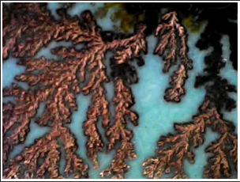
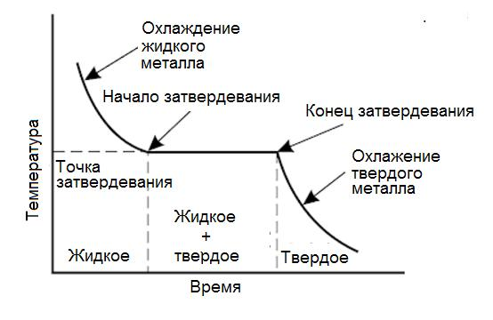
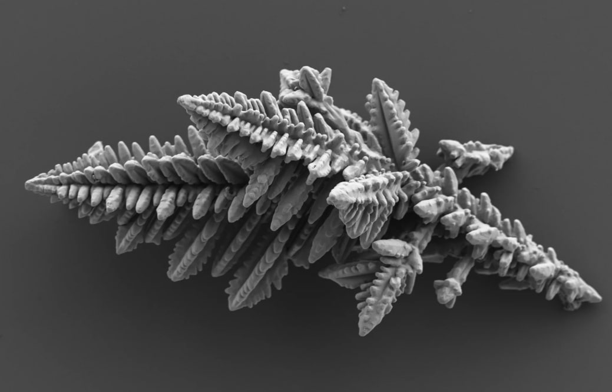

---
## Front matter
lang: ru-RU
title: Рост дендритов
subtitle: Групповой проект. Этап 1.
author:
  - Дворкина Е.В.,
  - Чемоданова А.А.,
  - Серёгина И.А.,
  - Волгин И.А.,
  - Александрова У.В.,
  - Голощапов Я.В.
institute:
  - Российский университет дружбы народов, Москва, Россия
date: 26 марта 2025

## i18n babel
babel-lang: russian
babel-otherlangs: english

## Formatting pdf
toc: false
toc-title: Содержание
slide_level: 2
aspectratio: 169
section-titles: true
theme: metropolis
header-includes:
 - \metroset{progressbar=frametitle,sectionpage=progressbar,numbering=fraction}
---

# Информация

## Состав исследовательской группы

Студенты группы НФИбд-01-22:

- Дворкина Е. В.
- Чемоданова А. А.
- Серёгина И. А.
- Волгин И. А.
- Александрова У. В.
- Голощапов Я. В.

## Докладчик

:::::::::::::: {.columns align=center}
::: {.column width="70%"}

  * Александрова Ульяна Вадимовна
  * студент учебной группы НФИбд-01-22
  * Российский университет дружбы народов
  * <https://github.com/AleksandrovaUV>

:::
::: {.column width="30%"}

:::
::::::::::::::

# Вводная часть

## Актуальность

:::::::::::::: {.columns align=center}
::: {.column width="60%"}

  - Ключевая роль в металлургии и литейном производстве.
  - теоретическое понимание процессов кристаллизации,
  - улучшение технологий производства материалов.

:::
::: {.column width="40%"}

:::
::::::::::::::

## Объект и предмет исследования

:::::::::::::: {.columns align=center}
::: {.column width="50%"}

:::
::: {.column width="50%"}

- Дендриты
- Кристаллические дендриты

:::
::::::::::::::

## Цели и задачи
Цели: 

- Исследовать модель роста дендритов

Задачи:

- Рассмотреть комбинированную модель роста дендритов.
- Рассмотреть алгоритм построения модели роста дендритов.
- Построить модель роста дендритов.
- Исследовать зависимость от времени числа частиц в агрегате и его среднеквадратичного радиуса в разных режимах.

# Теоретические сведения о модели

## Физические свойства вещества

- плотность $\rho$,
- удельная теплота плавления на единицу массы $L$, 
- теплоемкость при постоянном давлении $c_p$ (также на единицу массы),
- коэффициент теплопроводности $\kappa$ (для простоты будем считать теплопроводность и плотность не зависящими от температуры и одинаковыми для твердой и жидкой фаз – так называемая симметричная модель),
- температура плавления $T_m$.

## Переохлаждение расплава

Безразмерное переохлаждение:
$$
S = c_p \frac{(T_m - T_\infty)}{L} \tag{1}
$$

При $S \geq 1$ — полное затвердевание, при $S < 1$ — частичное.

## Уравнение теплопроводности

:::::::::::::: {.columns align=center}
::: {.column width="40%"}

:::
::: {.column width="60%"}
Для описания изменения температуры со временем в двумерном случае используется уравнение теплопроводности:

$$
\rho c_p \frac{\partial T}{\partial t} = \kappa \nabla^2 T \equiv \kappa \left( \frac{\partial^2 T}{\partial x^2} + \frac{\partial^2 T}{\partial y^2} \right) \tag{2}
$$
:::
::::::::::::::

## Скорость роста границы кристализации

:::::::::::::: {.columns align=center}
::: {.column width="55%"}

:::
::: {.column width="45%"}

Скорость движения границы $V$ связана с градиентом температуры. 

**Условие Стефана:**

$$
\mathbf{n} \cdot \mathbf{V} = \frac{\kappa}{\rho L} (\mathbf{n} \cdot \nabla T|_s - \mathbf{n} \cdot \nabla T|_l) \tag{3}
$$

Градиенты температуры в твердой и жидкой фазах определяют поток тепла.

:::
::::::::::::::

## Механизмы ограничивающие рост выступов

:::::::::::::: {.columns align=center}
::: {.column width="60%"}

**Условие Гибса-Томсона**:

Температура границы снижается для компенсации поверхностного натяжения:

$$
T_b = T_m \left(1 - \frac{\gamma T_m}{\rho L^2 R}\right). \tag{4}
$$

**Кинетическое замедление роста**:

$$
\Delta T_b = -T_m / \beta V. \tag{5}
$$

Здесь $\beta$ — кинетический коэффициент.

:::
::: {.column width="40%"}

:::
::::::::::::::

## Безразмерная температура и уравнение теплопроводности

Вводится безразмерная температура $\widetilde{T} = c_p (T - T_\infty)/L$, где $T_\infty$  — начальная температура расплава. Уравнение теплопроводности для $\widetilde{T}$ имеет вид

$$
\frac{\partial \widetilde{T}}{\partial t} = \chi \nabla^2 \widetilde{T}, \tag{6}
$$

где $\chi = \kappa / \rho c_p$ — коэффициент температуропроводности.

## Аппроксимация лапласиана

Точное выражение для $\nabla^2 T$ в узле $(i,j)$
$$
\nabla^2 T \approx \frac{\langle T_{(i,j)} \rangle - T_{i,j}}{(4 + 4w)(1 + 2w) h^2}, \tag{7}
$$
где $\langle T_{(i,j)} \rangle$ — среднее значение температуры в соседних узлах, $w$ — коэффициент, учитывающий влияние диагональных соседей (обычно $w = 1/2$).

## Явная разностная схема

$$
\hat{T}_{i,j} = T_{i,j} + \frac{\chi \Delta t \nabla^2 T}{m}. \tag{8}
$$

$m$ - количество подшагов

## Условие перехода в твердую фазу

Узел переходит из жидкого в твердое состояние, если:

$$
T \leq \tilde{T}_m (1 + \eta_{i,j} \delta) + \lambda s_{i,j}, \tag{9}
$$

где:

- $\tilde{T}_m$ — безразмерное начальное переохлаждение,

- $\eta_{i,j}$ — случайное число в интервале $[-1,1]$,

- $\delta$ — величина случайного отклонения температуры  (теплового шума),

- $\lambda$ — величина, связанная с капиллярным радиусом,

- $s_{i,j}$ — параметр, учитывающий кривизну границы.

## Выводы

Во время выполнения первого этапа группового проекта мы:

- сделали теоретическое описание модели роста дендритов
- определили задачи дальнейшего исследования
