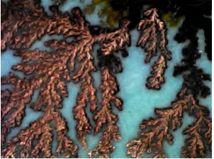

---
## Front matter
title: "Групповой проект. Этап 1"
subtitle: "Научная проблема проекта Рост дендритов"
author:

 - Александрова Ульяна Вадимовна
 - Волгин Иван Алексеевич
 - Голощапов Ярослав Вячеславович
 - Дворкина Ева Владимировна
 - Серёгина Ирина Андреевна
 - Чемоданова Ангелина Александровна
 
institute: RUDN University, Moscow, Russian Federation        

## Generic otions
lang: ru-RU
toc-title: "Содержание"

## Bibliography
bibliography: bib/cite.bib
csl: pandoc/csl/gost-r-7-0-5-2008-numeric.csl

## Pdf output format
toc: true # Table of contents
toc-depth: 2
lof: true # List of figures
lot: false # List of tables
fontsize: 12pt
linestretch: 1.5
papersize: a4
documentclass: scrreprt
## I18n polyglossia
polyglossia-lang:
  name: russian
  options:
	- spelling=modern
	- babelshorthands=true
polyglossia-otherlangs:
  name: english
## I18n babel
babel-lang: russian
babel-otherlangs: english
## Fonts
mainfont: IBM Plex Serif
romanfont: IBM Plex Serif
sansfont: IBM Plex Sans
monofont: IBM Plex Mono
mathfont: STIX Two Math
mainfontoptions: Ligatures=Common,Ligatures=TeX,Scale=0.94
romanfontoptions: Ligatures=Common,Ligatures=TeX,Scale=0.94
sansfontoptions: Ligatures=Common,Ligatures=TeX,Scale=MatchLowercase,Scale=0.94
monofontoptions: Scale=MatchLowercase,Scale=0.94,FakeStretch=0.9
mathfontoptions:
## Biblatex
biblatex: true
biblio-style: "gost-numeric"
biblatexoptions:
  - parentracker=true
  - backend=biber
  - hyperref=auto
  - language=auto
  - autolang=other*
  - citestyle=gost-numeric
## Pandoc-crossref LaTeX customization
figureTitle: "Рис."
tableTitle: "Таблица"
listingTitle: "Листинг"
lofTitle: "Список иллюстраций"
lotTitle: "Список таблиц"
lolTitle: "Листинги"
## Misc options
indent: true
header-includes:
  - \usepackage{indentfirst}
  - \usepackage{float} # keep figures where there are in the text
  - \floatplacement{figure}{H} # keep figures where there are in the text
---

# Введение

## Актуальность

Появление дендритов (рис. [-@fig:001]) играет ключевую роль в металлургии и в литейном производстве, особенно при затвердевании металлов и сплавов, так как микроструктура образующихся дендритов во многом определяет механические, электрические и тепловые свойства полученных материалов. Изучение их характеристик важно не только для теоретического понимания процессов кристаллизации, но и для практики, для улучшения технологий производства современных материалов с заданными свойствами. 
Таким образом, научная проблема заключается в разработке теоретических и численных моделей, способных точно предсказывать динамику роста дендритов и их влияние на микроструктуру сформированных материалов. 

{#fig:001 width=70%}

## Объект и предмет исследования

- Дендриты
- Кристаллические дендриты

## Цель 

Исследовать модель роста дендритов.

## Задачи

- Рассмотреть комбинированную модель роста дендритов.
- Рассмотреть алгоритм построения модели роста дендритов.
- Построить модель роста дендритов.
- Исследовать зависимость от времени числа частиц в агрегате и его среднеквадратичного радиуса в разных режимах.

# Теоретическое описание задачи

## Определения

Дендрит - это кристалл, который развивается с типичной многоветвящейся формой, напоминающей фрактал [@wiki:bash].  В металлах образуются в процессе кристаллизации из переохлажденного расплава.

Анизотропия кристалла — это зависимость физических свойств кристалла от направления роста. То есть кристаллическая структура не симметрична, и существует несколько осей, вдоль которых у кристалла проявляются различные свойства (механические, электрические, оптические) [@rtu:bash].

Анизотропия является естественным следствием кристаллического строения, так как на различных кристаллографических плоскостях и вдоль различных направлений плотность атомов различна.

Далее будем рассматривать образование кристаллической структуры из переохлажденного расплава [@ngu:bash]. 

## Основные понятия и уравнения

### Образование дендритов

Образование дендритов начинается с некоторого зародышеобразования, т. е. первого появления твердого роста в переохлажденной жидкости. Это образование сначала будет расти сферически, пока эта форма не перестанет быть устойчивой. Нестабильность формы имеет две причины: анизотропию поверхностной энергии границы твердого тела и жидкости и кинетику прикрепления частиц к кристаллографическим плоскостям при их образовании.

Необходимо задать физические свойства вещества:

- плотность $\rho$,
- удельная теплота плавления на единицу массы $L$, 
- теплоемкость при постоянном давлении $c_p$ (также на единицу массы),
- коэффициент теплопроводности $\kappa$ (для простоты будем считать теплопроводность и плотность не зависящими от температуры и одинаковыми для твердой и жидкой фаз – так называемая симметричная модель),
- температура плавления $T_m$.

Пусть начальная температура расплава меньше температуры плавления (т.е. он переохлажденный) $T_{\infty}<T_m$.  

В контексте кристаллизации из переохлажденного расплава (рис. [-@fig:002]), безразмерное переохлаждение S вводится для нормализации и упрощения математических моделей процесса. Этот параметр характеризует степень переохлаждения расплава относительно его температуры плавления, что критично для инициации и скорости кристаллизации. Оно рассчитывается по формуле ([-@eq:eq:cool]).

$$
S = c_p \frac{(T_m - T_\infty)}{L}
$${#eq:eq:cool}

{#fig:002 width=70%}

Адиабатические условия предполагают отсутствие теплообмена с окружающей средой, что означает сохранение тепловой энергии внутри системы. В таких условиях, при $S \geq 1$, весь расплав затвердевает, поскольку имеется достаточная разность температур для обеспечения процесса кристаллизации. При $S < 1$ затвердевает только часть расплава, этот случай мы и будем рассматривать.

Также ограничимся двумерным случаем. Для описания изменения температуры со временем в двумерном случае используется уравнение теплопроводности ([-@eq:eq:tem])

$$
\rho c_p \frac{\partial T}{\partial t} = \kappa \nabla^2 T \equiv \kappa \left( \frac{\partial^2 T}{\partial x^2} + \frac{\partial^2 T}{\partial y^2} \right)
$${#eq:eq:tem}

### Скорость роста дендритов

Далее найдем скорость движения границы кристаллизации перпендикулярно самой себе, обозначим эту скорость $V$. За время  $\Delta t$ на участке площади $s$ затвердевает масса вещества, равная $\Delta m = \rho s V \Delta t$ [@ngu:bash].

При кристаллизации выделяется теплота плавления $\Delta Q = \Delta m L$. Закон сохранения энергии требует, чтобы все выделившееся тепло было отведено за счет теплопроводности, суммарный поток тепла на границе $\mathbf{q} = -\kappa (\nabla T|_l - \nabla T|_s)$

Здесь  \( \nabla T|_l \) и \( \nabla T|_s \) — градиенты температуры в жидкой и твердой фазах соответственно. Ориентация дендрита задается внешним градиентом температуры. Градиент температуры \( \nabla T \) — вектор, компоненты которого в двумерном случае равны $(\partial T / \partial x, \partial T / \partial y)$.

Индексы $l$ и $s$ относятся к жидкой и твердой фазам.

Для сохранения энергии должно выполняться условие $q s \Delta t = \Delta Q$. Подставляя выражения для $q$ и $\Delta Q$, получаем ([-@eq:eq:a])

$$
\kappa (\nabla T|_l - \nabla T|_s) s \Delta t = \rho s V \Delta t L
$${#eq:eq:a}

Сокращая общие множители $s$, $\Delta t $ и учитывая, что $\mathbf{n} \cdot (\nabla T)$ — проекция градиента температуры на нормаль к границе, можно записать скалярное уравнение ([-@eq:eq:b])

$$
\kappa (\mathbf{n} \cdot \nabla T|_l - \mathbf{n} \cdot \nabla T|_s) = \rho V L
$${#eq:eq:b}

Перестроив выражение, получаем условие Стефана ([-@eq:eq:c])

$$
\mathbf{n} \cdot \mathbf{V} = \frac{\kappa}{\rho L} (\mathbf{n} \cdot \nabla T|_s - \mathbf{n} \cdot \nabla T|_l)
$${#eq:eq:c}

Это уравнение описывает связь между скоростью движения границы кристаллизации и градиентами температуры. В нем $\mathbf{n}$ - вектор единичной длины, перпендикулярный границе (вектор нормали).

### Задача Стефана и неустойчивость Муллинса-Секерки 

Для определения изменения положения и формы границы затвердевания со временем необходимо задать температуру на границе $T_b$. Простейший вариант — принять $T_b = T_m$. В этом случае внутри твердой области температура будет постоянной, а такая проблема известна как **задача Стефана**.

Однако граница затвердевания в этом случае неустойчива. Рассмотрим плоскую границу, движущуюся с некоторой скоростью. Если на ней возникает небольшой выступ, градиент температуры перед выступом увеличивается, что приводит к ускорению его роста. Это приводит к дальнейшему увеличению градиента и ускорению выступа, что характеризует **неустойчивость Муллинса-Секерки**. Эта ситуация аналогична диффузионно-ограниченной агрегации.

В реальных процессах затвердевания таких неустойчивостей не наблюдается, что указывает на наличие механизмов, ограничивающих рост выступов. Эти механизмы могут быть связаны с поверхностным натяжением и кинетическими ограничениями.

### Условие Гиббса-Томсона  

Первый механизм связан с поверхностным натяжением. Атомы на поверхности имеют меньшее число соседей,  находящихся в той же фазе, что приводит к повышению их потенциальной энергии. Дополнительная потенциальная энергия пропорциональна площади поверхности: $\Delta E_p = \gamma s$, где $\gamma$ — коэффициент поверхностного натяжения.

Рост выступов увеличивает площадь поверхности, что энергетически невыгодно. Следовательно, температура границы на выступах должна быть ниже температуры плавления, чтобы компенсировать эту энергию. Это описывается **условием Гиббса-Томсона**:

$$
T_b = T_m \left(1 - \frac{\gamma T_m}{\rho L^2 R}\right).
$$

Здесь $R$ — радиус кривизны границы в данной точке (для плоской поверхности $R = \infty$). Вводится капиллярный радиус $d_0 = \gamma T_m c_p / (\rho L^2)$, размер образующейся структуры пропорционален ему.

### Кинетическое замедление роста выступов  

Второй механизм связан с кинетическими ограничениями. Присоединение атомов к твердой поверхности не происходит мгновенно, требуя некоторого времени, в течение которого движущиеся участки границы могут переохладиться. Это влияет на температуру границы ([-@eq:eq:d])

$$
\Delta T_b = -T_m / \beta V.
$${#eq:eq:d}

Здесь $\beta$ — кинетический коэффициент.

### Безразмерная температура и уравнение теплопроводности

Вводится безразмерная температура $\widetilde{T} = c_p (T - T_\infty)/L$, где $T_\infty$  — начальная температура расплава. Уравнение теплопроводности для $\widetilde{T}$ имеет вид ([-@eq:eq:e])

$$
\frac{\partial \widetilde{T}}{\partial t} = \chi \nabla^2 \widetilde{T},
$${#eq:eq:e}

где $\chi = \kappa / \rho c_p$ — коэффициент температуропроводности.

Начальное условие: $\widetilde{T} = 0$ везде, кроме затравки. При затвердевании всего вещества $\widetilde{T}$ повышается на единицу. Далее опустим знак $~$ у переменной $\widetilde{T}$.

# Описание модели

Начальное положение зародыша определяется случайным образом. Мы же опишем модель опишем для примера, где рассмотрим квадратную область размера $N \times N$ узлов, с центральной затравкой. Расстояние между узлами $h = 1$, шаг по времени $\Delta t = 1$.

## Изменение температуры

Используем уравнение теплопроводности ([-@eq:eq:tem]). 

Точное выражение для $\nabla^2 T$ в узле $(i,j)$ ([-@eq:eq:f])

$$
\nabla^2 T \approx \frac{\langle T_{(i,j)} \rangle - T_{i,j}}{(4 + 4w)(1 + 2w) h^2},
$${#eq:eq:f}

где $\langle T_{(i,j)} \rangle$ — среднее значение температуры в соседних узлах, $w$ — коэффициент, учитывающий влияние диагональных соседей (обычно $w = 1/2$).

В первом приближении можно записать новое значение температуры, используя явную разностную схему ([-@eq:eq:g]) :

$$
\hat{T}_{i,j} = T_{i,j} + \chi \Delta t \nabla^2 T.
$${#eq:eq:g}

Однако, при этом изменение температуры в узле через один шаг по времени ощутят только соседи. Это может быть правильно для больших скоростей кристаллизации. Обычно все же установление температуры происходит гораздо быстрее, чем рост кристалла. Чтобы это учесть, один шаг процесса роста кристалла $\Delta t$ разобьем на $m$ шагов длительностью $\frac{\Delta t}{m}$. Новое значение температуры после шага $m$ вычисляется по формуле ([-@eq:eq:h])

$$
\hat{T}_{i,j} = T_{i,j} + \frac{\chi \Delta t \nabla^2 T}{m}.
$${#eq:eq:h}

## Рост дендрита 

Состояние каждого узла: $n = 0$ — жидкая фаза, $n = 1$ — твердая фаза. Промежуточные состояния не учитываются.

Узел переходит из жидкого в твердое состояние, если он находится на границе и температура в нем ниже локальной температуры плавления. То есть выполняется условие ([-@eq:eq:i]) :

$$
T \leq \tilde{T}_m (1 + \eta_{i,j} \delta) + \lambda s_{i,j},
$${#eq:eq:i}

где:

- $\tilde{T}_m$ — безразмерное начальное переохлаждение,

- $\eta_{i,j}$ — случайное число в интервале $[-1,1]$,

- $\delta$ — величина случайного отклонения температуры  (теплового шума),

- $\lambda$ — величина, связанная с капиллярным радиусом,

- $s_{i,j}$ — параметр, учитывающий кривизну границы.

## Учет кривизны границы 

Кривизна границы [@ngu:bash, @urfu:bash]  $1/R$ приближенно вычисляется по соседям узла [-@eq:eq:u] :

$$
1/R \approx s_{i,j} = \sum_{1} n_{i,j} + w_n \sum_{2} n_{i,j} - \left( \frac{5}{2} + \frac{5}{2} w_n \right),
$${#eq:eq:u}

где:

- первая сумма — по ближайшим соседям,

- вторая сумма — по диагональным соседям,

- $w_n$ — коэффициент, обычно $w_n = 1/2$.

Естественно, при затвердевании вещества температура в узле повышается на 1 в наших безразмерных единицах

# Примеры моделей роста дендритов

В условиях самосборки с использованием водного раствора сульфата меди и пластин цинка, размещенных в чашечке Петри на фильтровальной бумаге, образуются двумерные дендритные структуры. Цинк медленно вытесняет медь из водного раствора сульфата меди, так что образуется сульфат цинка и выпадает медь в виде дендритных структур [@moluch:bash] (рис. [-@fig:004]).

{#fig:004 width=70%}

- **Начальная стадия**: Образование зародышей меди на поверхности цинковой пластины.

- **Рост дендритов**: Организация зародышей в более крупные образования.

- **Формирование структуры**: Появление металлических древовидных образований с пышной кроной.

- **Перераспределение примеси**: В процессе роста дендритов ионы меди диффундируют от областей с высокой концентрацией к областям с низкой концентрацией. Это перераспределение примеси влияет на форму и скорость роста дендритов, создавая более сложные и ветвистые структуры [@cyber:bash].
Это означает, что концентрация примеси в жидкой фазе изменяется в зависимости от положения и роста дендритов. В модели используются уравнения диффузии для описания перераспределения примеси ([-@eq:eq:j]). 

$$
\frac{\partial C}{\partial t} = D \nabla^2 C
$${#eq:eq:j}

где $C$ — концентрация примеси, $D$ — коэффициент диффузии.

## Фазово-полевая модель

Фазово-полевая модель является одной из наиболее распространенных моделей для описания роста дендритов. Она основывается на термодинамических принципах и описывает кинетику фазовых переходов в системе. В этой модели используется фазовое поле, которое представляет собой параметр, описывающий состояние системы (твердое тело или жидкость).

Уравнение фазового поля ([-@eq:eq:k])

$$
\frac{\partial \phi}{\partial t} = M \nabla^2 \phi - \frac{\partial f}{\partial \phi}
$${#eq:eq:k}

где $$\phi$$ — фазовое поле, $$M$$ — подвижность, $$f$$ — свободная энергия.

Фазово-полевая модель позволяет учитывать влияние температуры и концентрации примеси на процесс роста дендритов. Она также учитывает анизотропию, то есть зависимость свойств материала от направления. Это важно для точного описания формы и скорости роста дендритов (рис. [-@fig:005]).

{#fig:005 width=70%}

 
## Модель клеточных автоматов

Модель клеточных автоматов используется для дискретного описания роста дендритов. В этой модели пространство делится на ячейки, каждая из которых может находиться в одном из нескольких состояний (жидкость, твердое тело, граница). Переходы между состояниями описываются вероятностными правилами, зависящими от локальных условий.

- **Состояния ячеек**: Жидкость, твердое тело, граница.

- **Правила перехода**: Вероятностные правила, зависящие от локальных условий.

- **Влияние соседних ячеек**: Взаимодействие между ячейками учитывается через локальные правила перехода.

Модель клеточных автоматов позволяет учитывать сложные взаимодействия между ячейками и описывать процесс роста дендритов на микроскопическом уровне. 

# Выводы

Во время выполнения первого этапа группового проекта мы сделали теоретическое описание модели роста дендритов и определили задачи дальнейшего исследования.

# Список литературы{.unnumbered}

::: {#refs}
:::
