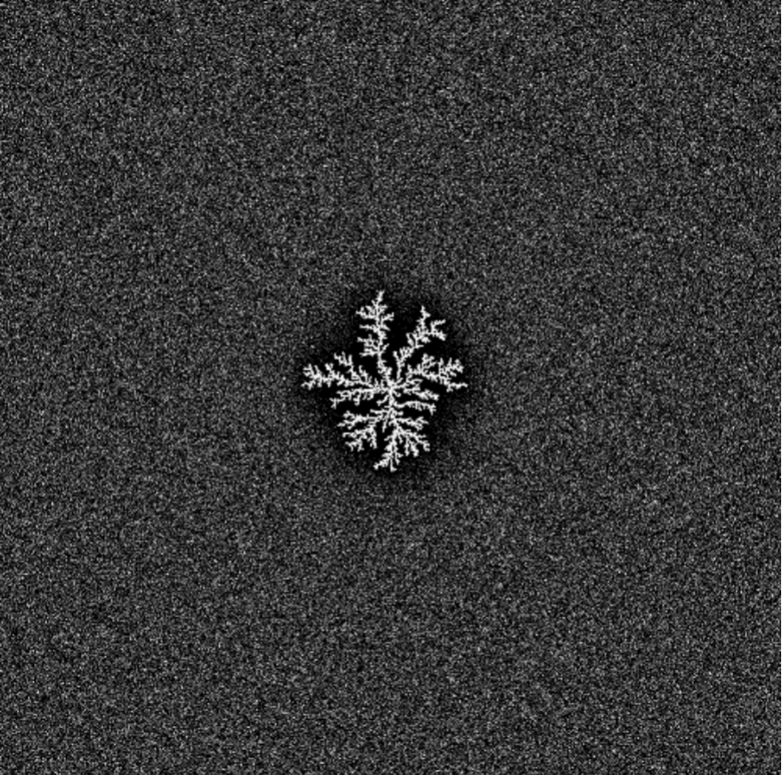

---
## Front matter
lang: ru-RU
title: Алгоритм решения задачи Рост дендритов
subtitle: Групповой проект. Этап 2
author:
  - Дворкина Е.В.,
  - Чемоданова А.А.,
  - Серёгина И.А.,
  - Волгин И.А.,
  - Александрова У.В.,
  - Голощапов Я.В.
institute:
  - Российский университет дружбы народов, Москва, Россия
date: 9 апреля 2025

## i18n babel
babel-lang: russian
babel-otherlangs: english

## Formatting pdf
toc: false
toc-title: Содержание
slide_level: 2
aspectratio: 169
section-titles: true
theme: metropolis
header-includes:
 - \metroset{progressbar=frametitle,sectionpage=progressbar,numbering=fraction}
---

## Cостав исследовательской группы

 - Александрова Ульяна Вадимовна
 - Волгин Иван Алексеевич
 - Голощапов Ярослав Вячеславович
 - Дворкина Ева Владимировна
 - Серёгина Ирина Андреевна
 - Чемоданова Ангелина Александровна

## Докладчик

:::::::::::::: {.columns align=center}
::: {.column width="70%"}

  * Волгин Иван Алексеевич
  * студент учебной группы НФИбд-01-22
  * Российский университет дружбы народов
  * <https://github.com/iavolgin>

:::
::: {.column width="30%"}

:::
::::::::::::::

##

:::::::::::::: {.columns align=center}
::: {.column width="70%"}

  * Чемоданова Ангелина Александровна 
  * студент учебной группы НФИбд-02-22
  * Российский университет дружбы народов
  * <https://github.com/aachemodanova>

:::
::: {.column width="30%"}

:::
::::::::::::::

## Цели и задачи 

- Описать алгоритм решения задачи моделирования роста дендритов

# Описание алгоритма

## Шаг 1: Задание начальных условий

:::::::::::::: {.columns align=center}
::: {.column width="60%"}

- Плотность $\rho$
- Удельная теплота плавления `L`
- Теплоемкость $cp$
- Коэффициент теплопроводности $\kappa$
- Температура плавления $T_m​$
- Коэффициент поверхностного натяжения $\gamma$
- Параметры `анизотропии` 

:::
::: {.column width="40%"}

:::
::::::::::::::

## Начальные условия:

- Исходная температура расплава $T_∞​$
- Безразмерное переохлаждение $S=Lcp​(T_m​−T_∞​)​$
- Граничные условия
- Условия теплообмена с окружающей средой 

## Шаг 2: Настройка симуляционной сетки и инициализация затравки

:::::::::::::: {.columns align=center}
::: {.column width="60%"}

- Размер сетки $N \times N$
- Пространственный шаг $h$

- Центральная область твердой фазы
- Параметры формы и размеров 

:::
::: {.column width="40%"}
  

:::
::::::::::::::

## Шаг 3: Расчет температурного поля

- Уравнение теплопроводности 

$$
\rho c_p \frac{\partial T}{\partial t} = \kappa \nabla^2 T \tag{1}
$$

- Метод конечных разностей
- Выбор временного шага $\Delta t$ и пространственного шага $h$ важен для стабильности и точности расчетов.

## Шаги расчета:

- Вычислить новое распределение температуры на каждом шаге времени t;
- Обновлять значения температуры в каждой точке сетки;
- Повторять вычисления до достижения стационарного состояния или заданного времени.

## Шаг 4: Моделирование роста дендритов

**Критерий затвердевания**: Когда температура в точке падает ниже температуры плавления $T_m$, вещество в точке начинает затвердевать. 

**Условие Стефана**:

$$
V = \frac{\kappa}{\rho L} (\nabla T|_s - \nabla T|_l) \tag{2}
$$

**Условие Гиббса-Томсона**: 

$$
T_b = T_m \left(1 - \frac{\gamma T_m}{\rho L^2 R}\right) \tag{3}
$$

## Определение фрактальной размерности

:::::::::::::: {.columns align=center}
::: {.column width="70%"}

$$
 N(r) \sim r^D \tag{4}
$$

где $N(r)$ — число точек внутри круга радиуса $r$.

- Выбрать множество точек, принадлежащих образованной структуре 
- Для разных значений $r$ подсчитать количество точек внутри круга
- Построить график $\log(N(r))$ от $\log(r)$
   
:::
::: {.column width="30%"}

:::
::::::::::::::

## Шаг 5: Анализ структуры дендритов

   - Морфологический анализ
   - Корреляционный анализ

## Исследование влияния теплового шума $\delta$

- Добавлять случайное возмущение к температуре $\eta_{i,j} \delta$, где $\eta_{i,j}$ — случайная величина из отрезка $[-1,1]$.
- Повторить моделирование для разных $\delta$
- Сравнить результаты

## Шаг 6: Визуализация процесса

Применение графических средств для иллюстраций этапов формирования дендритов 

:::::::::::::: {.columns align=center}
::: {.column width="30%"}

:::
::: {.column width="30%"}

:::
::: {.column width="30%"}

:::
::::::::::::::

## Выводы

Описали алгоритм моделирования роста дендритов, включающий все ключевые этапы.

