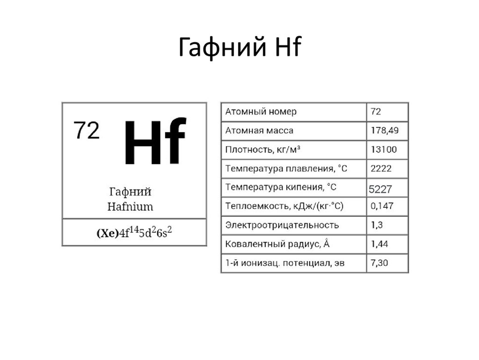
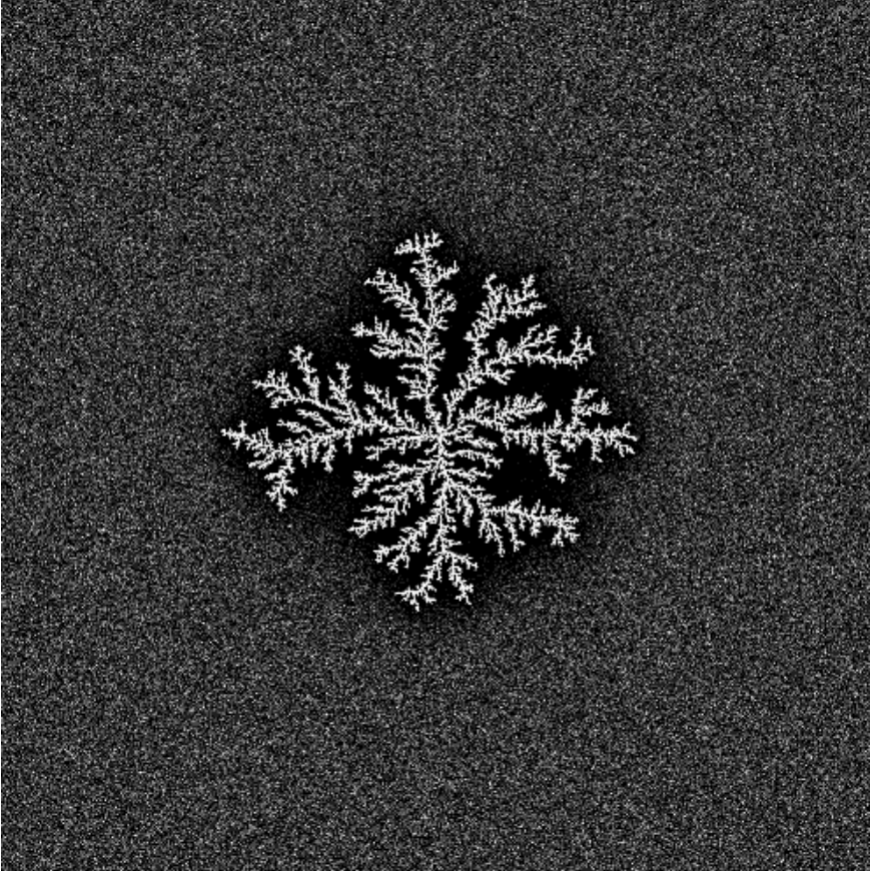

---
## Front matter
title: "Групповой проект. Этап 2"
subtitle: "Алгоритм решения задачи Рост дендритов"
author: 

 - Александрова Ульяна Вадимовна
 - Волгин Иван Алексеевич
 - Голощапов Ярослав Вячеславович
 - Дворкина Ева Владимировна
 - Серёгина Ирина Андреевна
 - Чемоданова Ангелина Александровна
 
institute: RUDN University, Moscow, Russian Federation

## Generic otions
lang: ru-RU
toc-title: "Содержание"

## Bibliography
bibliography: bib/cite.bib
csl: pandoc/csl/gost-r-7-0-5-2008-numeric.csl

## Pdf output format
toc: true # Table of contents
toc-depth: 2
lof: true # List of figures
lot: false # List of tables
fontsize: 12pt
linestretch: 1.5
papersize: a4
documentclass: scrreprt
## I18n polyglossia
polyglossia-lang:
  name: russian
  options:
	- spelling=modern
	- babelshorthands=true
polyglossia-otherlangs:
  name: english
## I18n babel
babel-lang: russian
babel-otherlangs: english
## Fonts
mainfont: IBM Plex Serif
romanfont: IBM Plex Serif
sansfont: IBM Plex Sans
monofont: IBM Plex Mono
matSont: STIX Two Math
mainfontoptions: Ligatures=Common,Ligatures=TeX,Scale=0.94
romanfontoptions: Ligatures=Common,Ligatures=TeX,Scale=0.94
sansfontoptions: Ligatures=Common,Ligatures=TeX,Scale=MatchLowercase,Scale=0.94
monofontoptions: Scale=MatchLowercase,Scale=0.94,FakeStretch=0.9
mathfontoptions:
## Biblatex
biblatex: true
biblio-style: "gost-numeric"
biblatexoptions:
  - parentracker=true
  - backend=biber
  - hyperref=auto
  - language=auto
  - autolang=other*
  - citestyle=gost-numeric
## Pandoc-crossref LaTeX customization
figureTitle: "Рис."
tableTitle: "Таблица"
listingTitle: "Листинг"
lofTitle: "Список иллюстраций"
lotTitle: "Список таблиц"
lolTitle: "Листинги"
## Misc options
indent: true
header-includes:
  - \usepackage{indentfirst}
  - \usepackage{float} # keep figures where there are in the text
  - \floatplacement{figure}{H} # keep figures where there are in the text
---

# Введение

На втором этапе группового проекта описывается алгоритм решения задачи моделирования кристаллизации. 

**Алгоритм** - систематизированная последовательность действий, необходимых для достижения поставленной цели. В контексте научных исследований алгоритмы важны не только для повышения эффективности вычислений, но и для обеспечения воспроизводимости результатов, что является фундаментальным требованием научного метода.

## Цели

Описать алгоритм решения задачи моделирования роста дендритов.

## Задачи

Описать алгоритм решения задачи моделирования роста дендритов. 

# Алгоритмы

## Шаг 1: Описание алгоритма

На первом этапе задается начальное состояние системы, которое включает в себя все необходимые физические параметры материала и граничные условия для симуляции. Особое внимание уделяется корректности задания исходных данных, так как от этого зависит достоверность всего процесса моделирования.

### Физические свойства вещества:

- Плотность $\rho$: Определяет массу единицы объема материала и влияет на тепловой баланс системы. Чем выше плотность, тем больше энергии требуется для нагрева (рис. [-@fig:001]).
- Удельная теплота плавления `L`: Характеризует энергию, необходимую для перехода вещества из твердой фазы в жидкую без изменения температуры.
- Теплоемкость $cp$: Показывает количество энергии, требуемое для нагрева единицы массы на один градус. Важна для расчета динамики изменения температуры.
- Коэффициент теплопроводности $\kappa$: отражает способность материала передавать тепловую энергию. Определяет скорость выравнивания температурных градиентов.
- Температура плавления $T_m​$: Критическая точка, при которой начинается фазовый переход.
- Коэффициент поверхностного натяжения $\gamma$: влияет на форму границы раздела фаз.
- Параметры `анизотропии`: определяют направление преимущественного роста [@phy:bash].

{#fig:001 width=80%}
    
### Начальные условия:

- Исходная температура расплава $T_∞​$: Задает степень переохлаждения системы. Определяет потенциал для начала кристаллизации.
- Безразмерное переохлаждение $S=Lcp​(T_m​−T_∞​)​$: Ключевой параметр, показывающий термодинамическую готовность системы к началу процесса.
- Граничные условия: задают поведение системы на границах расчетной области.
- Условия теплообмена с окружающей средой [@medvedev:bash]

## Шаг 2: Настройка симуляционной сетки

На втором шаге создается расчетная сетка для моделирования роста дендритов. Этап состоит из подготовки сетки и начальной конфигурации затравки кристаллизации.

### Создание симуляционной сетки:

- Размер сетки $N \times N$:
    Определяет детализацию моделирования — количество узлов по каждой стороне. Больше узлов дают точность, но требуют больше ресурсов.
- Пространственный шаг $h$:
    Расстояние между соседними узлами сетки. Меньший шаг повышает точность, но увеличивает вычислительные затраты.

### Инициализация затравки:

- Центральная область твердой фазы:
  Начальная твердая зона в центре сетки, откуда начинается рост дендритов. Её расположение влияет на симметрию процесса.
- Параметры формы и размеров:
  Форма (например, круглая или эллиптическая) и размер затравки задают начальные условия для роста и могут влиять на направление и скорость кристаллизации (рис. [-@fig:002]) [@wiki:bash].
  
{#fig:002 width=70%}

## Шаг 3: Расчет температурного поля

Третий шаг представляет собой моделирование распределения температуры в системе с течением времени. Оно является основой для анализа роста дендритов.

### Применение уравнения теплопроводности:

- Уравнение теплопроводности ([-@eq:eq:tem])

$$
\rho c_p \frac{\partial T}{\partial t} = \kappa \nabla^2 T
$${#eq:eq:tem}

Оно используется для моделирования изменений температуры, учитывает приток тепла в систему, а также его распределение.

### Численная реализация уравнения:

- Метод конечных разностей: аппроксимирует производные через дискретные значения;
- Выбор временного шага $\Delta t$ и пространственного шага $h$ важен для стабильности и точности расчетов.

### Шаги алгоритма:

- Вычислить новое распределение температуры на каждом шаге времени t;
- Обновлять значения температуры в каждой точке сетки;
- Повторять вычисления до достижения стационарного состояния или заданного времени.

## Шаг 4: Моделирование роста дендритов

На четвертом этапе реализуется моделирование роста дендритов, основываясь на рассчитанных температурных полях и соответствующих физических законах.

### Критерий затвердевания:

Определить температуру плавления $T$ когда температура в точке падает ниже $T_m$, она начинает затвердевать.

### Использование условия Стефана:

- Условие Стефана ([-@eq:eq:a]):

$$
V = \frac{\kappa}{\rho L} (\nabla T|_s - \nabla T|_l)
$${#eq:eq:a}

Оно определяет скорость роста границы кристаллизации $V$, что позволяет связать скорость роста и разницу градиентов температуры на границе фаз.
- Учитывая скорость $V$, обновляются положения границы кристаллизации, моделируя расширение твердой фазы.

### Применение условия Гиббса-Томсона:

- Условие Гиббса-Томсона ([-@eq:eq:b]): 

$$
T_b = T_m \left(1 - \frac{\gamma T_m}{\rho L^2 R}\right)
$${#eq:eq:b}

корректирует температуру плавления на границе кристалла. При этом учитываются влияние поверхностного натяжения и кривизна границы.

### Обновление параметров:

После каждого этапа роста дендритов температурное поле пересчитывается с учетом теплоты, поглощенной или выделившейся за счет фазового перехода. 

### Определение фрактальной размерности

Фрактальная размерность $D$ описывает степень заполнения пространства структурой.
Для расчета можно использовать метод корреляционной функции или масштабирования ([-@eq:eq:c]):

$$
 N(r) \sim r^D
$${#eq:eq:c}

где $N(r)$ — число точек внутри круга радиуса $r$.

Необходимо:

   - Выбрать множество точек, принадлежащих образованной структуре 
   - Для разных значений $r$ подсчитать количество точек внутри круга радиуса.
   - Построить график $\log(N(r))$ от $\log(r)$ и найти наклон прямой — это будет фрактальная размерность $D$ (рис. [-@fig:003]) [@nano:bash].

{#fig:003 width=80%}

## Шаг 5: Анализ структуры дендритов

На данном этапе анализируются сформированные дендритные структуры. Их свойства оцениваются и сравниваются с теоретическими и экспериментальными данными.

### Морфологический анализ:

- Предполагает анализ формы и размеров дендрита, позволяя определить механизмы их роста, а также влияющие на это процессы.
- Метод измерения фрактальной размерности дает количественную оценку сложности структуры дендритов.
- Спектральный анализ исследует пространственные частоты структуры, выявляя повторяющиеся паттерны и масштаб особенностей дендритов. Это помогает оценить регулярность ветвления и общую организацию формы.

### Корреляционный анализ:

Оценивает связь между параметрами (например, температурой и скоростью роста), чтобы количественно определить, как условия моделирования влияют на морфологию дендритов.

### Исследование влияния теплового шума $\delta$

Сначала добавим тепловой шум:

- На каждый шаг добавлять случайное возмущение к температуре $\eta_{i,j} \delta$, где $\eta_{i,j}$ — случайная величина из отрезка $[-1,1]$.

 Так как тепловой шум может влиять на скорость распространения фронта затвердевания и форму дендритов, следует повторить моделирование для разных значений $\delta$ и сравнить результаты, а именно оценить, как тепловой шум влияет на:
 
- Форму дендритов.
- Скорость затвердевания.
- Фрактальную размерность образованных структур.

## Шаг 6: Визуализация процесса

Шестой этап алгоритма представляет собой визуализацию роста дендритов.

### Визуализация роста дендритов:

1. Применение графических средств для генерации изображений и анимации, иллюстрирующих этапы формирования дендритов и их окончательную конфигурацию (рис. [-@fig:004]) [@gif:bash].

![Симуляция роста дендрита[@chem:bash]](image/8.png){#fig:004 width=80%}

2. Визуальное представление данных играет ключевую роль в интерпретации результатов и обеспечивает понимание моделируемого процесса (рис. [-@fig:005]), (рис. [-@fig:006]), (рис. [-@fig:007]).

{#fig:005 width=40%}

{#fig:006 width=40%}

{#fig:007 width=40%}

# Вывод

Во втором этапе группового проекта был описан процесс создания алгоритма для моделирования роста дендритов, включающий все ключевые этапы: от задания начальных параметров и настройки расчетной сетки до моделирования процесса роста и детального анализа полученных структур. 

Использование алгоритмов позволяет решать задачи более эффективно и точно, каждый этап вносит важный вклад в формирование целостного понимания исследуемого явления.

# Список литературы{.unnumbered}

::: {#refs}
:::
