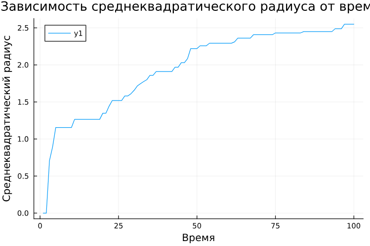

---
## Front matter
lang: ru-RU
title: Групповой проект. Этап 3
subtitle: Описание программной реализации.
author:
  - Дворкина Е.В.
  - Чемоданова А.А.
  - Серёгина И.А.
  - Волгин И.А.
  - Александрова У.В.
  - Голощапов Я.В.
institute:
  - Российский университет дружбы народов, Москва, Россия
date: 07 мая 2025

## i18n babel
babel-lang: russian
babel-otherlangs: english

## Formatting pdf
toc: false
toc-title: Содержание
slide_level: 2
aspectratio: 169
section-titles: true
theme: metropolis
header-includes:
 - \metroset{progressbar=frametitle,sectionpage=progressbar,numbering=fraction}
---

# Информация

## Докладчик

:::::::::::::: {.columns align=center}
::: {.column width="70%"}

  * Серёгина Ирина Андреевна
  * Студентка учебной группы НФИбд-01-22
  * Российский университет дружбы народов
  * <https://github.com/irinaseregina>

:::
::: {.column width="30%"}


:::
::::::::::::::

# Вводная часть

## Цели третьего этапа

- Написать программу, моделирующую теплопроводность.
- Добавить в модель процесс затвердевания.
- Исследовать, как со временем изменяются количество частиц в агрегате и его среднеквадратичный радиус в различных режимах.
- Определить фрактальную размерность полученных структур
- Проанализировать, как величина теплового шума влияет на морфологию формирующихся агрегатов.

# Выполнение задач третьего этапа

## Задание базовых параметров моделирования

```Julia
N = 150          # Размер сетки (N x N)
T_initial = -1 # Начальная температура в центральной точке
steps = 200     # Количество временных шагов
dt = 1          # Шаг по времени
h = 1           # Расстояние между узлами
kappa = 0.1         # Коэффициент теплопроводности
w = 0.5         # Коэффициент для диагональных соседей
T_m = 0         # Температура плавления
lambda = 0.01         # Капиллярный радиус
delta = 0.02        # Величина флуктуаций температуры
```

## Инициализация сетки

```Julia
T = zeros(N, N)            # Матрица температур
n = zeros(Int, N, N)       # Матрица состояний (0 - жидкое, 1 - твердое)
T[N÷2+1, N÷2+1] = T_initial  # Установка начальной температуры в центральной точке
n[N÷2+1, N÷2+1] = 1
```

## Базовые функции

:::::::::::::: {.columns align=center}
::: {.column width="55%"}

  - Метод полиномиальной аппроксимации
  - Среднее значение температуры
  - Кривизна границы
  - Количества затвердевших частиц 
  - Среднеквадратичный радиус 
  
:::
::: {.column width="45%"}


:::
::::::::::::::

## Базовые функции

:::::::::::::: {.columns align=center}
::: {.column width="55%"}

  - Метод полиномиальной аппроксимации
  - Среднее значение температуры
  - Кривизна границы
  - Количества затвердевших частиц 
  - Среднеквадратичный радиус 
  
:::
::: {.column width="45%"}


:::
::::::::::::::

## Базовые функции

:::::::::::::: {.columns align=center}
::: {.column width="55%"}

  - Метод полиномиальной аппроксимации
  - Среднее значение температуры
  - Кривизна границы
  - Количества затвердевших частиц 
  - Среднеквадратичный радиус 
  
:::
::: {.column width="45%"}


:::
::::::::::::::

## Модель теплопроводности

:::::::::::::: {.columns align=center}
::: {.column width="30%"}


  
:::
::: {.column width="70%"}

Функция `simulate_heat_conduction` на основе уравнения обновления температуры:


:::
::::::::::::::

## Добавление процесса затвердевания

:::::::::::::: {.columns align=center}
::: {.column width="50%"}

Реализована функция `simulate_solidification`, которая выполняет следующие шаги:

1. Обновление температур
2. Проверка условия затвердевания
3. Обновление состояний
  
:::
::: {.column width="50%"}


:::
::::::::::::::


## Результаты моделирования. Исследование влияния капиллярного радиуса


## Динамика роста агрегата

:::::::::::::: {.columns align=center}
::: {.column width="50%"}


  
:::
::: {.column width="50%"}



:::
::::::::::::::

## Фрактальная размерность

:::::::::::::: {.columns align=center}
::: {.column width="40%"}


  
:::
::: {.column width="60%"}

Фрактальную размерность $D$ можно определить через логарифмическую регрессию:

$$ 
D = \frac{\log N(r)}{\log r} 
\tag{}
$$

где:

- $N(r)$ - количество частиц внутри радиуса $r$
- $D$ - искомая фрактальная размерность

Реализована функция `fractal_dimension`

:::
::::::::::::::

## Влияние теплового шума

:::::::::::::: {.columns align=center}
::: {.column width="33%"}


:::
::: {.column width="33%"}


:::
::: {.column width="33%"}


:::
::::::::::::::

## Выводы

1. Смоделирован процесс теплопроводности.
2. Исследовано влияние начального переохлаждения и капиллярного радиуса на форму дендритов.
3. Проанализирована динамика роста агрегата и его фрактальная размерность.
4. Изучено влияние теплового шума на морфологию агрегатов.

Результаты показывают, что:

- Тепловой шум значительно влияет на структуру дендритов, увеличивая их нерегулярность и скорость роста.
