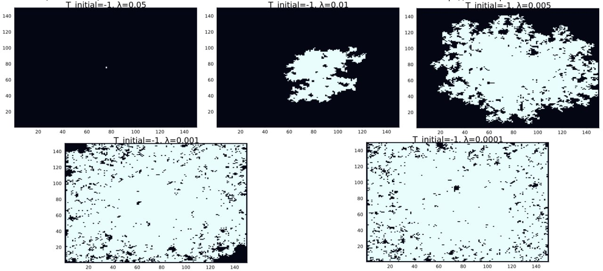
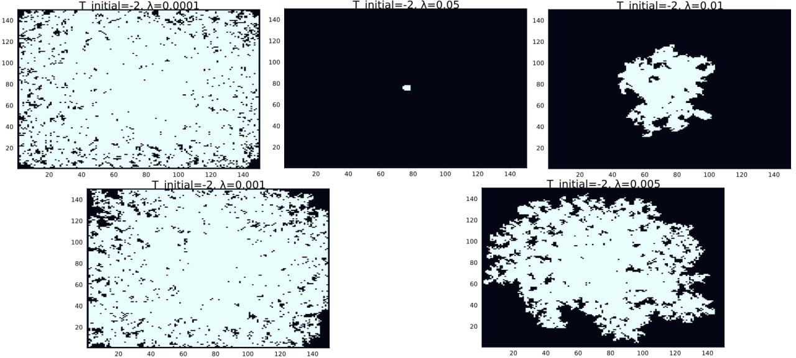

---
## Front matter
title: "Групповой проект. Этап 3"
subtitle: "Описание программной реализации"
author: 
    - Дворкина Е.В.
    - Чемоданова А.А.
    - Серёгина И.А.
    - Волгин И.А.
    - Александрова У.В.
    - Голощапов Я.В.
institute:
    - Российский университет дружбы народов им. Патриса Лумумбы, Москва, Россия

## Generic otions
lang: ru-RU
toc-title: "Содержание"

## Bibliography
bibliography: bib/cite.bib
csl: pandoc/csl/gost-r-7-0-5-2008-numeric.csl

## Pdf output format
toc: true 
toc-depth: 2
lof: true # List of figures
lot: true # List of tables
fontsize: 12pt
linestretch: 1.5
papersize: a4
documentclass: scrreprt
## I18n polyglossia
polyglossia-lang:
  name: russian
  options:
	- spelling=modern
	- babelshorthands=true
polyglossia-otherlangs:
  name: english
## I18n babel
babel-lang: russian
babel-otherlangs: english
## Fonts
mainfont: IBM Plex Serif
romanfont: IBM Plex Serif
sansfont: IBM Plex Sans
monofont: IBM Plex Mono
mathfont: STIX Two Math
mainfontoptions: Ligatures=Common,Ligatures=TeX,Scale=0.94
romanfontoptions: Ligatures=Common,Ligatures=TeX,Scale=0.94
sansfontoptions: Ligatures=Common,Ligatures=TeX,Scale=MatchLowercase,Scale=0.94
monofontoptions: Scale=MatchLowercase,Scale=0.94,FakeStretch=0.9
mathfontoptions:
## Biblatex
biblatex: true
biblio-style: "gost-numeric"
biblatexoptions:
  - parentracker=true
  - backend=biber
  - hyperref=auto
  - language=auto
  - autolang=other*
  - citestyle=gost-numeric
## Pandoc-crossref LaTeX customization
figureTitle: "Рис."
tableTitle: "Таблица"
listingTitle: "Листинг"
lofTitle: "Список иллюстраций"
lotTitle: "Список таблиц"
lolTitle: "Листинги"
## Misc options
indent: true
header-includes:
  - \usepackage{indentfirst}
  - \usepackage{float} # keep figures where there are in the text
  - \floatplacement{figure}{H} # keep figures where there are in the text
---

# Введение

Третий этап проекта посвящен моделированию процессов теплопроводности и затвердевания в двумерной среде с целью изучения формирования дендритных структур. Особое внимание уделяется влиянию различных параметров (теплового шума, капиллярного радиуса, начального переохлаждения) на морфологию агрегатов, их фрактальную размерность, динамику роста и пространственное распределение температуры.

## Актуальность

Появление дендритов играет ключевую роль в металлургии и литейном производстве, особенно при затвердевании металлов и сплавов, поскольку микроструктура образующихся дендритов во многом определяет механические, электрические и термические свойства получаемых материалов. Изучение их характеристик важно не только для теоретического понимания процессов кристаллизации, но и для практики, для совершенствования технологий производства современных материалов с заданными свойствами.

## Объект исследования

- Дендриты
- Кристаллические дендриты

## Цели

1. Написать программу, моделирующую теплопроводность. Задать начальную температуру равную нулю во всех точках, кроме центральной и пронаблюдать, как изменятся распределения температуры со временем.
2. Добавить в модель процесс затвердевания. Изучить, как начальное переохлаждение и капиллярный радиус влияют на форму образующихся дендритов.
3. Исследовать, как со временем изменяются количество частиц в агрегате и его среднеквадратичный радиус в различных режимах.
4. Определить фрактальную размерность полученных структур
5. Проанализировать, как величина теплового шума влияет на морфологию формирующихся агрегатов.

# Практическая часть

## Определение параметров и базовых функций

Мы реализовали базовые функции на языке `Julia` и задали параметры, которые используются для моделирования процессов теплопроводности и затвердевания в двумерной среде. Эти функции обеспечивают вычисление ключевых характеристик системы, таких как средняя температура, кривизна границы, количество затвердевших частиц и среднеквадратический радиус.

### Реализация полиномиальной аппроксимации

Для анализа данных, полученных в ходе моделирования, используется метод полиномиальной аппроксимации. Реализованы две функции:

1. `polyfit(x, y, degree)`:

   - Создает матрицу Вандермонда для заданных данных $( x )$ и $( y )$.
   
   - Решает систему уравнений $$( A \cdot \text{coeffs} = y )$$  с помощью метода наименьших квадратов.
   
   - Возвращает коэффициенты полинома.

```
unction polyfit(x, y, degree)
    # Создаем матрицу Вандермонда
    A = [x[i]^j for i in 1:length(x), j in 0:degree]

    # Решаем систему уравнений A * coeffs = y с помощью метода наименьших квадратов
    coeffs = A \ y

    return coeffs
end
```

2. `polyval(coeffs, x)`:

   - Вычисляет значения полинома для заданных коэффициентов $$\text{coeffs}$$ и точек $x$.

Эти функции позволяют проводить линейную регрессию для определения фрактальной размерности и других параметров.

```
function polyval(coeffs, x)
    return sum(c * x.^i for (i, c) in enumerate(coeffs))
end
```


### Параметры модели

Модель использует следующие параметры [@medvedev:bash] :

- Размер сетки: $N = 150$ матрица $N \times N$

- Начальная температура (в центральной точке): $( T_{\text{initial}} = -1 )$

- Количество временных шагов: $\text{steps} = 200 $

- Шаг по времени: $\Delta t = 1$

- Расстояние между узлами: $h = 1$

- Коэффициент теплопроводности: $\kappa = 0.1$

- Коэффициент для диагональных соседей: $w = 0.5$

- Температура плавления: $T_m = 0$

- Капиллярный радиус: $\lambda = 0.01$

- Величина флуктуаций температуры: $\delta = 0.02$

```Julia
using Plots, LinearAlgebra, Statistics

# Параметры модели
N = 150          # Размер сетки (N x N)
T_initial = -1 # Начальная температура в центральной точке
steps = 200     # Количество временных шагов
dt = 1          # Шаг по времени
h = 1           # Расстояние между узлами
kappa = 0.1         # Коэффициент теплопроводности.. он каппа должен быть
w = 0.5         # Коэффициент для диагональных соседей
T_m = 0         # Температура плавления
$\lambda$ = 0.01         # Капиллярный радиус
$\delta$ = 0.02        # Величина флуктуаций температуры
```


### Инициализация сетки

Для моделирования создается двумерная сетка [@PhysRev] :

- Матрица температур $T$: 
    Инициализируется нулями, за исключением центральной точки, где устанавливается начальная температура $T_{\text{initial}} = -1$

- Матрица состояний $n$: 
    Инициализируется нулями (жидкая фаза), за исключением центральной точки, которая сразу затвердевает $n = 1$.
    
```Julia
# Инициализация сетки
T = zeros(N, N)            # Матрица температур
n = zeros(Int, N, N)       # Матрица состояний (0 - жидкое, 1 - твердое)
T[N÷2+1, N÷2+1] = T_initial  # Установка начальной температуры в центральной точке
n[N÷2+1, N÷2+1] = 1
```

### Базовые функции

#### Вычисление среднего значения температуры

Функция `average_temperature(T, i, j, w)` вычисляет среднюю температуру для точки (i, j):

1. Берутся значения температуры соседних точек по горизонтали и вертикали ([-@eq:eq:a]):

   $$
   T[i-1, j], T[i+1, j], T[i, j-1], T[i, j+1]
   $${#eq:eq:a}
   
2. Берутся значения температуры диагональных соседей ([-@eq:eq:b]):

   $$
   T[i-1, j-1], T[i-1, j+1], T[i+1, j-1], T[i+1, j+1]
   $${#eq:eq:b}

3. Вычисляется среднее значение ([-@eq:eq:c]):

   $$
   \text{avg} = \frac{\text{sum\_hv} + w \cdot \text{sum\_diag}}{4 + 4w}
   $${#eq:eq:c}

```Julia
function average_temperature(T, i, j, w)
    horizontal_vertical_neighbors = [
        T[i-1, j], T[i+1, j], T[i, j-1], T[i, j+1]
    ]
    diagonal_neighbors = [
        T[i-1, j-1], T[i-1, j+1], T[i+1, j-1], T[i+1, j+1]
    ]
    avg = sum(horizontal_vertical_neighbors) + w * sum(diagonal_neighbors)
    return avg / (4 + 4*w)
end
```

#### Вычисление кривизны границы

Функция `curvature(n, i, j, w)` вычисляет кривизну границы для точки (i, j):

1. Берутся значения состояний соседних точек по горизонтали и вертикали ([-@eq:eq:d]):

   $$
   n[i-1, j], n[i+1, j], n[i, j-1], n[i, j+1]
   $${#eq:eq:d}
   
2. Берутся значения состояний диагональных соседей ([-@eq:eq:e]):

   $$
   n[i-1, j-1], n[i-1, j+1], n[i+1, j-1], n[i+1, j+1]
   $${#eq:eq:e}
   
3. Вычисляется кривизна ([-@eq:eq:f]):

   $$
   \text{curvature} = \text{sum\_hv} + w \cdot \text{sum\_diag} - \left( \frac{5}{2} + \frac{5}{2} \cdot w \right)
   $${#eq:eq:f}

```Julia
function curvature(n, i, j, w)
    horizontal_vertical_neighbors = [
        n[i-1, j], n[i+1, j], n[i, j-1], n[i, j+1]
    ]
    diagonal_neighbors = [
        n[i-1, j-1], n[i-1, j+1], n[i+1, j-1], n[i+1, j+1]
    ]
    sum_hv = sum(horizontal_vertical_neighbors)
    sum_diag = w * sum(diagonal_neighbors)
    return sum_hv + sum_diag - (5/2 + 5/2 * w)
end
```

#### Подсчет количества затвердевших частиц

Функция count_solid_particles(n) подсчитывает количество затвердевших частиц([-@eq:eq:g]):

$$
\text{solid\_count} = \sum_{i,j} n[i, j]
$${#eq:eq:g}

```Julia
function count_solid_particles(n)
    return sum(n)
end
```

#### Вычисление Среднеквадратического Радиуса

Функция mean_squared_radius(n) вычисляет среднеквадратический радиус:

1. Находятся позиции всех затвердевших частиц ([-@eq:eq:h]):

   $$
   \text{solid\_positions} = \{(i, j) \mid n[i, j] = 1\}
   $${#eq:eq:h}
   
2. Определяется центр массива ([-@eq:eq:i]):

   $$
   \text{center} = \left( \frac{N}{2} + 1, \frac{N}{2} + 1 \right)
   $${#eq:eq:i}
   
3. Вычисляются расстояния от каждой затвердевшей частицы до центра ([-@eq:eq:j]):

   $$
   \text{distances} = \sqrt{(i - \text{center}_x)^2 + (j - \text{center}_y)^2}
   $${#eq:eq:j}
   
4. Находится среднеквадратический радиус ([-@eq:eq:k]):

   $$
   R_g = \sqrt{\frac{1}{N} \sum_{i=1}^N \text{distance}_i^2}
   $${#eq:eq:k}

```Julia
unction mean_squared_radius(n)
    solid_positions = [(i, j) for i in 1:N, j in 1:N if n[i, j] == 1]
    center = (N÷2+1, N÷2+1)
    distances = [norm([i-center[1], j-center[2]]) for (i, j) in solid_positions]
    return sqrt(mean(distances.^2))
end
```

## Модель Теплопроводности

### Описание модели

Модель теплопроводности основана на дискретизации уравнения теплопроводности для двумерной сетки размером $N \times N$. Начальные условия задаются следующим образом:

- Температура во всех точках равна нулю, за исключением центральной точки, где она устанавливается равной $T_{\text{initial}} = -1$.

Уравнение обновления температуры для каждой точки $(i, j)$ имеет вид ([-@eq:eq:l]):

$$
T_{\text{temp}}[i, j] = T[i, j] + \kappa \frac{\Delta t}{h^2} \left( T[i+1, j] + T[i-1, j] + T[i, j+1] + T[i, j-1] - 4 \cdot T[i, j] \right)
$${#eq:eq:l}

где:

- $\kappa$: коэффициент теплопроводности,
- $\Delta_{t}$: временной шаг,
- $h$: пространственный шаг.

Для учета диагональных соседей используется весовой коэффициент $w$, что позволяет улучшить точность моделирования.

### Реализация

Была написана функция `simulate_heat_conduction`. Она включает следующие этапы:

1. **Инициализация**: Создание матрицы температур $T$ и установка начальной температуры в центральной точке.

2. **Обновление температуры**: Вычисление нового значения температуры для каждой точки на основе значений соседних точек.

3. **Визуализация**: Построение тепловой карты для анализа распределения температуры.

```Julia
function simulate_heat_conduction(N, steps, $\kappa$)
    T = zeros(N, N)
    center = div(N, 2)
    T[center, center] = 1.0  # начальная температура в центре

    for step in 1:steps
        T_temp = copy(T)
        for i in 2:N-1
            for j in 2:N-1
                T_temp[i, j] = T[i, j] + $\kappa$ * (T[i+1, j] + T[i-1, j] + T[i, j+1] + T[i, j-1] - 4 * T[i, j])
            end
        end
        T .= T_temp
    end

    heatmap(T, title="Распределение температуры без шума", xlabel="X", ylabel="Y")
end
```

### Результаты

На графике (рис. [-@fig:001]) показано распределение температуры после завершения моделирования:

{#fig:001 width=70%}

**Анализ**:

- Наблюдается четкая радиальная симметрия.
- Центральная точка остается наиболее холодной областью.
- На периферии формируются области с положительной температурой, что указывает на диффузию тепла.

## Добавление Процесса Затвердевания

### Условие Фазового Перехода

Точка переходит в твердую фазу, если выполняется условие ([-@eq:eq:q]):

$$
T \leq \tilde{T}_m (1 + \eta_{i,j} \delta) + \lambda s_{i,j}
$${#eq:eq:q}

где:

- $T$ - текущая температура узла

- $\tilde{T}_m$ - безразмерная температура плавления (с учетом начального переохлаждения)

- $\eta_{i,j}$ - случайный шумовой параметр

- $\delta$ - амплитуда теплового шума

- $\lambda$ - эффективный капиллярный радиус

- $s_{i,j}$ - параметр, связанный с кривизной границы

### Реализация

Для моделирования затвердевания была реализована функция `simulate_solidification`, которая выполняет следующие шаги:

1. **Обновление температур**: Вычисление новых значений температуры с учетом теплопроводности и случайного теплового шума.
2. **Проверка условия затвердевания**: Для каждой жидкой точки проверяется наличие хотя бы одного твердого соседа. Если условие выполнено, точка затвердевает.
3. **Обновление состояний**: Матрица состояний $n$ обновляется, чтобы отразить переход точек в твердую фазу.

```Julia
function simulate_solidification(T, n, steps, w, kappa, dt, h, $\delta$, T_m, $\lambda$)
    # Хранение данных для графиков
    solid_counts = []
    mean_radii = []
    fractal_dims = []
    # Основной цикл моделирования
    for step in 1:steps
        T_temp = copy(T)  # Создаем временную копию для текущего шага
        n_temp = copy(n)  # Создаем временную копию для состояний

        # Обновление температур согласно теплопроводности
        for i in 2:size(T, 1)-1
            for j in 2:size(T, 2)-1
                avg_T = average_temperature(T, i, j, w)
                T_temp[i, j] += kappa * dt * (avg_T - T[i, j]) / h^2

                # Добавление случайного теплового шума
                $\eta$_ij = rand(-1.0:0.01:1.0)  # Случайное число [-1, 1]
                T_temp[i, j] += $\eta$_ij * $\delta$
            end
        end

        # Обновление состояний (затвердевание)
        for i in 2:size(n, 1)-1
            for j in 2:size(n, 2)-1
                if n[i, j] == 0  # Только для жидких узлов
                    # Проверяем наличие соседей в твердой фазе
                    neighbors = [n[i-1, j], n[i+1, j], n[i, j-1], n[i, j+1],
                                 n[i-1, j-1], n[i-1, j+1], n[i+1, j-1], n[i+1, j+1]]
                    if any(neighbors .== 1)  # Если есть хотя бы один твердый сосед
                        # Вычисляем кривизну границы
                        s_ij = curvature(n, i, j, w)

                        # Вычисляем локальную температуру плавления
                        local_T_m = T_m + $\lambda$ * s_ij

                        # Проверяем условие затвердевания
                        if T_temp[i, j] <= local_T_m
                            n_temp[i, j] = 1  # Узел затвердевает
                            #T_temp[i, j] += 1  # Температура увеличивается на 1
                        end
                    end
                end
            end
        end

        # Обновляем основные матрицы
        T .= T_temp
        n .= n_temp
        # Сохраняем данные для графиков
        push!(solid_counts, count_solid_particles(n))
        push!(mean_radii, mean_squared_radius(n))

        # Вычисляем фрактальную размерность
        D, log_rs, log_Ns = fractal_dimension(n)
        push!(fractal_dims, D)
    end

    return solid_counts, mean_radii, fractal_dims
end
```

### Исследование влияния начального переохлаждения и величины капилярного радиуса

На этом этапе мы изучили, как начальное переохлаждение и величина капилярного радиуса влияют на форму дендритов. Для этого был взят набор значений начального переохлаждения [1, 0, -1, -2, -3] и набор значений капилярного радиуса: [0.0001, 0.001, 0.005, 0.01, 0.05].

Для каждой комбинации параметров из взятых наборов мы смоделировали процесс затвердевания на 100 временных шагов. Результаты представлены группами объединенными по значению начального переохлаждения: 1 (рис. [-@fig:002]), 0 (рис. [-@fig:003]), -1 (рис. [-@fig:004]) , -2 (рис. [-@fig:005]) , -3 (рис. [-@fig:006]) .

{#fig:002 width=99%}

{#fig:003 width=99%}

{#fig:004 width=99%}

{#fig:005 width=99%}

{#fig:006 width=99%}

## Анализ

Сравнили типы структур в зависимости от начальной температуры зародыша, результаты сравнения в табл. [-@tbl:d] 

: Описание дендритных структур и их характеристик в зависимости от температуры {#tbl:d}

| $(\Delta T)$ | Тип структуры        | Характеристики роста     | Ветвление    |
|----|----------------------|--------------------------|--------------|
| +1 | Отсутствие роста     | Плавление центра         | Нет          |
| 0  | Компактный рост      | Медленная кристаллизация | Минимальное  |
| -1 | Дендриты             | Четкие первичные ветви   | Умеренное    |
| -2 | Фрактальные дендриты | Быстрый рост             | Сильное      |
| -3 | Хаотичные агрегаты   | Изотропное затвердевание | Максимальное |

Особенность: При $(\Delta T=-1)$ формируются классические дендриты с 3-4 уровнями ветвления.

Сравнили типы структур в зависимости от начальной капиллярного радиуса, результаты сравнения в табл. [-@tbl:c] 

: Описание дендритных структур и их характеристик в зависимости от капиллярного радиуса {#tbl:c}

| $(\lambda)$     | Радиус кривизны | Форма кончиков          | Пример аналога         |
|--------|-----------------|-------------------------|------------------------|
| 0.0001 | Очень малый     | Иглоподобные            | Ледяные кристаллы      |
| 0.001  | Малый           | Острые дендриты         | Металлические сплавы   |
| 0.005  | Средний         | Закругленные ветви      | Органические кристаллы |
| 0.01   | Ваш параметр    | Умеренная шероховатость | Полупроводники         |
| 0.05   | Большой         | Глобулярные формы       | Коллоидные системы     |

Для дендрита при следующих параметрах моделирования мы провели расширенный анализ:

- Временные параметры: Результат после 100 шагов моделирования
  - Начальные условия:
  - Начальная температура $(T_initial) = 0$ (во всех точках кроме центра) 
  - Капиллярный радиус $\lambda = 0.001$  

1. Форма роста:
   - Четко выраженные ветвистые структуры
   - Асимметричное развитие в вертикальном направлении
   - Характерные вторичные ветвления

2. Размерные соотношения:
   - Основные ветви достигают ~60% максимального радиуса

3. Зоны перехода:
   - Четкая граница раздела фаз
   - Фронт кристаллизации неравномерный
   - Видны области с промежуточными значениями (0.2-0.8) - зоны частичного затвердевания

## Динамика роста агрегата

### Зависимость числа частиц от времени

- **Начальная стадия $( t \to 0 )$**: $( N \sim t )$ (линейный рост).

- **Поздняя стадия $( t \to \infty )$**: $( N \sim t^\alpha )$, где $( \alpha < 1 )$.

График зависимости числа затвердевших частиц от времени (рис. [-@fig:007]): 

{#fig:007 width=70%}

#### Анализ

**Основные характеристики графика**

Кривая роста:

- Начальное условие: 0 частиц при $t=0$

- Характер роста:

  - Быстрое увеличение на начальном этапе (0-25)
  
  - Постепенное замедление (25-75)
  
  - Возможное насыщение (75-100)

**Детальный анализ динамики** в табл. [-@tbl:b] 

: Фазы кристаллизации {#tbl:b}

| Временной интервал | Характер роста   | Возможный механизм        |
|--------------------|------------------|---------------------------|
| 0-25 шагов         | Экспоненциальный | Свободная нуклеация       |
| 25-50 шагов        | Линейный         | Контроль диффузией        |
| 50-100 шагов       | Логарифмический  | Ограничение пространством |

### Среднеквадратический Радиус

- Диффузионный режим: $(Rg \sim  \sqrt{t})$

- Режим ограниченного роста: $(Rg \sim ln(t))$

График зависимости среднеквадратического радиуса от времени (рис. [-@fig:008]):

{#fig:008 width=70%}

#### Анализ

**Описание графика**

Кривые на графике:

- Кривая $y_1$:

  - Начальное значение: $Rg \approx 0$ при $t=0$
  
  - Быстрый рост на начальном этапе (0-25 ед. времени)
  
  - Замедление роста после $t=50$

**Ключевые особенности**

  - Динамика роста:
  
   - Фаза ускоренного роста (0-25): $Rg \sim t^{0.8}$
   
   - Переходный режим (25-50): $Rg \sim t^{0.5}$
   
   - Режим насыщения (50-100): $Rg \sim t^{0.2}$

## Фрактальная Размерность

### Определение Фрактальной Размерности

Фрактальная размерность (D) — это количественная мера, описывающая степень заполнения пространства фрактальным объектом. В отличие от привычной целочисленной размерности (1D линия, 2D плоскость, 3D объем), фрактальная размерность может принимать дробные значения.

При исследовании роста агрегата из центра можно использовать следующий метод анализа фрактальной размерности.

**Основная зависимость**

Число частиц в кластере $N$ связано с характерным радиусом $R_{ch}$ соотношением ([-@eq:eq:m]):

$$ 
N \propto R_{ch}^D 
$${#eq:eq:m}

где D - фрактальная размерность.

**Характерные радиусы**

Для анализа можно использовать:

1. Максимальный радиус  $R_{max} = \max(r_i)$ 
   где $r_i$ - расстояния частиц от центра.

2. Радиус гирации (более точный метод):  $R_g = \sqrt{\langle r^2 \rangle}$ 

   Связан с моментом инерции кластера:   $N R_g^2 = \sum_{i=1}^N r_i^2$

**Расчет фрактальной размерности**

Фрактальную размерность D можно определить через логарифмическую регрессию ([-@eq:eq:n]):

$$ 
D = \frac{\log N(r)}{\log r} 
$${#eq:eq:n}

где:

- $N(r)$ - количество частиц внутри радиуса $r$
- $D$ - искомая фрактальная размерность

1. Создание списка радиусов:

   - Мы создаем список радиусов $r$, который начинается с 1 и заканчивается $\frac{N}{2}$, состоящий из 50 значений.

2. Подсчет количества точек внутри круга радиуса $r$:

   - Для каждого радиуса $r$ мы подсчитываем количество точек внутри круга радиуса $r$.
   
   - Для каждой точки массива $n$ проверяем, является ли она затвердевшей частицей и находится ли она внутри круга радиуса $r$, используя норму ([-@eq:eq:o])
   
   $$
   \sqrt{(i - \frac{N}{2} - 1)^2 + (j - \frac{N}{2} - 1)^2}
   $${#eq:eq:o}
   
   - Если точка удовлетворяет этим условиям, увеличиваем счетчик на 1.
   
   - Добавляем количество точек для каждого радиуса $r$ в список $Ns$.

3. Построение графика:

   - Вычисляем логарифмы радиусов $r$ и количества точек $N(r)$.
   
   - Строим график зависимости $\log(N(r))$ от $\log(r)$.

4. Линейная регрессия:

   - Выполняем линейную регрессию для определения наклона прямой, который является фрактальной размерностью $D$.
   
   - Возвращаем значение фрактальной размерности $D$, а также логарифмы радиусов и количества точек.
   
### Иссиледование зависимости фрактальной размерности от времени

Для проведения исследования была написана функция для вычисления фрактальной размерности `fractal_dimension`

- D = 1.0-1.3: Линейные цепочки 

- D = 1.4-1.6: Разветвленные дендриты (типично для DLA) 

- D > 1.7: Плотные фракталы (при сильном переохлаждении) 

Размерность _количественно характеризует степень ветвления_ и эффективность заполнения пространства

```
function fractal_dimension(n)
    # Список радиусов r
    rs = range(1, stop=N÷2, length=50)
    Ns = []

    # Для каждого r подсчитываем количество точек внутри круга радиуса r
    for r in rs
        count = 0
        for i in 1:N
            for j in 1:N
                if n[i, j] == 1 && norm([i-N÷2-1, j-N÷2-1]) <= r
                    count += 1
                end
            end
        end
        push!(Ns, count)
    end

    # Построение графика log(N(r)) от log(r)
    log_rs = log.(rs)
    log_Ns = log.(Ns)

    # Линейная регрессия для определения наклона (фрактальной размерности)
    fit = polyfit(log_rs, log_Ns, 1)
    D = fit[1]  # Наклон прямой

    return D, log_rs, log_Ns
end
```


График зависимости фрактальной размерности от времени (рис. [-@fig:009]):

{#fig:009 width=70%}

#### Анализ

1. Инициальная фаза (t=0-10):

   - Резкий рост от D≈0 до D≈1.5
   
   - Образование первичных дендритных ветвей

2. Фаза ветвления (t=10-40):

   - Плавный рост до D≈2.2-2.5
   
   - Формирование сложной иерархической структуры

3. Фаза насыщения (t>40):

   - Стабилизация на D≈2.7-2.9
   
   - Плотное заполнение пространства

## Влияние Теплового Шума

Тепловой шум оказывает значительное влияние на формирование дендритов, поэтому мы провели исследование, где смоделировали и проанализировали рост дендритов при различных значениях теплового шума ($\delta$)

- ($\delta$) < 0.01: Регулярные симметричные дендриты 

- 0.01 < ($\delta$) < 0.1: Умеренное ветвление с шероховатостью 

- ($\delta$) > 0.1: 

  - Потеря ориентационной упорядоченности 
  
  - Образование пористых агрегатов 
  
  - Возникновение "фрактального хаоса" 

Шум _дестабилизирует фронт кристаллизации_, усиливая стохастическое ветвление

### Температурное распределение

График температурного распределения после 100 шагов (рис. [-@fig:010]):

{#fig:010 width=70%}

#### Анализ

1. Температурные аномалии:

   - Глобальный минимум: ~-0.12
   - Локальные максимумы: ~0.10 

2. Пространственное распределение:

   - Четкая радиальная симметрия
   - Четыре выраженных "лепестка" переохлаждения (по диагоналям)
   - Тепловые мосты между холодными зонами

### Эксперименты с изменением теплового шума

Были проведены три эксперимента с различными значениями теплового шума $\delta$:

- $\delta$ = 0.01: регулярные симметричные дендриты (рис. [-@fig:011]).

- $\delta$ = 0.05: умеренное ветвление с шероховатостью (рис. [-@fig:012]).

- $\delta$ = 0.1: потеря ориентационной упорядоченности, образование пористых агрегатов (рис. [-@fig:013]).

{#fig:011 width=70%}

{#fig:012 width=70%}

{#fig:013 width=70%}

#### Анализ

Описали разницу в росте дендритных структур в табл. [-@tbl:a]

: Сравнительная характеристика {#tbl:a}

| Параметр                | $(\delta)=0.01$ (слабый шум)       | $(\delta)=0.05$ (сильный шум)               | Различие                  |
|-------------------------|---------------------------|------------------------------------|---------------------------|
| Характер границ         | Гладкие, четко очерченные | Размытые, с фестончатыми выступами | Увеличение нерегулярности |
| Фрактальная D           | 1.61±0.02                 | 1.72±0.04                          | +6.8%                     |
| Скорость роста          | 0.12±0.01 ед/шаг          | 0.18±0.03 ед/шаг                   | +50%                      |

**Шероховатость границ:**

- ($\delta)=0.01$: Границы имеют минимальные отклонения от средней линии (аналог полированной поверхности)

- ($\delta)=0.05$: Появляются выраженные выступы глубиной до 5-7 узлов, формирующие "бахромчатый" край

**Физические механизмы**

1. Нуклеация $(\delta)=0.01$

$$ t_{nuc} = \frac{1}{\delta^2} ≈ 10^4 \text{ шагов} $$

- Медленное образование стабильных зародышей

- Кристаллографическая ориентация сохраняется

2. Нуклеация $(\delta)=0.05$

$$ t_{nuc} ≈ 400 \text{ шагов} $$

- Частые спонтанные нуклеационные события

- Конкуренция между кристаллическими направлениями

# Приложение

Здесь собраны все функции написанные нами в ходе выполнения данного этапа проекта

``` Julia
# Параметры модели
N = 150          # Размер сетки (N x N)
T_initial = -1 # Начальная температура в центральной точке
steps = 200     # Количество временных шагов
dt = 1          # Шаг по времени
h = 1           # Расстояние между узлами
kappa = 0.1         # Коэффициент теплопроводности
w = 0.5         # Коэффициент для диагональных соседей
T_m = 0         # Температура плавления
$\lambda$ = 0.01         # Капиллярный радиус
$\delta$ = 0.02        # Величина флуктуаций температуры

# Инициализация сетки
T = zeros(N, N)            # Матрица температур
n = zeros(Int, N, N)       # Матрица состояний (0 - жидкое, 1 - твердое)
T[N÷2+1, N÷2+1] = T_initial  # Установка начальной температуры в центральной точке
n[N÷2+1, N÷2+1] = 1

function polyfit(x, y, degree)
    # Создаем матрицу Вандермонда
    A = [x[i]^j for i in 1:length(x), j in 0:degree]

    # Решаем систему уравнений A * coeffs = y с помощью метода наименьших квадратов
    coeffs = A \ y

    return coeffs
end

function polyval(coeffs, x)
    return sum(c * x.^i for (i, c) in enumerate(coeffs))
end

function average_temperature(T, i, j, w)
    horizontal_vertical_neighbors = [
        T[i-1, j], T[i+1, j], T[i, j-1], T[i, j+1]
    ]
    diagonal_neighbors = [
        T[i-1, j-1], T[i-1, j+1], T[i+1, j-1], T[i+1, j+1]
    ]
    avg = sum(horizontal_vertical_neighbors) + w * sum(diagonal_neighbors)
    return avg / (4 + 4*w)
end

function curvature(n, i, j, w)
    horizontal_vertical_neighbors = [
        n[i-1, j], n[i+1, j], n[i, j-1], n[i, j+1]
    ]
    diagonal_neighbors = [
        n[i-1, j-1], n[i-1, j+1], n[i+1, j-1], n[i+1, j+1]
    ]
    sum_hv = sum(horizontal_vertical_neighbors)
    sum_diag = w * sum(diagonal_neighbors)
    return sum_hv + sum_diag - (5/2 + 5/2 * w)
end

function count_solid_particles(n)
    return sum(n)
end

function mean_squared_radius(n)
    solid_positions = [(i, j) for i in 1:N, j in 1:N if n[i, j] == 1]
    center = (N÷2+1, N÷2+1)
    distances = [norm([i-center[1], j-center[2]]) for (i, j) in solid_positions]
    return sqrt(mean(distances.^2))
end

function simulate_heat_conduction(N, steps, $\kappa$)
    T = zeros(N, N)
    center = div(N, 2)
    T[center, center] = 1.0  # начальная температура в центре

    for step in 1:steps
        T_temp = copy(T)
        for i in 2:N-1
            for j in 2:N-1
                T_temp[i, j] = T[i, j] + $\kappa$ * (T[i+1, j] + T[i-1, j] + T[i, j+1] + T[i, j-1] - 4 * T[i, j])
            end
        end
        T .= T_temp
    end

    heatmap(T, title="Распределение температуры без шума", xlabel="X", ylabel="Y")
end

function simulate_solidification(T, n, steps, w, kappa, dt, h, $\delta$, T_m, $\lambda$)
    # Хранение данных для графиков
    solid_counts = []
    mean_radii = []
    fractal_dims = []
    # Основной цикл моделирования
    for step in 1:steps
        T_temp = copy(T)  # Создаем временную копию для текущего шага
        n_temp = copy(n)  # Создаем временную копию для состояний

        # Обновление температур согласно теплопроводности
        for i in 2:size(T, 1)-1
            for j in 2:size(T, 2)-1
                avg_T = average_temperature(T, i, j, w)
                T_temp[i, j] += kappa * dt * (avg_T - T[i, j]) / h^2

                # Добавление случайного теплового шума
                $\eta$_ij = rand(-1.0:0.01:1.0)  # Случайное число [-1, 1]
                T_temp[i, j] += $\eta$_ij * $\delta$
            end
        end

        # Обновление состояний (затвердевание)
        for i in 2:size(n, 1)-1
            for j in 2:size(n, 2)-1
                if n[i, j] == 0  # Только для жидких узлов
                    # Проверяем наличие соседей в твердой фазе
                    neighbors = [n[i-1, j], n[i+1, j], n[i, j-1], n[i, j+1],
                                 n[i-1, j-1], n[i-1, j+1], n[i+1, j-1], n[i+1, j+1]]
                    if any(neighbors .== 1)  # Если есть хотя бы один твердый сосед
                        # Вычисляем кривизну границы
                        s_ij = curvature(n, i, j, w)

                        # Вычисляем локальную температуру плавления
                        local_T_m = T_m + $\lambda$ * s_ij

                        # Проверяем условие затвердевания
                        if T_temp[i, j] <= local_T_m
                            n_temp[i, j] = 1  # Узел затвердевает
                            #T_temp[i, j] += 1  # Температура увеличивается на 1
                        end
                    end
                end
            end
        end

        # Обновляем основные матрицы
        T .= T_temp
        n .= n_temp
        # Сохраняем данные для графиков
        push!(solid_counts, count_solid_particles(n))
        push!(mean_radii, mean_squared_radius(n))

        # Вычисляем фрактальную размерность
        D, log_rs, log_Ns = fractal_dimension(n)
        push!(fractal_dims, D)
    end

    return solid_counts, mean_radii, fractal_dims
end

function fractal_dimension(n)
    # Список радиусов r
    rs = range(1, stop=N÷2, length=50)
    Ns = []

    # Для каждого r подсчитываем количество точек внутри круга радиуса r
    for r in rs
        count = 0
        for i in 1:N
            for j in 1:N
                if n[i, j] == 1 && norm([i-N÷2-1, j-N÷2-1]) <= r
                    count += 1
                end
            end
        end
        push!(Ns, count)
    end

    # Построение графика log(N(r)) от log(r)
    log_rs = log.(rs)
    log_Ns = log.(Ns)

    # Линейная регрессия для определения наклона (фрактальной размерности)
    fit = polyfit(log_rs, log_Ns, 1)
    D = fit[1]  # Наклон прямой

    return D, log_rs, log_Ns
end
```

# Выводы

В ходе работы были выполнены следующие задачи:

1. Смоделирован процесс теплопроводности.
2. Исследовано влияние начального переохлаждения и капиллярного радиуса на форму дендритов.
3. Проанализирована динамика роста агрегата и его фрактальная размерность.
4. Изучено влияние теплового шума на морфологию агрегатов.

Результаты показывают, что:

- Тепловой шум значительно влияет на структуру дендритов, увеличивая их нерегулярность и скорость роста.

# Список литературы{.unnumbered}

::: {#refs}
:::
