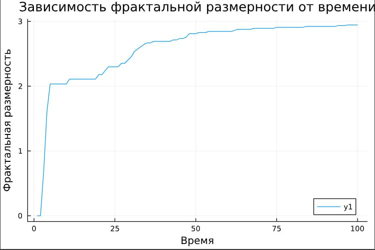
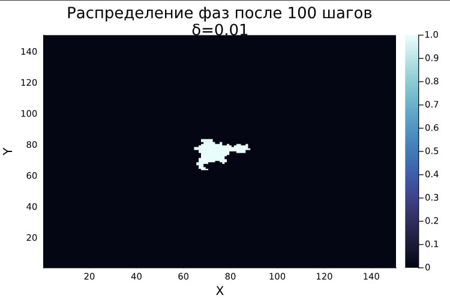

---
## Front matter
lang: ru-RU
title: Групповой проект. Этап 4
subtitle: Результаты проекта. Самооценка деятельности
author:
 - Александрова Ульяна Вадимовна
 - Волгин Иван Алексеевич
 - Голощапов Ярослав Вячеславович
 - Дворкина Ева Владимировна
 - Серёгина Ирина Андреевна
 - Чемоданова Ангелина Александровна
 
institute: RUDN University, Moscow, Russian Federation        

## i18n babel
babel-lang: russian
babel-otherlangs: english

## Formatting pdf
toc: false
toc-title: Содержание
slide_level: 2
aspectratio: 169
section-titles: true
theme: metropolis
header-includes:
 - \metroset{progressbar=frametitle,sectionpage=progressbar,numbering=fraction}
---

# Информация

## Докладчик

:::::::::::::: {.columns align=center}
::: {.column width="70%"}

  * Серегина Ирина Сергеевна
  * студентка 3-го курса учебной группы НФИбд-01-22
  * Российский университет дружбы народов
  * <https://github.com/irinaseregina>

:::
::: {.column width="30%"}


:::
::::::::::::::

## Докладчик

:::::::::::::: {.columns align=center}
::: {.column width="70%"}

  * Волгин Иван Алексеевич
  * студент 3-го курса учебной группы НФИбд-01-22
  * Российский университет дружбы народов
  * <https://github.com/VolginIA>

:::
::: {.column width="30%"}


:::
::::::::::::::

# Введение

## Актуальность

Появление дендритов играет ключевую роль в металлургии и в литейном производстве, особенно при затвердевании металлов и сплавов.

## Объект и предмет исследования: 

- Дендриты

- Кристаллические дендриты

## Цель: 

- Исследовать модель роста дендритов.

- Описать алгоритм решения задачи моделирования роста дендритов.

- Реализовать модель роста дендритов и проанализировать результаты.


## Задачи

:::::::::::::: {.columns align=center}
::: {.column width="70%"}

- Рассмотреть модель роста дендритов.

- Рассмотреть алгоритм построения модели.

- Описать основные этапы алгоритма.

- Написать программу для моделирования.

- Проанализировать результаты.

:::
::: {.column width="30%"}


:::
::::::::::::::

# Теоретическое описание задачи. 

## Основные понятия и уравнения

### Образование дендритов

$$
S = c_p \frac{(T_m - T_\infty)}{L}\tag{1}
$$

### Уравнение теплопроводности

$$
\rho c_p \frac{\partial T}{\partial t} = \kappa \nabla^2 T \equiv \kappa \left( \frac{\partial^2 T}{\partial x^2} + \frac{\partial^2 T}{\partial y^2} \right)\tag{2}
$$

## 

### Условие Стефана

$$
\mathbf{n} \cdot \mathbf{V} = \frac{\kappa}{\rho L} (\mathbf{n} \cdot \nabla T|_s - \mathbf{n} \cdot \nabla T|_l)\tag{3}
$$

### Условие Гиббса-Томсона  

$$
T_b = T_m \left(1 - \frac{\gamma T_m}{\rho L^2 R}\right)\tag{4}
$$

## Безразмерная температура и уравнение теплопроводности

Вводится безразмерная температура $\widetilde{T} = c_p (T - T_\infty)/L$, где $T_\infty$  — начальная температура расплава. Уравнение теплопроводности для $\widetilde{T}$ имеет вид

$$
\frac{\partial \widetilde{T}}{\partial t} = \chi \nabla^2 \widetilde{T},\tag{5}
$$

где $\chi = \kappa / \rho c_p$ — коэффициент температуропроводности.

# Описание модели

## Изменение температуры

Новое значение температуры после шага $m$ вычисляется по формуле

$$
\hat{T}_{i,j} = T_{i,j} + \frac{\chi \Delta t \nabla^2 T}{m}.\tag{6}
$$


### Рост дендрита 

$$
T \leq \tilde{T}_m (1 + \eta_{i,j} \delta) + \lambda s_{i,j},\tag{7}
$$

### Учет кривизны границы 

Кривизна границы $1/R$ приближенно вычисляется по соседям узла:

$$
1/R \approx s_{i,j} = \sum_{1} n_{i,j} + w_n \sum_{2} n_{i,j} - \left( \frac{5}{2} + \frac{5}{2} w_n \right),\tag{8}
$$

## Описание алгоритма

:::::::::::::: {.columns align=center}
::: {.column width="40%"}


:::
::: {.column width="50%"}

### Шаг 1: Задание параметров

### Шаг 2: Настройка симуляционной сетки

### Шаг 3: Расчет температурного поля

* Применение уравнения теплопроводности,
* Численная реализация уравнения

:::
::::::::::::::

## Описание алгоритма 

:::::::::::::: {.columns align=center}
::: {.column width="60%"}


:::
::: {.column width="40%"}

### Шаг 4: Моделирование роста дендритов 

Реализуется моделирование роста дендритов, основываясь на рассчитанных температурных полях и соответствующих физических законах.

:::
::::::::::::::

## Определение фрактальной размерности

$$
N(r) \sim r^D\tag{9}
$$

где $N(r)$ — число точек внутри круга радиуса $r$.

{width=50%}


# Практическая часть

## Задание базовых параметров модели

```Julia
using Plots, LinearAlgebra, Statistics

# Параметры модели
N = 150          # Размер сетки (N x N)
T_initial = -1 # Начальная температура в центральной точке
steps = 200     # Количество временных шагов
dt = 1          # Шаг по времени
h = 1           # Расстояние между узлами
kappa = 0.1         # Коэффициент теплопроводности
w = 0.5         # Коэффициент для диагональных соседей
T_m = 0         # Температура плавления
$\lambda$ = 0.01         # Капиллярный радиус
$\delta$ = 0.02        # Величина флуктуаций температуры
```

## Инициализация сетки
    
```Julia
# Инициализация сетки
T = zeros(N, N)            # Матрица температур
n = zeros(Int, N, N)       # Матрица состояний (0 - жидкое, 1 - твердое)
T[N÷2+1, N÷2+1] = T_initial  # Установка начальной температуры в центральной точке
n[N÷2+1, N÷2+1] = 1
```

## Базовые функции

:::::::::::::: {.columns align=center}
::: {.column width="55%"}

  - Метод полиномиальной аппроксимации
  - Среднее значение температуры
  - Кривизна границы
  - Количества затвердевших частиц 
  - Среднеквадратичный радиус 
  
:::
::: {.column width="45%"}


:::
::::::::::::::


## Модель теплопроводности

:::::::::::::: {.columns align=center}
::: {.column width="30%"}


  
:::
::: {.column width="70%"}

Функция `simulate_heat_conduction` на основе уравнения обновления температуры:


:::
::::::::::::::

## Добавление процесса затвердевания

:::::::::::::: {.columns align=center}
::: {.column width="50%"}

Реализована функция `simulate_solidification`, которая выполняет следующие шаги:

1. Обновление температур
2. Проверка условия затвердевания
3. Обновление состояний
  
:::
::: {.column width="50%"}


:::
::::::::::::::

## Результаты моделирования. Исследование влияния капиллярного радиуса


## Динамика роста агрегата

:::::::::::::: {.columns align=center}
::: {.column width="50%"}


  
:::
::: {.column width="50%"}


:::
::::::::::::::

## Фрактальная размерность

:::::::::::::: {.columns align=center}
::: {.column width="40%"}


  
:::
::: {.column width="60%"}

Фрактальную размерность $D$ можно определить через логарифмическую регрессию:

$$ 
D = \frac{\log N(r)}{\log r} 
\tag{10}
$$

где:

- $N(r)$ - количество частиц внутри радиуса $r$
- $D$ - искомая фрактальная размерность

Реализована функция `fractal_dimension`

:::
::::::::::::::

## Влияние теплового шума

:::::::::::::: {.columns align=center}
::: {.column width="33%"}



:::
::: {.column width="33%"}


:::
::: {.column width="33%"}


:::
::::::::::::::

# Выводы

Во время выполнения группового проекта мы:

- сделали теоретическое описание модели роста дендритов и определили задачи дальнейшего исследования,

- описали процесс создания алгоритма для моделирования роста дендритов, включающий все ключевые этапы

- смоделировали процесс теплопроводности.

- исследовали влияние начального переохлаждения и капиллярного радиуса на форму дендритов,

- проанализировали динамика роста агрегата и его фрактальная размерность,

- изучили влияние теплового шума на морфологию агрегатов.

