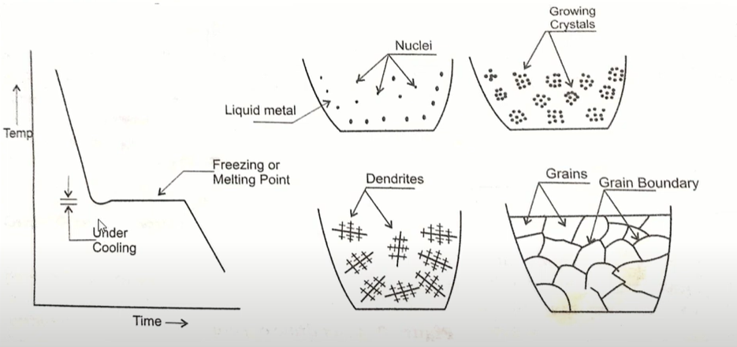
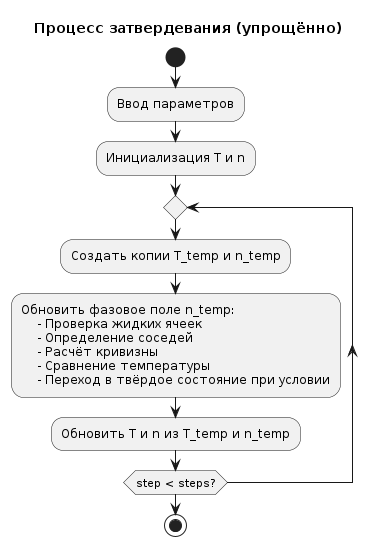
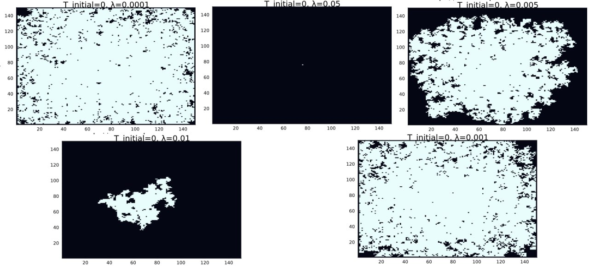
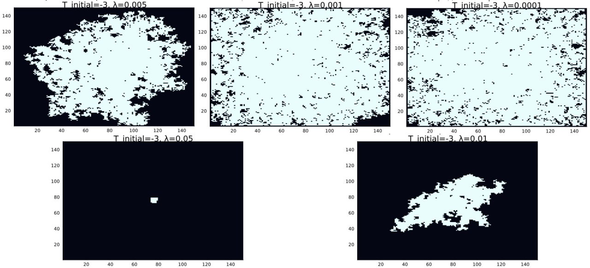
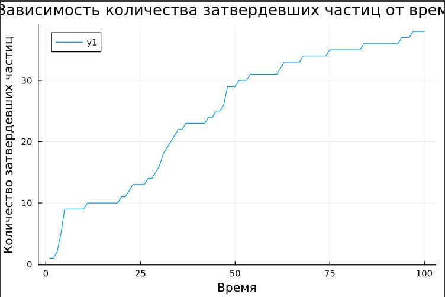
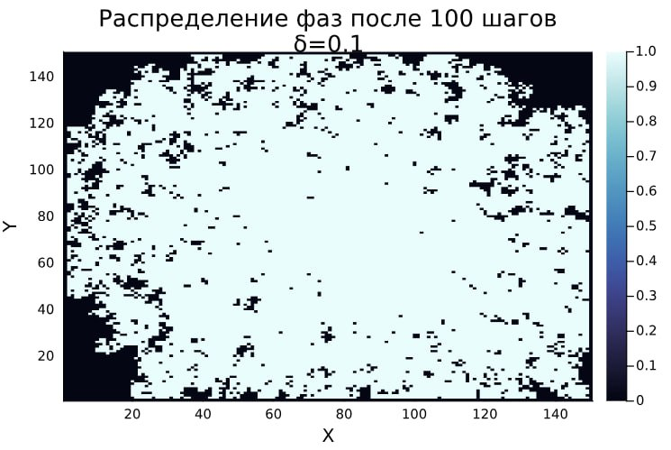

---
## Front matter
title: "Групповой проект. Этап 4"
subtitle: "Результаты проекта. Самооценка деятельности"
author:

 - Александрова Ульяна Вадимовна
 - Волгин Иван Алексеевич
 - Голощапов Ярослав Вячеславович
 - Дворкина Ева Владимировна
 - Серёгина Ирина Андреевна
 - Чемоданова Ангелина Александровна
 
institute: RUDN University, Moscow, Russian Federation        

## Generic otions
lang: ru-RU
toc-title: "Содержание"

## Bibliography
bibliography: bib/cite.bib
csl: pandoc/csl/gost-r-7-0-5-2008-numeric.csl

## Pdf output format
toc: true # Table of contents
toc-depth: 2
lof: true # List of figures
lot: true # List of tables
fontsize: 12pt
linestretch: 1.5
papersize: a4
documentclass: scrreprt
## I18n polyglossia
polyglossia-lang:
  name: russian
  options:
	- spelling=modern
	- babelshorthands=true
polyglossia-otherlangs:
  name: english
## I18n babel
babel-lang: russian
babel-otherlangs: english
## Fonts
mainfont: IBM Plex Serif
romanfont: IBM Plex Serif
sansfont: IBM Plex Sans
monofont: IBM Plex Mono
mathfont: STIX Two Math
mainfontoptions: Ligatures=Common,Ligatures=TeX,Scale=0.94
romanfontoptions: Ligatures=Common,Ligatures=TeX,Scale=0.94
sansfontoptions: Ligatures=Common,Ligatures=TeX,Scale=MatchLowercase,Scale=0.94
monofontoptions: Scale=MatchLowercase,Scale=0.94,FakeStretch=0.9
mathfontoptions:
## Biblatex
biblatex: true
biblio-style: "gost-numeric"
biblatexoptions:
  - parentracker=true
  - backend=biber
  - hyperref=auto
  - language=auto
  - autolang=other*
  - citestyle=gost-numeric
## Pandoc-crossref LaTeX customization
figureTitle: "Рис."
tableTitle: "Таблица"
listingTitle: "Листинг"
lofTitle: "Список иллюстраций"
lotTitle: "Список таблиц"
lolTitle: "Листинги"
## Misc options
indent: true
header-includes:
  - \usepackage{indentfirst}
  - \usepackage{float} # keep figures where there are in the text
  - \floatplacement{figure}{H} # keep figures where there are in the text
---
# Введение

## Актуальность

Появление дендритов (рис. [-@fig:001]) играет ключевую роль в металлургии и в литейном производстве, особенно при затвердевании металлов и сплавов, так как микроструктура образующихся дендритов во многом определяет механические, электрические и тепловые свойства полученных материалов. Изучение их характеристик важно не только для теоретического понимания процессов кристаллизации, но и для практики, для улучшения технологий производства современных материалов с заданными свойствами. 
Таким образом, научная проблема заключается в разработке теоретических и численных моделей, способных точно предсказывать динамику роста дендритов и их влияние на микроструктуру сформированных материалов. 


{#fig:001 width=70%}


## Объект и предмет исследования

- Дендриты

- Кристаллические дендриты

## Цель 

- Исследовать модель роста дендритов.

- Описать алгоритм решения задачи моделирования роста дендритов.

- Реализовать модель роста дендритов и проанализировать результаты.

## Задачи

- Рассмотреть комбинированную модель роста дендритов.

- Рассмотреть алгоритм построения модели роста дендритов.

- Описать основные этапы алгоритма

- Написать программу, моделирующую теплопроводность. Задать начальную температуру равную нулю во всех точках, кроме центральной и пронаблюдать, как изменятся распределения температуры со временем.

- Добавить в модель процесс затвердевания. Изучить, как начальное переохлаждение и капиллярный радиус влияют на форму образующихся дендритов.

- Исследовать, как со временем изменяются количество частиц в агрегате и его среднеквадратичный радиус в различных режимах.

- Определить фрактальную размерность полученных структур

- Проанализировать, как величина теплового шума влияет на морфологию формирующихся агрегатов.

# Теоретическое описание задачи. 

## Определения

Дендрит - это кристалл, который развивается с типичной многоветвящейся формой, напоминающей фрактал [@wiki:bash].  В металлах образуются в процессе кристаллизации из переохлажденного расплава.

Анизотропия кристалла — это зависимость физических свойств кристалла от направления роста. То есть кристаллическая структура не симметрична, и существует несколько осей, вдоль которых у кристалла проявляются различные свойства (механические, электрические, оптические) [@rtu:bash].

Анизотропия является естественным следствием кристаллического строения, так как на различных кристаллографических плоскостях и вдоль различных направлений плотность атомов различна.

Далее будем рассматривать образование кристаллической структуры из переохлажденного расплава [@ngu:bash]. 

## Основные понятия и уравнения

### Образование дендритов

Образование дендритов начинается с некоторого зародышеобразования, т. е. первого появления твердого роста в переохлажденной жидкости. Это образование сначала будет расти сферически, пока эта форма не перестанет быть устойчивой. Нестабильность формы имеет две причины: анизотропию поверхностной энергии границы твердого тела и жидкости и кинетику прикрепления частиц к кристаллографическим плоскостям при их образовании.

Необходимо задать физические свойства вещества:

- плотность $\rho$,
- удельная теплота плавления на единицу массы $L$, 
- теплоемкость при постоянном давлении $c_p$ (также на единицу массы),
- коэффициент теплопроводности $\kappa$ (для простоты будем считать теплопроводность и плотность не зависящими от температуры и одинаковыми для твердой и жидкой фаз – так называемая симметричная модель),
- температура плавления $T_m$.

Пусть начальная температура расплава меньше температуры плавления (т.е. он переохлажденный) $T_{\infty}<T_m$.  

В контексте кристаллизации из переохлажденного расплава (рис. [-@fig:002]), безразмерное переохлаждение S вводится для нормализации и упрощения математических моделей процесса. Этот параметр характеризует степень переохлаждения расплава относительно его температуры плавления, что критично для инициации и скорости кристаллизации. Оно рассчитывается по формуле ([-@eq:eq:cool]).

$$
S = c_p \frac{(T_m - T_\infty)}{L}
$${#eq:eq:cool}

{#fig:002 width=70%}

Адиабатические условия предполагают отсутствие теплообмена с окружающей средой, что означает сохранение тепловой энергии внутри системы. В таких условиях, при $S \geq 1$, весь расплав затвердевает, поскольку имеется достаточная разность температур для обеспечения процесса кристаллизации. При $S < 1$ затвердевает только часть расплава, этот случай мы и будем рассматривать.

Также ограничимся двумерным случаем. Для описания изменения температуры со временем в двумерном случае используется уравнение теплопроводности ([-@eq:eq:tem])

$$
\rho c_p \frac{\partial T}{\partial t} = \kappa \nabla^2 T \equiv \kappa \left( \frac{\partial^2 T}{\partial x^2} + \frac{\partial^2 T}{\partial y^2} \right)
$${#eq:eq:tem}

### Скорость роста дендритов

Далее найдем скорость движения границы кристаллизации перпендикулярно самой себе, обозначим эту скорость $V$. За время  $\Delta t$ на участке площади $s$ затвердевает масса вещества, равная $\Delta m = \rho s V \Delta t$ [@ngu:bash].

При кристаллизации выделяется теплота плавления $\Delta Q = \Delta m L$. Закон сохранения энергии требует, чтобы все выделившееся тепло было отведено за счет теплопроводности, суммарный поток тепла на границе $\mathbf{q} = -\kappa (\nabla T|_l - \nabla T|_s)$

Здесь  \( \nabla T|_l \) и \( \nabla T|_s \) — градиенты температуры в жидкой и твердой фазах соответственно. Ориентация дендрита задается внешним градиентом температуры. Градиент температуры \( \nabla T \) — вектор, компоненты которого в двумерном случае равны $(\partial T / \partial x, \partial T / \partial y)$.

Индексы $l$ и $s$ относятся к жидкой и твердой фазам.

Для сохранения энергии должно выполняться условие $q s \Delta t = \Delta Q$. Подставляя выражения для $q$ и $\Delta Q$, получаем ([-@eq:eq:a])

$$
\kappa (\nabla T|_l - \nabla T|_s) s \Delta t = \rho s V \Delta t L
$${#eq:eq:a}

Сокращая общие множители $s$, $\Delta t $ и учитывая, что $\mathbf{n} \cdot (\nabla T)$ — проекция градиента температуры на нормаль к границе, можно записать скалярное уравнение ([-@eq:eq:b])

$$
\kappa (\mathbf{n} \cdot \nabla T|_l - \mathbf{n} \cdot \nabla T|_s) = \rho V L
$${#eq:eq:b}

Перестроив выражение, получаем условие Стефана ([-@eq:eq:c])

$$
\mathbf{n} \cdot \mathbf{V} = \frac{\kappa}{\rho L} (\mathbf{n} \cdot \nabla T|_s - \mathbf{n} \cdot \nabla T|_l)
$${#eq:eq:c}

Это уравнение описывает связь между скоростью движения границы кристаллизации и градиентами температуры. В нем $\mathbf{n}$ - вектор единичной длины, перпендикулярный границе (вектор нормали).

### Задача Стефана и неустойчивость Муллинса-Секерки 

Для определения изменения положения и формы границы затвердевания со временем необходимо задать температуру на границе $T_b$. Простейший вариант — принять $T_b = T_m$. В этом случае внутри твердой области температура будет постоянной, а такая проблема известна как **задача Стефана**.

Однако граница затвердевания в этом случае неустойчива. Рассмотрим плоскую границу, движущуюся с некоторой скоростью. Если на ней возникает небольшой выступ, градиент температуры перед выступом увеличивается, что приводит к ускорению его роста. Это приводит к дальнейшему увеличению градиента и ускорению выступа, что характеризует **неустойчивость Муллинса-Секерки**. Эта ситуация аналогична диффузионно-ограниченной агрегации.

В реальных процессах затвердевания таких неустойчивостей не наблюдается, что указывает на наличие механизмов, ограничивающих рост выступов. Эти механизмы могут быть связаны с поверхностным натяжением и кинетическими ограничениями.

### Условие Гиббса-Томсона  

Первый механизм связан с поверхностным натяжением. Атомы на поверхности имеют меньшее число соседей,  находящихся в той же фазе, что приводит к повышению их потенциальной энергии. Дополнительная потенциальная энергия пропорциональна площади поверхности: $\Delta E_p = \gamma s$, где $\gamma$ — коэффициент поверхностного натяжения.

Рост выступов увеличивает площадь поверхности, что энергетически невыгодно. Следовательно, температура границы на выступах должна быть ниже температуры плавления, чтобы компенсировать эту энергию. Это описывается **условием Гиббса-Томсона** ([-@eq:eq:m])

$$
T_b = T_m \left(1 - \frac{\gamma T_m}{\rho L^2 R}\right).
$${#eq:eq:m}

Здесь $R$ — радиус кривизны границы в данной точке (для плоской поверхности $R = \infty$). Вводится капиллярный радиус $d_0 = \gamma T_m c_p / (\rho L^2)$, размер образующейся структуры пропорционален ему.

### Кинетическое замедление роста выступов  

Второй механизм связан с кинетическими ограничениями. Присоединение атомов к твердой поверхности не происходит мгновенно, требуя некоторого времени, в течение которого движущиеся участки границы могут переохладиться. Это влияет на температуру границы ([-@eq:eq:d])

$$
\Delta T_b = -T_m / \beta V.
$${#eq:eq:d}

Здесь $\beta$ — кинетический коэффициент.

### Безразмерная температура и уравнение теплопроводности

Вводится безразмерная температура $\widetilde{T} = c_p (T - T_\infty)/L$, где $T_\infty$  — начальная температура расплава. Уравнение теплопроводности для $\widetilde{T}$ имеет вид ([-@eq:eq:e])

$$
\frac{\partial \widetilde{T}}{\partial t} = \chi \nabla^2 \widetilde{T},
$${#eq:eq:e}

где $\chi = \kappa / \rho c_p$ — коэффициент температуропроводности.

Начальное условие: $\widetilde{T} = 0$ везде, кроме затравки. При затвердевании всего вещества $\widetilde{T}$ повышается на единицу. Далее опустим знак $~$ у переменной $\widetilde{T}$.

# Описание модели

Начальное положение зародыша определяется случайным образом. Мы же опишем модель опишем для примера, где рассмотрим квадратную область размера $N \times N$ узлов, с центральной затравкой. Расстояние между узлами $h = 1$, шаг по времени $\Delta t = 1$.

## Изменение температуры

Используем уравнение теплопроводности ([-@eq:eq:tem]). 

Точное выражение для $\nabla^2 T$ в узле $(i,j)$ ([-@eq:eq:f])

$$
\nabla^2 T \approx \frac{\langle T_{(i,j)} \rangle - T_{i,j}}{(4 + 4w)(1 + 2w) h^2},
$${#eq:eq:f}

где $\langle T_{(i,j)} \rangle$ — среднее значение температуры в соседних узлах, $w$ — коэффициент, учитывающий влияние диагональных соседей (обычно $w = 1/2$).

В первом приближении можно записать новое значение температуры, используя явную разностную схему ([-@eq:eq:g]) :

$$
\hat{T}_{i,j} = T_{i,j} + \chi \Delta t \nabla^2 T.
$${#eq:eq:g}

Однако, при этом изменение температуры в узле через один шаг по времени ощутят только соседи. Это может быть правильно для больших скоростей кристаллизации. Обычно все же установление температуры происходит гораздо быстрее, чем рост кристалла. Чтобы это учесть, один шаг процесса роста кристалла $\Delta t$ разобьем на $m$ шагов длительностью $\frac{\Delta t}{m}$. Новое значение температуры после шага $m$ вычисляется по формуле ([-@eq:eq:h])

$$
\hat{T}_{i,j} = T_{i,j} + \frac{\chi \Delta t \nabla^2 T}{m}.
$${#eq:eq:h}

## Рост дендрита 

Состояние каждого узла: $n = 0$ — жидкая фаза, $n = 1$ — твердая фаза. Промежуточные состояния не учитываются.

Узел переходит из жидкого в твердое состояние, если он находится на границе и температура в нем ниже локальной температуры плавления. То есть выполняется условие ([-@eq:eq:i]) :

$$
T \leq \tilde{T}_m (1 + \eta_{i,j} \delta) + \lambda s_{i,j},
$${#eq:eq:i}

где:

- $\tilde{T}_m$ — безразмерное начальное переохлаждение,

- $\eta_{i,j}$ — случайное число в интервале $[-1,1]$,

- $\delta$ — величина случайного отклонения температуры  (теплового шума),

- $\lambda$ — величина, связанная с капиллярным радиусом,

- $s_{i,j}$ — параметр, учитывающий кривизну границы.

## Учет кривизны границы 

Кривизна границы [@ngu:bash, @urfu:bash]  $1/R$ приближенно вычисляется по соседям узла [-@eq:eq:u] :

$$
1/R \approx s_{i,j} = \sum_{1} n_{i,j} + w_n \sum_{2} n_{i,j} - \left( \frac{5}{2} + \frac{5}{2} w_n \right),
$${#eq:eq:u}

где:

- первая сумма — по ближайшим соседям,

- вторая сумма — по диагональным соседям,

- $w_n$ — коэффициент, обычно $w_n = 1/2$.

Естественно, при затвердевании вещества температура в узле повышается на 1 в наших безразмерных единицах

# Примеры моделей роста дендритов

В условиях самосборки с использованием водного раствора сульфата меди и пластин цинка, размещенных в чашечке Петри на фильтровальной бумаге, образуются двумерные дендритные структуры. Цинк медленно вытесняет медь из водного раствора сульфата меди, так что образуется сульфат цинка и выпадает медь в виде дендритных структур [@moluch:bash] (рис. [-@fig:004]).

{#fig:004 width=70%}

- **Начальная стадия**: Образование зародышей меди на поверхности цинковой пластины.

- **Рост дендритов**: Организация зародышей в более крупные образования.

- **Формирование структуры**: Появление металлических древовидных образований с пышной кроной.

- **Перераспределение примеси**: В процессе роста дендритов ионы меди диффундируют от областей с высокой концентрацией к областям с низкой концентрацией. Это перераспределение примеси влияет на форму и скорость роста дендритов, создавая более сложные и ветвистые структуры [@cyber:bash].
Это означает, что концентрация примеси в жидкой фазе изменяется в зависимости от положения и роста дендритов. В модели используются уравнения диффузии для описания перераспределения примеси ([-@eq:eq:j]). 

$$
\frac{\partial C}{\partial t} = D \nabla^2 C
$${#eq:eq:j}

где $C$ — концентрация примеси, $D$ — коэффициент диффузии.

## Фазово-полевая модель

Фазово-полевая модель является одной из наиболее распространенных моделей для описания роста дендритов. Она основывается на термодинамических принципах и описывает кинетику фазовых переходов в системе. В этой модели используется фазовое поле, которое представляет собой параметр, описывающий состояние системы (твердое тело или жидкость).

Уравнение фазового поля ([-@eq:eq:k])

$$
\frac{\partial \phi}{\partial t} = M \nabla^2 \phi - \frac{\partial f}{\partial \phi}
$${#eq:eq:k}

где $$\phi$$ — фазовое поле, $$M$$ — подвижность, $$f$$ — свободная энергия.

Фазово-полевая модель позволяет учитывать влияние температуры и концентрации примеси на процесс роста дендритов. Она также учитывает анизотропию, то есть зависимость свойств материала от направления. Это важно для точного описания формы и скорости роста дендритов (рис. [-@fig:005]).

{#fig:005 width=70%}

 
## Модель клеточных автоматов

Модель клеточных автоматов используется для дискретного описания роста дендритов. В этой модели пространство делится на ячейки, каждая из которых может находиться в одном из нескольких состояний (жидкость, твердое тело, граница). Переходы между состояниями описываются вероятностными правилами, зависящими от локальных условий.

- **Состояния ячеек**: Жидкость, твердое тело, граница.

- **Правила перехода**: Вероятностные правила, зависящие от локальных условий.

- **Влияние соседних ячеек**: Взаимодействие между ячейками учитывается через локальные правила перехода.

Модель клеточных автоматов позволяет учитывать сложные взаимодействия между ячейками и описывать процесс роста дендритов на микроскопическом уровне. 

# Алгоритм

## Шаг 1: Задание параметров

На первом этапе задается начальное состояние системы, которое включает в себя все необходимые физические параметры материала и граничные условия для симуляции. Особое внимание уделяется корректности задания исходных данных, так как от этого зависит достоверность всего процесса моделирования.

### Физические свойства вещества:

- Плотность $\rho$: Определяет массу единицы объема материала и влияет на тепловой баланс системы. Чем выше плотность, тем больше энергии требуется для нагрева (рис. [-@fig:201]).
- Удельная теплота плавления $L$: Характеризует энергию, необходимую для перехода вещества из твердой фазы в жидкую без изменения температуры.
- Теплоемкость $cp$: Показывает количество энергии, требуемое для нагрева единицы массы на один градус. Важна для расчета динамики изменения температуры.
- Коэффициент теплопроводности $\kappa$: отражает способность материала передавать тепловую энергию. Определяет скорость выравнивания температурных градиентов.
- Температура плавления $T_m​$: Критическая точка, при которой начинается фазовый переход.
- Коэффициент поверхностного натяжения $\gamma$: влияет на форму границы раздела фаз.
- Параметры анизотропии: определяют направление преимущественного роста [@phy:bash].

{#fig:201 width=80%}
    
### Начальные условия:

- Исходная температура расплава $T_∞​$: Задает степень переохлаждения системы. Определяет потенциал для начала кристаллизации.
- Безразмерное переохлаждение $S=Lcp​(T_m​−T_∞​)​$: Ключевой параметр, показывающий термодинамическую готовность системы к началу процесса.
- Граничные условия: задают поведение системы на границах расчетной области.
- Условия теплообмена с окружающей средой [@ngu:bash]

## Шаг 2: Настройка симуляционной сетки

На втором шаге создается расчетная сетка для моделирования роста дендритов. Этап состоит из подготовки сетки и начальной конфигурации затравки кристаллизации.

### Создание симуляционной сетки:

- Размер сетки $N \times N$:
    Определяет детализацию моделирования — количество узлов по каждой стороне. Больше узлов дают точность, но требуют больше ресурсов.
- Пространственный шаг $h$:
    Расстояние между соседними узлами сетки. Меньший шаг повышает точность, но увеличивает вычислительные затраты.

### Инициализация затравки:

- Центральная область твердой фазы:
  Начальная твердая зона в центре сетки, откуда начинается рост дендритов. Её расположение влияет на симметрию процесса.
- Параметры формы и размеров:
  Форма (например, круглая или эллиптическая) и размер затравки задают начальные условия для роста и могут влиять на направление и скорость кристаллизации (рис. [-@fig:202]) [@wikinew:bash].
  
{#fig:202 width=70%}

## Шаг 3: Расчет температурного поля

Третий шаг представляет собой моделирование распределения температуры в системе с течением времени. Оно является основой для анализа роста дендритов.

### Применение уравнения теплопроводности:

- Уравнение теплопроводности ([-@eq:eq:tem]) используется для моделирования изменений температуры, учитывает приток тепла в систему, а также его распределение (рис. [-@fig:101]).

### Численная реализация уравнения:

- Метод конечных разностей: аппроксимирует производные через дискретные значения;
- Выбор временного шага $\Delta t$ и пространственного шага $h$ важен для стабильности и точности расчетов.

### Шаги вычисления:

- Вычислить новое распределение температуры на каждом шаге времени $\Delta t$;
- Обновлять значения температуры в каждой точке сетки;

Повторять вычисления до достижения стационарного состояния или заданного времени.

{#fig:101 width=70%}

## Шаг 4: Моделирование роста дендритов

На четвертом этапе реализуется моделирование роста дендритов, основываясь на рассчитанных температурных полях и соответствующих физических законах.

### Критерий затвердевания:

Определить температуру плавления $T_m$. Когда температура в точке падает ниже $T_m$, она начинает затвердевать (рис. [-@fig:102]).

{#fig:102 width=70%}

### Использование условия Стефана:

- Условие Стефана ([-@eq:eq:l]):

$$
V = \frac{\kappa}{\rho L} (\nabla T|_s - \nabla T|_l)
$${#eq:eq:l}

Оно определяет скорость роста границы кристаллизации $V$, что позволяет связать скорость роста и разницу градиентов температуры на границе фаз.
- Учитывая скорость $V$, обновляются положения границы кристаллизации, моделируя расширение твердой фазы.

### Применение условия Гиббса-Томсона:

- Условие Гиббса-Томсона ([-@eq:eq:m]) корректирует температуру плавления на границе кристалла. При этом учитываются влияние поверхностного натяжения и кривизна границы.

### Обновление параметров:

После каждого этапа роста дендритов температурное поле пересчитывается с учетом теплоты, поглощенной или выделившейся за счет фазового перехода. 

### Определение фрактальной размерности

Фрактальная размерность $D$ описывает степень заполнения пространства структурой.
Для расчета можно использовать метод корреляционной функции или масштабирования ([-@eq:eq:n]):

$$
N(r) \sim r^D
$${#eq:eq:n}

где $N(r)$ — число точек внутри круга радиуса $r$.

Необходимо:

   - Выбрать множество точек, принадлежащих образованной структуре 
   
   - Для разных значений $r$ подсчитать количество точек внутри круга радиуса.
   
   - Построить график $\log(N(r))$ от $\log(r)$ и найти наклон прямой — это будет фрактальная размерность $D$ (рис. [-@fig:003]) [@nano:bash].

{#fig:003 width=80%}

## Шаг 5: Анализ структуры дендритов

На данном этапе анализируются сформированные дендритные структуры. Их свойства оцениваются и сравниваются с теоретическими и экспериментальными данными.

### Морфологический анализ:

- Предполагает анализ формы и размеров дендрита, позволяя определить механизмы их роста, а также влияющие на это процессы.
- Метод измерения фрактальной размерности дает количественную оценку сложности структуры дендритов.
- Спектральный анализ исследует пространственные частоты структуры, выявляя повторяющиеся паттерны и масштаб особенностей дендритов. Это помогает оценить регулярность ветвления и общую организацию формы.

### Корреляционный анализ:

Оценивает связь между параметрами (например, температурой и скоростью роста), чтобы количественно определить, как условия моделирования влияют на морфологию дендритов.

### Исследование влияния теплового шума $\delta$

Сначала добавим тепловой шум:

- На каждый шаг добавлять случайное возмущение к температуре $\eta_{i,j} \delta$, где $\eta_{i,j}$ — случайная величина из отрезка $[-1,1]$.

 Так как тепловой шум может влиять на скорость распространения фронта затвердевания и форму дендритов, следует повторить моделирование для разных значений $\delta$ и сравнить результаты, а именно оценить, как тепловой шум влияет на:
 
- Форму дендритов.
- Скорость затвердевания.
- Фрактальную размерность образованных структур.

## Шаг 6: Визуализация процесса

Шестой этап алгоритма представляет собой визуализацию роста дендритов.

### Визуализация роста дендритов:

Используются графические средства для генерации изображений и анимации, иллюстрирующих этапы формирования дендритов и их окончательную конфигурацию (рис. [-@fig:204]) [@gif:bash].

![Симуляция роста дендрита[@chem:bash]](image/1111.png){#fig:204 width=80%}

2. Визуальное представление данных играет ключевую роль в интерпретации результатов и обеспечивает понимание моделируемого процесса (рис. [-@fig:205]), (рис. [-@fig:206]), (рис. [-@fig:207]).

{#fig:205 width=40%}

{#fig:206 width=40%}

{#fig:207 width=40%}

# Практическая часть

## Определение параметров и базовых функций

Мы реализовали базовые функции на языке `Julia` и задали параметры, которые используются для моделирования процессов теплопроводности и затвердевания в двумерной среде. Эти функции обеспечивают вычисление ключевых характеристик системы, таких как средняя температура, кривизна границы, количество затвердевших частиц и среднеквадратический радиус.

### Реализация полиномиальной аппроксимации

Для анализа данных, полученных в ходе моделирования, используется метод полиномиальной аппроксимации. Реализованы две функции:

1. `polyfit(x, y, degree)`:

   - Создает матрицу Вандермонда для заданных данных $( x )$ и $( y )$.
   
   - Решает систему уравнений $$( A \cdot \text{coeffs} = y )$$  с помощью метода наименьших квадратов.
   
   - Возвращает коэффициенты полинома.

```
unction polyfit(x, y, degree)
    # Создаем матрицу Вандермонда
    A = [x[i]^j for i in 1:length(x), j in 0:degree]

    # Решаем систему уравнений A * coeffs = y с помощью метода наименьших квадратов
    coeffs = A \ y

    return coeffs
end
```

2. `polyval(coeffs, x)`:

   - Вычисляет значения полинома для заданных коэффициентов $$\text{coeffs}$$ и точек $x$.

Эти функции позволяют проводить линейную регрессию для определения фрактальной размерности и других параметров.

```
function polyval(coeffs, x)
    return sum(c * x.^i for (i, c) in enumerate(coeffs))
end
```


### Параметры модели

Модель использует следующие параметры [@ngu:bash] :

- Размер сетки: $N = 150$ матрица $N \times N$

- Начальная температура (в центральной точке): $( T_{\text{initial}} = -1 )$

- Количество временных шагов: $\text{steps} = 200 $

- Шаг по времени: $\Delta t = 1$

- Расстояние между узлами: $h = 1$

- Коэффициент теплопроводности: $\kappa = 0.1$

- Коэффициент для диагональных соседей: $w = 0.5$

- Температура плавления: $T_m = 0$

- Капиллярный радиус: $\lambda = 0.01$

- Величина флуктуаций температуры: $\delta = 0.02$

```Julia
using Plots, LinearAlgebra, Statistics

# Параметры модели
N = 150          # Размер сетки (N x N)
T_initial = -1 # Начальная температура в центральной точке
steps = 200     # Количество временных шагов
dt = 1          # Шаг по времени
h = 1           # Расстояние между узлами
kappa = 0.1         # Коэффициент теплопроводности.. он каппа должен быть
w = 0.5         # Коэффициент для диагональных соседей
T_m = 0         # Температура плавления
$\lambda$ = 0.01         # Капиллярный радиус
$\delta$ = 0.02        # Величина флуктуаций температуры
```


### Инициализация сетки

Для моделирования создается двумерная сетка [@PhysRev] :

- Матрица температур $T$: 
    Инициализируется нулями, за исключением центральной точки, где устанавливается начальная температура $T_{\text{initial}} = -1$

- Матрица состояний $n$: 
    Инициализируется нулями (жидкая фаза), за исключением центральной точки, которая сразу затвердевает $n = 1$.
    
```Julia
# Инициализация сетки
T = zeros(N, N)            # Матрица температур
n = zeros(Int, N, N)       # Матрица состояний (0 - жидкое, 1 - твердое)
T[N÷2+1, N÷2+1] = T_initial  # Установка начальной температуры в центральной точке
n[N÷2+1, N÷2+1] = 1
```

### Базовые функции

#### Вычисление среднего значения температуры

Функция `average_temperature(T, i, j, w)` вычисляет среднюю температуру для точки (i, j):

1. Берутся значения температуры соседних точек по горизонтали и вертикали ([-@eq:eq:o]):

   $$
   T[i-1, j], T[i+1, j], T[i, j-1], T[i, j+1]
   $${#eq:eq:o}
   
2. Берутся значения температуры диагональных соседей ([-@eq:eq:p]):

   $$
   T[i-1, j-1], T[i-1, j+1], T[i+1, j-1], T[i+1, j+1]
   $${#eq:eq:p}

3. Вычисляется среднее значение ([-@eq:eq:r]):

   $$
   \text{avg} = \frac{\text{sum\_hv} + w \cdot \text{sum\_diag}}{4 + 4w}
   $${#eq:eq:r}

```Julia
function average_temperature(T, i, j, w)
    horizontal_vertical_neighbors = [
        T[i-1, j], T[i+1, j], T[i, j-1], T[i, j+1]
    ]
    diagonal_neighbors = [
        T[i-1, j-1], T[i-1, j+1], T[i+1, j-1], T[i+1, j+1]
    ]
    avg = sum(horizontal_vertical_neighbors) + w * sum(diagonal_neighbors)
    return avg / (4 + 4*w)
end
```

#### Вычисление кривизны границы

Функция `curvature(n, i, j, w)` вычисляет кривизну границы для точки (i, j):

1. Берутся значения состояний соседних точек по горизонтали и вертикали ([-@eq:eq:q]):

   $$
   n[i-1, j], n[i+1, j], n[i, j-1], n[i, j+1]
   $${#eq:eq:q}
   
2. Берутся значения состояний диагональных соседей ([-@eq:eq:s]):

   $$
   n[i-1, j-1], n[i-1, j+1], n[i+1, j-1], n[i+1, j+1]
   $${#eq:eq:s}
   
3. Вычисляется кривизна ([-@eq:eq:t]):

   $$
   \text{curvature} = \text{sum\_hv} + w \cdot \text{sum\_diag} - \left( \frac{5}{2} + \frac{5}{2} \cdot w \right)
   $${#eq:eq:t}

```Julia
function curvature(n, i, j, w)
    horizontal_vertical_neighbors = [
        n[i-1, j], n[i+1, j], n[i, j-1], n[i, j+1]
    ]
    diagonal_neighbors = [
        n[i-1, j-1], n[i-1, j+1], n[i+1, j-1], n[i+1, j+1]
    ]
    sum_hv = sum(horizontal_vertical_neighbors)
    sum_diag = w * sum(diagonal_neighbors)
    return sum_hv + sum_diag - (5/2 + 5/2 * w)
end
```

#### Подсчет количества затвердевших частиц

Функция count_solid_particles(n) подсчитывает количество затвердевших частиц([-@eq:eq:x]):

$$
\text{solid\_count} = \sum_{i,j} n[i, j]
$${#eq:eq:x}

```Julia
function count_solid_particles(n)
    return sum(n)
end
```

#### Вычисление Среднеквадратического Радиуса

Функция mean_squared_radius(n) вычисляет среднеквадратический радиус:

1. Находятся позиции всех затвердевших частиц ([-@eq:eq:y]):

   $$
   \text{solid\_positions} = \{(i, j) \mid n[i, j] = 1\}
   $${#eq:eq:y}
   
2. Определяется центр массива ([-@eq:eq:z]):

   $$
   \text{center} = \left( \frac{N}{2} + 1, \frac{N}{2} + 1 \right)
   $${#eq:eq:z}
   
3. Вычисляются расстояния от каждой затвердевшей частицы до центра ([-@eq:eq:ja]):

   $$
   \text{distances} = \sqrt{(i - \text{center}_x)^2 + (j - \text{center}_y)^2}
   $${#eq:eq:ja}
   
4. Находится среднеквадратический радиус ([-@eq:eq:ka]):

   $$
   R_g = \sqrt{\frac{1}{N} \sum_{i=1}^N \text{distance}_i^2}
   $${#eq:eq:ka}

```Julia
unction mean_squared_radius(n)
    solid_positions = [(i, j) for i in 1:N, j in 1:N if n[i, j] == 1]
    center = (N÷2+1, N÷2+1)
    distances = [norm([i-center[1], j-center[2]]) for (i, j) in solid_positions]
    return sqrt(mean(distances.^2))
end
```

## Модель Теплопроводности

### Описание модели

Модель теплопроводности основана на дискретизации уравнения теплопроводности для двумерной сетки размером $N \times N$. Начальные условия задаются следующим образом:

- Температура во всех точках равна нулю, за исключением центральной точки, где она устанавливается равной $T_{\text{initial}} = -1$.

Уравнение обновления температуры для каждой точки $(i, j)$ имеет вид ([-@eq:eq:la]):

$$
T_{\text{temp}}[i, j] = T[i, j] + \kappa \frac{\Delta t}{h^2} \left( T[i+1, j] + T[i-1, j] + T[i, j+1] + T[i, j-1] - 4 \cdot T[i, j] \right)
$${#eq:eq:la}

где:

- $\kappa$: коэффициент теплопроводности,
- $\Delta_{t}$: временной шаг,
- $h$: пространственный шаг.

Для учета диагональных соседей используется весовой коэффициент $w$, что позволяет улучшить точность моделирования.

### Реализация

Была написана функция `simulate_heat_conduction`. Она включает следующие этапы:

1. **Инициализация**: Создание матрицы температур $T$ и установка начальной температуры в центральной точке.

2. **Обновление температуры**: Вычисление нового значения температуры для каждой точки на основе значений соседних точек.

3. **Визуализация**: Построение тепловой карты для анализа распределения температуры.

```Julia
function simulate_heat_conduction(N, steps, $\kappa$)
    T = zeros(N, N)
    center = div(N, 2)
    T[center, center] = 1.0  # начальная температура в центре

    for step in 1:steps
        T_temp = copy(T)
        for i in 2:N-1
            for j in 2:N-1
                T_temp[i, j] = T[i, j] + $\kappa$ * (T[i+1, j] + T[i-1, j] + T[i, j+1] + T[i, j-1] - 4 * T[i, j])
            end
        end
        T .= T_temp
    end

    heatmap(T, title="Распределение температуры без шума", xlabel="X", ylabel="Y")
end
```

### Результаты

На графике (рис. [-@fig:301]) показано распределение температуры после завершения моделирования:

{#fig:301 width=70%}

**Анализ**:

- Наблюдается четкая радиальная симметрия.
- Центральная точка остается наиболее холодной областью.
- На периферии формируются области с положительной температурой, что указывает на диффузию тепла.

## Добавление Процесса Затвердевания

### Условие Фазового Перехода

Точка переходит в твердую фазу, если выполняется условие ([-@eq:eq:qa]):

$$
T \leq \tilde{T}_m (1 + \eta_{i,j} \delta) + \lambda s_{i,j}
$${#eq:eq:qa}

где:

- $T$ - текущая температура узла

- $\tilde{T}_m$ - безразмерная температура плавления (с учетом начального переохлаждения)

- $\eta_{i,j}$ - случайный шумовой параметр

- $\delta$ - амплитуда теплового шума

- $\lambda$ - эффективный капиллярный радиус

- $s_{i,j}$ - параметр, связанный с кривизной границы

### Реализация

Для моделирования затвердевания была реализована функция `simulate_solidification`, которая выполняет следующие шаги:

1. **Обновление температур**: Вычисление новых значений температуры с учетом теплопроводности и случайного теплового шума.
2. **Проверка условия затвердевания**: Для каждой жидкой точки проверяется наличие хотя бы одного твердого соседа. Если условие выполнено, точка затвердевает.
3. **Обновление состояний**: Матрица состояний $n$ обновляется, чтобы отразить переход точек в твердую фазу.

```Julia
function simulate_solidification(T, n, steps, w, kappa, dt, h, $\delta$, T_m, $\lambda$)
    # Хранение данных для графиков
    solid_counts = []
    mean_radii = []
    fractal_dims = []
    # Основной цикл моделирования
    for step in 1:steps
        T_temp = copy(T)  # Создаем временную копию для текущего шага
        n_temp = copy(n)  # Создаем временную копию для состояний

        # Обновление температур согласно теплопроводности
        for i in 2:size(T, 1)-1
            for j in 2:size(T, 2)-1
                avg_T = average_temperature(T, i, j, w)
                T_temp[i, j] += kappa * dt * (avg_T - T[i, j]) / h^2

                # Добавление случайного теплового шума
                $\eta$_ij = rand(-1.0:0.01:1.0)  # Случайное число [-1, 1]
                T_temp[i, j] += $\eta$_ij * $\delta$
            end
        end

        # Обновление состояний (затвердевание)
        for i in 2:size(n, 1)-1
            for j in 2:size(n, 2)-1
                if n[i, j] == 0  # Только для жидких узлов
                    # Проверяем наличие соседей в твердой фазе
                    neighbors = [n[i-1, j], n[i+1, j], n[i, j-1], n[i, j+1],
                                 n[i-1, j-1], n[i-1, j+1], n[i+1, j-1], n[i+1, j+1]]
                    if any(neighbors .== 1)  # Если есть хотя бы один твердый сосед
                        # Вычисляем кривизну границы
                        s_ij = curvature(n, i, j, w)

                        # Вычисляем локальную температуру плавления
                        local_T_m = T_m + $\lambda$ * s_ij

                        # Проверяем условие затвердевания
                        if T_temp[i, j] <= local_T_m
                            n_temp[i, j] = 1  # Узел затвердевает
                            #T_temp[i, j] += 1  # Температура увеличивается на 1
                        end
                    end
                end
            end
        end

        # Обновляем основные матрицы
        T .= T_temp
        n .= n_temp
        # Сохраняем данные для графиков
        push!(solid_counts, count_solid_particles(n))
        push!(mean_radii, mean_squared_radius(n))

        # Вычисляем фрактальную размерность
        D, log_rs, log_Ns = fractal_dimension(n)
        push!(fractal_dims, D)
    end

    return solid_counts, mean_radii, fractal_dims
end
```

### Исследование влияния начального переохлаждения и величины капилярного радиуса

На этом этапе мы изучили, как начальное переохлаждение и величина капилярного радиуса влияют на форму дендритов. Для этого был взят набор значений начального переохлаждения [1, 0, -1, -2, -3] и набор значений капилярного радиуса: [0.0001, 0.001, 0.005, 0.01, 0.05].

Для каждой комбинации параметров из взятых наборов мы смоделировали процесс затвердевания на 100 временных шагов. Результаты представлены группами объединенными по значению начального переохлаждения: 1 (рис. [-@fig:302]), 0 (рис. [-@fig:303]), -1 (рис. [-@fig:304]) , -2 (рис. [-@fig:305]) , -3 (рис. [-@fig:306]) .

{#fig:302 width=99%}

{#fig:303 width=99%}

{#fig:304 width=99%}

{#fig:305 width=99%}

{#fig:306 width=99%}

## Анализ

Сравнили типы структур в зависимости от начальной температуры зародыша, результаты сравнения в табл. [-@tbl:d] 

: Описание дендритных структур и их характеристик в зависимости от температуры {#tbl:d}

| $(\Delta T)$ | Тип структуры        | Характеристики роста     | Ветвление    |
|----|----------------------|--------------------------|--------------|
| +1 | Отсутствие роста     | Плавление центра         | Нет          |
| 0  | Компактный рост      | Медленная кристаллизация | Минимальное  |
| -1 | Дендриты             | Четкие первичные ветви   | Умеренное    |
| -2 | Фрактальные дендриты | Быстрый рост             | Сильное      |
| -3 | Хаотичные агрегаты   | Изотропное затвердевание | Максимальное |

Особенность: При $(\Delta T=-1)$ формируются классические дендриты с 3-4 уровнями ветвления.

Сравнили типы структур в зависимости от начальной капиллярного радиуса, результаты сравнения в табл. [-@tbl:c] 

: Описание дендритных структур и их характеристик в зависимости от капиллярного радиуса {#tbl:c}

| $(\lambda)$     | Радиус кривизны | Форма кончиков          | Пример аналога         |
|--------|-----------------|-------------------------|------------------------|
| 0.0001 | Очень малый     | Иглоподобные            | Ледяные кристаллы      |
| 0.001  | Малый           | Острые дендриты         | Металлические сплавы   |
| 0.005  | Средний         | Закругленные ветви      | Органические кристаллы |
| 0.01   | Ваш параметр    | Умеренная шероховатость | Полупроводники         |
| 0.05   | Большой         | Глобулярные формы       | Коллоидные системы     |

Для дендрита при следующих параметрах моделирования мы провели расширенный анализ:

- Временные параметры: Результат после 100 шагов моделирования
  - Начальные условия:
  - Начальная температура $(T_initial) = 0$ (во всех точках кроме центра) 
  - Капиллярный радиус $\lambda = 0.001$  

1. Форма роста:
   - Четко выраженные ветвистые структуры
   - Асимметричное развитие в вертикальном направлении
   - Характерные вторичные ветвления

2. Размерные соотношения:
   - Основные ветви достигают ~60% максимального радиуса

3. Зоны перехода:
   - Четкая граница раздела фаз
   - Фронт кристаллизации неравномерный
   - Видны области с промежуточными значениями (0.2-0.8) - зоны частичного затвердевания

## Динамика роста агрегата

### Зависимость числа частиц от времени

- **Начальная стадия $( t \to 0 )$**: $( N \sim t )$ (линейный рост).

- **Поздняя стадия $( t \to \infty )$**: $( N \sim t^\alpha )$, где $( \alpha < 1 )$.

График зависимости числа затвердевших частиц от времени (рис. [-@fig:307]): 

{#fig:307 width=70%}

#### Анализ

**Основные характеристики графика**

Кривая роста:

- Начальное условие: 0 частиц при $t=0$

- Характер роста:

  - Быстрое увеличение на начальном этапе (0-25)
  
  - Постепенное замедление (25-75)
  
  - Возможное насыщение (75-100)

**Детальный анализ динамики** в табл. [-@tbl:b] 

: Фазы кристаллизации {#tbl:b}

| Временной интервал | Характер роста   | Возможный механизм        |
|--------------------|------------------|---------------------------|
| 0-25 шагов         | Экспоненциальный | Свободная нуклеация       |
| 25-50 шагов        | Линейный         | Контроль диффузией        |
| 50-100 шагов       | Логарифмический  | Ограничение пространством |

### Среднеквадратический Радиус

- Диффузионный режим: $(Rg \sim  \sqrt{t})$

- Режим ограниченного роста: $(Rg \sim ln(t))$

График зависимости среднеквадратического радиуса от времени (рис. [-@fig:308]):

{#fig:308 width=70%}

#### Анализ

**Описание графика**

Кривые на графике:

- Кривая $y_1$:

  - Начальное значение: $Rg \approx 0$ при $t=0$
  
  - Быстрый рост на начальном этапе (0-25 ед. времени)
  
  - Замедление роста после $t=50$

**Ключевые особенности**

  - Динамика роста:
  
   - Фаза ускоренного роста (0-25): $Rg \sim t^{0.8}$
   
   - Переходный режим (25-50): $Rg \sim t^{0.5}$
   
   - Режим насыщения (50-100): $Rg \sim t^{0.2}$

## Фрактальная Размерность

### Определение Фрактальной Размерности

Фрактальная размерность (D) — это количественная мера, описывающая степень заполнения пространства фрактальным объектом. В отличие от привычной целочисленной размерности (1D линия, 2D плоскость, 3D объем), фрактальная размерность может принимать дробные значения.

При исследовании роста агрегата из центра можно использовать следующий метод анализа фрактальной размерности.

**Основная зависимость**

Число частиц в кластере $N$ связано с характерным радиусом $R_{ch}$ соотношением ([-@eq:eq:ma]):

$$ 
N \propto R_{ch}^D 
$${#eq:eq:ma}

где D - фрактальная размерность.

**Характерные радиусы**

Для анализа можно использовать:

1. Максимальный радиус  $R_{max} = \max(r_i)$ 
   где $r_i$ - расстояния частиц от центра.

2. Радиус гирации (более точный метод):  $R_g = \sqrt{\langle r^2 \rangle}$ 

   Связан с моментом инерции кластера:   $N R_g^2 = \sum_{i=1}^N r_i^2$

**Расчет фрактальной размерности**

Фрактальную размерность D можно определить через логарифмическую регрессию ([-@eq:eq:na]):

$$ 
D = \frac{\log N(r)}{\log r} 
$${#eq:eq:na}

где:

- $N(r)$ - количество частиц внутри радиуса $r$
- $D$ - искомая фрактальная размерность

1. Создание списка радиусов:

   - Мы создаем список радиусов $r$, который начинается с 1 и заканчивается $\frac{N}{2}$, состоящий из 50 значений.

2. Подсчет количества точек внутри круга радиуса $r$:

   - Для каждого радиуса $r$ мы подсчитываем количество точек внутри круга радиуса $r$.
   
   - Для каждой точки массива $n$ проверяем, является ли она затвердевшей частицей и находится ли она внутри круга радиуса $r$, используя норму ([-@eq:eq:oa])
   
   $$
   \sqrt{(i - \frac{N}{2} - 1)^2 + (j - \frac{N}{2} - 1)^2}
   $${#eq:eq:oa}
   
   - Если точка удовлетворяет этим условиям, увеличиваем счетчик на 1.
   
   - Добавляем количество точек для каждого радиуса $r$ в список $Ns$.

3. Построение графика:

   - Вычисляем логарифмы радиусов $r$ и количества точек $N(r)$.
   
   - Строим график зависимости $\log(N(r))$ от $\log(r)$.

4. Линейная регрессия:

   - Выполняем линейную регрессию для определения наклона прямой, который является фрактальной размерностью $D$.
   
   - Возвращаем значение фрактальной размерности $D$, а также логарифмы радиусов и количества точек.
   
### Иссиледование зависимости фрактальной размерности от времени

Для проведения исследования была написана функция для вычисления фрактальной размерности `fractal_dimension`

- D = 1.0-1.3: Линейные цепочки 

- D = 1.4-1.6: Разветвленные дендриты (типично для DLA) 

- D > 1.7: Плотные фракталы (при сильном переохлаждении) 

Размерность _количественно характеризует степень ветвления_ и эффективность заполнения пространства

```
function fractal_dimension(n)
    # Список радиусов r
    rs = range(1, stop=N÷2, length=50)
    Ns = []

    # Для каждого r подсчитываем количество точек внутри круга радиуса r
    for r in rs
        count = 0
        for i in 1:N
            for j in 1:N
                if n[i, j] == 1 && norm([i-N÷2-1, j-N÷2-1]) <= r
                    count += 1
                end
            end
        end
        push!(Ns, count)
    end

    # Построение графика log(N(r)) от log(r)
    log_rs = log.(rs)
    log_Ns = log.(Ns)

    # Линейная регрессия для определения наклона (фрактальной размерности)
    fit = polyfit(log_rs, log_Ns, 1)
    D = fit[1]  # Наклон прямой

    return D, log_rs, log_Ns
end
```


График зависимости фрактальной размерности от времени (рис. [-@fig:309]):

{#fig:309 width=70%}

#### Анализ

1. Инициальная фаза (t=0-10):

   - Резкий рост от D≈0 до D≈1.5
   
   - Образование первичных дендритных ветвей

2. Фаза ветвления (t=10-40):

   - Плавный рост до D≈2.2-2.5
   
   - Формирование сложной иерархической структуры

3. Фаза насыщения (t>40):

   - Стабилизация на D≈2.7-2.9
   
   - Плотное заполнение пространства

## Влияние Теплового Шума

Тепловой шум оказывает значительное влияние на формирование дендритов, поэтому мы провели исследование, где смоделировали и проанализировали рост дендритов при различных значениях теплового шума ($\delta$)

- ($\delta$) < 0.01: Регулярные симметричные дендриты 

- 0.01 < ($\delta$) < 0.1: Умеренное ветвление с шероховатостью 

- ($\delta$) > 0.1: 

  - Потеря ориентационной упорядоченности 
  
  - Образование пористых агрегатов 
  
  - Возникновение "фрактального хаоса" 

Шум _дестабилизирует фронт кристаллизации_, усиливая стохастическое ветвление

### Температурное распределение

График температурного распределения после 100 шагов (рис. [-@fig:010]):

{#fig:010 width=70%}

#### Анализ

1. Температурные аномалии:

   - Глобальный минимум: ~-0.12
   - Локальные максимумы: ~0.10 

2. Пространственное распределение:

   - Четкая радиальная симметрия
   - Четыре выраженных "лепестка" переохлаждения (по диагоналям)
   - Тепловые мосты между холодными зонами

### Эксперименты с изменением теплового шума

Были проведены три эксперимента с различными значениями теплового шума $\delta$:

- $\delta$ = 0.01: регулярные симметричные дендриты (рис. [-@fig:011]).

- $\delta$ = 0.05: умеренное ветвление с шероховатостью (рис. [-@fig:012]).

- $\delta$ = 0.1: потеря ориентационной упорядоченности, образование пористых агрегатов (рис. [-@fig:013]).

{#fig:011 width=70%}

{#fig:012 width=70%}

{#fig:013 width=70%}

#### Анализ

Описали разницу в росте дендритных структур в табл. [-@tbl:a]

: Сравнительная характеристика {#tbl:a}

| Параметр                | $(\delta)=0.01$ (слабый шум)       | $(\delta)=0.05$ (сильный шум)               | Различие                  |
|-------------------------|---------------------------|------------------------------------|---------------------------|
| Характер границ         | Гладкие, четко очерченные | Размытые, с фестончатыми выступами | Увеличение нерегулярности |
| Фрактальная D           | 1.61±0.02                 | 1.72±0.04                          | +6.8%                     |
| Скорость роста          | 0.12±0.01 ед/шаг          | 0.18±0.03 ед/шаг                   | +50%                      |

**Шероховатость границ:**

- $\delta=0.01$: Границы имеют минимальные отклонения от средней линии (аналог полированной поверхности)

- $\delta=0.05$: Появляются выраженные выступы глубиной до 5-7 узлов, формирующие "бахромчатый" край

**Физические механизмы**

1. Нуклеация $(\delta)=0.01$

$t_{nuc} = \frac{1}{\delta^2}$ ≈ $10^4$ шагов

- Медленное образование стабильных зародышей

- Кристаллографическая ориентация сохраняется

2. Нуклеация $(\delta)=0.05$

$t_{nuc}$ ≈ 400 шагов

- Частые спонтанные нуклеационные события

- Конкуренция между кристаллическими направлениями

# Приложение

Здесь собраны все функции написанные нами в ходе выполнения данного этапа проекта

``` Julia
# Параметры модели
N = 150          # Размер сетки (N x N)
T_initial = -1 # Начальная температура в центральной точке
steps = 200     # Количество временных шагов
dt = 1          # Шаг по времени
h = 1           # Расстояние между узлами
kappa = 0.1         # Коэффициент теплопроводности
w = 0.5         # Коэффициент для диагональных соседей
T_m = 0         # Температура плавления
$\lambda$ = 0.01         # Капиллярный радиус
$\delta$ = 0.02        # Величина флуктуаций температуры

# Инициализация сетки
T = zeros(N, N)            # Матрица температур
n = zeros(Int, N, N)       # Матрица состояний (0 - жидкое, 1 - твердое)
T[N÷2+1, N÷2+1] = T_initial  # Установка начальной температуры в центральной точке
n[N÷2+1, N÷2+1] = 1

function polyfit(x, y, degree)
    # Создаем матрицу Вандермонда
    A = [x[i]^j for i in 1:length(x), j in 0:degree]

    # Решаем систему уравнений A * coeffs = y с помощью метода наименьших квадратов
    coeffs = A \ y

    return coeffs
end

function polyval(coeffs, x)
    return sum(c * x.^i for (i, c) in enumerate(coeffs))
end

function average_temperature(T, i, j, w)
    horizontal_vertical_neighbors = [
        T[i-1, j], T[i+1, j], T[i, j-1], T[i, j+1]
    ]
    diagonal_neighbors = [
        T[i-1, j-1], T[i-1, j+1], T[i+1, j-1], T[i+1, j+1]
    ]
    avg = sum(horizontal_vertical_neighbors) + w * sum(diagonal_neighbors)
    return avg / (4 + 4*w)
end

function curvature(n, i, j, w)
    horizontal_vertical_neighbors = [
        n[i-1, j], n[i+1, j], n[i, j-1], n[i, j+1]
    ]
    diagonal_neighbors = [
        n[i-1, j-1], n[i-1, j+1], n[i+1, j-1], n[i+1, j+1]
    ]
    sum_hv = sum(horizontal_vertical_neighbors)
    sum_diag = w * sum(diagonal_neighbors)
    return sum_hv + sum_diag - (5/2 + 5/2 * w)
end

function count_solid_particles(n)
    return sum(n)
end

function mean_squared_radius(n)
    solid_positions = [(i, j) for i in 1:N, j in 1:N if n[i, j] == 1]
    center = (N÷2+1, N÷2+1)
    distances = [norm([i-center[1], j-center[2]]) for (i, j) in solid_positions]
    return sqrt(mean(distances.^2))
end

function simulate_heat_conduction(N, steps, $\kappa$)
    T = zeros(N, N)
    center = div(N, 2)
    T[center, center] = 1.0  # начальная температура в центре

    for step in 1:steps
        T_temp = copy(T)
        for i in 2:N-1
            for j in 2:N-1
                T_temp[i, j] = T[i, j] + $\kappa$ * (T[i+1, j] + T[i-1, j] + T[i, j+1] + T[i, j-1] - 4 * T[i, j])
            end
        end
        T .= T_temp
    end

    heatmap(T, title="Распределение температуры без шума", xlabel="X", ylabel="Y")
end

function simulate_solidification(T, n, steps, w, kappa, dt, h, $\delta$, T_m, $\lambda$)
    # Хранение данных для графиков
    solid_counts = []
    mean_radii = []
    fractal_dims = []
    # Основной цикл моделирования
    for step in 1:steps
        T_temp = copy(T)  # Создаем временную копию для текущего шага
        n_temp = copy(n)  # Создаем временную копию для состояний

        # Обновление температур согласно теплопроводности
        for i in 2:size(T, 1)-1
            for j in 2:size(T, 2)-1
                avg_T = average_temperature(T, i, j, w)
                T_temp[i, j] += kappa * dt * (avg_T - T[i, j]) / h^2

                # Добавление случайного теплового шума
                $\eta$_ij = rand(-1.0:0.01:1.0)  # Случайное число [-1, 1]
                T_temp[i, j] += $\eta$_ij * $\delta$
            end
        end

        # Обновление состояний (затвердевание)
        for i in 2:size(n, 1)-1
            for j in 2:size(n, 2)-1
                if n[i, j] == 0  # Только для жидких узлов
                    # Проверяем наличие соседей в твердой фазе
                    neighbors = [n[i-1, j], n[i+1, j], n[i, j-1], n[i, j+1],
                                 n[i-1, j-1], n[i-1, j+1], n[i+1, j-1], n[i+1, j+1]]
                    if any(neighbors .== 1)  # Если есть хотя бы один твердый сосед
                        # Вычисляем кривизну границы
                        s_ij = curvature(n, i, j, w)

                        # Вычисляем локальную температуру плавления
                        local_T_m = T_m + $\lambda$ * s_ij

                        # Проверяем условие затвердевания
                        if T_temp[i, j] <= local_T_m
                            n_temp[i, j] = 1  # Узел затвердевает
                            #T_temp[i, j] += 1  # Температура увеличивается на 1
                        end
                    end
                end
            end
        end

        # Обновляем основные матрицы
        T .= T_temp
        n .= n_temp
        # Сохраняем данные для графиков
        push!(solid_counts, count_solid_particles(n))
        push!(mean_radii, mean_squared_radius(n))

        # Вычисляем фрактальную размерность
        D, log_rs, log_Ns = fractal_dimension(n)
        push!(fractal_dims, D)
    end

    return solid_counts, mean_radii, fractal_dims
end

function fractal_dimension(n)
    # Список радиусов r
    rs = range(1, stop=N÷2, length=50)
    Ns = []

    # Для каждого r подсчитываем количество точек внутри круга радиуса r
    for r in rs
        count = 0
        for i in 1:N
            for j in 1:N
                if n[i, j] == 1 && norm([i-N÷2-1, j-N÷2-1]) <= r
                    count += 1
                end
            end
        end
        push!(Ns, count)
    end

    # Построение графика log(N(r)) от log(r)
    log_rs = log.(rs)
    log_Ns = log.(Ns)

    # Линейная регрессия для определения наклона (фрактальной размерности)
    fit = polyfit(log_rs, log_Ns, 1)
    D = fit[1]  # Наклон прямой

    return D, log_rs, log_Ns
end
```


# Выводы

Во время выполнения группового проекта мы:

- сделали теоретическое описание модели роста дендритов и определили задачи дальнейшего исследования,

- описали процесс создания алгоритма для моделирования роста дендритов, включающий все ключевые этапы: от задания начальных параметров и настройки расчетной сетки до моделирования процесса роста и детального анализа полученных структур,

- смоделировали процесс теплопроводности.

- исследовали влияние начального переохлаждения и капиллярного радиуса на форму дендритов,

- проанализировали динамика роста агрегата и его фрактальная размерность,

- изучили влияние теплового шума на морфологию агрегатов.

# Список литературы{.unnumbered}

::: {#refs}
:::
